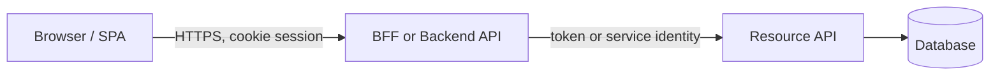
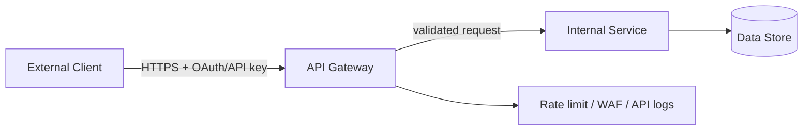
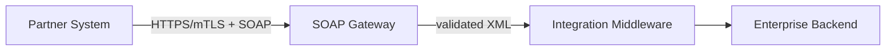
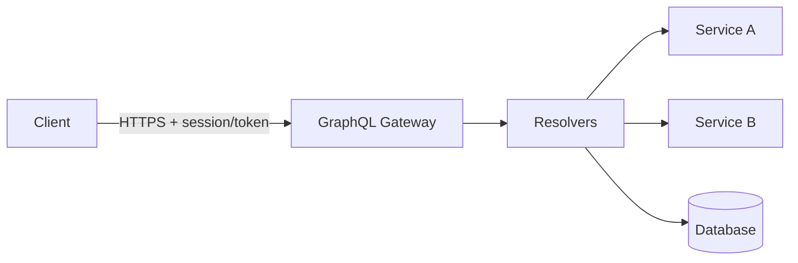
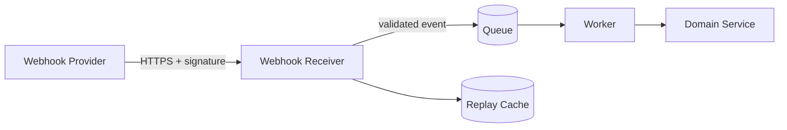
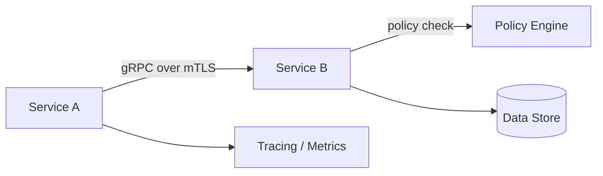

# API Security and Integration Patterns Playbook

## 1. Scope and Goal

This playbook describes common API styles, applicable threats, baseline security controls and reference integration patterns for REST, SOAP/XML, GraphQL, Webhook and gRPC APIs.

The baseline is aligned with OWASP API Security Top 10 2023. It is not a restatement of that list: the goal is to turn the categories into reviewable production controls, defaults and verification evidence.

Use this document for:
- designing public, partner, internal and frontend-facing APIs;
- API architecture security review before release;
- building a threat model, security checklist and negative test plan;
- selecting mandatory controls for API gateways, BFFs, service-to-service communication and webhook integrations.

This document does not replace specialized materials:
- for OIDC/OAuth, use the [OIDC + OAuth 2.0 security guide](../../identity/oidc-oauth/playbook.en.md);
- for threat modeling, use the [threat modeling playbook](../../../review/threat-modeling/playbook.en.md);
- for architecture gate review, use the [security architecture review checklist](../../../review/architecture/checklist.en.md).

---

## 2. API Styles and Purpose

### 2.1 REST API

REST APIs typically use HTTP methods, URI resources and JSON representations. The client calls a specific resource or collection of resources, while the operation is expressed through a method such as `GET`, `POST`, `PUT`, `PATCH` or `DELETE`.

They are the default choice for public APIs, frontend-backend communication, partner APIs and most CRUD/business-flow scenarios. In live environments, REST APIs often sit behind an API gateway or BFF, but the security boundary must not stop at the route: domain logic still needs to check authorization for the object, tenant, action and fields.

Strengths:
- broad support across API gateways, OpenAPI, SDK generation, DAST and contract testing;
- clear resource model and HTTP status code semantics;
- straightforward integration with OAuth 2.0, API keys, mTLS and rate limiting.

Typical risks:
- Broken Object Level Authorization (BOLA): the user can access an object by changing an ID because the API checks authentication but not authorization for that specific resource. Common signals include changing `user_id`, `tenant_id`, `order_id` or another object ID and receiving or modifying someone else's data.
- Broken Function Level Authorization (BFLA): the user can call a function, method or route that should not be available to their role. This often appears as a regular user reaching admin/support/export endpoints through a direct HTTP request even though the UI does not expose that action.
- Mass assignment and excessive field exposure: the API accepts or returns more fields than the operation needs. With mass assignment, the client can submit `role`, `isAdmin`, `tenantId` or internal flags in a write model; with excessive exposure, responses reveal internal or sensitive fields.
- Uncontrolled pagination/filter/sort parameters: the client controls expensive query behavior without limits and allowlists. This can cause resource exhaustion, bypass business constraints, create timing leakage or retrieve data outside the expected scope.
- Weak inventory of older API versions: the team does not know which versions, routes and deprecated endpoints are reachable at runtime. Older versions often bypass newer authz, validation and logging controls because they no longer pass through the same release gate.

### 2.2 SOAP/XML API

SOAP APIs use XML messages with a formal envelope, WSDL contracts and often additional WS-* mechanisms for signing, encryption, routing and reliability. Unlike typical REST-over-HTTP, the operation is usually defined by the SOAP action, XML body structure and service contract.

SOAP is common in legacy, enterprise, banking, government and B2B integrations where formal contracts, XML Schema, WS-* extensions and compatibility with existing platforms matter. In live environments, these APIs often sit in front of critical backend systems, so parser hardening, signatures, fault redaction and segmentation matter as much as partner authentication.

Strengths:
- strict WSDL/XSD contracts;
- mature enterprise middleware support;
- message-level security support in WS-Security scenarios.

Typical risks:
- XXE, XML entity expansion and XML bombs: the XML parser processes external entities, DTDs or excessive entity expansion. This can lead to local file reads, SSRF, network metadata leakage or denial of service through memory/CPU growth.
- Unsafe XML canonicalization/signature validation: the signature is verified over the wrong XML representation or the wrong document element. An attacker can use signature wrapping to keep a valid signature on a safe part of the message while placing malicious payload in the executed part.
- Over-trusted integration paths into backend systems: the SOAP gateway forwards valid XML as a trusted business command without rechecking context. In legacy integrations this often creates a direct path into core banking, ERP, billing or other high-impact systems.
- Verbose fault handling and internal detail exposure: SOAP faults and middleware errors can reveal stack traces, backend system names, SQL/XML fragments and routing details. That information helps the attacker choose the next step and simplifies exploitation of parser or backend bugs.

### 2.3 GraphQL API

GraphQL APIs usually expose one endpoint where the client sends a query or mutation and selects the required fields, nested relationships and response shape. The schema describes available types, fields and operations, while resolvers fetch data from backend services, databases or other APIs.

GraphQL is useful for client applications that need flexible field selection and aggregation across multiple backend sources. It should not be treated as "REST, only without a large number of endpoints": the security model moves into resolvers, schema governance and query cost controls.

Strengths:
- precise client-selected fields;
- single schema;
- convenient data aggregation for frontend and mobile clients.

Typical risks:
- Authorization bypass at field/node/edge level: a GraphQL resolver returns a field, node or relationship without checking access to the specific object and tenant. Even when the top-level query is protected, a nested resolver can expose email, billing data, membership or admin-only attributes.
- Query depth/complexity DoS: the client builds a deeply nested or expensive query that forces the backend to run many resolver calls and downstream requests. Without depth, complexity, timeout and cancellation limits, one request can create the load of many REST calls.
- Batching attacks and brute force inside one HTTP request: the client sends many operations or aliases in one request and bypasses per-request rate limits. This is useful for brute forcing credentials, OTPs, object IDs or existence checks with fewer visible HTTP events.
- Leakage through introspection, GraphiQL and verbose errors: schema discovery and development tooling reveal types, fields, mutations, deprecated surfaces and internal naming conventions. Verbose errors can also disclose resolver paths, backend messages and data useful for attack planning.

### 2.4 Webhook API

A webhook is an inbound call from an external provider or another system when an event occurs: a payment succeeded, an order changed, a user was created or an alert fired. Unlike a normal API call, the receiver usually does not initiate the request and must handle events asynchronously, including retries, out-of-order delivery and duplicate delivery.

For the receiver, a webhook is an internet-facing endpoint even when it does not look like a user API. Its security is built around signature verification over the raw body, timestamp/replay controls, idempotency, queue-based processing isolation and strict payload validation before any business action.

Strengths:
- asynchronous event delivery;
- reduced polling;
- simple SaaS and partner system integration.

Typical risks:
- Provider spoofing: an attacker sends a request that looks like a webhook from a legitimate service. If signature, timestamp, key ID and source are not verified before business processing, the system may accept a fake event as a real payment, refund, signup or alert.
- Replay of old events: a previously valid webhook is sent again after state has already changed. Without a freshness window and replay cache, an old event can execute an operation again or revert state to an unwanted result.
- Duplicate processing and broken idempotency: the same event is processed multiple times because of provider retries, network failures or race conditions. If the handler is not bound to an event ID or idempotency key, duplicate charges, repeated notifications, duplicate orders and inconsistent state become possible.
- SSRF-like chains when payloads trigger outbound requests: the webhook payload contains a URL, domain, object reference or integration target that the receiver later uses for an outbound call. Without allowlists and egress controls, this turns the webhook into an indirect SSRF or data exfiltration path.
- Queue flooding and poison messages: an attacker or faulty provider sends many events or a payload that repeatedly breaks the worker. This fills the queue, delays legitimate events and can trigger infinite retry loops without DLQ and limits.

### 2.5 gRPC API

gRPC APIs describe services and methods in a `.proto` contract, use Protocol Buffers for message serialization and usually run over HTTP/2. A call looks like an RPC method call rather than a URI resource request; the API can be unary, server/client streaming or bidirectional streaming.

gRPC is common for internal service-to-service communication, low-latency backend calls and streaming. In live environments, it must not be treated as safe only because it is "internal": TLS/mTLS, workload identity, method-level authorization, deadlines, message limits and server reflection control are still required.

Strengths:
- strict protobuf contract;
- efficient binary serialization;
- unary and streaming RPC support;
- interceptors for authn/authz/logging.

Typical risks:
- Missing method-level authorization: the service checks only mTLS/service identity, not whether the calling workload may invoke a specific RPC method and resource. After one service is compromised, this makes lateral movement and privileged method calls easier.
- Plaintext gRPC inside internal networks: traffic is sent without TLS/mTLS because the network is treated as trusted. This increases interception, tampering and credential/session leakage risk when segmentation fails, sidecars are bypassed or a node is compromised.
- Overexposed server reflection: reflection reveals services, methods and message types to clients that do not need it in live environments. For an attacker, this accelerates reconnaissance and helps build valid payloads without proto files.
- Message size/streaming DoS: large messages, long streams or missing deadlines hold memory, connections and worker threads. Without limits on message size, stream duration and concurrency, one client can degrade the whole backend pool.
- Weak protobuf schema backward-compatibility governance: proto changes break older clients or change the meaning of default/unknown fields. Schema evolution mistakes can cause authorization bypass, incorrect interpretation of business flags or silent data loss.

---

## 3. Data Formats and Security Impact

| Format | Where Used | Security Impact | Mandatory Measures |
|---|---|---|---|
| JSON | REST, GraphQL, webhooks | Mass assignment, type confusion, excessive data exposure, injection into downstream interpreters | JSON Schema/OpenAPI validation, field allowlists, reject unknown properties for write models, response filtering |
| XML | SOAP, legacy REST, SAML-like payloads | XXE, entity expansion, XPath/XSLT injection, signature wrapping | Disable DTD/external entities, secure processing mode, schema limits, signature wrapping tests |
| Protocol Buffers | gRPC, event contracts | Non-obvious defaults, unknown fields, schema evolution mistakes | protobuf validation, max message size, compatibility checks, explicit authorization outside the schema |
| Multipart/form-data | file upload, mixed payloads | Malware, parser inconsistencies, oversized parts, content-type spoofing | file size/part limits, content sniffing, malware scanning, storage isolation |
| application/x-www-form-urlencoded | browser forms, OAuth endpoints | parameter pollution, encoding ambiguity, CSRF exposure | strict parser behavior, duplicate parameter policy, CSRF controls for cookie-bound flows |
| Binary payloads | file APIs, streaming, media | parser exploits, decompression bombs, resource exhaustion | bounded parsing, sandboxed processing, decompression ratio limits, async scanning |

---

## 4. Exposure Models

API style and exposure model must be separated. REST can be public, internal or frontend-facing; each option has different trust boundaries.

| Exposure model | Trust Boundary | Main Risks | Baseline Security Posture |
|---|---|---|---|
| Browser/frontend -> Backend API | Browser and backend are separated by an internet boundary; browser is untrusted | CSRF, CORS mistakes, token leakage, BOLA, XSS-to-API abuse | BFF or HttpOnly session cookie, CSRF controls, strict CORS, object-level authz |
| Public API -> API Gateway -> Internal services | Internet client to public edge | API key theft, OAuth misuse, bot abuse, quota bypass, inventory drift | OAuth/client credentials or HMAC/request signing, gateway validation, per-client quotas, schema enforcement |
| Partner API | Contracted external client | credential sharing, weak partner controls, excessive access | mTLS or OAuth client credentials, allowlisting where justified, scoped access, contract monitoring |
| Internal service-to-service API | Internal network is not trusted | lateral movement, confused deputy, missing authz | workload identity, mTLS, method/resource authorization, network policy |
| Webhook receiver | External provider calls your endpoint | spoofing, replay, duplicate delivery, payload abuse | signature verification, timestamp window, idempotency key, async queue isolation |
| Admin/privileged API | User or service performs dangerous actions | privilege escalation, repudiation, bulk data damage | step-up auth, JIT/JEA access, approval for destructive actions, immutable audit |

---

## 5. General API Threat Model

The minimum threat model for any API must cover:
- who calls the API: browser, mobile app, partner, backend service, SaaS provider, admin user;
- which credentials are used: cookie session, OAuth token, API key, client certificate, webhook secret, workload identity;
- where the trust boundary is crossed;
- which objects and operations require object-level, property-level and function-level authorization;
- which parameters influence downstream calls, database queries, file paths, URLs, queues and privileged actions;
- which limits bound cost, payload size, concurrency, streaming duration and retry behavior;
- which events are logged for investigation and detection.

### 5.1 Baseline Threat Matrix

The matrix covers the OWASP API Security Top 10 2023 categories: BOLA, Broken Authentication, BOPLA, Unrestricted Resource Consumption, BFLA, Unrestricted Access to Sensitive Business Flows, SSRF, Security Misconfiguration, Improper Inventory Management, and Unsafe Consumption of APIs.

| Threat | Where It Appears | Required Controls | Verification |
|---|---|---|---|
| BOLA | REST resources, GraphQL nodes, gRPC methods | Object-level authorization on every read/write, tenant boundary in policy | Negative tests: user A cannot read/change user B's object |
| BOPLA / excessive data exposure | REST responses, GraphQL fields | Field/property-level authorization, response DTO allowlist | Tests proving sensitive fields are absent for unauthorized roles |
| BFLA | admin endpoints, mutations, service methods | Function-level policy, deny-by-default routing, admin separation | Regular user access tests against privileged operations |
| Broken authentication | Public/partner/internal API | OAuth 2.0 flows hardened according to RFC 9700; OIDC login per OpenID Connect Core; token validation; mTLS or DPoP sender-constrained tokens per RFC 8705/RFC 9449 where used | Invalid issuer/audience/expired token tests, OIDC nonce/login tests where applicable, mTLS/DPoP binding tests |
| Resource exhaustion | GraphQL, gRPC streaming, uploads, search/list endpoints | Rate limits, payload limits, query cost/depth limits, timeouts | Load/abuse tests, 413/429 behavior, timeout evidence |
| Business-flow abuse | signup, checkout, booking, search, export | Risk-based limits, velocity controls, abuse detection, step-up | Abuse-case tests and monitoring for sensitive flows |
| SSRF through API | webhook payloads, URL fetchers, import/export | URL allowlist, egress policy, metadata IP block, DNS rebinding protection | SSRF canary tests, egress deny logs |
| Security misconfiguration | gateways, CORS, debug, reflection | Secure defaults, environment separation, config scanning | Config review, public endpoint inventory, debug endpoint checks |
| Improper inventory | legacy versions, shadow APIs | API catalog, owner, lifecycle, deprecation policy | Compare gateway routes, OpenAPI specs and runtime traffic |
| Unsafe consumption of APIs | third-party and partner APIs | Treat external data as untrusted, response schema validation, circuit breakers | Contract tests, malformed upstream response tests |

---

## 6. Threats and Controls by API Style

### 6.1 REST

Mandatory measures:
- OpenAPI 3.1 contract as the minimum for all live endpoints; OpenAPI 3.2 is acceptable where gateway validation, code generation, linting, scanners, and contract-test tooling support it;
- authentication at the gateway or service edge, with authorization inside domain logic;
- object-level authorization for every endpoint with an object ID;
- separate DTO/schema for create/update/read to prevent mass assignment;
- explicit response allowlist, especially for user, tenant, payment, admin and support objects;
- pagination defaults and hard limits;
- consistent 401/403/404 strategy without leaking the existence of other users' objects;
- rate limits by client, user, tenant, IP and sensitive business flow.

Release-ready defaults:
- request body max size: `1-10 MB` for normal JSON endpoints; larger values require separate design review;
- default page size: `50-100`, hard max: `500-1000`;
- gateway timeout: `<=30s`, internal service timeout usually `<=3-5s`;
- all write endpoints should have an idempotency key when clients can safely retry after network failure.

Verification:
- OpenAPI linting and contract tests run in CI for changed endpoints.
- Request and response validation coverage exists for gateway and service-level enforcement paths.
- Write DTOs reject unknown properties or prove an explicit field allowlist to prevent mass assignment.
- Gateway routes, service routes, and the OpenAPI inventory are compared for drift before release.

### 6.2 SOAP/XML

Mandatory measures:
- disallow DTD and external entities in all XML parsers;
- disable external DTD loading, XInclude and unsafe resolvers;
- enable secure processing mode and limits for entity expansion, depth, attributes and total document size;
- XSD validation with controlled external schema imports;
- XML signature wrapping checks when WS-Security/XML Signature is used;
- SOAP fault redaction and correlation ID instead of stack traces;
- a separate network segment or gateway for legacy SOAP backends.

Release-ready defaults:
- XML document size hard limit is explicitly defined for each operation class;
- SOAP endpoint must not have direct access to internal metadata services, admin panels or cloud control planes;
- parser configuration must be verified by unit/integration tests with XXE and XML bomb payloads.

### 6.3 GraphQL

Mandatory measures:
- authentication before query execution;
- authorization in resolvers at object, field and mutation level;
- query depth, query complexity and operation count limits;
- disabled or strictly authorized introspection and GraphiQL in live environments;
- persisted queries or allowlisted operations for high-impact, public abuse-prone GraphQL APIs when compatible with the product;
- batching limits and separate protection against brute force inside one request;
- timeout and cancellation propagation into downstream calls;
- schema review for sensitive fields and deprecated fields.

Release-ready defaults:
- max query depth: `5-10` for public APIs, higher only with justification;
- max operations per request: `1` by default for public APIs; batching only with an explicit limit;
- resolver timeout: `<=2-5s`, total request timeout: `<=10-15s`;
- introspection disabled for anonymous/public clients; for internal clients, only with an authenticated developer role.
- dynamic GraphQL queries are acceptable for public APIs only with a stricter cost budget, per-client abuse monitoring, and owner-approved exception; persisted queries do not replace resolver authorization and query cost controls.

### 6.4 Webhooks

Mandatory measures:
- verify provider signature before parsing the business payload;
- enforce request body size limits before reading the full payload into memory;
- preserve and verify the exact raw request body used by the provider signature scheme before JSON/XML/form parsing, normalization, decompression, charset conversion, or middleware mutation;
- disallow webhook body compression/decompression unless the provider explicitly requires it in the contract;
- if compression is required, set a decompression ratio limit and document what is signed: compressed bytes or decompressed payload;
- document the provider-specific canonical string, signed fields, timestamp field, allowed algorithms, key identifier rules, and secret/certificate selection logic;
- compare signatures in constant time and reject unsigned, duplicate-signature, unknown-algorithm, unknown-key, and malformed-signature cases;
- timestamp freshness window and replay cache by event ID/signature nonce;
- idempotent processing by provider event ID;
- fast event acceptance and asynchronous processing through a queue;
- payload schema validation and max size limit;
- strict content type and rejection of unknown event types;
- webhook secrets are rotated and stored in a secrets manager;
- outbound calls triggered by webhook payloads pass SSRF controls.

Release-ready defaults:
- timestamp freshness window: `<=5m` if the provider supports timestamps;
- clock skew tolerance: `<=60s` unless the provider requires a narrower value;
- replay cache retention: at least `24h` or longer than the provider's maximum retry window;
- secret/key rotation uses an explicit overlap window that accepts old and new keys only for the provider retry period, then removes the old key;
- HTTP response for an accepted event: `2xx` only after signature, freshness and schema validation;
- processing retries: bounded exponential backoff + DLQ, no infinite retry loops.

Verification:
- negative tests cover raw-body mutation by framework/proxy middleware, invalid canonicalization, stale/future timestamps, wrong algorithm, wrong key ID, duplicate replay, and rotated-key overlap.

### 6.5 gRPC

Mandatory measures:
- TLS for all release channels; mTLS for service-to-service;
- workload identity or OAuth token in metadata, not credentials inside message body;
- method-level authorization through interceptor/policy layer;
- max receive/send message size;
- client-side and server-side deadline/timeout;
- server reflection disabled or available only to authenticated developer/admin clients;
- protobuf schema compatibility checks in CI;
- structured audit events for privileged methods.

Release-ready defaults:
- plaintext gRPC is acceptable only in local development or isolated test environments;
- max receive message size: `4-16 MB` by default, higher only for documented streaming/file scenarios;
- server deadline for unary methods: `<=5s` for normal operations, separate budget for long-running jobs;
- certificate lifetime for service identity: `<=90d` with automated rotation.

---

## 7. Baseline API Security Controls

### 7.1 Authentication

Recommendations:
- Browser/frontend flows: prefer BFF + HttpOnly/Secure/SameSite cookie; do not store refresh tokens in browser storage.
- Public/partner API: OAuth 2.0 client credentials, authorization code + PKCE for user-delegated access or HMAC/request signing with timestamp, nonce, canonical request, key ID, replay cache, rotation, and scoped access. A signed request without canonicalization and replay semantics is a bearer secret, not full replay/tamper protection.
- Service-to-service: workload identity + mTLS; do not rely only on the internal network.
- Webhooks: provider-specific signature scheme + timestamp/replay checks.

Verification:
- expired/invalid issuer/invalid audience token tests;
- token validation check in every resource server;
- evidence for API key/client secret/certificate rotation;
- mTLS handshake failure for an unknown client.

### 7.2 Authorization

Recommendations:
- authorization is enforced at domain object/action level, not only at gateway route level;
- every operation has an explicit policy: actor, action, resource, tenant, context;
- privileged operations are separated from normal user operations;
- deny-by-default for new endpoints, methods, mutations and webhook event types.

Verification:
- BOLA/BFLA/BOPLA negative tests;
- policy coverage report;
- audit events for allow/deny decisions on sensitive actions.

### 7.3 Input Validation and Schema Enforcement

Recommendations:
- validate request body, path, query, headers and metadata;
- reject unknown fields for write operations unless backward compatibility requires otherwise;
- normalize input before authorization only when it does not change security meaning;
- do not pass user-controlled values into SQL/NoSQL/LDAP/OS/XML/URL contexts without safe APIs and allowlists.

Verification:
- schema validation tests;
- fuzz/negative tests for boundary values;
- injection tests for downstream interpreters.

### 7.4 Rate Limiting and Abuse Protection

Recommendations:
- apply limits on multiple keys: IP, user, client, tenant, token, API key, endpoint, business flow;
- separate technical rate limiting from business abuse controls;
- use a quota/cost model for expensive operations;
- 429 responses must not leak unnecessary information about other tenants or internal limit design.

Verification:
- load test for 429 behavior;
- alerts for burst, sustained abuse and quota exhaustion;
- per-client/per-tenant API consumption dashboard.

### 7.5 Transport and Network Security

Recommendations:
- HTTPS is mandatory for all APIs outside local development;
- TLS 1.3 by default; TLS 1.2 only with a modern configuration;
- HSTS for browser-facing HTTPS unless legacy constraints apply;
- egress policy for APIs that make outbound calls based on inbound data.

Verification:
- TLS scan;
- no plaintext endpoints in inventory;
- egress deny tests for metadata IPs, localhost, private ranges and forbidden domains.

### 7.6 Logging, Audit and Detection

Minimum events:
- authentication success/failure;
- authorization deny for sensitive actions;
- admin and privileged operation;
- API key/client credential usage;
- rate-limit/quota decisions;
- webhook signature/replay failures;
- schema validation failures at public boundary;
- sensitive data access and bulk export.

Minimum fields:
- timestamp, actor, client ID, tenant ID, source IP, user agent or workload identity;
- API name, version, endpoint/method, action, resource type, resource ID or stable hash;
- decision, reason, status code, correlation ID, request ID;
- do not log tokens, secrets, raw credentials or sensitive payloads without redaction.

Verification:
- sample log review;
- detection rules for auth failures, BOLA probing, quota abuse and webhook replay;
- request ID tracing across gateway, service and datastore.

---

## 8. Reference Integration Patterns

### 8.1 Browser/frontend -> Backend REST API

Main threats:
- XSS leads to API abuse in the user's session;
- CSRF on state-changing endpoints;
- CORS misconfiguration;
- BOLA/BFLA on backend API;
- access/refresh token leakage in browser storage.

Required controls:
- BFF pattern or server-side session cookie with `HttpOnly`, `Secure`, `SameSite`;
- CSRF protection for `POST/PUT/PATCH/DELETE`: synchronizer token or signed double-submit cookie bound to the authenticated session with HMAC and a server-side secret; naive double-submit cookies are not acceptable;
- strict CORS allowlist without wildcard credentials;
- object-level authorization in the backend;
- access token is not available to JavaScript when BFF is used.

Verification:
- CSRF negative tests without token/Origin, with mismatched token, and with cookie injection/subdomain cookie scenarios;
- CORS preflight tests for forbidden origins;
- BOLA tests by object IDs;
- browser storage review for absence of refresh tokens.

### 8.2 Public REST API -> API Gateway -> Internal Services

Main threats:
- credential theft and replay;
- quota bypass;
- route shadowing and stale versions;
- excessive data exposure;
- SSRF through URL/import endpoints.

Required controls:
- authentication at the gateway and validation in the resource service for critical APIs;
- per-client, per-tenant and per-endpoint quotas;
- OpenAPI-based request validation;
- response filtering in the service layer;
- API inventory with owner, version, data classification and deprecation date.

Verification:
- invalid token/API key tests;
- 429 behavior tests;
- gateway route comparison against API catalog;
- SSRF tests for URL-bearing endpoints.

### 8.3 SOAP/XML Partner Integration

Main threats:
- XXE and XML bombs;
- signature wrapping;
- partner credential compromise;
- fault leakage;
- legacy backend exposure.

Required controls:
- mTLS or equivalent strong client authentication;
- hardened XML parser before handoff to middleware;
- WSDL/XSD allowlist and controlled schema imports;
- SOAP fault redaction;
- network segmentation between SOAP gateway and backend.

Verification:
- XXE/XML bomb test suite;
- invalid certificate test;
- signature wrapping negative tests;
- SOAP fault sample review.

### 8.4 GraphQL Gateway -> Backend Services

Main threats:
- field-level data leakage;
- expensive nested queries;
- batching brute force;
- resolver-level SSRF/injection;
- introspection leakage.

Required controls:
- authn before execution;
- resolver-level authorization;
- depth/complexity/cost limits;
- persisted queries or allowlisted operations for high-risk public API;
- controlled introspection and disabled GraphiQL for public live APIs;
- downstream timeouts and cancellation.

Verification:
- unauthorized field/node tests;
- complex query DoS tests;
- introspection tests for anonymous/public clients;
- resolver timeout tests.

### 8.5 Webhook Provider -> Receiver -> Queue -> Worker

Main threats:
- spoofed provider event;
- replay;
- duplicate event processing;
- poison message;
- SSRF through event-driven follow-up action.

Required controls:
- signature verification before business parsing;
- timestamp window and replay cache;
- idempotency by event ID;
- async processing and DLQ;
- schema validation and event type allowlist;
- outbound URL allowlist/egress controls for follow-up actions.

Verification:
- invalid signature test;
- replay same event ID test;
- duplicate delivery idempotency test;
- DLQ behavior for poison messages;
- SSRF canary test.

### 8.6 Internal gRPC Service-to-Service

Main threats:
- lateral movement after workload compromise;
- missing method-level authorization;
- plaintext internal traffic;
- reflection exposing service surface;
- streaming/message-size DoS.

Required controls:
- mTLS with workload identity;
- method-level authorization in interceptors;
- max message size and stream duration;
- server reflection restricted;
- deadlines on client and server;
- protobuf compatibility gates in CI.

Verification:
- unknown client certificate test;
- unauthorized method test;
- reflection access test;
- oversized message and long stream tests;
- CI evidence for proto breaking-change checks.

---

## 9. Release Review Checklist

| Check | Evidence |
|---|---|
| API has owner, exposure model, data classification and lifecycle status | API catalog entry |
| Authentication model is explicit and current | IdP/gateway/service config, token validation tests |
| Authorization covers object, property and function level | Policy matrix, negative tests |
| Contract exists and matches runtime routes | OpenAPI/WSDL/proto/schema, gateway route diff |
| Input validation covers body, path, query, headers and metadata | Schema tests, validator config |
| Resource limits are explicit | Payload/page/query/message/timeout/rate limit config |
| Sensitive business flows have abuse controls | Velocity rules, quota dashboards, fraud/abuse alerts |
| Webhook endpoints verify signature and replay | Invalid signature/replay tests |
| XML parsers are hardened where XML is accepted | Parser config, XXE tests |
| GraphQL has depth/complexity/field authorization controls | GraphQL security tests |
| gRPC uses TLS/mTLS and method authz | mTLS config, interceptor tests |
| Logs support investigation without leaking secrets | Sample logs, redaction tests |
| Deprecated versions are blocked or tracked | Deprecation policy, traffic report |

---

## 10. Review Decision Matrix

Use this matrix for API findings before release. It complements release governance: if a finding blocks release here, the exception must be handled through the release-governance process with owner, expiry, compensating controls, and verification evidence. For general SLA, exception lifecycle, and closure evidence across scanner findings, use the [vulnerability management playbook](../../../review/vulnerability-management/playbook.en.md).

| Severity | Use when | Required action |
|---|---|---|
| Critical | BOLA/BFLA or property-level authorization bypass exposes cross-tenant data, admin actions, payment/ledger state, secrets, or bulk export; webhook spoofing/replay can trigger financial, account, or privileged state changes; XML parser issue enables file read, SSRF to metadata/control plane, or RCE; GraphQL resolver bypass exposes tenant/admin-sensitive fields; plaintext or unauthenticated gRPC exposes high-value service-to-service operations | Block release until fixed; exception requires security leadership and business owner approval |
| High | Public or partner API has reachable object/function authorization gap; webhook signature, timestamp, replay, or idempotency controls are incomplete for sensitive events; GraphQL lacks resolver-level authorization or cost limits on a public/high-risk API; SOAP/XML parser hardening is missing but impact is bounded; gRPC lacks mTLS or method authorization for sensitive internal methods | Owner, due date, remediation or accepted risk, and negative-test evidence |
| Medium | API inventory, schema validation, rate limits, introspection/reflection controls, logging, or deprecated-version lifecycle is incomplete with bounded exposure and compensating controls | Track remediation and verify closure |
| Low | Documentation, contract hygiene, non-sensitive logging improvement, or hardening issue with limited direct impact | Fix opportunistically |

Required review output:
- affected API style, route/method/event/RPC, exposure model, and data class;
- attacker preconditions and impact;
- required fix or compensating control;
- negative test or runtime evidence that proves closure;
- owner, due date, and residual risk decision.
---

## 11. Related Materials

- [OIDC + OAuth 2.0 playbook](../../identity/oidc-oauth/playbook.en.md)
- [Browser and frontend security playbook](../../web/browser-security/playbook.en.md)
- [Business logic abuse playbook](../../business-logic/business-logic-abuse/playbook.en.md)
- [Threat modeling playbook](../../../review/threat-modeling/playbook.en.md)
- [MCP security playbook](../../../ai-security/mcp-security/playbook.en.md)
- [Agentic AI security playbook](../../../ai-security/agentic-ai/playbook.en.md)
