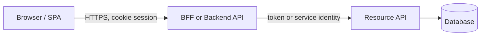
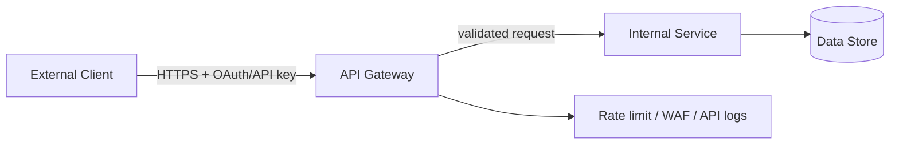
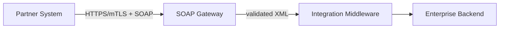
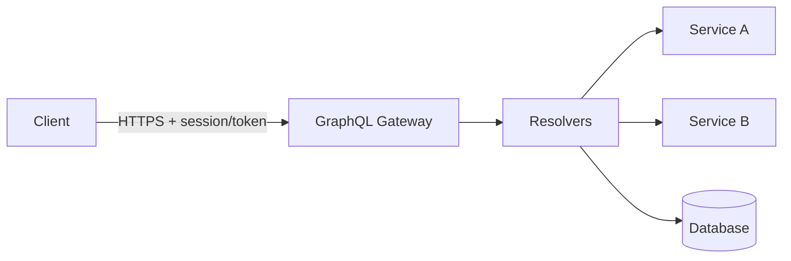
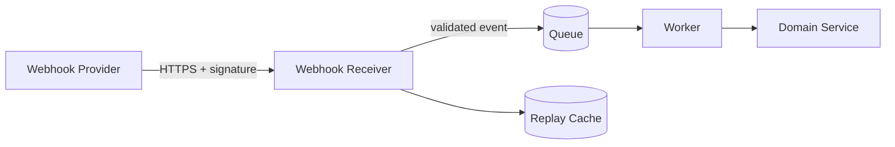
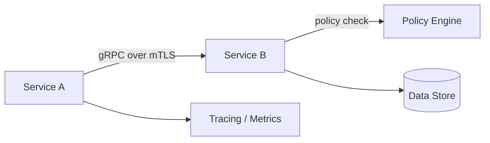

# Плейбук по безопасности API и типовым интеграциям

## 1. Область и цель

Этот плейбук описывает основные виды API, применимые угрозы, базовые меры защиты и типовые схемы интеграций для REST, SOAP/XML, GraphQL, Webhook и gRPC.

Используйте документ для:
- проектирования публичных, партнерских, внутренних и обращенных к фронтенду API;
- архитектурного ревью API до релиза;
- построения threat model, security checklist и negative test plan;
- выбора обязательных мер контроля для API gateway, BFF, service-to-service и webhook-интеграций.

Документ не заменяет специализированные материалы:
- для OIDC/OAuth используйте [руководство по безопасности OIDC + OAuth 2.0](../../identity/oidc-oauth/playbook.ru.md);
- для threat modeling используйте [плейбук по моделированию угроз](../../../review/threat-modeling/playbook.ru.md);
- для архитектурной gate-проверки используйте [чеклист ревью архитектуры безопасности](../../../review/architecture/checklist.ru.md).

---

## 2. Виды API и назначение

### 2.1 REST API

REST API обычно используют HTTP-методы, URI-ресурсы и представления данных в JSON. Это основной выбор для публичных API, взаимодействия фронтенда и бэкенда, partner API и большинства CRUD/business-flow сценариев.

Сильные стороны:
- широкая поддержка API gateways, OpenAPI, SDK generation, DAST и contract testing;
- понятная модель ресурсов и HTTP status codes;
- простая интеграция с OAuth 2.0, API keys, mTLS и rate limiting.

Типовые риски:
- Broken Object Level Authorization (BOLA);
- Broken Function Level Authorization (BFLA);
- mass assignment и избыточное раскрытие полей;
- неконтролируемые pagination/filter/sort параметры;
- слабый inventory старых версий API.

### 2.2 SOAP/XML API

SOAP применяется в legacy, enterprise, банковских, государственных и B2B-интеграциях, где важны формальные контракты, XML Schema, WS-* расширения и совместимость с существующими платформами.

Сильные стороны:
- строгие WSDL/XSD-контракты;
- зрелая поддержка enterprise middleware;
- возможность message-level security в WS-Security сценариях.

Типовые риски:
- XXE, XML entity expansion и XML bomb;
- небезопасная XML canonicalization/signature validation;
- чрезмерно доверенная схема интеграции с бэкенд-системами;
- сложная обработка ошибок и раскрытие внутренних деталей.

### 2.3 GraphQL API

GraphQL подходит для клиентских приложений, которым нужен гибкий выбор полей и агрегация данных из нескольких бэкенд-источников. Его нельзя рассматривать как “REST без взрыва числа endpoints”: основная модель безопасности переносится в resolvers, управление схемой и меры контроля стоимости запросов.

Сильные стороны:
- точный выбор полей клиентом;
- единая схема;
- удобная агрегация данных для фронтенда и mobile.

Типовые риски:
- обход authorization на field/node/edge уровне;
- query depth/complexity DoS;
- batching attacks и brute force внутри одного HTTP-запроса;
- leakage через introspection, GraphiQL и подробные ошибки.

### 2.4 Webhook API

Webhook - это входящий вызов от внешнего провайдера или другой системы при наступлении события. Для принимающей стороны это internet-facing точка входа, даже если она не выглядит как пользовательский API.

Сильные стороны:
- асинхронная доставка событий;
- снижение polling;
- простая интеграция с SaaS и partner systems.

Типовые риски:
- spoofing провайдера;
- replay старого события;
- повторная обработка и нарушение идемпотентности;
- SSRF-подобные цепочки, если payload запускает исходящие запросы;
- queue flooding и poison messages.

### 2.5 gRPC API

gRPC использует HTTP/2 и Protocol Buffers и часто применяется для внутреннего service-to-service взаимодействия, low-latency бэкенд-коммуникаций и streaming.

Сильные стороны:
- строгий protobuf-контракт;
- эффективная бинарная сериализация;
- поддержка unary и streaming RPC;
- удобные interceptors для authn/authz/logging.

Типовые риски:
- отсутствие method-level authorization;
- незашифрованный plaintext gRPC во внутренних сетях;
- чрезмерно включенный server reflection;
- message size/streaming DoS;
- слабый контроль backward compatibility protobuf-схем.

---

## 3. Форматы данных и security-impact

| Формат | Где используется | Security-impact | Обязательные меры |
|---|---|---|---|
| JSON | REST, GraphQL, webhooks | Mass assignment, type confusion, excessive data exposure, инъекции в downstream interpreters | JSON Schema/OpenAPI validation, allowlist полей, запрет unknown properties для write models, response filtering |
| XML | SOAP, legacy REST, SAML-like payloads | XXE, entity expansion, XPath/XSLT-инъекции, signature wrapping | Disable DTD/external entities, secure processing mode, schema limits, signature wrapping tests |
| Protocol Buffers | gRPC, event contracts | Неочевидные defaults, unknown fields, schema evolution ошибки | protobuf validation, max message size, compatibility checks, explicit authorization вне схемы |
| Multipart/form-data | загрузка файлов, смешанные payload | Malware, различия parser behavior, oversized parts, подмена content-type | лимиты размера файлов/частей, content sniffing, malware scanning, изоляция storage |
| application/x-www-form-urlencoded | browser forms, OAuth endpoints | parameter pollution, неоднозначность encoding, CSRF exposure | строгий parser behavior, политика duplicate parameters, CSRF controls для cookie-bound flows |
| Binary payloads | файловые API, streaming, media | parser exploits, decompression bombs, resource exhaustion | bounded parsing, sandboxed processing, decompression ratio limits, async scanning |

---

## 4. Модели экспозиции

Стиль API и модель экспозиции нужно разделять. REST может быть публичным, внутренним или обращенным к фронтенду; каждый вариант имеет разные границы доверия.

| Модель экспозиции | Граница доверия | Основные риски | Базовый профиль безопасности |
|---|---|---|---|
| Browser/frontend -> Backend API | Браузер и бэкенд разделены internet boundary; браузер недоверенный | CSRF, CORS ошибки, token leakage, BOLA, XSS-to-API abuse | BFF или HttpOnly session cookie, CSRF controls, strict CORS, object-level authz |
| Public API -> API Gateway -> Internal services | Internet client к public edge | API key theft, OAuth misuse, bot abuse, quota bypass, inventory drift | OAuth/client credentials или signed API keys, gateway validation, per-client quotas, schema enforcement |
| Partner API | Договорной внешний клиент | credential sharing, weak partner controls, excessive access | mTLS или OAuth client credentials, allowlisting где оправдано, scoped access, contract monitoring |
| Internal service-to-service API | Внутренняя сеть не считается доверенной | lateral movement, confused deputy, missing authz | workload identity, mTLS, method/resource authorization, network policy |
| Webhook receiver | Внешний провайдер вызывает вашу точку входа | spoofing, replay, duplicate delivery, payload abuse | проверка подписи, timestamp window, idempotency key, изоляция через async queue |
| Admin/privileged API | Пользователь или сервис выполняет опасные действия | privilege escalation, repudiation, массовое повреждение данных | step-up auth, JIT/JEA access, approval для destructive actions, immutable audit |

---

## 5. Общая модель угроз API

Минимальная threat model для любого API должна покрывать:
- кто вызывает API: браузер, mobile app, партнер, бэкенд-сервис, SaaS provider, admin user;
- какие credentials используются: cookie session, OAuth token, API key, client certificate, webhook secret, workload identity;
- где проходит граница доверия;
- какие объекты и операции требуют object-level, property-level и function-level authorization;
- какие параметры влияют на downstream calls, database queries, файловые пути, URLs, queues и привилегированные действия;
- какие лимиты ограничивают cost, payload size, concurrency, streaming duration и retry behavior;
- какие события журналируются для расследования и обнаружения.

### 5.1 Базовая матрица угроз

| Угроза | Где проявляется | Обязательные меры контроля | Проверка |
|---|---|---|---|
| BOLA | REST resources, GraphQL nodes, gRPC methods | Object-level authorization на каждый read/write, tenant boundary в policy | Негативные тесты: пользователь A не читает/меняет объект пользователя B |
| BOPLA / excessive data exposure | REST responses, GraphQL fields | Field/property-level authorization, response DTO allowlist | Тесты на отсутствие sensitive fields для ролей без доступа |
| BFLA | admin endpoints, mutations, service methods | Function-level policy, deny-by-default routing, admin separation | Тесты доступа regular user к privileged operation |
| Broken authentication | Public/partner/internal API | OAuth 2.0 flows по RFC 9700; OIDC login по OpenID Connect Core; token validation; mTLS или DPoP sender-constrained tokens по RFC 8705/RFC 9449, где используются | Тесты invalid issuer/audience/expired token, OIDC nonce/login tests где применимо, mTLS/DPoP binding tests |
| Resource exhaustion | GraphQL, gRPC streaming, uploads, search/list endpoints | Rate limits, лимиты payload, query cost/depth limits, timeouts | Load/abuse tests, поведение 413/429, подтверждение срабатывания timeout |
| Business-flow abuse | signup, checkout, booking, search, export | Лимиты по риску, velocity controls, обнаружение abuse, step-up | Abuse-case tests и мониторинг sensitive flows |
| SSRF через API | webhook payloads, URL fetchers, import/export | URL allowlist, egress policy, metadata IP block, DNS rebinding protection | SSRF canary tests, egress deny logs |
| Security misconfiguration | gateways, CORS, debug, reflection | Secure defaults, environment separation, config scanning | Config review, public endpoint inventory, debug endpoint checks |
| Improper inventory | legacy versions, shadow APIs | API catalog, owner, lifecycle, deprecation policy | Сверка gateway routes, OpenAPI specs и runtime traffic |
| Unsafe consumption of APIs | third-party and partner APIs | Внешние данные считаются недоверенными, response schema validation, circuit breakers | Contract tests и тесты malformed upstream responses |

---

## 6. Угрозы и меры по типам API

### 6.1 REST

Обязательные меры:
- OpenAPI 3.1 contract как минимум для всех production endpoints; OpenAPI 3.2 допустим там, где его поддерживают gateway validation, code generation, linting, scanners и contract-test tooling;
- authentication на gateway или service edge, но authorization внутри доменной логики;
- object-level authorization для каждого endpoint с object ID;
- separate DTO/schema для create/update/read, чтобы исключить mass assignment;
- explicit response allowlist, особенно для user, tenant, payment, admin и support объектов;
- pagination defaults и жесткие лимиты;
- consistent 401/403/404 strategy без утечки существования чужих объектов;
- rate limits по client, user, tenant, IP и sensitive business flow.

Production-настройки:
- максимальный размер request body: `1-10 MB` для обычных JSON endpoints; больше только по отдельному design review;
- default page size: `50-100`, hard max: `500-1000`;
- gateway timeout: `<=30s`, internal service timeout обычно `<=3-5s`;
- все write endpoints должны иметь idempotency key, если клиент может безопасно повторить запрос после network failure.

Проверка:
- OpenAPI linting и contract tests выполняются в CI для измененных endpoints.
- Есть покрытие request/response validation для gateway и service-level enforcement paths.
- Write DTOs отклоняют unknown properties или доказывают explicit field allowlist для защиты от mass assignment.
- Gateway routes, service routes и OpenAPI inventory сравниваются на drift перед релизом.

### 6.2 SOAP/XML

Обязательные меры:
- запрет DTD и external entities во всех XML parsers;
- отключение external DTD loading, XInclude и небезопасных resolver;
- secure processing mode и лимиты entity expansion, depth, attributes, total document size;
- XSD validation с контролем внешних schema imports;
- проверка XML signature wrapping, если используется WS-Security/XML Signature;
- redaction SOAP faults и correlation ID вместо stack traces;
- отдельный network segment или gateway для legacy SOAP backend.

Production-настройки:
- XML document size hard limit задается явно для каждого operation class;
- SOAP endpoint не должен иметь прямой доступ к internal metadata services, admin panels и cloud control plane;
- parser configuration должна проверяться unit/integration tests с XXE и XML bomb payloads.

### 6.3 GraphQL

Обязательные меры:
- authentication до выполнения query;
- authorization в resolvers на object, field и mutation уровне;
- лимиты query depth, query complexity и operation count;
- запрет или строгая авторизация introspection и GraphiQL в production;
- persisted queries для public/high-risk GraphQL API, если это совместимо с продуктом;
- лимиты batching и отдельная защита от brute force внутри одного запроса;
- timeout и cancellation propagation в downstream calls;
- schema review для sensitive fields и deprecated fields.

Production-настройки:
- максимальная query depth: `5-10` для публичных API, выше только по обоснованию;
- max operations per request: `1` по умолчанию для public API; batching только с явным лимитом;
- timeout resolver: `<=2-5s`, общий request timeout: `<=10-15s`;
- introspection disabled для anonymous/public clients; для внутренних клиентов - только с authenticated developer role.

### 6.4 Webhooks

Обязательные меры:
- проверяйте provider signature до parsing бизнес-payload;
- сохраняйте и проверяйте точный raw request body, который использует signature scheme провайдера, до JSON/XML/form parsing, normalization, decompression, charset conversion или изменения со стороны middleware;
- документируйте provider-specific canonical string, signed fields, timestamp field, разрешенные algorithms, key identifier rules и логику выбора secret/certificate;
- сравнивайте signatures в constant time и отклоняйте unsigned, duplicate-signature, unknown-algorithm, unknown-key и malformed-signature cases;
- timestamp freshness window и replay cache по event ID/signature nonce;
- idempotent processing по provider event ID;
- быстрая приемка события и асинхронная обработка через queue;
- валидация схемы payload и максимальный размер;
- строгий content type и отклонение неизвестных типов событий;
- секреты webhook ротационно обновляются и хранятся в secrets manager;
- исходящие вызовы, запускаемые webhook payload, проходят SSRF-меры контроля.

Production-настройки:
- окно свежести timestamp: `<=5m`, если provider поддерживает timestamp;
- допустимый clock skew: `<=60s`, если provider не требует более узкое значение;
- срок хранения replay cache: минимум `24h` или больше максимального retry window провайдера;
- rotation secret/key использует явное overlap window: старый и новый ключ принимаются только на период provider retry window, затем старый ключ удаляется;
- HTTP response для принятого события: `2xx` только после проверки signature, freshness и schema;
- повторные попытки обработки: bounded exponential backoff + DLQ, без бесконечных retry loops.

Проверка:
- негативные тесты покрывают raw-body mutation со стороны framework/proxy middleware, invalid canonicalization, stale/future timestamps, wrong algorithm, wrong key ID, duplicate replay и overlap при rotation ключа.

### 6.5 gRPC

Обязательные меры:
- TLS для всех production channels; mTLS для service-to-service;
- workload identity или OAuth token в metadata, не credentials внутри message body;
- method-level authorization через interceptor/policy layer;
- максимальный размер получаемого/отправляемого сообщения;
- deadline/timeout на стороне клиента и сервера;
- server reflection выключен или доступен только authenticated developer/admin clients;
- protobuf schema compatibility checks в CI;
- structured audit events для privileged methods.

Production-настройки:
- plaintext gRPC допустим только в local development или изолированном тестовом контуре;
- максимальный размер получаемого сообщения: `4-16 MB` по умолчанию, больше только для documented streaming/file scenarios;
- server deadline для unary methods: `<=5s` для обычных операций, отдельный budget для long-running jobs;
- certificate lifetime для service identity: `<=90d` при автоматической ротации.

---

## 7. Базовые меры безопасности для API

### 7.1 Аутентификация

Рекомендации:
- Потоки browser/frontend: предпочтительно BFF + HttpOnly/Secure/SameSite cookie; не храните refresh token в browser storage.
- Public/partner API: OAuth 2.0 client credentials, authorization code + PKCE для user-delegated access или подписанные API keys с rotation и scoped access.
- Service-to-service: workload identity + mTLS; не полагайтесь только на внутреннюю сеть.
- Webhooks: provider-specific signature scheme + timestamp/replay checks.

Проверка:
- тесты expired/invalid issuer/invalid audience token;
- проверка token validation в каждом resource server;
- подтверждения ротации API keys/client secrets/certificates;
- mTLS handshake failure для неизвестного клиента.

### 7.2 Авторизация

Рекомендации:
- authorization выполняется на уровне domain object/action, а не только на gateway route;
- каждая операция имеет явную политику: actor, action, resource, tenant, context;
- privileged operations отделены от обычных user operations;
- deny-by-default для новых endpoints, methods, mutations и типов webhook-событий.

Проверка:
- негативные тесты BOLA/BFLA/BOPLA;
- отчет о покрытии политики;
- audit events для allow/deny решений по sensitive actions.

### 7.3 Валидация ввода и применение схем

Рекомендации:
- валидируйте request body, path, query, headers и metadata;
- запрещайте unknown fields для write operations, если backward compatibility не требует обратного;
- нормализуйте ввод до authorization только там, где это не меняет security meaning;
- не передавайте user-controlled values в SQL/NoSQL/LDAP/OS/XML/URL без безопасных API и allowlist.

Проверка:
- schema validation tests;
- fuzz/negative tests для boundary values;
- тесты на инъекции для downstream interpreters.

### 7.4 Rate limiting и защита от злоупотреблений

Рекомендации:
- применяйте лимиты на нескольких ключах: IP, пользователь, client, tenant, token, API key, endpoint, business flow;
- отделяйте technical rate limit от business abuse controls;
- для expensive operations используйте quota/cost model;
- 429 responses не должны раскрывать лишнюю информацию о других tenants или внутренних лимитах.

Проверка:
- нагрузочный тест 429 behavior;
- алерты по burst, sustained abuse, quota exhaustion;
- dashboard per-client/per-tenant API consumption.

### 7.5 Транспортная и сетевая безопасность

Рекомендации:
- HTTPS обязателен для всех API вне local development;
- TLS 1.3 по умолчанию; TLS 1.2 только с современной конфигурацией;
- HSTS для browser-facing HTTPS, если нет legacy constraints;
- egress policy для API, которые делают outbound calls по входным данным.

Проверка:
- TLS scan;
- запрет plaintext endpoints в инвентаре;
- egress deny tests для metadata IP, localhost, private ranges и запрещенных доменов.

### 7.6 Журналирование, аудит и обнаружение

Минимальные события:
- authentication success/failure;
- authorization deny для sensitive actions;
- admin и privileged operation;
- API key/client credential usage;
- rate-limit/quota decisions;
- webhook signature/replay failures;
- schema validation failures на public boundary;
- доступ к sensitive data и bulk export.

Минимальные поля:
- timestamp, actor, client ID, tenant ID, source IP, user agent или workload identity;
- API name, version, endpoint/method, action, resource type, resource ID или stable hash;
- decision, reason, status code, correlation ID, request ID;
- не логируйте tokens, secrets, raw credentials и sensitive payload без redaction.

Проверка:
- проверка примеров логов;
- правила обнаружения для auth failures, BOLA probing, quota abuse и webhook replay;
- трассировка request ID через gateway, service и datastore.

---

## 8. Схемы типовых интеграций

### 8.1 Browser/frontend -> Backend REST API

Основные угрозы:
- XSS приводит к API abuse в сессии пользователя;
- CSRF на state-changing endpoints;
- CORS misconfiguration;
- BOLA/BFLA на backend API;
- утечка access/refresh tokens в browser storage.

Обязательные меры контроля:
- BFF-паттерн или server-side session cookie с `HttpOnly`, `Secure`, `SameSite`;
- CSRF protection для `POST/PUT/PATCH/DELETE`: synchronizer token или signed double-submit cookie, привязанный к authenticated session через HMAC и server-side secret; naive double-submit cookies недопустимы;
- strict CORS allowlist без wildcard credentials;
- object-level authorization на backend;
- access token не доступен JavaScript, если используется BFF.

Проверка:
- CSRF negative tests без token/Origin, с несовпадающим token и с cookie injection/subdomain cookie сценариями;
- CORS preflight tests для forbidden origins;
- BOLA tests по object IDs;
- проверка browser storage на отсутствие refresh tokens.

### 8.2 Public REST API -> API Gateway -> Internal Services

Основные угрозы:
- credential theft и replay;
- quota bypass;
- route shadowing и stale versions;
- excessive data exposure;
- SSRF через URL/import endpoints.

Обязательные меры контроля:
- authentication на gateway и validation в resource service для критичных API;
- per-client, per-tenant и per-endpoint quotas;
- OpenAPI-based request validation;
- response filtering в service layer;
- API inventory с владельцем, версией, классификацией данных и датой вывода из эксплуатации.

Проверка:
- invalid token/API key tests;
- 429 behavior tests;
- сверка gateway routes с API catalog;
- SSRF tests для URL-bearing endpoints.

### 8.3 SOAP/XML Partner Integration

Основные угрозы:
- XXE и XML bomb;
- signature wrapping;
- partner credential compromise;
- fault leakage;
- legacy backend exposure.

Обязательные меры контроля:
- mTLS или эквивалентная strong client authentication;
- hardened XML parser до передачи в middleware;
- WSDL/XSD allowlist и контролируемые schema imports;
- SOAP fault redaction;
- network segmentation между SOAP gateway и backend.

Проверка:
- XXE/XML bomb test suite;
- invalid certificate test;
- signature wrapping negative tests;
- проверка примеров SOAP fault.

### 8.4 GraphQL Gateway -> Backend Services

Основные угрозы:
- утечка данных на уровне fields;
- expensive nested queries;
- batching brute force;
- SSRF/инъекции на уровне resolver;
- introspection leakage.

Обязательные меры контроля:
- authn до execution;
- resolver-level authorization;
- лимиты depth/complexity/cost;
- persisted queries для high-risk public API;
- controlled introspection и disabled GraphiQL для public production;
- downstream timeouts и cancellation.

Проверка:
- unauthorized field/node tests;
- complex query DoS tests;
- introspection tests anonymous/public clients;
- resolver timeout tests.

### 8.5 Webhook Provider -> Receiver -> Queue -> Worker

Основные угрозы:
- поддельное событие provider;
- replay;
- повторная обработка события;
- poison message;
- SSRF through event-driven follow-up action.

Обязательные меры контроля:
- проверка подписи до бизнес-разбора;
- timestamp window и replay cache;
- идемпотентность по event ID;
- асинхронная обработка и DLQ;
- валидация схемы и allowlist типов событий;
- allowlist исходящих URL и egress-меры контроля для последующих действий.

Проверка:
- invalid signature test;
- replay same event ID test;
- duplicate delivery idempotency test;
- DLQ behavior for poison messages;
- SSRF canary test.

### 8.6 Internal gRPC Service-to-Service

Основные угрозы:
- lateral movement после компрометации workload;
- отсутствующая method-level authorization;
- plaintext-трафик внутри internal network;
- reflection раскрывает service surface;
- streaming/message-size DoS.

Обязательные меры контроля:
- mTLS с workload identity;
- method-level authorization в interceptors;
- максимальный размер сообщения и длительность stream;
- ограниченный server reflection;
- deadlines на клиенте и сервере;
- protobuf compatibility gates в CI.

Проверка:
- тест с неизвестным client certificate;
- тест unauthorized method;
- тест доступа к reflection;
- тесты oversized message и long stream;
- CI-подтверждения проверок breaking changes в proto.

---

## 9. Чеклист production-ревью

| Проверка | Подтверждение |
|---|---|
| У API есть владелец, модель экспозиции, классификация данных и статус жизненного цикла | Запись в API catalog |
| Модель аутентификации явно описана и актуальна | Конфиг IdP/gateway/service, тесты валидации токенов |
| Авторизация покрывает уровень объекта, свойства и функции | Матрица политики, негативные тесты |
| Контракт существует и совпадает с runtime routes | OpenAPI/WSDL/proto/schema, diff маршрутов gateway |
| Валидация ввода покрывает body, path, query, headers и metadata | Schema tests, validator config |
| Лимиты ресурсов заданы явно | Конфиг payload/page/query/message/timeout/rate limit |
| Чувствительные бизнес-потоки имеют abuse-меры контроля | Velocity rules, quota dashboards, fraud/abuse alerts |
| Webhook endpoints проверяют подпись и replay | Тесты invalid signature/replay |
| XML parsers захарднены там, где принимается XML | Parser config, XXE tests |
| GraphQL имеет меры контроля depth/complexity/field authorization | GraphQL security tests |
| gRPC использует TLS/mTLS и method authz | mTLS config, interceptor tests |
| Логи помогают расследованию и не раскрывают секреты | Примеры логов, redaction tests |
| Deprecated versions заблокированы или отслеживаются | Deprecation policy, traffic report |
