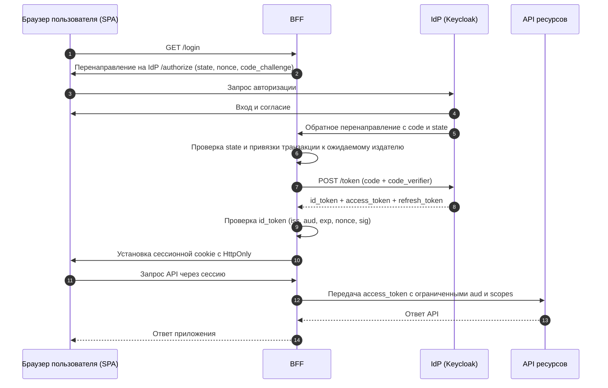

# Плейбук безопасности OIDC + OAuth 2.0

## 1. Область и цель

Этот документ описывает безопасную интеграцию OIDC (аутентификация) и OAuth 2.0 (авторизация) с Keycloak.

---

## 2. OIDC + OAuth 2.0: процесс и назначение токенов

- **OIDC** отвечает за пользовательский вход и контекст идентичности через `id_token`
- **OAuth 2.0** отвечает за делегированный доступ к API через `access_token`/`refresh_token`
- В потоке Authorization Code оба протокола работают вместе в одной сквозной последовательности

### 2.1 Последовательность (Authorization Code + PKCE, паттерн SPA + BFF)

### 2.2 Наборы токенов по потокам

1. `authorization_code` (с областью доступа OIDC):
- `id_token` + `access_token` + часто `refresh_token`

2. `authorization_code` (без области доступа OIDC):
- `access_token` + часто `refresh_token`, без `id_token`

3. `client_credentials`:
- только `access_token` (обычно без токена обновления)

4. `token exchange` (RFC 8693, Keycloak V2):
- входной токен -> новый `access_token` с другой аудиторией или областью доступа

5. `offline_access` (область доступа, а не отдельный поток):
- `offline_access`: это область доступа, которая меняет поведение токена обновления
- при запросе и разрешении выдается автономный токен с длительным сроком действия или без привязки к пользовательской сессии
- это изменение поведения токенов в существующем потоке, например `authorization_code`, а не отдельный способ выдачи токенов

### 2.3 Назначение каждого токена

- `id_token`: результат аутентификации пользователя для контекста сессии клиента
- `access_token`: токен доступа для авторизации на сервере ресурсов; может быть на предъявителя или привязан к отправителю
- `refresh_token`: получение новых токенов доступа без полного повторного входа
- `offline token`: получение новых токенов без активной браузерной сессии
- ответ `userinfo`: необязательный источник дополнительных утверждений (claims) о пользователе, не заменяющий проверку `id_token`

Правило идентичности:
- Связывайте внешнюю идентичность с проверенной парой `(iss, sub)` и сопоставляйте ее с внутренним идентификатором пользователя приложения. `sub` уникален только в пределах своего издателя; использовать его отдельно допустимо лишь при технически обеспеченной привязке приложения к единственному неизменному издателю.
- Сохраняйте границы издателей между областями Keycloak (realm), арендаторами и при миграции IdP. Попарные идентификаторы `sub` могут различаться у разных клиентов; связывание идентичностей требует явной процедуры с подтверждением доступа к учетным записям.
- Не используйте `email` как первичный ключ идентичности
- Негативный тест: одинаковый `sub` у двух доверенных издателей соответствует разным идентичностям; совпадение адреса почты не объединяет учетные записи и не предоставляет доступ к арендатору автоматически.

### 2.4 Критичные правила безопасности

- Никогда не используйте `id_token` как токен доступа к API
- Ограничивайте набор получателей `aud` и областей доступа `scope` необходимым минимумом
- Используйте явные численные ограничения времени для токенов/сессий (см. раздел 5), а не формулировки «короткий/длинный»
- PKCE обязателен для публичных клиентов

Что такое PKCE и зачем нужен:
- PKCE (`Proof Key for Code Exchange`) добавляет к потоку Authorization Code пару `code_challenge`/`code_verifier`.
- PKCE защищает от перехвата кода авторизации: даже похищенный в цепочке перенаправления код нельзя обменять на токены без `code_verifier`.

---

## 3. Рекомендуемые архитектурные шаблоны

### 3.1 Веб-бэкенд (серверный рендеринг)

- Конфиденциальный клиент
- Поток Authorization Code
- PKCE включен (рекомендуется даже для конфиденциальных клиентов)
- Токены хранятся на сервере
- Браузер получает только cookie сессии

### 3.2 SPA + BFF (рекомендуется для браузера)

- SPA (`Single-Page Application`): фронтенд, работающий в браузере пользователя (JS-приложение).
- BFF (`Backend for Frontend`): серверный слой, специально выделенный для этого фронтенда.
- SPA не хранит токен обновления
- BFF выполняет обмен кода авторизации на токены и хранит токен обновления на стороне сервера
- SPA взаимодействует с BFF через защищенную сессию на основе cookie
- BFF вызывает API от имени пользователя

Храните на BFF и токены доступа, и токены обновления; передача токена доступа в JavaScript создает другую архитектуру клиента. Ограничивайте проксирование явно разрешенными адресами и путями, задавайте допустимые методы для каждого маршрута. Клиентский ввод не должен выбирать произвольный адрес сервиса или приводить к передаче учетных данных постороннему получателю. Проверяйте измененные маршруты и перенаправления на синтетических токенах.

BFF и cookie с HttpOnly снижают риск кражи токенов, но не мешают вредоносному JavaScript того же источника выполнять запросы через сессию пользователя. Сохраняйте серверную авторизацию, защиту CSRF, предотвращение XSS и дополнительное подтверждение чувствительных операций. Где применимо, задавайте квоты аутентифицированному пользователю или арендатору: общий исходящий IP BFF не является идентичностью отдельного пользователя.

### 3.3 Мобильные клиенты

- Публичный клиент
- Authorization Code + PKCE (`S256`)
- Только системный браузер (ASWebAuthenticationSession / Custom Tabs)
- Токен обновления хранится только в защищенном хранилище ОС

### 3.4 Межсервисное взаимодействие

- OAuth Client Credentials
- Отдельные машинные клиенты, области доступа и роли
- Не смешивайте пользовательские токены и сервисные токены

---

## 4. Матрица профилей защиты (рекомендуемый и усиленный)

Усиленный профиль (M) расширяет рекомендуемый (R): в его колонке указаны только дополнительные или более строгие требования.
Маркировка по профилям в тексте ниже:
- Если пункт без тега, он относится к обоим профилям (`R+M`)
- Требования усиленного профиля вынесены в отдельные блоки `Дополнительные требования усиленного профиля`

| Контроль | Рекомендуемый (R) | Усиленный (M) | Обоснование / Угроза |
|---|---|---|---|
| Потоки и модель клиентов | Authorization Code + PKCE (`S256`); SPA с BFF или серверное веб-приложение; мобильный публичный клиент с системным браузером; сервисный конфиденциальный клиент с `client_credentials` | Дополнительно к R: обязательные строгие политики клиентов на стороне IdP | Снижение риска перехвата кода, злоупотребления токенами и дрейфа конфигурации |
| Токены, привязанные к отправителю | Bearer-токены допустимы только после явной оценки риска; для публичных, партнерских и особо ценных API оценивайте DPoP или mTLS и документируйте исключения | Дополнительно к R: обязательные DPoP и/или mTLS; публичные клиенты используют привязанные к отправителю токены обновления либо ротацию с обнаружением повторного использования | Снижение ущерба от кражи и повторного использования токена |
| PAR/JAR | Не обязательны по умолчанию | Дополнительно к R: PAR (RFC 9126) и JAR (RFC 9101) для критичных клиентов | Защита параметров авторизации от подмены и mix-up, снижение риска браузерного канала |
| MFA и дополнительная аутентификация | Предоставляйте аутентификацию, устойчивую к фишингу; требуйте ее для привилегированных учетных записей и операций с высоким воздействием; проверяйте контекст по разделу 6.7 | Дополнительно к R: аппаратно защищенные аутентификаторы с неизвлекаемыми ключами, если это требуется профилем доверия; проверенные процедуры восстановления и аварийного доступа | Защита от фишинга, захвата учетной записи и обхода через восстановление |
| Срок действия и ротация токенов | Короткие TTL, ротация токена обновления, явные лимиты раздела 5 | Дополнительно к R: более короткие TTL и окна деградации для высокого риска | Сокращение времени использования скомпрометированных токенов |
| Валидация токенов | `iss/aud/exp/nbf/iat`, подпись, список разрешенных `alg`, `nonce`, `azp` и проверки политик | Дополнительно к R: обязательная проверка владения ключом для токенов, привязанных к отправителю | Защита от подделки, ошибочной выдачи, mix-up и путаницы ключей |
| Сессии и cookie | HttpOnly/Secure/SameSite, узкие Domain/Path, смена ID сессии и защита от CSRF | Дополнительно к R: запрет доступа с другого источника для привязанных к сессии эндпоинтов без исключений | Защита от кражи cookie через XSS, CSRF, фиксации сессии и злоупотребления областью cookie |
| Выход/отзыв | Выход по инициативе RP, локальный выход и отзыв токена обновления | Дополнительно к R: соблюдение целевого времени отзыва для чувствительных API после выхода или компрометации | Снижение риска повторного использования после выхода и сокращение времени отзыва |
| Управление ключами | Плановая ротация ключей подписи, закрепление доверенных JWKS и издателя | Дополнительно к R: более частая ротация и строгий SLA аварийной смены | Снижение зоны поражения при компрометации ключей |
| Эксплуатация и мониторинг | Лимиты частоты, сигналы блокировки, мониторинг аномалий аутентификации и токенов | Дополнительно к R: усиленная защита от автоматизированных атак, более строгие оповещения и SLO | Снижение перебора, злоупотреблений и времени восстановления |

---

## 5. Единая числовая база (единый источник значений)

Все численные лимиты токенов, сессий, повторного воспроизведения и частоты запросов заданы здесь. Остальные разделы ссылаются на эту базу без дублирования значений.

Это локальные рекомендуемые значения для рабочих сред, а не прямые требования RFC или OIDC Core. Используйте их как исходные ограничения и уточняйте с учетом риска, пользовательских сценариев, возможностей клиента и поведения IdP.

### 5.1 Временные параметры токенов и сессий

- TTL токена доступа: `5-15m`, по умолчанию `10m`
- TTL ID-токена: `<=5m`
- Максимальный абсолютный срок действия токена обновления браузера/BFF: `<=24h`
- Максимальный абсолютный срок действия мобильного токена обновления: `<=30d`, только при использовании защищенного хранилища ключей устройства (Secure Enclave/Keystore) и проверках доверия к устройству
- Допуск повторного использования токена обновления при гонках повторных запросов: `<=30s`, только если IdP явно поддерживает ограниченное окно с требуемым обнаружением повторов. Это не универсальная настройка Keycloak. Сериализуйте обновление одной сессии между экземплярами BFF и атомарно сохраняйте новый токен; проверьте параллельные запросы и использование уже замененного токена
- Тайм-аут бездействия браузерной сессии: `15m`
- Максимальная длительность браузерной сессии: `8h`
- Давность аутентификации (`max_age`) для операций с высоким риском: `<=15m`
- Допуск рассинхронизации часов JWT и клиента: `<=60s`, предельное значение `<=120s`

### 5.2 Повторное воспроизведение и ограничения частоты

- Устойчивая частота запросов к эндпоинту токенов по клиенту и исходному IP: `60 req/min`
- Допустимый всплеск: `120 req/min` в течение `<=1m`
- Сигнал блокировки при переборе: `10` неудачных попыток за `5m`
- TTL `state` и `nonce` обратного вызова: `<=10m`, однократное использование
- Тайм-аут интроспекции (проверки состояния токена на сервере авторизации): соединение `<=100ms`, ответ `<=300ms`, всего `<=500ms`
- TTL кеша интроспекции: положительный результат `<=30s`, не дольше ограничений `exp`/`Not Before`; отрицательный `<=5s`
- Разрешение при отказе (`fail-open`) допустимо только для класса C с низким риском и по исключению: `<=120s`

### 5.3 Дополнительные требования усиленного профиля

- Для контуров повышенного риска или регулируемых сред: ужесточайте TTL и максимальные окна деградации относительно базовых значений
- Для высокого риска и регулируемых сред ужесточайте лимиты частоты, всплесков, кеширования и окна деградации

---

## 6. Домены контроля

### 6.1 Поток идентификации

- Используйте Authorization Code + PKCE (`S256`) для входа пользователей в браузерных и мобильных клиентах
- Проверяйте целостность обратного вызова: обязательный `state` точно совпадает со значением исходного запроса
- Для входа OIDC обязателен `nonce`, совпадающий с исходным запросом авторизации
- URI перенаправления и выхода: только точные совпадения, отдельные списки по средам
- Для клиентов с несколькими серверами авторизации, областями Keycloak или издателями арендаторов защищайтесь от mix-up: проверяйте `iss` ответа авторизации при объявленной поддержке RFC 9207 либо используйте отдельный redirect URI для каждого издателя. Сохраняйте ожидаемого издателя в состоянии операции и отклоняйте обратный вызов при несовпадении.
- В Keycloak применяйте Client Policies/Profiles для обязательных настроек OAuth 2.1 и FAPI, поддерживаемых версией и адаптерами: PKCE `S256`, безопасные redirect URI, запрет implicit и password grant, request object/PAR/JAR при требованиях профиля и проверку владения ключом или DPoP для выбранных клиентов.
- По умолчанию блокируйте implicit grant. Временное исключение требует плана миграции, владельца, срока действия и компенсирующих мер.
- Password grant / Resource Owner Password Credentials запрещен для клиентов рабочей среды. Это не обычное исключение: допустим только ограниченный по времени план миграции существующих клиентов.
- Варианты замены: Authorization Code + PKCE для входа пользователей в браузере и мобильном приложении; Device Authorization Grant для устройств с ограниченным вводом; `client_credentials` для межсервисного доступа.

Дополнительные требования усиленного профиля:
- Включайте PAR/JAR для критичных клиентов и потоков с повышенным риском

### 6.2 Безопасность токенов

- Проверяйте `iss`, `aud`, `exp`, `nbf`, `iat` и подпись по `kid`/JWKS
- Задавайте список разрешенных JWT `alg` и отклоняйте неожиданные алгоритмы
- Проверяйте `azp` при наличии, особенно при нескольких аудиториях
- Проверяйте области доступа, роли и политики; по умолчанию запрещайте доступ
- Никогда не используйте `id_token` как токен доступа к API
- Используйте короткие TTL, ротацию и явную аудиторию, как указано в разделе 5
- Включите `Revoke Refresh Token` для ротации
- Операции с высоким риском и ограничения после инцидента должны соответствовать целевому времени отзыва из раздела 6.4. Если автономная проверка JWT не обеспечивает его, требуйте проверку статуса онлайн или инвалидацию по событиям; интроспекция является одним из допустимых механизмов. Недействительные и подозрительные токены отклоняйте до завершения проверки: интроспекция не исправляет неуспешную валидацию.
- Токен доступа на предъявителя (Bearer) допустим только после документированной оценки риска. Для публичных, партнерских, особо ценных API и API с серьезными последствиями повторного использования оценивайте привязку к отправителю через `DPoP` и/или `mTLS`. Если согласован режим только bearer, фиксируйте ограничения клиентов, риски XSS и компрометации клиента, компенсирующие меры и TTL.

Дополнительные требования усиленного профиля:
- Требуйте токены, привязанные к отправителю через DPoP и/или mTLS
- Для публичных клиентов требуйте привязанные к отправителю токены обновления либо ротацию с обнаружением повторного использования. Для API с высоким ущербом от повтора предпочитайте привязанные токены доступа.
- Проверяйте владение ключом в адаптерах и среде выполнения DPoP/mTLS. Для DPoP сервер ресурсов проверяет подпись доказательства, `typ`, допустимый асимметричный `alg`, привязку ключа к токену, `htm`, `htu` без query/fragment, `ath`, давность и защиту от повторов; выданный сервером `nonce` также проверяется. Отклоняйте чужой ключ, измененный метод или URL, отсутствующее доказательство и его повторное использование. Не принимайте DPoP-токен как обычный Bearer

### 6.3 Сессии и cookie

- Браузер хранит только cookie сессии; токены обновления и автономного доступа (offline tokens) в браузерном хранилище запрещены
- Сервер приложения хранит состояние сессии в Redis, БД или памяти с репликацией
- Меняйте ID сессии после обратного вызова входа и повышения привилегий
- Cookie `HttpOnly`: запрещает JS-доступ и снижает риск кражи cookie при XSS
- Cookie `Secure`: отправка только по HTTPS, снижает риск перехвата в канале
- Значение атрибута cookie по умолчанию: `SameSite=Lax`. Применяйте `SameSite=None; Secure`, только если этого требует реальный межсайтовый сценарий, например межсайтовый POST-запрос или встроенный интерфейс. Обычный SSO через перенаправление сам по себе не требует `None`; проверьте режим ответа и сохраните защиту от CSRF.
- Узкие `Domain` и `Path` снижают межприложенческие утечки и риск подбрасывания cookie или захвата поддомена
- Для меняющих состояние эндпоинтов BFF (`POST/PUT/PATCH/DELETE`) обязательна защита CSRF: синхронизирующий токен либо подписанная схема double-submit cookie с привязкой к аутентифицированной сессии через HMAC и серверный секрет. Наивная схема double-submit недопустима.
- Проверяйте `Origin` как основной сигнал и `Referer` как резервный для браузерных запросов изменения состояния
- Ограничивайте привязанные к сессии эндпоинты одним источником и проверяйте `Sec-Fetch-Site`
- Негативные тесты покрывают внедрение cookie и cookie поддоменов, отсутствие и несовпадение токена, межсайтовый `Origin` и резервное поведение без `Sec-Fetch-*`

Дополнительные требования усиленного профиля:
- Не разрешайте CORS с другого источника для привязанных к сессии эндпоинтов без явно утвержденного исключения

### 6.4 Выход и отзыв

- Безопасный выход: удаление локальной сессии -> выход по инициативе RP -> строгая проверка `post_logout_redirect_uri`
- При выходе отзывайте токен обновления через `/protocol/openid-connect/revoke` (RFC 7009)
- Для нескольких RP настройте back-channel или front-channel logout и резервный сценарий
- При глобальном инциденте используйте `Sign out all active sessions` и `Not Before` для области Keycloak или клиента
- Сам выход не аннулирует мгновенно ранее выданные токены доступа до `exp`; см. раздел 5
- Определите и обеспечьте предельное время отзыва доступа для чувствительных API. Используйте интроспекцию и непрозрачные токены, инвалидацию по событиям либо достаточно короткий срок действия токена. Привязка токена к отправителю снижает риск повторного использования, но сама по себе не отзывает токен. Интроспекция является вариантом архитектуры, а не универсальным требованием OAuth.
- Зафиксируйте TTL токена доступа, поведение токена обновления, действия при компрометации, проверку и кеширование, а также семантику локального выхода и выхода из IdP. Инвалидация должна достигать всех обслуживающих экземпляров; измеряйте поведение устаревшего кеша при отказах.
- Задайте численное целевое время отзыва для каждого класса эндпоинтов до выпуска. Измеряйте его от принятого решения о выходе, отзыве или ограничении при инциденте до отказа на всех экземплярах API; учитывайте доставку событий, срок кеширования положительного результата, допуск часов и уже выполняющиеся операции. Предыдущий кешированный результат `active` не должен разрешать чувствительную операцию после этого срока. При отсутствии цели или подтверждающих результатов блокируйте запуск сценариев с высоким риском.
- Отклоняйте токены, которые неактивны, выданы до `Not Before` или нарушают контекст привязки

Дополнительные требования усиленного профиля:
- Сократите допустимое время отзыва и требуйте сетевую проверку или инвалидацию по событиям там, где автономная проверка не обеспечивает его. Проверьте выход и отзыв уже выданного токена на каждом экземпляре API, включая отказы кеша и IdP.

### 6.5 Управление ключами

- Проверяйте подпись JWT только по доверенному JWKS (`/protocol/openid-connect/certs`) ожидаемого издателя
- `kid` должен соответствовать разрешенному для проверки ключу доверенного JWKS. Пассивный ключ Keycloak может проверять ранее выданные токены в окне ротации; отключенный или скомпрометированный ключ принимать нельзя. Недоверенные и задаваемые пользователем URL JWKS запрещены
- Плановая ротация ключей подписи области Keycloak обязательна
- Вводите новый ключ заранее в активном или пассивном режиме; удаляйте старый только после окна совместимости
- При компрометации немедленно выпускайте новый ключ и аннулируйте сессии и токены
- Локальное эксплуатационное допущение: ротация ключа подписи каждые `90d`, период одновременного действия старого и нового ключей `24-72h`, аварийная смена `<=1h`. Уточните значения по возможностям издателя и модели угроз.
- Только HTTPS; mTLS для доверенных внутренних каналов по модели угроз
- Для конфиденциальных клиентов предпочитайте `private_key_jwt` или mTLS; `client_secret` допустим только с обязательной ротацией

Дополнительные требования усиленного профиля:
- Для регулируемых сред и высокого риска повышайте частоту ротации и ужесточайте SLA аварийной смены

### 6.6 Эксплуатация и мониторинг

- Централизуйте валидацию JWT и интроспекцию в промежуточном обработчике, сохраняя запрет доступа по умолчанию
- Включите аудит административных и пользовательских событий IdP и корреляцию событий аутентификации и API в SIEM
- Отслеживайте ошибки эндпоинта токенов, обновления, подписи, аудитории, обмена токенами и DPoP
- Собирайте сигналы повторного воспроизведения и формируйте оповещения: повторные `state`, `nonce` и идентификаторы корреляции обратных вызовов
- Для интроспекции применяйте автоматическое размыкание цепи вызовов, увеличение задержки повторов и автоматическое восстановление политики после подтверждения восстановления сервиса
- Зафиксируйте поведение по классам эндпоинтов:
  - Класс A: движение средств, администрирование, изменение привилегий, экспорт персональных данных; `fail-closed`
  - Класс B: бизнес-операции, меняющие состояние; `fail-closed`
  - Класс C: чтение с низким риском; явное решение, `fail-open` только по утвержденному исключению

Дополнительные требования усиленного профиля:
- Усиливайте меры защиты от автоматизированных атак и оповещения (более низкие пороги и более быстрый SLA реакции)

### 6.7 Надежность аутентификации, passkeys и восстановление доступа

Профиль для рабочей среды:
- Предоставляйте пользователям passkeys на основе WebAuthn/FIDO2. Для привилегированных учетных записей и операций с высоким воздействием требуйте аутентификацию, устойчивую к фишингу; OTP, SMS и обычное подтверждение push не дают равноценной защиты. Исключения на время миграции оформляйте с владельцем, сроком, ограничением операций и компенсирующими мерами.
- При использовании passkeys как MFA требуйте проверку пользователя и проверяйте флаг `UV` на сервере. Одно действие, подтверждающее присутствие пользователя, не является вторым фактором. Синхронизируемые passkeys могут применяться в профиле, ориентированном на AAL2; для AAL3 нужны неизвлекаемые ключи и выполнение остальных применимых требований. Название продукта само по себе не подтверждает AAL.
- Используйте поддерживаемую библиотеку проверки WebAuthn. Проверяйте тип процедуры, одноразовое проверочное значение (challenge), точное совпадение разрешенного источника, хеш RP ID, подпись, принадлежность учетных данных и обязательные флаги присутствия и проверки пользователя. Срок действия проверочного значения задавайте на сервере. Перед включением новых возможностей WebAuthn проверяйте конкретное сочетание браузера, аутентификатора, IdP и прокси.
- Фиксируйте, синхронизируются ли учетные данные или привязаны к устройству. Флаги резервного копирования и изменения счетчика подписей являются сигналами риска; нулевой или нерастущий счетчик сам по себе не доказывает клонирование синхронизируемых учетных данных. Требуйте аттестацию только тогда, когда происхождение устройства входит в модель угроз, с утвержденным хранилищем доверия и оценкой влияния на приватность.
- При дополнительной аутентификации через IdP связывайте запрос с исходной сессией и проверяйте возвращенные `auth_time`, утвержденный `acr` и смысл `amr` у конкретного поставщика. Передача `max_age` или запрос уровня доверия не доказывают, что требования выполнены; применяйте ограничение давности из раздела 5 и запрещайте операцию при недостаточных подтверждениях.

Если пароли сохраняются:
- Требуйте минимум `15` символов для входа только по паролю; минимум `8` допустим лишь тогда, когда каждый вход по паролю требует MFA. Поддерживайте длину не менее `64` символов, менеджеры паролей и вставку; не обрезайте ввод молча.
- Блокируйте распространенные и скомпрометированные пароли. Не задавайте произвольные требования к составу символов и периодической смене; требуйте смену при признаках компрометации. Ограничивайте попытки с учетом учетной записи и применяйте требования к хешированию из плейбука ревью кода.

Регистрация факторов и восстановление:
- Добавление, замена и удаление аутентификатора, изменение канала восстановления и связывание внешней идентичности требуют недавней аутентификации с применимой степенью надежности. Одной сессионной cookie или знания сведений об учетной записи недостаточно.
- Предусмотрите отдельно зарегистрированный резервный аутентификатор либо защищенные коды восстановления. Храните проверочные значения кодов, обеспечивайте однократное использование и ограничение попыток; уведомляйте пользователя об изменениях факторов и восстановления через уже доверенный канал.
- Ссылки сброса пароля имеют короткий срок действия, используются однократно и привязаны к учетной записи и назначению. Не создавайте сессию автоматически после сброса и не позволяйте ему незаметно отключать MFA. При подозрении на захват учетной записи отзывайте затронутые сессии и токены обновления по разделу 6.4.
- Восстановление привилегированного доступа требует независимого согласования и документированной проверки личности; резервный вход по почте или SMS сам по себе не должен возвращать неограниченные привилегии. Аварийный доступ оформляйте отдельной процедурой с мониторингом, сроком действия и проверкой после использования.

Проверка:
- Отклоняйте повторное использование проверочного значения, неверные источник и RP ID, чужие учетные данные и отсутствие обязательного `UV`; отдельно проверяйте допустимые синхронизируемые учетные данные и подозрения на клонирование.
- Отклоняйте устаревший или более слабый результат дополнительной аутентификации, замену фактора через украденную сессию, повтор кода восстановления, перебор существующих учетных записей и попытки обхода привилегированного восстановления через службу поддержки.
- Храните политику аутентификаторов, события регистрации и восстановления, обезличенные примеры контекста аутентификации и результаты негативных тестов в материалах выпуска. Использование резервных способов входа и удаление аутентификаторов отслеживайте как сигналы безопасности.

---

## 7. Проверки по модели угроз (обязательны в ревью)

- Перехват кода авторизации -> PKCE и точный URI перенаправления
- Кража bearer-токена -> короткий TTL и привязка к отправителю по профилю риска
- Повторное использование токена обновления -> ротация и обнаружение повторов
- Открытое перенаправление -> строгий список разрешенных адресов
- Атаки mix-up -> валидация `iss` и строгая конфигурация клиента и издателя
- Повышение привилегий -> строгое разделение аудитории, области доступа и роли
- Фиксация сессии -> смена ID после входа
- Утечка токенов в журналах -> маскирование и явный запрет записи токенов

---

## 8. Антипаттерны

- Использование `id_token` как токена доступа к API
- PKCE `plain` вместо `S256`
- Широкие шаблоны URI перенаправления
- Хранение токена обновления в браузерном хранилище
- Включение password grant / Keycloak Direct Access Grants для клиентов рабочих сред
- Длительный срок действия токена доступа (часы/дни)
- Один клиент для входа пользователей и межмашинного трафика без разделения
- Отсутствие ротации ключей и процедуры реагирования на их компрометацию

---

## 9. Пошаговая интеграция с Keycloak

### Шаг 1. Базовая настройка области Keycloak (realm) и криптографии

- Настройте ключи области Keycloak и план ротации по разделу управления ключами
- Включите аудит административных и пользовательских событий
- Проверьте HTTPS и обработку заголовков прокси

### Шаг 2. Создайте типы клиентов

- `web-bff` (конфиденциальный)
- `spa-frontend` (если нужен отдельный публичный клиент)
- `mobile-app` (публичный + PKCE)
- `service-api-client` (конфиденциальный + `client_credentials`)

### Шаг 3. Зафиксируйте URI перенаправления и выхода

- Только точное совпадение
- Отдельный набор URI для каждой среды
- Настройте `Valid Post Logout Redirect URIs`

### Шаг 4. Включите безопасные возможности

- Standard Flow: ON для клиентов пользовательского входа; OFF для отдельного клиента, использующего только `client_credentials`. Для такого сервисного клиента включите Client authentication и Service accounts roles, оставив остальные ненужные потоки выключенными
- Implicit: OFF
- Direct Access Grants: OFF. В Keycloak это соответствует password grant и должно оставаться отключенным для рабочей среды. Для старых клиентов нужен план миграции, а не постоянное исключение.
- Метод PKCE: `S256`
- Revoke Refresh Token: ON (обычно)
- Client Policies включены для нужного класса клиентов и фактически блокируют небезопасные настройки потока, перенаправлений, PKCE и проверки владения ключом.

Дополнительные требования усиленного профиля:
- Включите PAR/JAR и привязку токенов к отправителю для выбранных клиентов повышенного риска

### Шаг 5. Настройте области доступа, роли и аудиторию

- Минимальные области доступа клиента
- Отдельные роли клиентов API
- Сопоставление аудитории с конкретными серверами ресурсов

### Шаг 6. Интегрируйте приложение

- Используйте `.well-known/openid-configuration` как источник эндпоинтов
- Закрепляйте доверие к ожидаемому `issuer` и используйте только `jwks_uri` этого издателя
- Храните в браузере cookie сессии, а не bearer-токены в браузерном хранилище
- При обратном вызове строго проверяйте `state` и `nonce` до создания локальной сессии

### Шаг 7. Создайте промежуточный обработчик сервера ресурсов

- Централизуйте валидацию JWT и интроспекцию
- Проверяйте `iss/aud/exp/nbf`, область доступа и роль
- Сохраняйте запрет доступа по умолчанию

### Шаг 8. Реализуйте выход, отзыв и аннулирование

- Реализуйте выход по инициативе RP
- Реализуйте отзыв токена обновления
- Подготовьте сценарий реагирования на инцидент для массового `Not Before`

### Шаг 9. Мониторинг и обнаружение

- Введите набор метрик и оповещений из раздела «Эксплуатация и мониторинг»
- Зафиксируйте реагирование на повторное воспроизведение, перебор и злоупотребление токенами
---

### Выбранные проверки ASVS

- `v5.0.0-9.2.1`: проверяйте заданный в токене период действия, включая `nbf` и `exp` для JWT; наличие подписи не отменяет эту проверку.
- `v5.0.0-10.3.1`: сервер ресурсов принимает только токены доступа, предназначенные для него; получателя проверяют по данным токена или ответу интроспекции.

Используйте эти требования ASVS 5.0.0 при оформлении результатов проверки соответствующих мер защиты. Список не заменяет полную оценку по ASVS.

## 10. Связанные материалы

- [Плейбук безопасности браузера и клиентской части](../../web/browser-security/playbook.ru.md)
- [Плейбук безопасности API](../../api/api-security-patterns/playbook.ru.md)
- [Плейбук Vault](../../../platform-security/secrets/vault/playbook.ru.md)
- [Плейбук моделирования угроз](../../../review/threat-modeling/playbook.ru.md)
