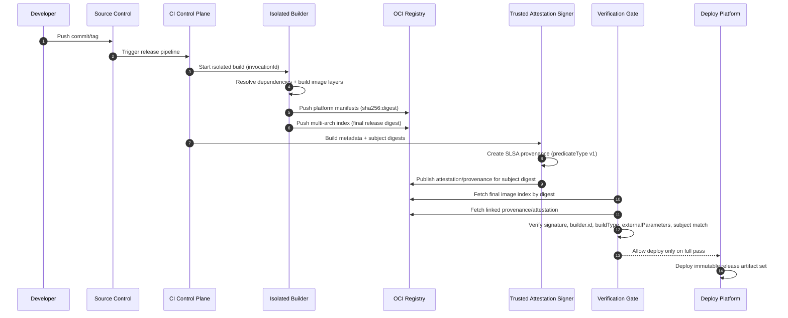

# SLSA Provenance (v1.2) for Container Images: Overview

## 1. Scope and objective

This overview describes how to apply the `SLSA v1.2` Build track to a CI/CD pipeline that builds and publishes container images.

Scope boundary:
- in scope: build provenance, builder identity, build invocation, artifact digest, provenance distribution, and deploy-time verification;
- out of scope: full Source track implementation and complete source-governance program;
- required assumption: source governance controls are still mandatory and must be verified separately from Build provenance.

Objective:
- provide verifiable traceability `source -> build -> image digest`
- reduce risk of artifact tampering, metadata forgery, and unauthorized build influence

SLSA adoption trace in this document:
- define the target pipeline maturity level first
- then set mandatory requirements for producer/build platform
- then formalize the threat model
- then present the reference CI/CD model and map verification by stage
- finally define policy gates and a minimal phased implementation recipe

---

## 2. Target Build maturity model: L1 -> L2 -> L3

### 2.1 Build L1

- provenance exists and describes how the image was built
- benefit: visibility and process traceability
- limitation: weak resistance to forgery

### 2.2 Build L2

- provenance is generated/signed by a hosted build platform
- verifier checks signature and builder identity
- baseline for live supply chains

### 2.3 Build L3

- stronger resistance to provenance forgery by tenant process
- build isolation, ephemeral environment, and protected signing secrets
- `externalParameters` must be complete (no hidden channel for external influence on the build)
- target level for internet-facing, high-value, partner-facing, and package/image-distribution release paths

---

### 2.4 Risk-tier target matrix

SLSA Build level selection is a risk decision, not a universal one-size-fits-all rule. Build provenance also does not replace Source-track governance; source review, branch protection, release authorization, and build-definition change control remain separate requirements.

| Release class | Minimum acceptable target | Additional requirement |
|---|---|---|
| Internal low-risk service with bounded blast radius | Build L2 may be acceptable with documented exception and deploy-time verification | Keep Source-track/SDLC controls explicit; do not claim L2/L3 proves source safety |
| Internet-facing, high-value, partner-facing, or live platform component | Build L3 target | Require protected source refs, reviewed build definitions, trusted builder identity, and pre-deploy policy enforcement |
| Widely consumed package/image, shared base image, signing tooling, deploy tooling, or regulated critical artifact | Build L3 plus stronger Source-track controls | Add stricter source governance, release authorization, key custody, reproducible or independent rebuild where practical, and faster incident revocation |

Use the lower tier only when the service owner records blast-radius assumptions, exception expiry, and compensating controls. If weak source governance is the real risk, record it as a Source-track or SDLC finding even when Build provenance passes.

## 3. Pipeline requirements (producer + build platform)

### 3.1 Source and invocation controls

These controls are Build-track expectations about what the builder is allowed to consume. They do not replace Source-track governance.

- canonical repo/revision only for release branches
- explicit policy for allowed trigger types (tag, protected branch)
- deny unauthorized runtime build parameters
- verify that provenance source fields match the expected repository, immutable revision, branch/tag policy, and build trigger

### 3.2 Build environment controls

- hosted runners for release builds
- one-build-one-ephemeral-environment
- no shared mutable state across concurrent builds
- treat cache as untrusted input; release pipelines must enforce cache-safe controls (scoped cache keys, provenance-consistent inputs), with optional no-cache rebuilds for high-risk releases

### 3.3 Artifact controls

- publish and enforce policy only by digest (`sha256:...`), not by mutable tag; release manifests, Helm values, Kustomize overlays, GitOps state, and release evidence must preserve the exact digest intended for deployment
- distinguish the OCI image index digest from platform-specific manifest digests. For multi-arch images, the release may have one index digest that points to different `linux/amd64`, `linux/arm64`, or other platform manifests
- validate the actual digest that the runtime will consume. If the deployment references an index, the gate must either verify the index and every allowed platform manifest, or resolve and verify the platform-specific manifest selected for the target cluster
- registry copy or promotion must not silently change the reviewed artifact reference. If an index or manifest is copied between registries, record the source digest, destination digest, media type, platform set, and the signature/provenance subject that policy verifies
- tag mutation must never bypass release approval. Tags may help humans find an artifact, but approval, provenance, vulnerability decisions, and deploy admission must bind to immutable digests

### 3.4 Source track and source-governance assumptions

Build provenance can prove where and how an artifact was built; it does not prove that the source change itself was authorized, reviewed, or safe.

Minimum source-governance assumptions before treating Build L2/L3 as ready for live use:
- protected branches and release tags are enforced for release sources;
- code owners or equivalent review rules cover application code, build definitions, deployment manifests, and signing/provenance configuration;
- changes to CI workflow files, build scripts, dependency manifests, and release configuration require security-relevant review;
- repository, owner, branch/tag, and commit identity are verified against immutable or tightly scoped identifiers where the platform supports them;
- emergency changes and bypasses have owner, justification, expiry, and post-change review.

Required evidence:
- branch/tag protection and review policy;
- change history for workflow/build/signing configuration;
- provenance samples showing source repository, revision, trigger, `buildType`, and `externalParameters`;
- exception log for source-control or review bypasses.

---

## 4. Threat model (overview)

Core scenarios the pipeline must cover:
- building from non-canonical source (fork/branch/tag drift)
- `externalParameters` tampering to inject unauthorized behavior
- provenance/signature forgery after build
- tampering in registry/transit
- cross-build influence (cache poisoning, persistence between builds)

Minimum mapping to SLSA verification:
- step 1: provenance authenticity + `subject` match
- step 2: expectation match (`builder.id`, source, `buildType`, parameters)
- step 3: dependency checks (`resolvedDependencies`) as best effort/recursive

---

## 5. Reference CI/CD model for container images

### 5.1 Delivery flow

`commit/tag -> CI trigger -> isolated build -> image push (digest) -> provenance generation/signing -> attestation publish -> verification gate -> deploy`

### 5.2 Key trust boundaries

- developer/workstation
- source control system
- build platform control plane
- attestation signer service (part of build platform control plane)
- user-defined build steps (tenant workload)
- registry/distribution layer
- deployment control plane (admission/policy engine)

### 5.3 Sequence diagram: final artifact formation



### 5.4 How to read the diagram: trusted and risk paths

Trusted release path:
- trigger from canonical source
- isolated build inside trusted build platform
- digest-only artifact publication
- provenance generated by trusted attestation signer
- policy-based verification gate before deployment

Higher-risk paths (focus points):
- any non-canonical source/trigger before build starts
- runtime parameters outside approved `externalParameters` schema
- shared state/cache enabling cross-build influence
- any tenant-step access attempt to signer service/secrets
- deployment by mutable tag without attestation/provenance verification

Operational rule:
- the attestation signer belongs to the trusted build platform control plane; tenant build steps must not have direct access to it and must not have access to provenance signing secrets

### 5.5 What to verify at each stage

- pre-build: canonical source/revision + allowed trigger
- post-build: subject digest + provenance envelope authenticity
- pre-deploy: `predicateType`, `builder.id`, issuer/identity, `buildType`, `externalParameters` schema, anti-replay
- post-deploy: persist gate pass/fail in audit trail

Final release artifact set:
- OCI image index digest when the release is multi-platform
- platform-specific image manifest digest for every allowed target platform
- image config and filesystem layer descriptors reachable from the approved manifest
- SLSA provenance attestation linked to artifact digest
- verification gate result (pass/fail) in audit trail

---

## 6. Attestation/provenance distribution

### 6.1 Where to publish

Recommended minimum:
- primary: in the same OCI repository, explicitly linked to artifact digest via `subject`/referrers
- secondary: additional location only as backup/disaster channel (for example, release assets)

### 6.2 Artifact <-> attestation relationship

- support one-to-many (multiple attestations per artifact)
- accept attestations only when both checks pass: `builder.id` in allowlist and signature issuer/identity in allowlist
- attestations must be immutable: do not overwrite attestation for the same digest
- for multi-arch images, define whether the subject is the image index digest, each platform-specific manifest digest, or both. Live-environment policy must be explicit, otherwise a verified index can hide an unverified platform manifest, or a verified platform manifest can be deployed through an unapproved index
- when images are promoted across registries, verify the attestation subject against the digest used in the destination deployment, not only against a source-registry reference observed earlier in CI

---

## 7. Trust roots and identity pinning

### 7.1 What to pin in policy

- signature identity: certificate issuer and subject/SAN from the signing certificate (exact match or tightly scoped regexp for a specific CI workflow identity);
- OIDC issuer used for keyless signing, separate from the subject/SAN;
- workflow identity, such as GitHub workflow ref, job workflow ref, or certificate SAN pattern, depending on the signing system;
- source identity: repository, immutable repository/owner identifiers when available, branch/tag/ref, and expected commit provenance;
- SLSA builder identity: `predicate.runDetails.builder.id` (exact match) and max trusted SLSA Build level for that builder;
- signature trust roots (for example, Fulcio/Rekor or enterprise PKI), separated by environment
- expected `buildType` and policy/schema version for `externalParameters`

Do not collapse these identities into one `subject` field. GitHub Actions OIDC `sub` format depends on organization/repository configuration and, for new repositories, may include immutable owner/repository identifiers. Policy must be tested against real signing certificates and real provenance samples from the release workflow before enforcement.

Minimum policy model:

```yaml
trusted_builders:
  - signature_oidc_issuer: https://token.actions.githubusercontent.com
    signature_certificate_identity: https://github.com/ORG/REPO/.github/workflows/release.yml@refs/tags/v*
    github_oidc_subject_pattern: repo:ORG/REPO:ref:refs/tags/v*
    source_repository: github.com/ORG/REPO
    source_ref_pattern: refs/tags/v*
    workflow_ref: ORG/REPO/.github/workflows/release.yml@refs/tags/v*
    builder_id: https://github.com/slsa-framework/slsa-github-generator/.github/workflows/generator_generic_slsa3.yml@refs/tags/v*
    max_slsa_build_level: 3
    build_type: https://slsa-framework.github.io/github-actions-buildtypes/workflow/v1
    external_parameters_schema: policy://slsa/github-actions/v3
```

### 7.2 Rotating trust roots/identity without outage

- rotate with a controlled overlap window: temporarily accept old+new identity, then remove old
- treat every trust-root/allowlist change as a policy change with review and audit trail

---

## 8. Verification policy before deployment + minimal implementation recipe

### 8.1 Mandatory gate

SLSA-conformance and local deployment policy are separate checks. Do not fail a valid SLSA provenance only because optional build metadata is missing; fail it when required SLSA fields, authenticity, subject binding, or policy expectations do not pass.

SLSA-required and expectation checks:

1. Verify statement shape: `_type = https://in-toto.io/Statement/v1` and presence of `subject[]`, `predicate.buildDefinition`, `predicate.runDetails`
2. Verify provenance envelope authenticity and `subject` match
3. Verify `predicateType = https://slsa.dev/provenance/v1`
4. Verify presence of `predicate.runDetails.builder` and match `builder.id` against the trusted builder allowlist
5. Verify roots of trust and signature issuer/identity against allowlist
6. Verify expectations for source/build parameters; keys in `externalParameters` that are outside the approved schema for the specific `buildType` and policy version => fail

Organization deployment policy checks:

1. If `predicate.runDetails.metadata.startedOn` and `finishedOn` are present, verify `startedOn <= finishedOn`; if they are absent, require builder-specific evidence or a documented policy exception instead of treating absence as SLSA failure
2. Enforce provenance freshness through local `max_provenance_age` per environment (for example, prod `24h`, staging `7d`), except for approved delayed deploy/promote cases
3. For delayed deploy/promote, redeploy of a previously approved digest is allowed when artifact digest is unchanged, provenance/attestation digest is unchanged, and a valid prior gate-pass exists in audit trail

### 8.2 Decision policy

- default: `deny`
- deployment is allowed only after full pass of mandatory checks
- break-glass is allowed only via formal exception with TTL and post-incident RCA

Guardrail for live environments:
- live-environment `break-glass` must not exceed `24h`, with mandatory post-incident review

### 8.3 Minimal implementation recipe (phased)

If the reference model cannot be reached in one step, adopt in phases:

1. Phase A (L1):
- publish digest-only artifacts
- generate provenance for each release image
- persist gate result in audit trail

2. Phase B (L2):
- move release builds to hosted runners
- enforce provenance signature + `builder.id` + issuer/identity allowlist checks
- block deployment unless mandatory gate fully passes

3. Phase C (L3):
- enforce one-build-one-ephemeral-environment
- remove tenant-step direct access to signer/secrets
- enforce schema-versioned `externalParameters` policy and anti-replay rules per environment
---

## 9. Related Materials

- [Container image security playbook](../container-image-security/playbook.en.md)
- [Release governance playbook](../../review/release-governance/playbook.en.md)
- [Vulnerability management playbook](../../review/vulnerability-management/playbook.en.md)
- [Kubernetes cluster security review playbook](../../platform-security/kubernetes/cluster-security-review/playbook.en.md)
