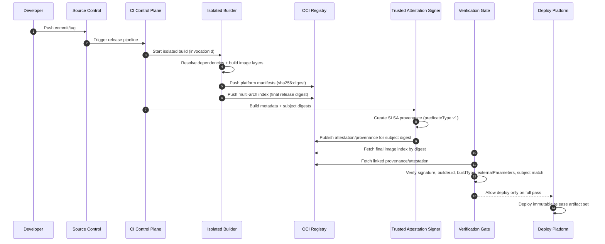

# SLSA Provenance (v1.2) для контейнерных образов: Обзор

## 1. Область и цель

Этот обзор описывает, как применять Build track `SLSA v1.2` к CI/CD-пайплайну, который собирает и публикует контейнерные образы.

Граница области:
- в scope: build provenance, builder identity, build invocation, artifact digest, provenance distribution и deploy-time verification;
- вне scope: полная реализация Source track и полноценная программа source-governance;
- обязательное предположение: source governance controls все равно обязательны и должны проверяться отдельно от Build provenance.

Цель:
- обеспечить проверяемую трассировку `source -> build -> image digest`
- снизить риск подмены артефакта, подделки metadata и несанкционированного build-влияния

Трассировка применения SLSA в этом документе:
- сначала фиксируется целевой уровень зрелости пайплайна
- затем задаются обязательные требования к producer/build platform
- затем формализуется модель угроз
- после этого строится референсная CI/CD-модель и разбирается по этапам верификации
- в конце задаются policy-правила и минимальный поэтапный рецепт внедрения

---

## 2. Целевая Build-модель зрелости: L1 -> L2 -> L3

### 2.1 Build L1

- provenance существует и описывает, как собран образ
- польза: видимость и воспроизводимость процесса
- ограничение: низкая устойчивость к подделке

### 2.2 Build L2

- provenance генерирует/подписывает hosted build platform
- верификатор проверяет подпись и identity builder
- базовый уровень для рабочей цепочки поставки

### 2.3 Build L3

- усиленная защита от подделки provenance tenant-процессом
- изоляция между билдами, эфемерная среда, недоступность signing secrets
- `externalParameters` должны быть полными (без скрытых каналов внешнего влияния на build)
- целевой уровень для internet-facing, high-value, partner-facing и package/image-distribution release paths

---

### 2.4 Матрица целевых уровней по риску

Выбор SLSA Build level — это risk decision, а не универсальное правило для всех релизов. Build provenance также не заменяет Source-track governance: source review, branch protection, release authorization и контроль изменений build definitions остаются отдельными требованиями.

| Класс релиза | Минимально допустимая цель | Дополнительное требование |
|---|---|---|
| Внутренний low-risk service с ограниченным blast radius | Build L2 может быть допустим при документированном исключении и deploy-time verification | Source-track/SDLC controls должны быть явными; не заявляйте, что L2/L3 доказывает безопасность source |
| Internet-facing, high-value, partner-facing или компонент рабочей платформы | Целевой уровень Build L3 | Требуются protected source refs, review build definitions, trusted builder identity и pre-deploy policy enforcement |
| Широко используемый package/image, shared base image, signing tooling, deploy tooling или regulated critical artifact | Build L3 плюс усиленные Source-track controls | Добавьте более строгий source governance, release authorization, key custody, reproducible или independent rebuild where practical и ускоренную incident revocation |

Нижний tier используйте только если владелец сервиса фиксирует blast-radius assumptions, expiry исключения и компенсирующие меры. Если реальный риск в слабом source governance, фиксируйте его как Source-track или SDLC-замечание даже при успешной Build provenance проверке.

## 3. Требования к pipeline (producer + build platform)

### 3.1 Меры контроля source и invocation

Эти меры контроля являются Build-track expectations о том, что builder имеет право потреблять. Они не заменяют Source-track governance.

- только canonical repo/revision для релизных веток
- явная политика допустимых типов запуска (tag, protected branch)
- запрет неутвержденных runtime-параметров сборки
- проверка, что source fields в provenance соответствуют ожидаемому repository, immutable revision, branch/tag policy и build trigger

### 3.2 Меры контроля build environment

- hosted runner для релизных сборок
- one-build-one-ephemeral-environment
- запрет shared mutable state между concurrent builds
- cache рассматривается как недоверенный ввод; для release-пайплайна обязательны cache-safe controls (scoped cache keys, provenance-consistent inputs), а для high-risk релизов опционально выполняется rebuild без cache

### 3.3 Меры контроля артефактов

- публикация и policy decisions только по digest (`sha256:...`), не по mutable tag; релизные manifests, Helm values, Kustomize overlays, GitOps state и release evidence должны сохранять точный digest, который планируется к deploy
- различайте digest OCI image index и digest platform-specific manifest. У multi-arch image может быть один index digest, который указывает на разные manifests для `linux/amd64`, `linux/arm64` или других платформ
- проверяйте фактический digest, который будет потреблять runtime. Если deployment ссылается на index, gate должен либо проверить index и все разрешенные platform manifests, либо resolve и проверить platform-specific manifest, выбранный для целевого cluster
- registry copy или promotion не должны незаметно менять reviewed artifact reference. Если index или manifest копируется между registries, фиксируйте source digest, destination digest, media type, platform set и subject подписи/provenance, который проверяет policy
- tag mutation никогда не должен обходить release approval. Tags могут помогать людям находить artifact, но approval, provenance, vulnerability decisions и deploy admission должны привязываться к immutable digests

### 3.4 Source track и предположения source-governance

Build provenance может доказать, где и как был собран артефакт; она не доказывает, что source change был авторизован, отревьюен и безопасен.

Минимальные source-governance assumptions перед тем, как считать Build L2/L3 готовым к рабочей эксплуатации:
- protected branches и release tags enforced для релизных source refs;
- code owners или эквивалентные review rules покрывают application code, build definitions, deployment manifests и signing/provenance configuration;
- изменения CI workflow files, build scripts, dependency manifests и release configuration требуют security-relevant review;
- repository, owner, branch/tag и commit identity проверяются по immutable или строго ограниченным identifiers там, где platform это поддерживает;
- emergency changes и bypasses имеют owner, justification, expiry и post-change review.

Подтверждения:
- branch/tag protection и review policy;
- change history для workflow/build/signing configuration;
- provenance samples, показывающие source repository, revision, trigger, `buildType` и `externalParameters`;
- журнал исключений для source-control или review bypasses.

---

## 4. Модель угроз (обзор)

Основные сценарии, которые должен покрывать pipeline:
- build от неканоничного source (fork/branch/tag drift)
- подмена `externalParameters` для внедрения несанкционированного поведения
- подделка provenance или подписи после сборки
- tampering в registry/транзите
- cross-build влияние (cache poisoning, persistence между билдами)

Минимальная привязка к SLSA-проверкам:
- шаг 1: подлинность provenance + соответствие `subject`
- шаг 2: соответствие ожиданиям (`builder.id`, source, `buildType`, parameters)
- шаг 3: зависимые артефакты (`resolvedDependencies`) по best effort/рекурсивно

---

## 5. Референсная модель CI/CD для container images

### 5.1 Поток поставки

`commit/tag -> CI trigger -> isolated build -> image push (digest) -> provenance generation/signing -> attestation publish -> verification gate -> deploy`

### 5.2 Ключевые trust boundaries

- developer/workstation
- source control system
- build platform control plane
- attestation signer service (часть build platform control plane)
- user-defined build steps (tenant workload)
- registry/distribution layer
- deployment control plane (admission/policy engine)

### 5.3 Sequence-диаграмма: формирование итогового артефакта



### 5.4 Как читать диаграмму: надежные и рискованные пути

Надежный путь (release path):
- запуск из canonical source
- isolated build в trusted build platform
- публикация только digest-артефактов
- trusted attestation signer формирует provenance
- verification gate принимает решение по policy и только затем deploy

Пути повышенного риска (focus points):
- любой неканоничный source/trigger до запуска build
- любые runtime-параметры, не входящие в schema `externalParameters`
- shared state/cache, влияющий на cross-build поведение
- попытка signer access из tenant build steps
- deploy по tag без проверки attestation/provenance

Практическое правило:
- attestation signer относится к trusted build platform control plane; tenant build steps не должны иметь к нему прямого доступа и не должны иметь доступ к секретам подписи provenance

### 5.5 Что верифицировать на каждом этапе

- перед build: canonical source/revision + допустимый trigger
- после build: subject digest + provenance envelope authenticity
- перед deploy: `predicateType`, `builder.id`, issuer/identity, `buildType`, `externalParameters` schema, anti-replay
- после deploy: фиксация gate-pass/fail в audit trail

Итоговый набор релизных артефактов:
- OCI image index digest, если release является multi-platform
- platform-specific image manifest digest для каждой разрешенной целевой платформы
- image config и filesystem layer descriptors, достижимые из approved manifest
- SLSA provenance attestation, связанная с digest артефакта
- результат verification gate (pass/fail) в audit trail

---

## 6. Дистрибуция attestations/provenance

### 6.1 Где публиковать

Рекомендуемый минимум:
- primary: в том же OCI repository, с явной привязкой к artifact digest через `subject`/referrers
- secondary: дополнительная площадка только как backup/disaster channel (например, release assets)

### 6.2 Связь artifact <-> attestation

- поддерживать one-to-many (несколько attestations на артефакт)
- принимать attestations только если одновременно выполняются два условия: `builder.id` в allowlist и issuer/identity подписи в allowlist
- attestations должны быть immutable: не перезаписывать attestation для того же digest
- для multi-arch images явно определяйте, что является subject: image index digest, каждый platform-specific manifest digest или оба уровня. Политика для рабочих сред должна быть явной, иначе verified index может скрыть unverified platform manifest, а verified platform manifest может быть развернут через unapproved index
- при promotion между registries проверяйте attestation subject относительно digest, используемого в destination deployment, а не только относительно source-registry reference, который CI видел раньше

---

## 7. Корни доверия и закрепление identity

### 7.1 Что фиксировать в policy

- signature identity: issuer и subject/SAN сертификата подписи (exact match или строго ограниченный regexp для конкретного CI workflow identity);
- OIDC issuer, используемый для keyless signing, отдельно от subject/SAN;
- workflow identity, например GitHub workflow ref, job workflow ref или certificate SAN pattern, в зависимости от signing system;
- source identity: repository, immutable repository/owner identifiers при наличии, branch/tag/ref и ожидаемая provenance коммита;
- SLSA builder identity: `predicate.runDetails.builder.id` (exact match) и максимальный доверенный SLSA Build level для этого builder;
- trust roots для проверки подписи (например, Fulcio/Rekor или корпоративная PKI), отдельно по средам
- ожидаемый `buildType` и версия policy/schema для `externalParameters`

Не сворачивайте эти identity в одно поле `subject`. Формат GitHub Actions OIDC `sub` зависит от настроек organization/repository и для новых repositories может включать immutable owner/repository identifiers. Перед enforcement policy нужно протестировать на реальных signing certificates и реальных provenance samples из release workflow.

Минимальная модель policy:

```yaml
trusted_builders:
  - signature_oidc_issuer: https://token.actions.githubusercontent.com
    signature_certificate_identity: https://github.com/ORG/REPO/.github/workflows/release.yml@refs/tags/v*
    github_oidc_subject_pattern: repo:ORG/REPO:ref:refs/tags/v*
    source_repository: github.com/ORG/REPO
    source_ref_pattern: refs/tags/v*
    workflow_ref: ORG/REPO/.github/workflows/release.yml@refs/tags/v*
    builder_id: https://github.com/slsa-framework/slsa-github-generator/.github/workflows/generator_generic_slsa3.yml@refs/tags/v*
    max_slsa_build_level: 3
    build_type: https://slsa-framework.github.io/github-actions-buildtypes/workflow/v1
    external_parameters_schema: policy://slsa/github-actions/v3
```

### 7.2 Ротация trust roots/identity без outage

- проводить ротацию через controlled overlap: временно принимать old+new identity, затем удалять old
- каждое изменение trust roots/allowlist оформлять как policy change с ревью и audit trail

---

## 8. Политика проверки перед deploy и минимальный рецепт внедрения

### 8.1 Обязательный gate

SLSA conformance и локальная deployment policy — разные проверки. Не отклоняйте валидную SLSA provenance только из-за отсутствия optional build metadata; отклоняйте, когда не проходят обязательные SLSA-поля, authenticity, привязка к subject или policy expectations.

Обязательные SLSA-проверки и expectation checks:

1. Проверка структуры statement: `_type = https://in-toto.io/Statement/v1` и наличие `subject[]`, `predicate.buildDefinition`, `predicate.runDetails`
2. Проверка аутентичности provenance envelope и соответствия `subject`
3. Проверка `predicateType = https://slsa.dev/provenance/v1`
4. Проверка наличия `predicate.runDetails.builder` и соответствия `builder.id` trusted builder allowlist
5. Проверка roots of trust и issuer/identity подписи по allowlist
6. Проверка expectations по source/build parameters; ключи в `externalParameters`, не входящие в утвержденную schema для конкретного `buildType` и версии policy, => fail

Локальные проверки deployment policy:

1. Если `predicate.runDetails.metadata.startedOn` и `finishedOn` присутствуют, проверяйте `startedOn <= finishedOn`; если они отсутствуют, требуйте builder-specific evidence или документированное policy-исключение, а не считайте отсутствие SLSA failure
2. Проверяйте freshness provenance через локальный `max_provenance_age` per environment (например, prod `24h`, staging `7d`), кроме утвержденных delayed deploy/promote сценариев
3. Для delayed deploy/promote повторный deploy ранее одобренного digest допускается при неизменности digest артефакта, неизменности provenance/attestation digest и наличии валидного предыдущего gate-pass в audit trail

### 8.2 Политика решений

- default: `deny`
- deploy разрешается только при полном прохождении обязательных проверок
- break-glass допустим только по оформленному исключению с TTL и последующим RCA

Ограничение для рабочих сред:
- `break-glass` для prod не дольше `24h`, с обязательным post-incident review

### 8.3 Минимальный рецепт внедрения (поэтапно)

Если референсная модель недостижима за один шаг, внедрять по фазам:

1. Phase A (L1):
- выпускать digest-only артефакты
- генерировать provenance для каждого релизного image
- сохранять результат gate в audit trail

2. Phase B (L2):
- перенести релизные сборки на hosted runner
- включить проверку подписи provenance + `builder.id` + issuer/identity allowlist
- запретить deploy без полного mandatory gate-pass

3. Phase C (L3):
- обеспечить one-build-one-ephemeral-environment
- закрыть прямой доступ tenant steps к signer/secrets
- зафиксировать schema-versioned policy для `externalParameters` и правила anti-replay per environment
---

## 9. Связанные материалы

- [Плейбук безопасности container images](../container-image-security/playbook.ru.md)
- [Плейбук release governance](../../review/release-governance/playbook.ru.md)
- [Плейбук управления уязвимостями](../../review/vulnerability-management/playbook.ru.md)
- [Плейбук ревью безопасности Kubernetes-кластера](../../platform-security/kubernetes/cluster-security-review/playbook.ru.md)
