# Infrastructure Technologies Reference

This document explains how key technologies commonly seen in live infrastructure and security reviews work. It does not replace playbooks: the focus here is purpose, operating model, responsibility boundaries, and common live patterns.

Sections are grouped by the role a technology plays in a live system: build and supply chain, container platform, identity/secrets, automation, data stores, and messaging.

## Table of Contents

- [Build, Delivery, and Supply Chain](#build-delivery-and-supply-chain)
  - [CI/CD Platforms](#cicd-platforms)
  - [Docker](#docker)
  - [OCI Registry / Artifact Registry](#oci-registry--artifact-registry)
  - [Helm](#helm)
  - [GitOps / Argo CD / Flux](#gitops--argo-cd--flux)
- [Container Platform and Kubernetes Runtime](#container-platform-and-kubernetes-runtime)
  - [Container Runtimes](#container-runtimes)
  - [Kubernetes](#kubernetes)
  - [CNI / Kubernetes Networking](#cni--kubernetes-networking)
  - [Ingress / Gateway / API Gateway](#ingress--gateway--api-gateway)
  - [Istio](#istio)
  - [Policy Engines](#policy-engines)
- [Identity, Secrets, and Access](#identity-secrets-and-access)
  - [Cloud IAM / Workload Identity](#cloud-iam--workload-identity)
  - [Vault](#vault)
  - [PKI / cert-manager](#pki--cert-manager)
  - [KMS / HSM](#kms--hsm)
- [Automation and Configuration Management](#automation-and-configuration-management)
  - [Ansible](#ansible)
  - [Terraform / OpenTofu](#terraform--opentofu)
- [Data Stores, Search, and Messaging](#data-stores-search-and-messaging)
  - [Object Storage](#object-storage)
  - [PostgreSQL / Relational Databases](#postgresql--relational-databases)
  - [Redis](#redis)
  - [Vector Database / Vector DB](#vector-database--vector-db)
  - [Elasticsearch / OpenSearch](#elasticsearch--opensearch)
  - [Kafka](#kafka)
  - [RabbitMQ](#rabbitmq)
- [Related Materials](#related-materials)

## Build, Delivery, and Supply Chain

### CI/CD Platforms

#### What It Is Used For
CI/CD platforms are used to build, test, package, publish, and deploy software artifacts. Common examples include GitHub Actions, GitLab CI, Jenkins, Buildkite, and TeamCity. In live environments this is a central part of the software supply chain: the pipeline gets access to source code, secrets, package registries, cloud accounts, artifact registries, and deployment environments.

#### Operating Model
A pipeline or workflow describes a sequence of jobs. A job runs on a runner/agent and usually consists of steps: source checkout, dependency installation, tests, security scans, build, artifact upload, image push, and deployment. A runner can be hosted, where the CI/CD vendor provides the execution infrastructure, or self-hosted, where the team runs agents in its own network, cloud account, or Kubernetes cluster.

Artifacts are used to pass build outputs between jobs and later stages. Cache speeds up repeated builds by storing dependencies or intermediate outputs. An environment defines a deployment target such as `staging` or `prod`, and can have protection rules: required reviewers, wait timers, branch/tag restrictions, and environment-scoped secrets. A secret store holds tokens, passwords, certificates, and signing keys available to the pipeline during job execution.

A modern live pattern is to use OIDC federation instead of long-lived static secrets. The CI/CD platform issues a short-lived OIDC token for a specific job/workflow with claims about the repository, branch/tag, pipeline, environment, and actor. A cloud provider or Vault verifies the issuer, audience, subject, and additional claims, then issues temporary credentials with a limited policy.

The deploy pipeline should not be the only trust point. The pipeline builds and publishes an artifact, while a deploy/admission gate separately verifies the digest, signature, provenance, policy result, environment approval, and release eligibility. The boundary usually sits where the pipeline hands an immutable artifact and deployment intent to Kubernetes, a GitOps controller, a release orchestrator, or a cloud deploy service.

Untrusted workflow input is a separate boundary. Pull request titles and bodies, issue comments, branch names, tag names, release notes, commit messages, and forked code must be treated as attacker-controlled when they reach shell scripts, deployment commands, release notes, AI-assisted workflow steps, or policy inputs.

#### Interaction Diagram
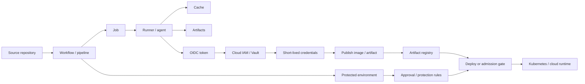

#### Responsibility Boundaries
A CI/CD platform runs automation and provides primitives for secrets, runners, artifacts, approvals, and identity federation, but it does not make a pipeline secure automatically. The team owns minimal workflow permissions, trusted actions/plugins, self-hosted runner isolation, protected branches/tags/environments, secrets, cache poisoning controls, artifact integrity, and separation between build and deploy roles.

Hosted runners reduce operational burden and usually provide a clean ephemeral environment. Self-hosted runners are needed for private networks, specialized hardware, or compliance, but require hardening, cleanup, egress control, patching, and protection against persistence between jobs.

#### Common Live Patterns
- Protected branches and tags for release refs.
- Environment approvals for live deployment.
- OIDC federation into a cloud provider or Vault instead of static deploy secrets.
- OIDC trust bound to issuer, audience, protected ref/environment, workflow identity, and repository identity; broad organization-wide trust is not a live-deploy default.
- Separate runners for trusted and untrusted workloads.
- Ephemeral self-hosted runners for pull request builds from untrusted code.
- No production secrets, signing material, or deploy credentials on runners that execute untrusted fork or branch code.
- Artifact transfer bound to an immutable identifier and verifiable digest; publication of SBOM, provenance, and signatures.
- Read-only source token by default; write permissions only for selected jobs.
- A deploy gate that does not trust pipeline success alone.

#### Security and Operational Verification

Treat repository content, pull request metadata, dependency scripts, caches, and artifacts from untrusted jobs as attacker-controlled input. A privileged follow-up job must not execute their contents merely because the earlier job completed successfully. Keep untrusted build execution separate from signing and deployment, and verify the producer, revision, digest, and required provenance before promotion.

Test that an untrusted change cannot acquire a write token, cloud deployment session, signing credential, or access to internal services. For self-hosted runners, confirm that the whole execution environment is disposable or otherwise isolated between jobs; removing the runner registration alone does not remove host persistence. Separate cache write permissions and trust scopes so that an untrusted producer cannot supply executable cache content to release jobs.

For GitHub Actions, review privileged triggers such as `pull_request_target` and `workflow_run`, including checkout, artifact consumption, and dependency execution. Do not disable platform safeguards to execute an untrusted revision with privileged credentials. Pin third-party actions to reviewed immutable revisions and pass event metadata as data rather than interpolating it into shell scripts.

#### Related Project Files
- `content/supply-chain/slsa-provenance/overview.ru.md` / `overview.en.md` — trusted builders, provenance, and verification policy.
- `content/review/release-governance/playbook.ru.md` / `playbook.en.md` — protected environments, release evidence, and approvals.
- `content/platform-security/secrets/vault/playbook.ru.md` / `playbook.en.md` — short-lived secrets and credentials issued to pipelines.
- [CI/CD security](../../content/supply-chain/ci-cd-security/playbook.en.md): executor isolation, artifact trust, and deployment acceptance.
- [Executable policy examples](../security-policy-examples/overview.en.md): configuration checks and allowed/denied CI scenarios.

### Docker

#### What It Is Used For
Docker is used to build, package, and run applications in containers. In live environments it most often appears as an image build tool, a local development tool, a CI/CD pipeline component, and part of the container supply chain, even when Kubernetes runs containers through containerd or CRI-O rather than Docker Engine.

#### Operating Model
`Dockerfile` describes what an image is built from: the base image, package installation, copied files, environment variables, user, working directory, and startup command. Build instructions produce filesystem changes and image configuration. Layers record filesystem changes; instructions such as `ENV` and `CMD` set metadata and runtime defaults, so not every instruction produces a new filesystem layer. The final image becomes a portable artifact that can be pushed to a registry and run in different environments.

At the OCI level, a runnable image is not a single opaque file. A platform-specific image manifest points to one image config object and an ordered set of filesystem layer descriptors. The config records runtime defaults such as entrypoint, command, environment, user, exposed ports, volumes, labels, and root filesystem metadata. Layers record filesystem changes; they do not carry the runtime configuration by themselves. An image index, also called a manifest list in Docker terminology, points to one or more platform-specific manifests.

A registry stores and serves images. Docker CLI is the client used by developers or CI jobs to send build, publish, and run commands. Docker daemon executes those commands on the host: it builds images, creates containers, attaches volumes and networks, assigns constraints, and delegates low-level execution to the runtime.

A container is a running process with an isolated view of the filesystem, processes, network, and resources. A volume is used for data that must survive container recreation. A network defines how a container communicates with other containers, the host, and external systems.

A typical flow looks like this: a developer or CI job builds an image from a `Dockerfile`, publishes it to a registry, then a runtime pulls the image and starts a container from an immutable set of layers with configured namespaces, cgroups, capabilities, mounts, and networking. When used with Kubernetes, Docker usually remains in the build/package stage, while node-level execution is handled by a container runtime.

The terms `tag`, `digest`, and image ID are easy to mix up in reviews. A tag is a mutable registry reference unless registry policy prevents mutation. A digest identifies registry content such as an index, manifest, config, or layer. The image ID is derived from the image config and is useful locally, but live deployment policy should bind to the registry digest that Kubernetes and the container runtime pull.

#### Interaction Diagram
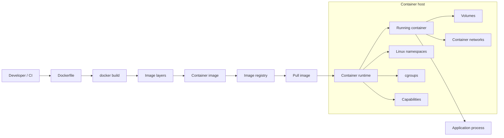

#### Responsibility Boundaries
Docker helps package an application and define runtime parameters, but it does not make an image secure automatically. The team is responsible for minimizing the base image, keeping secrets out of layers, pinning versions, scanning dependencies, running without root, limiting capabilities, and publishing images correctly to a registry.

The application still owns its own authentication, authorization, input handling, and safe use of secrets.

#### Common Live Patterns
- Building images in CI.
- Storing images in a private registry.
- Multi-stage builds.
- Minimal base images.
- Image scanning before publication or deployment.
- Image signing and provenance for critical services.
- Digest-pinned live deployments; tags are used for discovery or channels, not as the release trust anchor.
- Running containers in Kubernetes through containerd or CRI-O rather than directly through Docker Engine.

#### Security and Operational Verification

Treat access to a rootful Docker daemon as host-administrator access. Do not mount its socket into application containers or untrusted build jobs. A read-only socket mount does not make the API read-only: authorized clients can still send state-changing requests. Secure remote access through authenticated SSH or TLS and restrict who can reach and use the endpoint.

Verify the daemon and context actually used by CI, rather than inferring rootless operation from the container's `USER`. For a rootless deployment, confirm daemon mode and test that resource limits and required network behavior work on the deployed host. Rootless execution reduces host privileges but does not protect files and credentials accessible to the daemon's user from malicious jobs.

Use isolated disposable build environments for untrusted changes. With synthetic secrets, check image layers, image configuration, build logs, and exported caches for leakage; deleting a file in a later layer does not erase it from earlier layers. Verify runtime privileges, mounts, capabilities, and resource limits separately from image scanning.

#### Related Project Files
- `content/supply-chain/container-image-security/playbook.ru.md` / `playbook.en.md` — OCI image model, Dockerfile baseline, registry promotion, digest pinning, scanning, and signing.
- `content/platform-security/kubernetes/container-escape-capability-abuse/overview.ru.md` / `overview.en.md` — container escape risks through capabilities and dangerous container settings.
- `content/platform-security/kubernetes/pod-security/playbook.ru.md` / `playbook.en.md` — secure workload settings that apply to containers in Kubernetes.
- `content/supply-chain/slsa-provenance/overview.ru.md` / `overview.en.md` — artifact origin, supply chain, and build trust.

### OCI Registry / Artifact Registry

#### What It Is Used For
An OCI registry stores and serves container images and related supply-chain artifacts: SBOMs, signatures, provenance attestations, scan results, Helm charts, and other OCI-compatible objects. In live environments, the registry is usually the central point between the build pipeline, the deployment platform, and runtime: CI publishes artifacts, the admission/deploy gate verifies them, and Kubernetes nodes pull digests to run workloads.

#### Operating Model
The OCI Distribution Specification defines the API for pushing and pulling content through a registry. The core objects are blobs, manifests, image indexes, digests, and tags. A blob stores an image layer or config. A manifest describes one image or artifact and references blobs by digest. An image index connects several platform-specific manifests, such as `linux/amd64` and `linux/arm64`. A digest is a content-addressed identifier for specific registry content; a tag is a human-readable reference to a manifest or index and may be mutable unless registry policy prevents it.

A repository inside a registry groups related artifacts, for example `prod/payments/api`. A client pushes blobs and a manifest, then may assign a tag. During pull, the client asks for a manifest or index by tag or digest, receives descriptors for the selected content, and downloads the referenced blobs. For a multi-platform image, the client may first receive an index and then select the platform-specific manifest for its OS and architecture. Kubernetes deployments to live environments should reference images by digest because a tag is not a reliable immutable reference without a separate tag immutability policy.

Registry promotion must preserve what was reviewed. Copying an image from one registry to another can change the repository reference and may produce a different top-level digest when the copied object, media type, or index shape changes. Review evidence therefore needs the source and destination references, the exact digest deployed, the platform manifest set, and the signature/provenance subject that was accepted by policy.

Modern artifact registries often store not only images, but also referrers: signatures, SBOMs, and provenance linked to a subject digest. For example, image `sha256:...` can have a cosign signature, SLSA provenance, and SBOM as separate OCI artifacts. A deploy gate or admission policy first extracts the image digest, then looks for linked attestations/referrers and verifies the signature, builder identity, provenance predicate, and policy outcome.

The registry also handles authorization, retention, replication, vulnerability scanning, pull-through cache, and audit logs. In a cloud registry this is often a managed service with IAM policies; in self-hosted deployments such as Harbor or distribution-based registries, the team owns storage, TLS, auth, replication, and cleanup.

#### Interaction Diagram
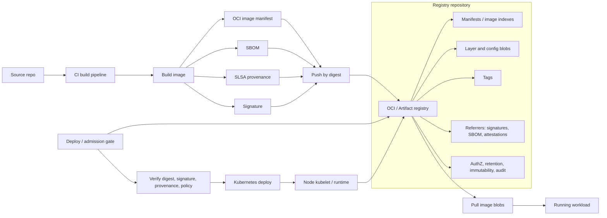

#### Responsibility Boundaries
A registry stores and serves artifacts through an API, but it does not automatically prove that an image is safe, signed by the right subject, or built from an approved source. The team owns authentication and authorization, immutable digest-based deployment, tag immutability for release tags, signatures, provenance, retention, vulnerability management, and audit trail.

The artifact registry should not be the only control point. Even if the registry blocks some unsafe images, the deploy gate should independently verify digest, signature, builder identity, provenance, and policy decision before a workload reaches a live environment.

#### Common Live Patterns
- Private registry with IAM/RBAC and separate repositories by environment or domain.
- Deployment only by digest (`image@sha256:...`); tags are used for discovery, not as the trust anchor.
- Tag immutability for release tags and no overwrites for live-environment tags.
- Image signing and SBOM/provenance publication as OCI artifacts/referrers.
- Admission/deploy gate that verifies signature, trusted builder identity, SLSA provenance, and vulnerability policy.
- Retention policy for old images while keeping artifacts required for rollback, incident response, and audit.
- Pull-through cache with a separate trust policy for upstream images.
- Audit logging for push/delete/tag mutation/anomalous pull patterns.

#### Security and Operational Verification

Separate build publication, release promotion, workload pull, and deletion identities. Test that a workload pull credential cannot publish or delete content and that a build job cannot overwrite the approved release channel. Apply repository-scoped permissions and verify effective access to signatures and attestations as well as images.

Verify the effective scope of immutability: tag selection rules, exclusions, permission to change the policy itself, and interaction with deletion and retention. Semantics depend on the registry; preventing overwrites of an existing tag alone does not prove that deletion or recreation is blocked. In a test repository, exercise overwriting, deleting, and republishing a release tag through the API and replication. A build identity must not be able to change protection rules; authorized administrative changes must leave an audit trail.

Exercise promotion and retention with an image index and its platform manifests, signatures, SBOM, and provenance. Confirm the destination digest and all required evidence remain discoverable and verifiable after replication and cleanup. Missing evidence must reject a deployment that requires it; an existing image is not sufficient proof that its evidence survived retention.

Deleting a registry artifact does not stop running containers or erase copies in node caches, mirrors, or exported archives. For a compromised digest, block new deployments, identify and replace affected workloads, and rotate exposed credentials. Test the incident procedure against a cached image. Registry cleanup and garbage collection are storage operations, not artifact revocation.

#### Related Project Files
- `content/supply-chain/slsa-provenance/overview.ru.md` / `overview.en.md` — provenance, verification policy, and trusted builders.
- `content/supply-chain/container-image-security/playbook.ru.md` / `playbook.en.md` — container image and OCI registry security baseline.
- `content/platform-security/kubernetes/cluster-security-review/playbook.ru.md` / `playbook.en.md` — registry as part of the deployment chain and release gate.
- `content/platform-security/kubernetes/adversarial-validation/playbook.ru.md` / `playbook.en.md` — private registry exposure, image history, and supply-chain abuse path checks.
- `content/platform-security/kubernetes/pod-security/playbook.ru.md` / `playbook.en.md` — runtime impact of running an untrusted image.

### Helm

#### What It Is Used For
Helm is used as a package manager for Kubernetes: manifest templating, release management, and application distribution through charts. In live environments it is often used to install platform components, ingress controllers, monitoring stacks, policy engines, and internal applications.

#### Operating Model
A chart is a package of Kubernetes manifests and templates for one application or platform component. A template contains Kubernetes YAML with Go templating. `values.yaml` and environment-specific values provide render parameters: image tag, replicas, resources, ingress, service account, RBAC, security context, and other settings.

A release is an installed instance of a chart in a specific namespace with a specific set of values. A repository stores charts and chart versions. A dependency allows a chart to include other charts, such as a database or sidecar component. A hook runs Kubernetes resources at specific lifecycle points, such as before install, after upgrade, or before deletion.

The Helm CLI renders templates and values and submits the resulting objects to the Kubernetes API. Helm-managed release state is stored in Kubernetes by default; `helm upgrade` uses the release history and desired configuration to apply an update. GitOps integrations can use a different model: Argo CD uses Helm to render templates and owns synchronization itself, while Flux Helm Controller manages Helm releases. Review hook execution, cleanup, rollback, and release history for the selected controller. Hook-created resources are not automatically removed by `helm uninstall`; define hook deletion policies or Job TTL where appropriate.

When used with GitOps, Helm is often not run manually by an operator. A GitOps controller takes a chart and values from Git or a registry, renders them or delegates rendering to Helm, then synchronizes the resulting objects with Kubernetes.

#### Interaction Diagram
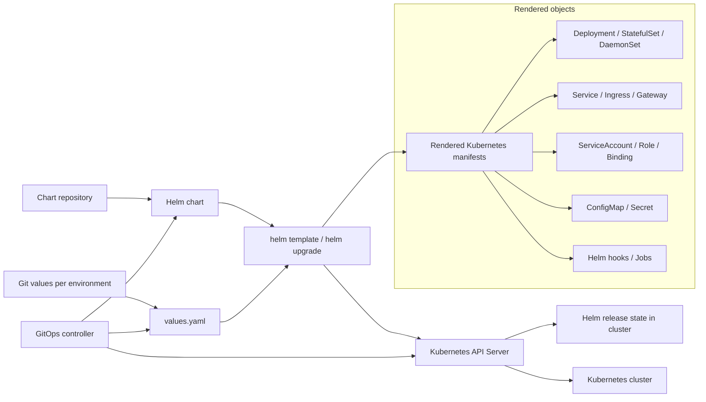

#### Responsibility Boundaries
Helm does not determine whether the resulting configuration is secure. A chart can create privileged workloads, wildcard RBAC, unsafe ingress, or secrets with sensitive values.

The team is responsible for reviewing rendered manifests, controlling values, verifying chart provenance, pinning versions, limiting hooks, and checking the permissions that the chart creates in the cluster.

#### Common Live Patterns
- Internal chart repository.
- Pinning chart versions and application image digests; chart `appVersion` is metadata and does not force the image version used by templates.
- Separate values per environment.
- Rendering manifests in CI with policy checks.
- A GitOps controller applies the chart instead of manual `helm install`.
- Signature/provenance checks for third-party charts.
- Minimizing post-install hooks and privileged jobs.

#### Security and Operational Verification

Treat chart installation as execution under the deployer's Kubernetes permissions. Review rendered RBAC, cluster-scoped objects, hooks, and dependency charts before granting a deployment identity additional rights. Test the exact chart and values used for the target environment; successful rendering does not prove admission acceptance or application readiness.

Keep live secrets out of committed values and command-line arguments. Helm release storage can retain supplied values and rendered Secret objects across revisions. Restrict access to that storage, protect render and dry-run output, and verify with synthetic secrets that CI logs and artifacts do not expose them. Prefer references to independently managed secrets where the chart supports them.

Test install, upgrade, rollback, and uninstall in an isolated environment. Inventory retained volumes, hook resources, and custom resource definitions separately; uninstall success is not proof of complete data deletion or credential revocation. A rollback of Kubernetes objects does not undo database migrations or external side effects of hooks.

Set an explicit `helm.sh/hook-delete-policy` for Helm hook resources; use `ttlSecondsAfterFinished` for finished jobs where appropriate. Do not rely on `helm uninstall` to delete them automatically. Check for residual Jobs, Secrets, ServiceAccounts, and permissions after successful and failed execution, reinstallation, and release deletion. Job cleanup does not undo external resources created by the job; assign ownership of their deletion and credential revocation. Preserve necessary diagnostic data before cleanup while keeping secrets out of logs.

For CRD definitions in the `crds/` directory, Helm does not perform ordinary upgrades or deletion with the release; an existing definition is skipped during installation. Assign ownership of CRD upgrades and verify schema compatibility with the controller and existing custom resources. Check the actual cluster schema after a chart upgrade rather than relying on the release version. If templates, hooks, or a separate controller manage CRDs, review their lifecycle and deletion consequences separately.

#### Related Project Files
- `content/platform-security/kubernetes/cluster-security-review/playbook.ru.md` / `playbook.en.md` — Helm is often a source of RBAC, workload, and ingress configuration for review.
- `content/platform-security/kubernetes/pod-security/playbook.ru.md` / `playbook.en.md` — review of final pod specs after chart rendering.
- `content/supply-chain/slsa-provenance/overview.ru.md` / `overview.en.md` — trust in artifacts, including charts and deployment packages.

### GitOps / Argo CD / Flux

#### What It Is Used For
GitOps controllers reconcile a declared configuration from Git or an artifact source with a running environment. Argo CD and Flux commonly deploy Kubernetes workloads. The repository becomes a deployment authority: a reviewed commit can cause the controller to change live resources without a CI runner holding cluster credentials.

#### Operating Model
The controller fetches a revision, renders manifests or invokes Helm/Kustomize, compares the result with live objects, and applies changes under its Kubernetes identity. Automatic synchronization, drift correction, pruning, and health assessment are separate behaviors. A synchronized application can still be unhealthy; removing a manifest can delete a live resource when pruning is enabled.

Argo CD uses Applications and AppProjects to scope sources and destinations; Flux reconciles source, Kustomization, and HelmRelease resources and can impersonate dedicated ServiceAccounts. These scopes complement Kubernetes RBAC. Rendering plugins, remote bases, chart dependencies, and decrypted secrets introduce additional execution and data-access boundaries.

#### Responsibility Boundaries
Protect repository write access, controller configuration, credentials, renderers, and the objects that select deployment sources. Restrict projects and reconciliation identities to approved repositories, namespaces, clusters, and resource kinds. A tenant must not be able to redirect an application to an attacker-controlled repository, select a privileged ServiceAccount, or modify the controller's own namespace.

#### Common Live Patterns
- Reviewed immutable source revisions and digest-pinned images.
- Separate reconciliation identities and controller trust domains for tenants with incompatible privileges.
- Deliberate pruning and drift-correction settings, with a controlled way to suspend reconciliation during incident response.
- Secret retrieval or decryption with restricted identities; decrypted manifests excluded from logs and broadly accessible caches.

#### Security and Operational Verification
Attempt an unauthorized source, destination, cluster-scoped resource, and ServiceAccount selection through the real tenant role. Verify both the GitOps decision and Kubernetes denial. Exercise a rollback to a reviewed revision, suspension during an incident, and controller restart; record the revision actually applied, health outcome, and any deleted resources. Review resource hooks and deletion protection for databases and other stateful assets.

In Argo CD, test `Application` deletion separately: the `resources-finalizer.argocd.argoproj.io` finalizer triggers cascading deletion of managed resources. Disabling automated pruning during sync does not protect against this path. In a test application, exercise cascading and non-cascading deletion, including child applications; define who retains management of surviving resources and how data is protected. A manifest backup does not replace a backup of database or volume contents.

In Argo CD, the repository allow-list restricts the initial repository, but not every source of Helm dependencies or Kustomize remote bases. Review and pin these dependencies separately, restrict outbound connections from the manifest-rendering component, and disable unused tools. In a test application, attempt to reference a dependency from a forbidden source: record which mechanism rejects the fetch or prevents its output from being deployed. An allowed primary repository alone does not establish trust in every rendered resource.

#### Related Project Files
- `content/review/release-governance/playbook.en.md`: deployment authority, approvals, and release evidence.
- `content/platform-security/kubernetes/cluster-security-review/playbook.en.md`: controller RBAC and admission controls.

## Container Platform and Kubernetes Runtime

### Container Runtimes

#### What It Is Used For
A container runtime starts containers on a node: it pulls images, prepares the filesystem, namespaces, and cgroups, and hands execution to a lower-level runtime. In Kubernetes, the runtime usually works through CRI and is part of every worker node.

#### Operating Model
CRI is the interface between kubelet and the runtime. Because of CRI, kubelet is not tied to a specific implementation and can work with containerd, CRI-O, or another compatible runtime. The runtime receives kubelet requests to create a pod sandbox, pull an image, start a container, stop a container, and report status.

The OCI image spec defines the image format. The OCI runtime spec defines a runtime bundle containing a root filesystem and `config.json`, including the process, mounts, namespaces, cgroups, and capabilities. Higher-level software pulls and unpacks the image and prepares that bundle; a low-level runtime such as `runc` does not independently pull an OCI image. The image store keeps pulled images locally on the node. The snapshotter prepares filesystem layers so a container gets its working filesystem view without copying the whole image.

A pod sandbox represents the infrastructure shell of a pod: networking, namespaces, and base resources inside which application containers run. A shim process maintains the connection to a running container and lets the runtime avoid keeping the entire lifecycle inside one process.

A typical chain looks like this: kubelet receives a pod assignment, calls the CRI runtime, the runtime pulls the image from a registry, prepares snapshots/layers, creates a sandbox, and then invokes an OCI runtime such as `runc` or Kata Containers. The low-level runtime creates Linux isolation and starts the application process.

#### Interaction Diagram
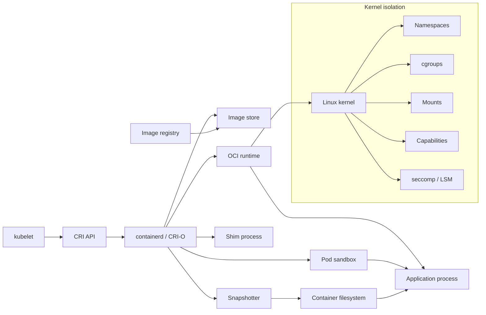

#### Responsibility Boundaries
The runtime executes a container with the requested constraints, but it does not decide which permissions are safe. If a Kubernetes workload requests privileged mode, dangerous capabilities, `hostPath`, `hostPID`, or `hostNetwork`, the runtime will technically apply that configuration.

Policy, admission control, and baselines belong to the platform.

#### Common Live Patterns
- containerd as the runtime in managed Kubernetes.
- CRI-O in clusters oriented around a Kubernetes-native runtime stack.
- RuntimeClass for isolating selected workloads.
- gVisor or Kata Containers for workloads with stronger isolation requirements.
- Centralized runtime configuration in node images.
- Runtime event monitoring and node-level audit.

#### Security and Operational Verification

Verify the actual runtime handler and node configuration for each selected RuntimeClass. Its name alone does not prove sandbox isolation. Restrict scheduling to nodes with the configured handler and protect the labels used for that selection. Test startup on supported nodes and failure on an unsupported configuration; do not permit a fallback that silently removes the required isolation.

Restrict runtime socket access and keep sockets out of application mounts. Inspect a running test container through the node's CRI endpoint and confirm its mounts, capabilities, seccomp configuration, and resource limits match the approved workload settings. Check process behavior where configuration inspection alone cannot prove enforcement. Repeat relevant checks after node image or runtime upgrades.

#### Related Project Files
- `content/platform-security/kubernetes/container-escape-capability-abuse/overview.ru.md` / `overview.en.md` — the connection between runtime isolation, capabilities, and escape scenarios.
- `content/platform-security/kubernetes/pod-security/playbook.ru.md` / `playbook.en.md` — workload settings that the runtime applies on the node.
- `content/platform-security/kubernetes/seccomp/checklist.ru.md` / `checklist.en.md` — syscall filtering as part of runtime hardening.

### Kubernetes

#### What It Is Used For
Kubernetes is used to orchestrate containerized applications: scheduling, service discovery, rollouts, autoscaling, configuration, secrets, networking, and workload lifecycle management. In live environments it often acts as the base platform for microservices, batch jobs, internal platforms, and cloud-native infrastructure.

#### Operating Model
The API Server is the central management point: user commands, controller activity, kubelet communication, and external integrations go through it. It validates requests, applies authentication, authorization, and admission, then stores desired state in etcd. etcd stores cluster state: workload objects, services, secrets, bindings, configuration, and metadata.

The scheduler selects a node for a pod based on resources, constraints, affinity, taints/tolerations, and other placement rules. The controller-manager runs controllers that continuously compare desired state with actual state: for example, creating new pods for a Deployment, replacing failed pods, or synchronizing endpoints for a Service. Admission controllers run at the API boundary and can mutate or reject objects before they are persisted.

On each worker node, kubelet receives assigned pods through the API Server and asks the container runtime to start the required containers. The container runtime pulls images and creates containers. The CNI plugin configures pod networking, while kube-proxy or an eBPF/CNI replacement provides service networking.

A pod is the smallest executable Kubernetes unit: one or more containers with shared network identity and volumes. A Deployment manages stateless replicas and rollouts, a StatefulSet manages stateful workloads with stable identity, and a DaemonSet runs an agent on every suitable node. A Service provides a stable network access point to a dynamic set of pods, while Ingress or Gateway publishes HTTP/TCP entry into the cluster. ConfigMap stores non-secret configuration, Secret stores sensitive values, and ServiceAccount defines workload identity. RBAC connects roles/clusterroles to subjects through rolebindings/clusterrolebindings. NetworkPolicy describes allowed network flows between pods and external addresses.

In a normal flow, a user applies a manifest through the API Server, the object is stored in etcd, a controller creates or updates child objects, the scheduler assigns a pod to a node, kubelet starts containers through the runtime, and networking components make the workload reachable by other services.

#### Interaction Diagram
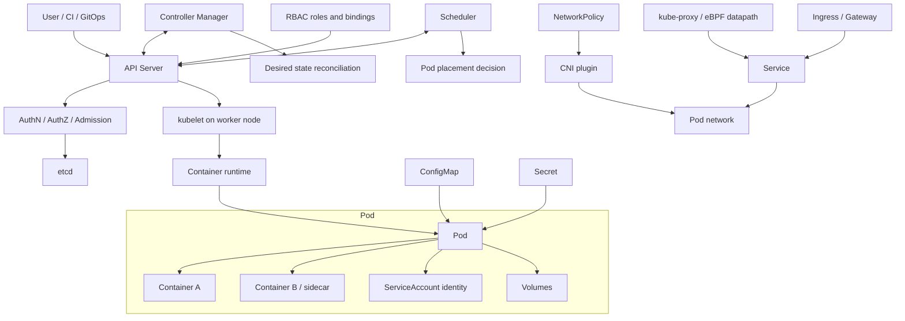

#### Responsibility Boundaries
Kubernetes provides APIs and workload management mechanisms, but it does not guarantee secure cluster or application configuration by itself. The platform team owns RBAC, isolation, admission policies, network policies, audit logs, node hardening, upgrade lifecycle, and integration with IAM, secrets, and registries.

Application teams own secure pod specs, health checks, resource limits, secrets, ingress configuration, and application behavior.

#### Common Live Patterns
- Managed Kubernetes: EKS, GKE, AKS, or an equivalent platform.
- GitOps through Argo CD or Flux.
- Namespace separation by environment, team, or blast radius.
- Separate node pools for trusted/untrusted, stateful, GPU, or privileged workloads.
- Ingress controller or Gateway API.
- External Secrets Operator or CSI driver for secrets.
- Policy engine: Kyverno or OPA Gatekeeper.
- Private control plane and restricted access to the Kubernetes API.

#### Security and Operational Verification

Verify allowed and denied API operations using representative workload and deployment identities. An authorization check does not prove that admission accepts the object or that runtime constraints are applied. Include cross-namespace access, Secret reads, workload creation, role binding changes, and applicable impersonation or escalation permissions in the review.

Test network isolation from actual Pods on the deployed CNI, including permitted dependencies and denied tenant, metadata, and management endpoints. Namespace separation alone does not create a network boundary. Confirm rejection of unsafe workload settings at admission and verify the approved settings on a running test workload.

After upgrades or policy changes, repeat the affected checks and inspect audit coverage. Use synthetic resources and credentials; do not turn a review into extraction of production Secret values. Assign owners to existing violations and verify remediation rather than treating a healthy cluster or successful rollout as security evidence.

#### Related Project Files
- `content/platform-security/kubernetes/cluster-security-review/playbook.ru.md` / `playbook.en.md` — comprehensive Kubernetes cluster security review.
- `content/platform-security/kubernetes/pod-security/playbook.ru.md` / `playbook.en.md` — requirements for secure pod/workload configuration.
- `content/platform-security/kubernetes/seccomp/checklist.ru.md` / `checklist.en.md` — seccomp profile review.
- `content/platform-security/kubernetes/container-escape-capability-abuse/overview.ru.md` / `overview.en.md` — container escape and Linux capability misuse.

### CNI / Kubernetes Networking

#### What It Is Used For
CNI and Kubernetes networking provide pod connectivity, service discovery, Service load balancing, egress/ingress paths, and network policy enforcement. In live environments this is one of the main blast-radius control layers: the CNI decides whether a workload in one namespace can reach another workload, a metadata endpoint, a control-plane endpoint, or an external system.

Common implementations include Cilium, Calico, cloud-provider CNIs, Flannel, and other plugins. Cilium focuses on an eBPF datapath, observability, and kube-proxy replacement. Calico is widely used for Kubernetes NetworkPolicy and extended policy models, including GlobalNetworkPolicy in the Calico stack. Some managed clusters use cloud-native CNI where pod IPs integrate directly with the VPC/VNet.

#### Operating Model
Kubernetes defines the general network model: a pod gets an IP, pods can communicate with each other, a Service provides a stable virtual IP or DNS name for a set of endpoints, and NetworkPolicy describes allowed ingress/egress flows. The Kubernetes API stores objects, but it does not enforce NetworkPolicy on the datapath. Enforcement is performed by the CNI plugin or an associated policy engine.

The CNI plugin is called by kubelet/container runtime when a pod sandbox is created. It allocates an IP, connects the pod network interface, programs routes, rules, eBPF maps, or iptables/nftables, and then maintains state as pods, nodes, services, and policies change. DNS is usually provided by CoreDNS. On Linux, Service traffic is implemented by kube-proxy in iptables or nftables mode, or by the CNI datapath when kube-proxy replacement is used. IPVS is deprecated since Kubernetes 1.35; plan migration of existing installations to a supported mode. When switching, verify the kernel, CNI compatibility, NodePort reachability on intended addresses, and firewall rules: nftables behavior is not identical to iptables.

NetworkPolicy is a namespace-scoped Kubernetes resource. It selects pods through labels and defines which ingress and egress traffic is allowed. The important semantic detail: a pod without a matching policy is usually non-isolated for that direction. Once a pod is selected by an ingress or egress policy, only explicitly described flows are allowed for that direction. This means default deny requires a dedicated policy, not just the presence of a CNI.

Cilium can replace kube-proxy and implement Service load balancing through eBPF. In that model, Cilium agents program the eBPF datapath on nodes, use maps for service/backend lookup, collect flow visibility through Hubble, and enforce L3/L4/L7 policies. Calico can enforce Kubernetes NetworkPolicy and its own extended policies, including ordered rules, tiers, and host endpoints depending on edition/configuration. The practical review point: check not only policy YAML, but also the actual CNI, datapath mode, egress support, namespace selectors, DNS/FQDN policies, and observability.

#### Interaction Diagram
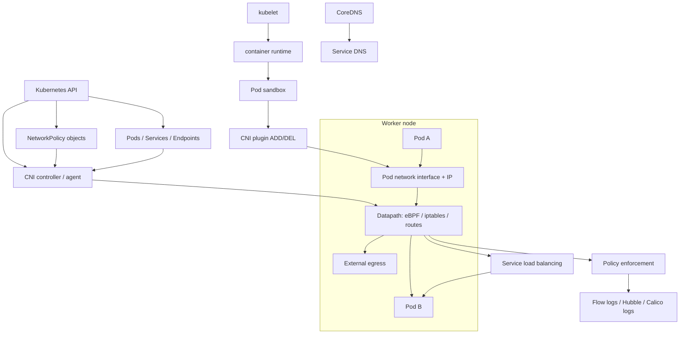

#### Responsibility Boundaries
CNI provides the datapath and may enforce NetworkPolicy, but it does not know service business semantics. The platform owns CNI selection, policy enforcement enablement, default-deny baseline, egress strategy, observability, upgrade compatibility, and validation that policy is actually active.

Application teams own correct labels, required service-to-service flow definitions, avoiding implicit "namespace isolation" assumptions, and connectivity testing after changes.

#### Common Live Patterns
- Default-deny ingress and egress for live and high-value namespaces.
- Explicit allow rules for service-to-service flows, DNS, and required egress.
- Separate node pools or clusters for workloads with different trust levels.
- Cilium/Hubble or Calico flow logs for network event investigation.
- Kube-proxy replacement only after compatibility checks with cloud load balancers, service mesh, NodePort/LoadBalancer behavior, and observability.
- Egress gateway/NAT strategy for stable outbound traffic identity.
- NetworkPolicy re-test after changes to namespace labels, pod labels, CNI version, and service selectors.
- Separate controls for metadata endpoints and cloud control-plane endpoints.

#### Security and Operational Verification

Standard Kubernetes NetworkPolicy combines allow rules additively: any matching policy can allow a flow. When both ends are isolated, source egress and destination ingress must both permit the connection. It has no rule ordering or overriding deny; vendor policy models can differ. A namespace is not isolated merely because it exists.

NetworkPolicy behavior for `hostNetwork` Pods depends on the network plugin and has no uniform guarantee: the plugin may enforce policy on those Pods or treat their traffic as node traffic. The standard model also permits ingress to a Pod from its own node. Do not use ordinary NetworkPolicy as evidence of isolation from a compromised node; restrict `hostNetwork`, apply supported host-network controls, and test flows from the same and a different node separately.

Verify reachability from representative Pods after policy rollout, including DNS, direct Pod IPs, Service IPs, metadata endpoints, and the deployed `hostNetwork` path. Use flow evidence to distinguish policy denial from an unavailable service; repeat after CNI upgrades or selector changes.

Default-deny egress also blocks DNS. Allow access to the deployed resolver rather than every destination on port 53; verify both UDP and TCP for conventional DNS. Account for the actual address in the Pod's `/etc/resolv.conf`, including a node-local DNS cache when deployed. From that same Pod, test a fully qualified service name containing its namespace and an external name, then separately test connectivity to the resolved address. On failure, inspect the DNS Service and EndpointSlices, CoreDNS logs, and its permissions to read Kubernetes resources. Successful name resolution proves neither service reachability nor network policy enforcement.

#### Related Project Files
- `content/platform-security/kubernetes/cluster-security-review/playbook.ru.md` / `playbook.en.md` — service boundary review, egress, and NetworkPolicy baseline.
- `content/platform-security/kubernetes/adversarial-validation/playbook.ru.md` / `playbook.en.md` — namespace bypass, SSRF, NodePort exposure, and actual reachability checks.
- `content/platform-security/kubernetes/pod-security/playbook.ru.md` / `playbook.en.md` — pod-level controls complement, but do not replace, network isolation.
- `content/review/architecture/checklist.ru.md` / `checklist.en.md` — trust boundary and data flow analysis.

### Ingress / Gateway / API Gateway

#### What It Is Used For
Ingress, Gateway, and API Gateway publish services outside the cluster or between network zones. They accept client traffic, terminate TLS or pass TLS through, route requests to Kubernetes Services, apply authentication/authorization integrations, rate limits, WAF/API security policies, header normalization, and observability.

Common live-environment implementations include NGINX Ingress Controller, cloud load balancer controllers, Envoy Gateway, Kong Gateway/Kong Ingress Controller, HAProxy/Contour/Traefik, and service mesh gateway components. Kubernetes Ingress remains a stable API for HTTP/HTTPS routing, but its development is frozen; new Kubernetes networking capabilities are primarily developed in Gateway API. If the controller is implemented by Istio, this section describes the north-south entry point, while Istio mesh semantics (`VirtualService`, `DestinationRule`, `PeerAuthentication`, `AuthorizationPolicy`, sidecar/ambient) are covered separately in the Istio section.

#### Operating Model
An Ingress resource describes host/path routing to a backend Service. By itself, Ingress does not work without an Ingress Controller. The controller watches the Kubernetes API, selects Ingress objects by `ingressClassName`, generates proxy/load balancer configuration, and exposes an external endpoint through a `LoadBalancer` Service, NodePort, cloud load balancer, or edge appliance.

Gateway API separates roles more explicitly. `GatewayClass` describes the controller type. `Gateway` describes listeners, addresses, ports, TLS, and rules for which Routes may attach to it. `HTTPRoute`, `GRPCRoute`, `TCPRoute`, `TLSRoute`, and other route resources describe application-level routing. `allowedRoutes` and the cross-namespace attachment model form a trust boundary between the platform team that owns the Gateway and application teams that own Routes. Do not confuse Kubernetes Gateway API `Gateway` with Istio `networking.istio.io/Gateway`: the names are similar, but ownership, deployment model, and route resources differ.

An API Gateway adds API-management functions: plugins/policies for auth, JWT/OIDC validation, API keys, rate limiting, request/response transformation, WAF, bot protection, schema validation, developer portals, or analytics. In Kubernetes this can be the same controller that reads Ingress/Gateway API resources and generates gateway data plane configuration.

Critical security review points: where TLS terminates, whether `X-Forwarded-*` is trusted, who can create routes for public hostnames, how wildcard hosts are protected, whether upstream mTLS exists, how authentication is enforced, how WAF/rate limiting works, who can change annotations/plugins, and whether they bypass the baseline.

#### Interaction Diagram
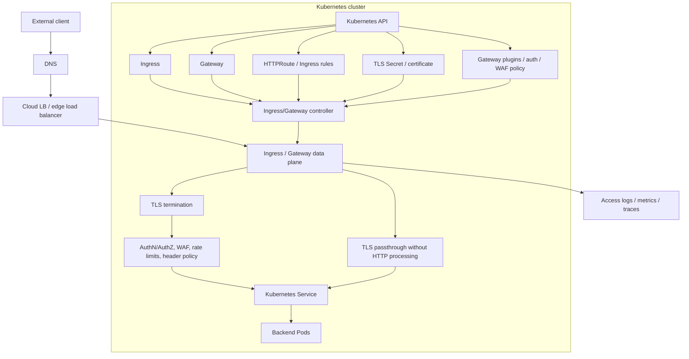

#### Responsibility Boundaries
The Ingress/Gateway layer controls the network entry point, but it does not replace application authorization. If the gateway only checks token presence, the application still needs to enforce business authorization and tenant boundaries. If TLS terminates at the gateway, decide explicitly whether mTLS or encryption is required to the upstream service.

The platform owns controller hardening, class ownership, public exposure, certificate lifecycle, baseline annotations/plugins, default security headers, logging, and guardrails for cross-namespace routes. Application teams own route ownership, backend readiness, correct host/path rules, and application compatibility with proxy headers/timeouts.

#### Common Live Patterns
- Gateway API for new deployments, Ingress for existing workloads where migration is not complete.
- Separate ingress/gateway classes for public, internal, and admin traffic.
- TLS termination at the gateway with managed certificate lifecycle; upstream mTLS for sensitive backends.
- Strict policy for `X-Forwarded-*`, `Forwarded`, `Host`, and client IP headers; applications trust only headers from approved proxies.
- WAF/API security and rate limiting on public routes.
- Wildcard hosts denied or separately approved.
- Route-to-Gateway attachment constrained through listener `allowedRoutes` and Route `parentRefs`; cross-namespace backend or certificate references require a `ReferenceGrant` from the target namespace owner. These mechanisms authorize different relationships.
- Access logs with correlation ID, request outcome, upstream service, and policy decision.
- Controller service account protection: it can often read Secrets and change gateway/proxy configuration.

#### Security and Operational Verification

With TLS passthrough, the gateway does not decrypt HTTP: token validation, WAF inspection, header modification, and HTTP request rate limits must run where TLS terminates. Do not credit these controls merely because a gateway plugin is installed; test them on the actual request path. When TLS terminates at the gateway, encryption to the backend is configured separately. For Gateway API, verify deployed controller support for `BackendTLSPolicy`, the trusted CA, and server name; connections with untrusted certificates or mismatched names must fail.

The community Kubernetes `ingress-nginx` controller is retired: upstream maintenance ended in March 2026, including security fixes. It is distinct from vendor products named NGINX Ingress Controller. Inventory the actual image, repository, and controller class; migrate community `ingress-nginx` to a maintained implementation. Any temporary exception needs an owner, expiry, and migration deadline.

For a shared Gateway, test unauthorized Route attachment separately from cross-namespace backend and TLS Secret references. Check `Accepted`, `ResolvedRefs`, and `Programmed` conditions where applicable, then probe the public endpoint: accepted configuration does not prove correct authentication, header trust, or backend encryption.

#### Related Project Files
- `content/platform-security/kubernetes/cluster-security-review/playbook.ru.md` / `playbook.en.md` — entry point inventory, service exposure, and ownership.
- `content/platform-security/kubernetes/adversarial-validation/playbook.ru.md` / `playbook.en.md` — NodePort/Ingress/Gateway reachability and SSRF/internal exposure checks.
- `content/application-security/web/owasp-top-10/playbook.ru.md` / `playbook.en.md` — application-layer risks behind the gateway.
- `content/review/architecture/checklist.ru.md` / `checklist.en.md` — trust boundaries, external integrations, and architectural review evidence.

### Istio

#### What It Is Used For
Istio is used as a service mesh for service-to-service traffic management: mTLS, traffic routing, retries, telemetry, authorization policies, and progressive delivery. In live environments it most often appears in Kubernetes clusters with many internal services and strict service-to-service security requirements.

#### Operating Model
Istiod is the mesh control plane. It consumes Kubernetes/Istio configuration, generates and distributes data plane configuration, manages service discovery, and participates in certificate distribution for mTLS. The data plane is represented by an Envoy proxy next to the application in the sidecar model, or by ambient mesh components when ambient mode is used. In ambient mode, the base L4 secure overlay is provided by per-node `ztunnel`, while L7 features are added through waypoint proxies.

Envoy proxy intercepts inbound and outbound workload traffic, establishes mTLS, applies routing rules, retry/timeout policy, authorization policy, and collects telemetry. An ingress gateway accepts external traffic into the mesh, while an egress gateway centralizes controlled outbound traffic from the mesh to external systems.

Key CRDs define mesh behavior. In the Istio API, `VirtualService` describes routing and traffic shifting. `DestinationRule` defines subsets, load balancing, and connection policy for an upstream. `Gateway` controls ingress/egress points into the mesh. `PeerAuthentication` defines the mTLS mode, and `AuthorizationPolicy` defines which workload may call which other workload. Separately, Istio supports Kubernetes Gateway API; in that model, `Gateway`, `HTTPRoute`, and other route resources come from `gateway.networking.k8s.io`, not from the Istio API.

When combined with Kubernetes, the application remains a regular Deployment/Pod, but its traffic passes through the data plane. Istiod watches services and policies in the Kubernetes API, recalculates configuration, and sends it to proxies. Proxies on the traffic path then enforce mTLS, routing, policy, and telemetry without changing application business code.

#### Interaction Diagram
The diagram below shows the sidecar model. In ambient mode, L4 traffic passes through node-level `ztunnel` proxies; L7 features require a waypoint on the relevant path.

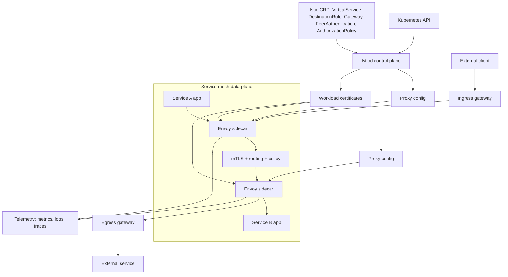

#### Responsibility Boundaries
Istio can provide mTLS between workloads and centralized mesh policy, but it does not fix weak application authentication and does not replace Kubernetes RBAC, NetworkPolicy, CNI datapath policy, or API security. NetworkPolicy is still needed for L3/L4 blast-radius control and for limiting traffic that should not rely only on mesh enrollment.

The platform owns correct mesh onboarding, certificate lifecycle, policy model, gateway exposure, and compatibility with applications.

#### Common Live Patterns
- Mesh enabled only for selected namespaces instead of the whole cluster at once.
- Strict mTLS for internal services.
- AuthorizationPolicy for service-to-service access.
- Separate ingress and egress gateways when north-south or outbound traffic must pass through controlled mesh edge points.
- Explicit decision on which API owns routing: Istio `VirtualService`/`Gateway`, Kubernetes Gateway API, or both during a transition.
- Canary/blue-green routing through `VirtualService`/`DestinationRule` for supported sidecar paths, or Gateway API routes for ambient waypoints. Validate feature support on the deployed Istio version; do not assume sidecar routing and policy attachment work unchanged in ambient mode.
- Telemetry integration with Prometheus, Grafana, or OpenTelemetry.
- Gradual migration from sidecar to ambient mesh where justified.

#### Security and Operational Verification

In ambient mode, `ztunnel` provides L4 transport and identity; L7 routing and authorization require the relevant traffic to traverse an enrolled waypoint. Bind L7 `AuthorizationPolicy` to the intended waypoint/resource using the supported attachment model, and verify the actual path. A deployed waypoint or an mTLS handshake alone does not establish application authorization. Direct Pod IP traffic and mixed sidecar/ambient migration paths need separate negative tests.

An egress gateway does not force traffic through itself merely because it exists. Confirm routing and network enforcement prevent workloads from reaching external destinations directly; test gateway unavailability and attempted bypass.

#### Related Project Files
- `content/platform-security/kubernetes/cluster-security-review/playbook.ru.md` / `playbook.en.md` — applies to mesh as part of the Kubernetes control/data plane.
- `content/platform-security/kubernetes/pod-security/playbook.ru.md` / `playbook.en.md` — sidecar/mesh workloads remain Kubernetes workloads and inherit pod security requirements.
- `content/review/architecture/checklist.ru.md` / `checklist.en.md` — useful for analyzing trust boundaries and service-to-service communication.
- There is no dedicated Istio playbook yet.

### Policy Engines

#### What It Is Used For
Policy engines are used for automated checking and enforcement of technical rules: Kubernetes admission policies, IaC checks, CI quality gates, image verification, configuration validation, and governance. Common tools include OPA, Gatekeeper, Kyverno, and Conftest.

#### Operating Model
OPA is a general-purpose policy engine: an application or tool passes structured input, policy code makes a decision, and the enforcement point applies the result. Conftest uses OPA/Rego to check structured files in CI or locally: Kubernetes manifests, Terraform plans, Helm outputs, and YAML/JSON configs.

In Kubernetes, a policy engine usually runs as a dynamic admission controller. After authentication and authorization, the API Server sends an AdmissionReview to a validating or mutating webhook. The policy engine checks the object, userInfo, namespace, labels, image references, and external context where supported, then allows, denies, or mutates the request before it is persisted in etcd.

Gatekeeper is built around constraint templates and constraints, and supports admission validation and audit of existing resources. Kyverno uses Kubernetes-native policy resources and supports validate, mutate, generate, cleanup/delete, and image verification patterns. During policy rollout, teams usually use audit/dry-run/warn modes before enforce; otherwise an untested rule can block deployment of critical workloads.

For checks expressible in CEL using request data and policy parameters, consider built-in `ValidatingAdmissionPolicy` with `ValidatingAdmissionPolicyBinding`: it runs inside the API Server without an external webhook. A policy without a matching binding does not enforce a decision; for mandatory rejection, verify `validationActions: [Deny]`, matching conditions, and error handling. External signature verification and arbitrary external context retrieval require another mechanism.

CI policy and runtime admission policy solve different problems. CI policy checks proposed configuration before merge/deploy and gives developers fast feedback. Runtime admission policy protects the cluster from CI bypass, manual changes, compromised deploy credentials, and drift, but must be highly available, observable, and carefully configured for failure policy.

#### Interaction Diagram
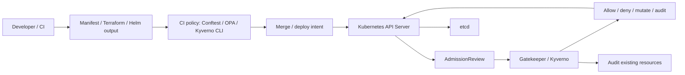

#### Responsibility Boundaries
A policy engine makes decisions according to configured rules, but it does not define the right security policy by itself. The team owns rule ownership, tests, rollout mode, exceptions, failure behavior, versioning, observability, performance impact, and alignment between rules and real risk scenarios.

#### Common Live Patterns
- CI checks for pull requests and Terraform/Kubernetes changes.
- Admission enforcement for critical Kubernetes controls.
- Audit mode before enforce for new or risky policies.
- Explicit exception model with owner, reason, expiry, and review.
- Policy unit tests and fixtures for known-good/known-bad manifests.
- Separate policy bundles by environment or risk tier.
- Monitoring webhook latency, denial rates, audit violations, and policy engine availability.
- Image verification policies for digest, signature, and attestations on live workloads.

#### Security and Operational Verification

For mandatory validating controls, use `failurePolicy: Fail` on the matching webhook and test rejection when its endpoint is unavailable or times out. Set `timeoutSeconds` from measured latency and monitor API Server webhook errors. Keep an audited recovery procedure that restores the controller without granting application teams a general bypass. A mutating webhook may use `Ignore` only when independent validation rejects objects missing required security properties.

Protect policies, webhook configuration, exception resources, and labels used by `namespaceSelector` or `objectSelector`. Workload owners must not bypass checks by changing labels or creating exceptions. Test create and update requests, controller-created Pods, and relevant subresources against the deployed rules.

Admission checks matching requests; it does not retrospectively remove existing violations. Background audit findings need remediation owners and deadlines. Reporting differs from separately configured mutation, generation, and cleanup rules, which have their own permissions and effects. Verify an existing violation, a new violating request, and an approved object, checking both reports and actual admission outcomes.

#### Related Project Files
- `content/platform-security/kubernetes/cluster-security-review/playbook.ru.md` / `playbook.en.md` — admission control and cluster policy gates.
- `content/platform-security/kubernetes/pod-security/playbook.ru.md` / `playbook.en.md` — workload controls that can be enforced through a policy engine.
- `content/supply-chain/slsa-provenance/overview.ru.md` / `overview.en.md` — image/provenance verification before deployment.
- There is no dedicated policy engines playbook yet.

## Identity, Secrets, and Access

### Cloud IAM / Workload Identity

#### What It Is Used For
Cloud IAM manages access to cloud resources: compute, storage, databases, queues, KMS, secrets, networking, and managed services. Workload identity binds a workload identity from a runtime, such as a Kubernetes ServiceAccount or CI job identity, to a cloud identity without storing long-lived access keys inside an application or pipeline.

#### Operating Model
IAM usually consists of principals and policies. A principal can be a user, group, service account, managed identity, role, or federated subject. A policy defines allowed actions on resources and conditions such as account, project, region, tag, resource name, or token claims. In AWS, the key objects are IAM users, groups, roles, policies, and STS. In Google Cloud, they are principals/service accounts, IAM roles, and allow policies. In Azure, they are Microsoft Entra identities, managed identities, app registrations, and Azure RBAC role assignments.

Short-lived credentials are issued through federation. A workload receives a signed token from a trusted issuer, such as the Kubernetes API server or CI/CD platform. Cloud IAM verifies the OIDC issuer, audience, subject, and conditions, then issues a temporary access token or role session. In Kubernetes this is implemented through cloud-specific integrations: AWS IAM Roles for Service Accounts, GCP Workload Identity Federation for GKE, and Microsoft Entra Workload ID for AKS.

EKS Pod Identity is a different path: a node agent uses the EKS Auth API and associations between cluster, namespace, ServiceAccount, and IAM role; it does not require an IAM OIDC provider per cluster. Constrain the association and role trust with the supported attributes or session tags, and verify the SDK credential chain does not select static or node credentials first. Do not copy IRSA trust policies into this integration.

The metadata service is a separate important boundary. On a cloud VM/node, the metadata endpoint can issue credentials for the instance/node identity. If a pod can reach the metadata service and the node role is too broad, workload compromise becomes lateral movement from Kubernetes into the cloud control plane. Workload identity reduces this risk, but only when node metadata access is restricted, service accounts are separated, trust policies are narrow, and cloud permissions are minimal.

Trust policies must bind to stable workload attributes, not only to a human-readable name. For Kubernetes, bind to issuer, audience, namespace, service account, and where the provider supports it, cluster/project/account identity. For CI/CD, bind to issuer, audience, repository or immutable repository ID where available, protected ref or environment, workflow identity, and expected trigger. A wildcard subject that lets any workload in a namespace, repository, or organization assume a live cloud role is a production finding.

Kubernetes RBAC and cloud IAM solve different problems. Kubernetes RBAC controls access to Kubernetes API objects. Cloud IAM controls cloud resources outside Kubernetes. A ServiceAccount with minimal Kubernetes RBAC can still have dangerously broad cloud permissions, and the reverse is also true.

#### Interaction Diagram
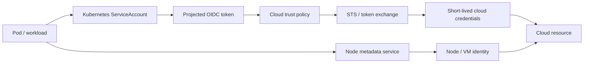

#### Responsibility Boundaries
The cloud provider owns IAM primitives, token exchange, and enforcement on cloud APIs. The platform team owns identity mapping, trust policies, node metadata restrictions, least privilege, audit logs, credential lifetime, break-glass access, and separation between environments. Application teams own the correct workload identity selection, absence of embedded keys, and correct token refresh handling.

#### Common Live Patterns
- Separate cloud identity per service or bounded workload group.
- Federation through OIDC instead of static cloud access keys.
- Trust policy bound to issuer, audience, namespace, service account, repository, branch/tag, or environment.
- Short credential lifetime for federated sessions; live deploy and runtime sessions should normally be measured in minutes to a few hours, not days.
- Deny wildcard assume-role or token-exchange subjects for production identities.
- Workload access to the node metadata service blocked unless required.
- Narrow permissions on data-plane actions, without wildcard admin policies.
- Separate identities for build, deploy, and runtime.
- Auditing for AssumeRole/token exchange, key creation, policy changes, and anomalous API calls.

#### Security and Operational Verification

Review who can launch or modify workloads under a ServiceAccount bound to a cloud role. Permission to create Pods or change controller templates may allow using that identity even without permission to read Secrets; separately account for token issuance through `serviceaccounts/token` and access to running containers. Separate namespaces by trust level and restrict ServiceAccount selection through admission policy. With a test workload, confirm that a less privileged principal cannot select a protected ServiceAccount, change its cloud binding, or access its credentials.

Distinguish blocking new token issuance from disabling credentials already issued. In AWS, changing a role trust policy does not invalidate existing role sessions. Use the applicable session-revocation or permission-denial mechanism and test a harmless resource operation with an existing session. Measure propagation and account for chained roles; an identity lookup alone does not prove resource access was revoked.

Test approved and rejected federation subjects, verify the resulting cloud principal, and exercise credential refresh failures. The application must not fall back to embedded keys or an unintended node or developer identity.

#### Related Project Files
- `content/application-security/identity/oidc-oauth/playbook.ru.md` / `playbook.en.md` — OIDC concepts, token validation, and trust boundaries.
- `content/platform-security/kubernetes/cluster-security-review/playbook.ru.md` / `playbook.en.md` — Kubernetes-to-cloud attack paths and cluster identity.
- `content/platform-security/secrets/vault/playbook.ru.md` / `playbook.en.md` — dynamic credentials and secrets delivery.
- [Cloud IAM and workload identity](../../content/platform-security/cloud-iam-workload-identity/playbook.en.md): federation, effective permissions, and containment of active sessions.
- [Executable policy examples](../security-policy-examples/overview.en.md): strict GitHub-to-AWS trust policy checks.

### Vault

#### What It Is Used For
HashiCorp Vault is used for centralized secret management, dynamic credentials, encryption-as-a-service, and access to sensitive material. In live environments it often sits between applications, CI/CD, Kubernetes, and external systems such as databases, cloud IAM, PKI, SSH, and message brokers.

#### Operating Model
Vault server receives API requests, performs authentication, checks policy, calls secret engines, and writes audit events. The storage backend stores encrypted Vault state: configuration, metadata, policies, and secret engine data. Seal/unseal protects master key material: while Vault is sealed, it cannot decrypt storage or serve normal requests.

Auth methods connect an external identity to a Vault identity: Kubernetes service account, OIDC subject, AppRole, cloud IAM principal, or another source. A policy defines which paths and operations are available. A token is the result of authentication and carries a set of policies. A lease defines the lifetime of an issued secret or credential and lets Vault renew or revoke it.

Secret engines perform the actual work. KV stores static secrets. The database engine issues dynamic database credentials. The PKI engine issues certificates. The Transit engine performs cryptographic operations without exposing key material to the client. Audit devices record requests and responses. By default, most string values are HMAC-hashed; this does not protect every field. Headers, non-string values, configured exemptions, and `log_raw` require separate review.

A normal flow is: a workload authenticates through an auth method, receives a token with a limited policy, calls a secret engine path, and Vault returns a secret, dynamic credential, or cryptographic result. If the secret is leased, Vault tracks its lifetime and can renew or revoke it. Static KV values do not acquire automatic rotation or downstream invalidation from a token TTL. PKI certificates have their own expiry and revocation model; role `generate_lease` defaults to `false`, so token revocation alone must not be assumed to revoke issued certificates. Define certificate revocation and how relying services consume CRLs or OCSP.

#### Interaction Diagram
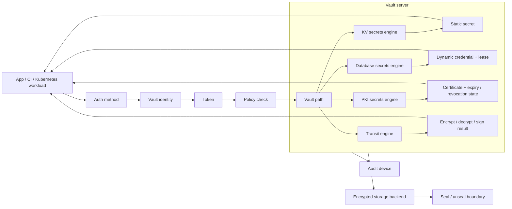

#### Responsibility Boundaries
Vault protects secret issuance and lifecycle, but it does not make every application that receives those secrets safe. Teams are responsible for minimal policies, short TTLs, audit logs, rotation, safe secret delivery into runtime, protection of root/admin tokens, and avoiding long-lived static secrets where dynamic ones are possible.

#### Common Live Patterns
- HA Vault cluster.
- Auto-unseal through cloud KMS or HSM.
- Kubernetes auth method for workloads.
- Dynamic database credentials.
- PKI engine for internal certificates.
- External Secrets Operator or Vault Agent Injector.
- Centralized audit devices.
- Separate mounts and policies by team and environment; Vault namespaces apply to Vault Enterprise and managed deployments that support them. They are not Kubernetes namespaces. In Community Edition, use tested ACLs for separate paths and mounts, or separate clusters when independent administration or stronger isolation is required.

#### Security and Operational Verification

Test denial of another service's secret path, renewal failure, and lease revocation against the downstream system. A removed Vault lease is insufficient evidence if the database or other service still accepts the credential. For static secrets, verify rotation at their issuer and application reload rather than relying on Vault token expiry.

Exercise audit-device failure and restore in an isolated environment. Audit delivery is a service dependency: monitor blocked writes, capacity, and latency, and verify the behavior of the deployed audit configuration without disabling required logging as a routine workaround. Restore tests must include access to the original seal mechanism or key material and actual authenticated secret access; accepting a snapshot file does not prove recovery completed.

#### Related Project Files
- `content/platform-security/secrets/vault/playbook.ru.md` / `playbook.en.md` — the main Vault playbook covering policies, auth methods, audit, and operational hardening.
- `content/platform-security/kubernetes/cluster-security-review/playbook.ru.md` / `playbook.en.md` — relevant when Vault is integrated with Kubernetes auth or secret delivery.
- `content/review/architecture/checklist.ru.md` / `checklist.en.md` — useful for analyzing trust boundaries around secrets.

### PKI / cert-manager

#### What It Is Used For
PKI binds identities to public keys through certificates and trusted issuers. cert-manager automates certificate issuance and renewal in Kubernetes through ACME, Vault, or another configured issuer. Certificate lifecycle automation does not itself define which identities an application trusts or authorizes.

#### Operating Model
A `Certificate` selects names, usages, an issuer, and a target Secret. cert-manager creates requests and completes the issuer-specific validation, then stores the certificate and private key in that Secret. An `Issuer` is namespace-scoped; a `ClusterIssuer` is cluster-scoped. A workload, ingress controller, or gateway must actually load the new material. Renewal success does not prove the serving endpoint has stopped using the old certificate.

#### Responsibility Boundaries
Constrain who may use an issuer and request each identity. Kubernetes permission to create a request is not automatically an approved right to obtain any SAN. Protect CA keys, DNS challenge credentials, ACME accounts, and TLS Secrets; separate public certificate validation from internal workload identity. Decide how trust bundles, key rotation, and revocation reach every verifier.

#### Common Live Patterns
- Automated renewal and an explicit private-key rotation policy supported by the deployed cert-manager version.
- DNS challenge credentials restricted to the intended validation zones.
- Controlled issuer access and policy for SANs, usages, and certificate lifetime.
- CA rollover with overlapping trust and a tested removal of the old trust anchor.
- Distribute trusted CAs separately from the server TLS Secret. A client that only needs a trust bundle must not receive access to the server private key just to read `ca.crt`. Approve trust-bundle membership separately: a CA appearing in the server certificate or its Secret does not itself justify trusting that CA.

#### Security and Operational Verification
Test rejection of an unauthorized name and issuer, renewal during an issuer outage, and recovery before certificate expiry. Inspect the certificate served by the real endpoint after Secret rotation and process restart. A certificate marked ready is insufficient evidence. Verify trust-chain and identity checks, plus revocation behavior where the relying protocol and clients support it.

As the client workload, confirm access to the trust bundle and denial of reads of the server TLS Secret; also inspect the actual mounted files, since restricting API access does not remove a previously distributed key copy. Replacing the server certificate with one issued by an unapproved CA must not automatically change client trust. After CA rollover completes, a new connection using a certificate from the removed root is rejected; separately define how established connections are terminated when immediate access cessation is required.

#### Related Project Files
- `content/platform-security/secrets/vault/playbook.en.md`: PKI issuance and revocation.
- `content/platform-security/kubernetes/secrets/playbook.en.md`: TLS Secret access and distribution.

### KMS / HSM

#### What It Is Used For
A KMS provides managed key lifecycle and cryptographic APIs. An HSM protects key operations within a hardware security boundary; it can back a KMS or be operated directly. Common uses include envelope encryption, signing, and protecting Vault seal or backup dependencies.

#### Operating Model
With envelope encryption, a data-encryption key encrypts the payload and a key-encryption key protects that data key. The stored record includes the ciphertext and wrapped data key, plus the key/version identifier and algorithm metadata needed to recover it. A KMS API can return plaintext data keys to authorized clients, so hardware protection of the master key does not mean plaintext or all data keys stay inside the HSM.

#### Responsibility Boundaries
Separate key administration from application encrypt/decrypt permissions, protect grants and key policies, and constrain operation context where supported. Authenticated encryption context must bind expected metadata, but is not an authorization substitute; exclude secrets and PII because provider audit logs may record it. Rotation does not necessarily re-encrypt existing records, and disabling or deleting a key can make production data and backups unreadable.

#### Common Live Patterns
- Distinct keys and identities for environments and purposes.
- Least-privilege cryptographic operations, with audited key-policy and grant changes.
- Planned rotation, retention of required decryption versions, and protection against accidental key deletion.
- A defined behavior for KMS outage and explicit limits on plaintext key caching.

#### Security and Operational Verification
Try decrypting under the wrong role and context, then restore an old backup using its actual key dependencies. Test denied permissions, throttling, and a controlled service outage. Measure recovery and verify that key deletion protection covers the full data-retention period, including disaster-recovery copies.

If the application caches plaintext data keys, disabling the KMS key does not stop operations using keys already obtained. Test outages and access revocation with both a populated cache and after cache clearing or process restart. Define the acceptable delay before access stops and a cache-clearing procedure; successful cached operations do not prove KMS availability or retention of keys required for later recovery. Set retention and reuse limits according to the selected SDK capabilities and threat model.

#### Related Project Files
- `content/platform-security/secrets/vault/playbook.en.md`: envelope encryption and auto-unseal recovery.
- `content/review/architecture/checklist.en.md`: cryptographic trust boundaries and recovery design.

## Automation and Configuration Management

### Ansible

#### What It Is Used For
Ansible is used for configuration management, provisioning, infrastructure automation, and orchestration of changes across servers, network devices, and platforms. In live environments it often appears in bootstrap processes, hardening, patch management, middleware configuration, and operational runbooks.

#### Operating Model
Inventory describes managed nodes and groups them by environment, role, or other attributes. A playbook defines a sequence of plays: which hosts to target, which variables to use, which tasks to run, and which privilege escalation settings apply. A task calls a module, and a module performs a concrete action: installing a package, changing a file, managing a service, creating a user, or calling an API.

A role packages reusable tasks, handlers, templates, defaults, and files. Variables parameterize playbook and role behavior for different environments. Facts are data collected from the managed node, such as OS, network interfaces, mounts, and package state. Collections provide modules, plugins, and roles as distributable packages. Ansible Vault encrypts sensitive variables or files when secrets are stored near playbooks.

A control node runs a playbook against managed nodes, usually over SSH or WinRM. Ansible copies or invokes a module on the target system, collects the result, and moves to the next task. Handlers run when changes occur, for example restarting a service after configuration changes.

In infrastructure workflows, Ansible often prepares hosts before they join Kubernetes, Kafka, RabbitMQ, or Vault: it installs packages, lays down configuration, manages service units, and applies baseline hardening.

#### Interaction Diagram
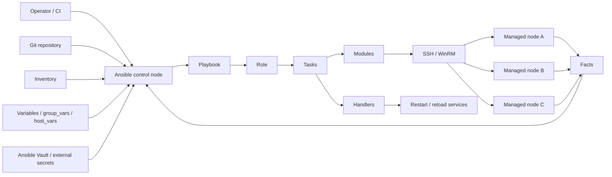

#### Responsibility Boundaries
Ansible applies the described changes, but it does not guarantee that a playbook is safe. The team owns access control to the control node, secrets in inventory/vars, change review, idempotency, blast radius limits, safe privilege escalation settings, and reproducible runs.

A mistake in a playbook can propagate insecure configuration at scale.

#### Common Live Patterns
- Git-hosted playbooks with review.
- Inventory separation by environment.
- Ansible Vault or an external secrets manager for sensitive variables.
- Execution through AWX/Automation Controller or CI with an audit trail.
- Restricted `become` and SSH access.
- SSH host-key verification with trusted initial key acquisition and an approved replacement procedure. Do not globally disable verification to enable unattended runs; a substituted target host key must cause connection failure.
- Dry-run/check mode for risky changes.
- Roles for baseline hardening and patch management.

#### Security and Operational Verification

Account for each task's execution location: `delegate_to`, `local_action`, and local connections can execute code on the controller or another designated host. Limiting target hosts does not itself restrict delegated actions. Review these tasks and their available credentials before running a third-party role; protect the controller as a privileged execution environment rather than only an SSH client.

Check mode is a module-dependent simulation, not a guarantee of a safe change. Unsupported tasks can be skipped, conditionals can depend on unavailable registered results, and `check_mode: false` can execute a task even during a check run. Inspect the selected modules, review the diff, and test privileged changes on a limited host group before broad rollout.

Ansible Vault protects stored files, not plaintext after decryption. Use `no_log` for sensitive tasks and avoid exposing values through debug tasks or diff output. `no_log` does not protect Ansible's own debugging output, so do not enable it in production with real secrets. Use a synthetic secret to test normal execution and approved diagnostic modes: the value must not appear in controller logs, callback output, or retained job artifacts. When module parameters reach temporary files on the controller or target, verify restrictive permissions and cleanup after execution, including task failure. Do not enable `world_readable_temp` for tasks carrying secrets; when using a shared group, review every member. Pipelining reduces temporary-file use but is not supported by every module and does not replace permission checks.

#### Related Project Files
- `content/review/architecture/checklist.ru.md` / `checklist.en.md` — applies to change management, privileged automation, and trust boundaries.
- `content/platform-security/secrets/vault/playbook.ru.md` / `playbook.en.md` — relevant when Ansible retrieves secrets from Vault or stores sensitive variables.
- There is no dedicated Ansible playbook yet.

### Terraform / OpenTofu

#### What It Is Used For
Terraform and OpenTofu are used for Infrastructure as Code: describing, creating, and changing cloud resources, Kubernetes objects, IAM policies, DNS records, managed databases, network components, and SaaS configuration through declarative code. In live environments they are often the main mechanism for changing production infrastructure, so they should be treated as privileged automation rather than an ordinary configuration repository.

#### Operating Model
Configuration describes desired state through resources, data sources, variables, outputs, providers, and modules. A provider knows the API of a specific platform: cloud, Kubernetes, Vault, DNS, monitoring, or SaaS. The CLI builds a dependency graph, reads current state from the state file, creates a plan, and then apply calls provider operations to bring infrastructure to the desired state.

State maps configuration to real remote objects and contains attributes of created resources. It is a critical artifact: state often includes internal identifiers, connection strings, generated passwords, private endpoints, IAM bindings, and other sensitive values even when variables are marked sensitive. Select a remote backend with the required access control, audit, encryption, recovery, and locking support; a remote location alone does not provide all these controls. Locking protects against concurrent apply operations that can corrupt state or create conflicting changes.

Modules provide reuse, but create a supply-chain boundary. Public modules, provider versions, and transitive module sources should be pinned and reviewed like application dependencies. A plan is an important review artifact, but not an absolute guarantee: drift, out-of-band changes, provider behavior, and data sources can change the final apply.

In live environments Terraform/OpenTofu usually runs from CI/CD or a dedicated IaC platform, not from an operator laptop. The pipeline obtains short-lived credentials through OIDC/workload identity, builds a plan, stores it as evidence, passes approval, and applies changes with a limited role. Manual apply should be a break-glass process with an audit trail and later state reconciliation.

#### Interaction Diagram
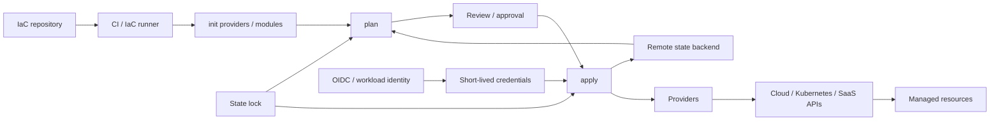

#### Responsibility Boundaries
Terraform/OpenTofu applies infrastructure changes, but it does not decide whether the architecture itself is secure. The team owns module review, provider pinning, remote state security, separation of duties, least-privilege credentials, drift detection, plan/apply approvals, policy-as-code gates, and state recoverability.

The state backend should be treated as high-value storage. Access to it is often equivalent to access to infrastructure topology, IAM bindings, and secrets.

#### Common Live Patterns
- Remote state backend with encryption, access control, audit logs, backup/versioning, and locking.
- Separate configurations and state backends with independent access controls and credentials for environments and ownership domains that require isolation.
- Plan in a pull request or change request; apply only after approval.
- Short-lived cloud credentials through OIDC/workload identity instead of long-lived access keys.
- Provider and module versions pinned; external module sources reviewed.
- Policy-as-code to block public exposure, broad IAM, unencrypted storage, and unsafe Kubernetes resources.
- Drift detection and import workflow for resources changed outside IaC.
- No secrets in Git-committed variables, published outputs, or CI logs; restricted access and encryption for state and plans containing secrets.

#### Security and Operational Verification

The `sensitive` flag redacts normal presentation; it does not itself encrypt or omit a value from state or a saved plan. Where supported by the exact CLI and provider versions, ephemeral values and write-only arguments can avoid persistence. Confirm the actual resulting state and plan rather than relying on the flag. Saved plans are sensitive executable change artifacts: approve and apply the same protected plan, bound to the source revision and environment.

Machine-readable output also needs protection: `terraform output -json` and `-raw` expose sensitive values without normal redaction. Do not publish this output in PR comments, shared logs, or third-party service reports without checking the data it contains. When passing a plan between jobs, restrict access and retention; verify that approval binds to the exact artifact, and require new approval if the plan is replaced. Test rejection of a substituted artifact and absence of a canary secret from publicly accessible pipeline results.

CLI workspaces separate states within one configuration, but do not create an independent access boundary. Do not rely solely on workspace switching to isolate test and production environments. Verify that test pipeline credentials cannot read or modify production state or access production resources. HCP Terraform workspaces have a different access model; assess it separately.

Backend support varies. Test that a concurrent writer cannot acquire the state lock, and protect lock removal as an exceptional operation. For current Terraform S3 backends, enable `use_lockfile`; DynamoDB-based locking is deprecated. Check OpenTofu and mixed-client compatibility separately instead of copying backend settings blindly.

In Terraform, `.terraform.lock.hcl` records provider versions and checksums, but not remote module versions. Keep it in Git and review changes; pin modules separately to an exact version or immutable source revision. A checksum proves a match to the previously selected package, not the security of its code. Verify the initial source and publisher before accepting a new lock file; CI reinitialization must not silently upgrade approved dependencies.

#### Related Project Files
- `content/review/architecture/checklist.ru.md` / `checklist.en.md` — applies to trust boundaries, data flows, and architecture changes through IaC.
- `content/review/release-governance/playbook.ru.md` / `playbook.en.md` — approvals, release evidence, and separation of duties for infrastructure changes.
- `content/application-security/identity/oidc-oauth/playbook.ru.md` / `playbook.en.md` — OIDC federation for CI/CD and workload identity.
- `content/platform-security/secrets/vault/playbook.ru.md` / `playbook.en.md` — relevant when Terraform/OpenTofu retrieves credentials or secrets from Vault.
- There is no dedicated Terraform/OpenTofu playbook yet.

## Data Stores, Search, and Messaging

### Object Storage

#### What It Is Used For
Object storage is used to store files and blobs: user uploads, backups, logs, artifacts, data lake objects, static assets, ML datasets, and exports. Common implementations include Amazon S3, Google Cloud Storage, Azure Blob Storage, and S3-compatible systems such as MinIO.

#### Operating Model
A bucket or container is the top-level storage container. An object stores content, metadata, key/name, and versions if versioning is enabled. A prefix is not a real directory in most object storage systems, but is used as a namespace convention for grouping objects, lifecycle policies, and IAM conditions.

Access is controlled through a combination of IAM policies, bucket/container policies, ACLs, or legacy access models. In live environments, a centralized IAM/policy model with public access blocked by default is preferred; ACLs should be used only where they are truly needed and understood. Signed URLs, presigned URLs, and SAS tokens provide time-limited upload/download access without giving users cloud credentials. The URL itself is a bearer credential; effective validity and revocation depend on the provider, signing mechanism, credential lifetime, and current access policy.

Encryption can be provider-managed, customer-managed through KMS, or client-side. Versioning, retention, soft delete, and object lock/immutability help protect against accidental deletion, ransomware, and destructive insider actions, but increase cost and require lifecycle management. Access logs and cloud audit logs are needed for investigations: who read, wrote, deleted, or changed policy.

#### Interaction Diagram
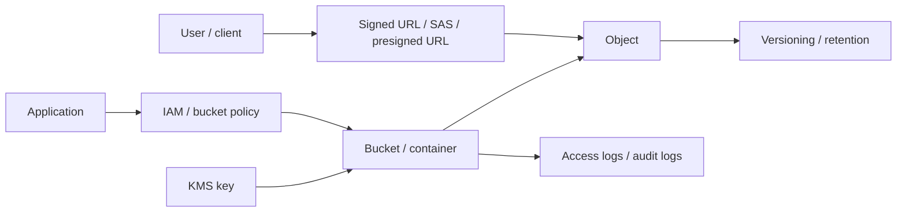

#### Responsibility Boundaries
Object storage reliably stores objects and enforces access policy, but it does not understand the business semantics of the data. The team owns bucket ownership, public exposure, object naming, signed URL scope/lifetime, malware scanning for uploads, encryption/KMS policy, lifecycle, retention, backup restore tests, and protection of sensitive data in logs/artifacts.

#### Common Live Patterns
- Private buckets/containers by default and an explicit public access exception process.
- Separate buckets by environment, data sensitivity, or ownership domain.
- Presigned upload/download with short TTL and a restricted method/object key.
- Server-side encryption with KMS for sensitive data.
- Versioning/soft delete/retention for backups and critical artifacts.
- Object lock or immutable retention for compliance archives and ransomware-resistant backups.
- Access logs/audit logs with a separate write-only destination.
- Lifecycle policies for old versions, incomplete uploads, and temporary exports.

#### Security and Operational Verification

A signed URL is normally reusable within its validity period; it is not a one-time authorization ticket. Revocation differs by provider and signing mechanism, so do not promise that revoking one signing credential invalidates every URL immediately. Keep URLs out of logs and referrers, restrict the operation and object, and verify expiry and revocation with the deployed mechanism.

For user uploads, authorize the object key on the server, prevent overwriting another tenant's object, and validate the completed object's size, type, and content before publication. A signed upload request alone does not establish that the resulting file is safe.

Do not publish a mutable object key based solely on an earlier successful check: a still-valid upload URL may allow replacement after scanning. Receive the file in a private area, bind the check result to a specific version or immutable content, and publish that exact checked object to an area where the client has no write permission. Test repeated and concurrent uploads through the same URL during and after scanning: unchecked content must not inherit the checked file status.

In versioning-enabled S3, a normal `DELETE` without `versionId` creates a delete marker rather than erasing older versions. For deletion requirements, check every object version, noncurrent-version expiration rules, and copies covered by the retention policy. A `404` on ordinary reads does not prove data erasure. Account for immutable-retention restrictions and separately test whether the application role can read an older version by its ID.

#### Related Project Files
- `content/review/architecture/checklist.ru.md` / `checklist.en.md` — data flows, trust boundaries, and storage exposure.
- `content/supply-chain/slsa-provenance/overview.ru.md` / `overview.en.md` — artifact, SBOM, and provenance storage.
- There is no dedicated object storage playbook yet.

### PostgreSQL / Relational Databases

#### What It Is Used For
PostgreSQL and other relational databases are used for transactional state, accounts, orders, billing, authorization data, audit records, and other data where consistency, relational integrity, and query flexibility matter.

#### Operating Model
A database contains schemas, tables, indexes, views, functions, and roles. A schema groups database objects and is often used to separate domains or tenants, although it does not replace access control by itself. A role can be a login role for connections or a group role for granting privileges. Privileges define who can connect, read, write, change schema, execute functions, or manage objects.

Connection pooling reduces database load and controls the number of active connections. Live deployments often use PgBouncer or managed poolers; the pooling mode matters because transaction/session pooling affects prepared statements, temp tables, session variables, and role switching. Migrations change schema and should be versioned, reviewed, reversible where practical, and compatible with rolling deployment.

Row-level security can restrict rows at the database policy layer and is useful for tenant isolation, but it requires a strict ownership model, bypass scenario tests, and control over privileged roles. Backups and point-in-time recovery rely on base backups and WAL/archive logs. Read replicas offload reads and help recovery, but create separate access risks to the same data and lag-sensitive logic.

Extensions, superuser-like privileges, and procedural languages expand database capability, but increase blast radius. Audit should cover privileged actions, DDL, authentication failures, and access to sensitive tables where required.

#### Responsibility Boundaries
The database engine provides storage, transactions, privileges, and replication primitives. The team owns schema ownership, least-privilege roles, secret rotation, migration safety, backup restore tests, encryption, network exposure, audit, tenant isolation, and protection of sensitive data in queries, dumps, and replicas.

#### Common Live Patterns
- Managed PostgreSQL with private networking.
- Separate app roles for read/write, migrations, and admin operations.
- Connection pooling with an explicitly selected mode.
- Backups with regular restore drills and measured RPO/RTO.
- PITR for critical transactional systems.
- Read replicas with separate access policies.
- RLS for high-risk multi-tenant tables after a dedicated threat model.
- Audit logging for privileged operations and sensitive data access.

#### Security and Operational Verification

In PostgreSQL, superusers and roles with `BYPASSRLS` always bypass RLS. Table owners normally bypass it too; `FORCE ROW LEVEL SECURITY` subjects the owner to policies but does not constrain superusers or `BYPASSRLS`. Application roles should neither own tenant tables nor be able to assume bypass roles. Review `SECURITY DEFINER` functions and the combination of permissive and restrictive policies.

RLS does not restrict table-level operations, including `TRUNCATE` and `REFERENCES`: review those privileges separately. Unique, primary-key, and foreign-key checks bypass RLS to preserve integrity and can reveal a hidden record through the operation outcome. For shared tables, test uniqueness conflicts and references to another tenant's object; include tenant context in constraints where it matches the business invariant, and do not expose internal error details to clients. Denial of `SELECT` alone does not prove these disclosure channels are absent.

Test reads and writes through the real application role and connection pool, including reuse of a connection between tenants and forged tenant context. If tenant identity comes from a session setting, reset it safely and do not treat a value the client can choose as independent proof of authorization. Verify restored backups with the expected grants and RLS policies.

For `SECURITY DEFINER` functions, set a protected `search_path` that excludes schemas writable by untrusted users and explicitly places `pg_temp` last. Restrict `EXECUTE`: new functions grant it to `PUBLIC` by default, so create the function, explicitly revoke execution from `PUBLIC`, and grant it only to permitted roles within one transaction. Granting a selected role access does not itself remove access through `PUBLIC`. Test object shadowing through a temporary table and invocation by a role that should not use the function.

PITR requires a physical base backup and an uninterrupted WAL sequence through the selected recovery point; a `pg_dump` dump does not replace that base backup. Test recovery to a specified point in an isolated environment, measure actual RPO/RTO, and monitor archive lag and free space in `pg_wal`. WAL replay does not restore `postgresql.conf`, `pg_hba.conf`, or `pg_ident.conf`: preserve their configuration separately and verify it after recovery.

#### Related Project Files
- `content/review/architecture/checklist.ru.md` / `checklist.en.md` — data classification, tenant isolation, and trust boundaries.
- `content/application-security/business-logic/business-logic-abuse/playbook.ru.md` / `playbook.en.md` — integrity-sensitive flows and abuse cases.
- There is no dedicated database security playbook yet.

### Redis

#### What It Is Used For
Redis is used as a cache, session store, rate-limit store, lightweight queue, distributed lock backend, and fast key-value database. In live environments Redis often sits on the critical path for authentication, authorization decisions, shopping carts, background jobs, and anti-abuse controls.

#### Operating Model
Redis stores keys of different types: strings, hashes, lists, sets, sorted sets, streams, and other structures. Data usually lives in memory, while persistence is configured through RDB snapshots, AOF, or both. Replication and clustering are used for availability and scale, but require understanding consistency, failover, and key distribution.

AUTH and ACL restrict client access to commands and key patterns. TLS protects network traffic. Dangerous commands such as administrative, persistence-changing, scripting, or bulk key operations can cause data loss, credential exposure, DoS, or tenant boundary bypass if available to the application without need.

The eviction policy defines which keys are removed under memory pressure. For cache this is normal behavior; for session store or queue usage it can become an incident. Shared Redis requires key and channel access controls plus enforceable resource isolation; prefixes alone do not provide memory quotas. Separate instances for different trust domains are often more reliable.

#### Responsibility Boundaries
Redis provides a fast in-memory data store and primitives for persistence/replication, but it does not guarantee safe cache, session, or lock semantics. The team owns network isolation, AUTH/ACL/TLS, command restrictions, key namespace, memory limits, eviction behavior, backups where needed, monitoring, and protection of secrets/PII in values.

#### Common Live Patterns
- Managed Redis or isolated private deployment.
- TLS and ACLs with separate users for applications and operations.
- Dangerous commands disabled for app users.
- Separate instances for cache, sessions, queues, and rate limiting.
- Explicit TTL for cache/session keys.
- Memory limits and eviction policy aligned with the use case.
- Monitoring memory, evictions, blocked clients, replication lag, and command latency.

#### Security and Operational Verification

Key prefixes and numbered logical databases are not independent security boundaries. Use named ACL users with narrowly allowed commands, key patterns, and Pub/Sub channel patterns where needed. Test the actual command set: a key-pattern rule alone is not a universal restriction on administrative, scripting, or channel operations. Ordinary Redis deployments do not provide per-tenant memory quotas just because keys have different prefixes.

ACL key patterns do not filter whole-database enumeration results: permitted `SCAN` and `KEYS` commands can expose other users' key names even when reading their values is denied. Do not grant these commands to an application user without a need; a client-selected `MATCH` parameter is not an access restriction. Test enumeration as each restricted user with the `*` pattern, rather than testing only denial of `GET` on another user's key.

Redis replication is asynchronous. Failover can lose a recent lock or counter update; expiry can let a paused lock holder resume after a new owner acquires the lock. Use ownership-checked release and, for correctness-critical writes, a fencing mechanism enforced by the protected resource or a transactional alternative. Test failover and expiry against the business invariant. Choose and test whether authentication or rate limiting rejects requests or degrades when Redis is unavailable.

Setting an ACL user to `off` prevents new authentication but does not close already authenticated connections. When revoking access, test both a new connection and the application's existing pool; terminate existing connections through a supported administrative mechanism where necessary. Password rotation without checking an existing connection does not prove immediate access revocation.

If Redis holds data that cannot be reconstructed from another source, select RDB/AOF and `appendfsync` based on acceptable data loss and write latency. An RDB snapshot does not preserve subsequent changes; enabling AOF does not mean every acknowledged write has reached durable storage. Test recovery from the preserved file set and lost writes after an abrupt shutdown. Monitor persistence errors, free disk space, and the impact of snapshots and AOF rewriting on memory and request latency.

#### Related Project Files
- `content/application-security/business-logic/business-logic-abuse/playbook.ru.md` / `playbook.en.md` — rate limits, sessions, and abuse controls.
- `content/review/architecture/checklist.ru.md` / `checklist.en.md` — state management and data flow review.
- There is no dedicated Redis playbook yet.

### Vector Database / Vector DB

#### What It Is Used For
A vector database stores embeddings and performs similarity search over vectors. In live environments it is most often used for RAG, semantic search, recommendations, deduplication, anomaly detection, and other scenarios where the system needs to search by semantic or feature proximity rather than exact match.

#### Operating Model
An embedding model converts text, an image, an event, or another object into a vector embedding: a fixed-dimensional numeric representation. The vector database stores the embedding, object ID, metadata, and, in some architectures, a reference to the source document or chunk. At query time, the application builds an embedding for the query and searches for nearest neighbors using a similarity metric such as cosine similarity, dot product, or Euclidean distance.

An index speeds up search, often with approximate nearest neighbor algorithms. This creates an important tradeoff: latency and cost improve by accepting approximation, so retrieval quality must be measured separately instead of treated as a default database property. Metadata filters limit results by tenant, document class, source, ACL, or other attributes; in RAG they must be part of the authorization model, not just a convenient search filter.

A vector database usually does not replace source-of-truth storage. Source documents, permissions, lifecycle, and deletion workflow often live in object storage, a database, or a document store, while the vector index is a derived representation. When a source document is updated or deleted, embeddings, metadata, and the search index must be updated as well; otherwise stale retrieval can return data that is no longer accessible or has been deleted by policy.

#### Responsibility Boundaries
A vector database provides embedding storage and similarity-based retrieval, but it does not guarantee correct authorization semantics, source data quality, or safe retrieved context. The team owns tenant isolation, document-level authorization, metadata integrity, ingestion validation, deletion propagation, encryption, backups, audit logs, monitoring, and protection against poisoned corpora, embedding leakage, and unbounded retrieval.

#### Common Live Patterns
- Separate indexes or namespaces by tenant, environment, and sensitivity where a shared index complicates isolation.
- Permission-aware retrieval: access filters are applied before context is returned to the model.
- Metadata schema with owner, source, classification, tenant, document version, and deletion state.
- Ingestion pipeline with validation, malware/content checks, provenance, and deduplication.
- Retrieval limits: `top_k`, score threshold, payload size limit, and rate limits.
- Evaluation set for retrieval quality and leakage tests before live-environment changes.
- Audit logging for queries, retrieved document IDs, metadata filters, and administrative changes.
- Regular index rebuild/cleanup after document deletion, permission changes, and embedding model upgrades.

#### Security and Operational Verification

Build tenant and access filters on the server from the authenticated principal, not from model output or client-selected metadata. If index permissions can lag, reauthorize candidates against current source permissions before returning content. An index namespace is not sufficient if a caller can select another namespace or query without the required filter.

Test cross-tenant queries, direct object lookup, permission revocation, deleted documents, cached retrieval, and exported indexes. Measure the deletion and access-revocation delay across the source, index, caches, and backup retention; protect embeddings and query logs as sensitive derived data.

#### Related Project Files
- `content/ai-security/securing-ai/overview.ru.md` / `overview.en.md` — LLMSecOps lifecycle, RAG data pipeline, and vector database controls.
- `content/ai-security/owasp-llm-top-10/overview.ru.md` / `overview.en.md` — LLM09:2026 Vector and Embedding Weaknesses.
- There is no dedicated vector database security playbook yet.

### Elasticsearch / OpenSearch

#### What It Is Used For
Elasticsearch and OpenSearch are used for search, log analytics, observability, security analytics, and document indexing. In live environments they often store application logs, audit events, customer-visible search indexes, and operational telemetry.

#### Operating Model
A cluster consists of nodes and stores indexes. An index contains documents and a mapping that describes fields and types. Shards divide an index for scale and replication. An ingest pipeline can transform documents before write: parse logs, add fields, normalize events, or remove some data.

Access can be defined at the cluster, index, document, and field level depending on distribution, edition, and configuration. Dashboards/OpenSearch Dashboards/Kibana provide UI for search and visualization, but when exposed incorrectly they become a direct window into logs, PII, tokens, and internal infrastructure data.

Snapshot repositories are used for backup/restore and migration. They often live in object storage, so their IAM and retention are as important as permissions on the cluster itself. Logs and traces should be treated as sensitive data: they can contain authorization headers, session IDs, emails, payload fragments, stack traces, and internal hostnames.

#### Responsibility Boundaries
A search cluster indexes and searches documents, but it does not decide which data is safe to log or who should see it. The team owns network exposure, authentication, authorization, tenant/index isolation, field masking, ingest redaction, dashboard access, snapshot security, retention, and cost/cardinality controls.

#### Common Live Patterns
- Managed or dedicated cluster in a private network.
- Separate indexes or clusters for environments and sensitivity levels.
- Index lifecycle management for retention and cost control.
- Ingest redaction for secrets, tokens, and PII.
- Least-privilege dashboard roles.
- Snapshot repository with restricted IAM and restore drills.
- Alerting on authentication failures, public exposure, disk watermarks, and ingestion spikes.

#### Security and Operational Verification

Separate ingestion identities from search and dashboard users. Treat document- and field-level security as read restrictions, not as authorization to write only the visible documents or fields. Verify effective permissions across all assigned roles: in Elasticsearch, another role granting unrestricted access to the same index removes the corresponding document or field restriction. Permissions from multiple roles are combined, so a narrow role does not reduce access already granted by a broad one. Include additional group and role assignments in testing: hidden fields and documents must not become accessible without the intended authorization to expand access. Test direct API access, not only the dashboard interface.

Use synthetic documents from two tenants to check search, direct document lookup, multi-search, exports, and any enabled write APIs. Confirm that ingestion credentials cannot read unrelated indexes and that search users cannot change mappings, retention, roles, or snapshot repositories. Check the deployed distribution and edition before relying on document- or field-level controls.

For Elasticsearch backups, use the built-in cluster snapshot mechanism: copies of node data directories and filesystem snapshots do not replace a supported backup, even when nodes are stopped. Do not delete or modify individual snapshot repository files through object-storage tools; manage snapshots through the Elasticsearch API, otherwise later restoration may fail or silently lose data.

Restore snapshots into an isolated environment and explicitly select data indexes, global state, and feature states. In Elasticsearch, restoring the `security` feature state overwrites authentication system indexes; require a reviewed recovery procedure and an independent access path before doing so. Verify restored access rules, repository permissions, and retention before reconnecting applications. Restoring older data must not silently reintroduce documents whose deletion or access revocation is still required.

#### Related Project Files
- `content/review/architecture/checklist.ru.md` / `checklist.en.md` — sensitive data flows and observability surfaces.
- `content/application-security/web/browser-security/playbook.ru.md` / `playbook.en.md` — relevant when frontend logs/telemetry contain browser-side data.
- There is no dedicated Elasticsearch/OpenSearch playbook yet.

### Kafka

#### What It Is Used For
Apache Kafka is used as a distributed event streaming platform: event bus, ingestion pipeline, audit/event log, integration backbone, stream processing source, and buffer between services. In live environments Kafka is often a critical shared platform that carries business events, telemetry, and integrations.

#### Operating Model
A broker stores topic partition data and serves producers/consumers. A topic is a logical category of events, such as `orders.created`. A partition is an ordered append-only log inside a topic; partitions provide scaling and parallelism. A replica is a copy of a partition on another broker for fault tolerance. The controller manages cluster metadata, partition leader election, and state changes.

A producer publishes records to a topic, selecting a partition explicitly or through a partitioner. A consumer reads records from partitions and advances an offset, which is the read position. A consumer group lets several instances of the same application divide partitions among themselves: one partition within a group is read by only one consumer instance at a time. This provides horizontal scaling for processing.

Schema Registry stores event schemas and helps control compatibility between producer and consumer contracts. Kafka Connect runs connectors that integrate Kafka with databases, object storage, search engines, and other systems. ACLs define who may read, write, create, or administer topics, groups, and cluster resources.

Current Kafka `4.x` clusters run in KRaft mode without ZooKeeper; older `3.x` clusters may still have ZooKeeper during migration. In a working flow, a producer sends an event to the broker leader for a partition, the broker writes it to the log and replicates it to followers, a consumer group reads events and commits offsets, and downstream services use those events for processing, integration, or analytics.

#### Interaction Diagram
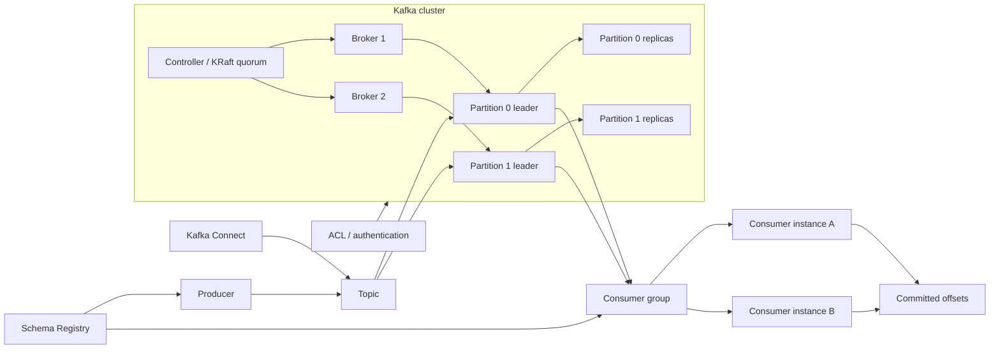

#### Responsibility Boundaries
Kafka provides event delivery, storage, and replication, but it does not define data access semantics for the application. Teams are responsible for topic ownership, ACLs, tenant isolation, encryption in transit, retention, schema governance, protecting PII/secrets in events, and handling redelivery correctly.

Kafka does not guarantee that a consumer interprets a message safely.

#### Common Live Patterns
- Managed Kafka or a dedicated platform cluster; for self-managed Kafka `4.x`, operate KRaft quorum explicitly and treat any remaining ZooKeeper dependency as legacy migration scope.
- TLS for client-broker and inter-broker traffic.
- SASL, OAuth, or mTLS for authentication.
- ACLs by topic and group.
- Schema Registry for contracts.
- Separate clusters across trust boundaries, or environment/domain-specific topic and group naming with explicit ACLs. A name prefix alone does not restrict access.
- Kafka Connect with a separate secret model.
- Monitoring lag, under-replicated partitions, auth failures, and retention pressure.

#### Security and Operational Verification

Ordinary consumer groups assign each partition to one consumer at a time, but this does not make external side effects exactly-once. Commit offsets after the required durable outcome and make retries idempotent. Kafka transactions can coordinate Kafka records and offsets; they do not automatically atomically commit a payment, database update, or external API call. Share groups use different consumption semantics and must not inherit ordinary consumer-group assumptions.

Where a consumer must see only committed Kafka transactions, set `isolation.level=read_committed`; `read_uncommitted` can expose records from aborted and still-open transactions. Test transaction abort and restart: these records must not trigger business actions, and the consumer position after abort must allow unfinished processing to be retried. This mode also returns non-transactional records and does not validate their business correctness.

For durable publication, verify the effective producer `acks=all` and `enable.idempotence=true` settings, compatible retry/in-flight settings, and the topic's replication and minimum in-sync replica requirements. Test broker loss, reduced ISR, restart after processing but before offset commit, and duplicate events. Protect Schema Registry and Kafka Connect separately: they are additional services and credentials, not automatically covered by topic ACLs.

#### Related Project Files
- `content/review/architecture/checklist.ru.md` / `checklist.en.md` — applies to event-driven architecture, trust boundaries, and data flow review.
- `content/platform-security/secrets/vault/playbook.ru.md` / `playbook.en.md` — relevant when credentials, certificates, or connector secrets are issued through Vault.
- There is no dedicated Kafka playbook yet.

### RabbitMQ

#### What It Is Used For
RabbitMQ is used as a message broker for queues, routing, asynchronous processing, task distribution, and service integration. In live environments it often appears in background jobs, transactional messaging, integration queues, and systems where routing semantics, acknowledgements, and backpressure matter.

#### Operating Model
A broker accepts messages, stores queues, and delivers messages to consumers. A virtual host separates a logical RabbitMQ space: exchanges, queues, bindings, user permissions, and policies live inside a vhost. An exchange accepts publications from producers and decides which queues should receive a message. A queue holds messages for delivery; with manual acknowledgement, a consumer reading a message does not itself permanently remove it. Removal or redelivery depends on acknowledgement and queue rules. A binding connects an exchange and a queue with a routing rule.

Routing depends on the exchange type and bindings. A direct exchange matches routing keys exactly, a topic exchange matches key patterns, a fanout exchange routes to all bound queues regardless of the key, and a headers exchange uses message headers. With manual acknowledgements, the consumer acknowledges after the required processing outcome; outstanding deliveries remain unacknowledged until acknowledged, negatively acknowledged, or the channel closes. Automatic acknowledgement treats delivery as complete when sent and can lose work if the consumer fails.

Account for the delivery acknowledgement timeout: when it expires, the broker closes the channel with `PRECONDITION_FAILED` and requeues outstanding deliveries on that channel. Starting with RabbitMQ `4.3`, this mechanism is supported only for quorum queues. Align the configured timeout with processing duration and test a stalled consumer; do not assume the time limit automatically sends a message to a DLQ.

A policy defines queue and exchange behavior: TTL, max length, dead-letter exchange, quorum settings, and other parameters. Operator policy acts as a guardrail above client-provided arguments and ordinary policies, especially for resource limits. User/permission defines which operations are allowed inside a vhost: configure, write, and read.

The working flow is: a producer publishes a message to an exchange, the exchange uses its type and bindings to select destinations, the broker stores the message, a consumer takes it and acknowledges processing. If processing fails or the message expires, DLX/retry topology decides whether it is retried, delayed, or sent to a dead-letter queue.

#### Interaction Diagram
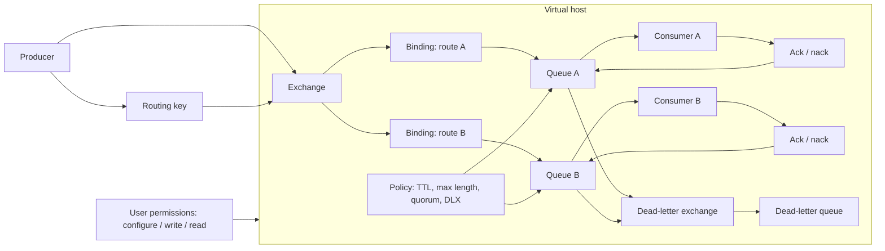

#### Responsibility Boundaries
RabbitMQ owns broker delivery and routing, but not message content security or business processing semantics. The team owns TLS, users/permissions, vhost isolation, queue policies, DLQ, TTL, management UI exposure, credential protection, and payload control, especially when messages contain personal data or commands for internal systems.

#### Common Live Patterns
- Clustered RabbitMQ with quorum queues for critical queues; do not design new HA paths around classic mirrored queues, which are removed in RabbitMQ `4.x`.
- Durable queues for live messages; transient non-exclusive classic queues are deprecated in RabbitMQ `4.3+` and should not be a new production model. For temporary state, use exclusive/server-named queues or durable queues with TTL.
- Separate vhosts for domains, environments, or teams.
- TLS for client connections.
- Least-privilege permissions on exchanges and queues.
- DLQ and retry topology.
- Policies and operator policies for TTL, max length, quorum settings, and upper resource limits.
- Restricted access to the management UI.
- Monitoring queue depth, consumer count, unacked messages, and publish/ack rates.

#### Security and Operational Verification

For AMQP 0-9-1 manual acknowledgements, an outstanding delivery stays unacknowledged while the channel is open; lack of an acknowledgement is not itself a request to dead-letter. Channel/connection closure normally requeues outstanding deliveries, subject to queue delivery limits. `basic.nack` or `basic.reject` with `requeue=false` dead-letters only when a DLX is configured, otherwise the message is discarded. Requeue loops need bounded retries and an explicit failure destination.

Publisher confirms acknowledge the broker-side publication outcome, not consumer completion. Use confirms and handle unroutable publications, for example with `mandatory` and returned-message handling; an unroutable publication can still be confirmed. For critical work, use suitable durable queues and message persistence, manual consumer acknowledgement after the durable business outcome, bounded prefetch, and idempotent processing. Test a lost connection before a confirm, consumer failure before acknowledgement, an unavailable DLX target, and replay from the failure queue.

Configuring a DLX alone does not guarantee durability: internal republishing uses no confirms by default, and a message can be lost when the destination queue is unavailable. Where loss is unacceptable, verify supported `at-least-once` dead-lettering for the source quorum queue and all prerequisites in the deployed version. Account for possible duplicates and message accumulation during destination failure; test routing recovery and absence of repeated business effects.

For this mode, set `dead-letter-strategy=at-least-once`, `overflow=reject-publish`, and `dead-letter-exchange` in the source queue policy; verify required feature flags for the deployed version. `drop-head` falls back to `at-most-once` transfer even without a queue length limit. Bound accumulation with `max-length` or `max-length-bytes` and test producer handling of rejected new publications during a prolonged destination outage. Do not switch the strategy to `at-most-once` or `overflow` to `drop-head` while messages remain unconfirmed by target queues: this change deletes them from the source queue.

#### Related Project Files
- `content/review/architecture/checklist.ru.md` / `checklist.en.md` — applies to asynchronous flows, trust boundaries, and message processing.
- `content/platform-security/secrets/vault/playbook.ru.md` / `playbook.en.md` — relevant when broker credentials or TLS materials are managed through Vault.
- There is no dedicated RabbitMQ playbook yet.
---

## Related Materials

- [Container image security playbook](../../content/supply-chain/container-image-security/playbook.en.md)
- [Kubernetes cluster security review playbook](../../content/platform-security/kubernetes/cluster-security-review/playbook.en.md)
- [Vault playbook](../../content/platform-security/secrets/vault/playbook.en.md)
- [Securing AI overview](../../content/ai-security/securing-ai/overview.en.md)
