# Infrastructure Technologies

Этот документ описывает, как работают ключевые технологии, которые часто встречаются в рабочей инфраструктуре и security review. Он не заменяет плейбуки: здесь фокус на назначении, модели работы, границах ответственности и типовых эксплуатационных паттернах.

Разделы сгруппированы по роли технологии в рабочей системе: build и supply chain, container platform, identity/secrets, automation, data stores и messaging.

## Оглавление

- [Build, Delivery и Supply Chain](#build-delivery-и-supply-chain)
  - [CI/CD Platforms](#cicd-platforms)
  - [Docker](#docker)
  - [OCI Registry / Artifact Registry](#oci-registry--artifact-registry)
  - [Helm](#helm)
- [Container Platform и Kubernetes Runtime](#container-platform-и-kubernetes-runtime)
  - [Среды выполнения контейнеров](#среды-выполнения-контейнеров-container-runtimes)
  - [Kubernetes](#kubernetes)
  - [CNI / Kubernetes networking](#cni--kubernetes-networking)
  - [Ingress / Gateway / API Gateway](#ingress--gateway--api-gateway)
  - [Istio](#istio)
  - [Policy Engines](#policy-engines)
- [Identity, Secrets и Access](#identity-secrets-и-access)
  - [Cloud IAM / Workload Identity](#cloud-iam--workload-identity)
  - [Vault](#vault)
- [Automation и Configuration Management](#automation-и-configuration-management)
  - [Ansible](#ansible)
  - [Terraform / OpenTofu](#terraform--opentofu)
- [Data Stores, Search и Messaging](#data-stores-search-и-messaging)
  - [Object Storage](#object-storage)
  - [PostgreSQL / Relational Databases](#postgresql--relational-databases)
  - [Redis](#redis)
  - [Векторная БД / Vector DB](#векторная-бд--vector-db)
  - [Elasticsearch / OpenSearch](#elasticsearch--opensearch)
  - [Kafka](#kafka)
  - [RabbitMQ](#rabbitmq)
- [Связанные материалы](#связанные-материалы)

## Build, Delivery и Supply Chain

### CI/CD Platforms

#### Для чего используется
CI/CD platforms используются для сборки, тестирования, упаковки, публикации и развертывания software artifacts. Типичные примеры: GitHub Actions, GitLab CI, Jenkins, Buildkite и TeamCity. В рабочих средах это центральная часть software supply chain: именно pipeline получает доступ к source code, secrets, package registries, cloud accounts, artifact registries и deployment environments.

#### Модель работы
Pipeline или workflow описывает последовательность jobs. Job выполняется на runner/agent и обычно состоит из steps: checkout source code, dependency install, tests, security scans, build, artifact upload, image push и deploy. Runner может быть hosted, когда инфраструктуру выполнения предоставляет CI/CD vendor, или self-hosted, когда команда запускает agents в своей сети, cloud account или Kubernetes cluster.

Artifacts используются для передачи build outputs между jobs и последующими stages. Cache ускоряет повторные builds, сохраняя dependencies или intermediate outputs. Environment задает deployment target, например `staging` или `prod`, и может иметь protection rules: required reviewers, wait timers, branch/tag restrictions и environment-scoped secrets. Secret store хранит tokens, passwords, certificates и signing keys, доступные pipeline при выполнении jobs.

Современный рабочий паттерн — использовать OIDC federation вместо long-lived static secrets. CI/CD platform выпускает short-lived OIDC token для конкретного job/workflow с claims о repository, branch/tag, pipeline, environment и actor. Cloud provider или Vault проверяет issuer, audience, subject и дополнительные claims, затем выдает временные учетные данные с ограниченной policy.

Deploy pipeline не должен быть единственной точкой доверия. Pipeline собирает и публикует artifact, а deploy/admission gate отдельно проверяет digest, signature, provenance, policy result, environment approval и допустимость release. Граница обычно проходит там, где pipeline передает immutable artifact и deployment intent в Kubernetes, GitOps controller, release orchestrator или cloud deploy service.

Untrusted workflow input является отдельной границей. Pull request titles and bodies, issue comments, branch names, tag names, release notes, commit messages и forked code считаются attacker-controlled, когда попадают в shell scripts, deployment commands, release notes, AI-assisted workflow steps или policy inputs.

#### Схема взаимодействия
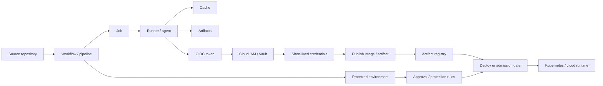

#### Границы ответственности
CI/CD platform запускает automation и предоставляет primitives для secrets, runners, artifacts, approvals и identity federation, но не гарантирует безопасность pipeline автоматически. Команда отвечает за минимальные workflow permissions, trusted actions/plugins, isolation self-hosted runners, защищенные branches/tags/environments, секреты, cache poisoning controls, artifact integrity и разделение build/deploy ролей.

Hosted runners уменьшают операционную нагрузку и обычно дают чистое ephemeral окружение. Self-hosted runners нужны для private networks, specialized hardware или compliance, но требуют hardening, cleanup, egress control, patching и защиты от persistence между jobs.

#### Типовые рабочие паттерны
- Protected branches и tags для release refs.
- Environment approvals для развертывания в рабочую среду.
- OIDC federation в cloud provider или Vault вместо static deploy secrets.
- OIDC trust с привязкой к issuer, audience, protected ref/environment, workflow identity и repository identity; широкий trust на всю organization не является default для live deploy.
- Separate runners для trusted и untrusted workloads.
- Ephemeral self-hosted runners для pull request builds из недоверенного кода.
- Никаких production secrets, signing material или deploy credentials на runners, которые выполняют untrusted fork или branch code.
- Artifact upload по digest и публикация SBOM/provenance/signatures.
- Read-only source token по умолчанию; write permissions только для отдельных jobs.
- Deploy gate, который не доверяет одному факту успешного pipeline.

#### Связанные файлы из проекта
- `content/supply-chain/slsa-provenance/overview.ru.md` / `overview.en.md` — trusted builders, provenance и verification policy.
- `content/review/release-governance/playbook.ru.md` / `playbook.en.md` — protected environments, релизные подтверждения и approvals.
- `content/platform-security/secrets/vault/playbook.ru.md` / `playbook.en.md` — выдача short-lived secrets и учетных данных для pipeline.
- Прямого отдельного playbook по CI/CD security пока нет.

### Docker

#### Для чего используется
Docker используется для сборки, упаковки и запуска приложений в контейнерах. В рабочих средах он чаще всего встречается как инструмент сборки образов, локальной разработки, CI/CD pipeline и часть контейнерной supply chain, даже если в Kubernetes контейнеры запускает уже containerd или CRI-O.

#### Модель работы
`Dockerfile` описывает, из чего собирается образ: базовый image, установку пакетов, копирование файлов, переменные окружения, пользователя, рабочую директорию и команду запуска. При сборке Docker превращает инструкции в набор слоев. Каждый layer фиксирует изменение filesystem, а итоговый image становится переносимым артефактом, который можно положить в registry и запускать в разных окружениях.

На уровне OCI runnable image не является одним непрозрачным файлом. Platform-specific image manifest указывает на один image config object и упорядоченный набор filesystem layer descriptors. Config хранит runtime defaults: entrypoint, command, environment, user, exposed ports, volumes, labels и metadata root filesystem. Layers фиксируют изменения filesystem; сами по себе они не несут runtime configuration. Image index, который в Docker-терминологии часто называют manifest list, указывает на один или несколько platform-specific manifests.

Registry хранит и раздает images. Docker CLI является клиентом, через который разработчик или CI отправляет команды сборки, публикации и запуска. Docker daemon выполняет эти команды на host: собирает image, создает container, подключает volumes и networks, назначает ограничения и передает низкоуровневый запуск runtime.

Container — это запущенный процесс с изолированным представлением filesystem, процессов, сети и ресурсов. Volume нужен для данных, которые должны пережить пересоздание container. Network определяет, как container общается с другими container, host и внешними системами.

Обычный поток выглядит так: разработчик или CI собирает image из `Dockerfile`, публикует его в registry, затем runtime скачивает image и запускает container из неизменяемого набора слоев с заданными namespace, cgroups, capabilities, mounts и сетевой конфигурацией. В связке с Kubernetes Docker чаще остается на этапе build/package, а запуском на node занимается container runtime.

Термины `tag`, `digest` и image ID легко смешать во время review. Tag является изменяемой registry-ссылкой, если политика registry не запрещает mutation. Digest идентифицирует registry content: index, manifest, config или layer. Image ID выводится из image config и полезен локально, но deployment policy для рабочей среды должна привязываться к registry digest, который Kubernetes и container runtime будут скачивать.

#### Схема взаимодействия
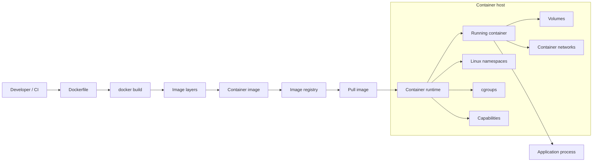

#### Границы ответственности
Docker помогает упаковать приложение и задать параметры запуска, но не делает образ безопасным автоматически. Команда отвечает за минимизацию базового образа, отсутствие секретов в слоях, pinning версий, сканирование зависимостей, запуск без root, ограничение capabilities и корректную публикацию в registry.

Приложение по-прежнему отвечает за собственную аутентификацию, авторизацию, обработку входных данных и безопасную работу с секретами.

#### Типовые рабочие паттерны
- Сборка образов в CI.
- Хранение образов в private registry.
- Multi-stage builds.
- Минимальные base images.
- Image scanning перед публикацией или развертыванием.
- Подписание образов и provenance для критичных сервисов.
- Развертывания в рабочую среду с привязкой к digest; tags используются для discovery или channels, а не как release trust anchor.
- Запуск контейнеров в Kubernetes через containerd или CRI-O, а не напрямую через Docker Engine.

#### Связанные файлы из проекта
- `content/supply-chain/container-image-security/playbook.ru.md` / `playbook.en.md` — OCI image model, Dockerfile baseline, registry promotion, digest pinning, scanning и signing.
- `content/platform-security/kubernetes/container-escape-capability-abuse/overview.ru.md` / `overview.en.md` — риски container escape через capabilities и опасные параметры контейнера.
- `content/platform-security/kubernetes/pod-security/playbook.ru.md` / `playbook.en.md` — безопасные настройки workload, применимые к контейнерам в Kubernetes.
- `content/supply-chain/slsa-provenance/overview.ru.md` / `overview.en.md` — происхождение артефактов, supply chain и доверие к сборкам.

### OCI Registry / Artifact Registry

#### Для чего используется
OCI registry хранит и раздает container images и связанные артефакты supply chain: SBOM, signatures, provenance attestations, scan results, Helm charts и другие OCI-compatible objects. В рабочих средах registry обычно является центральной точкой между build pipeline, deployment platform и runtime: CI публикует артефакты, admission/deploy gate проверяет их, Kubernetes nodes скачивают digest'ы для запуска workload'ов.

#### Модель работы
OCI Distribution Specification описывает API для push/pull контента через registry. Основные объекты: blob, manifest, image index, digest и tag. Blob хранит слой image или конфигурацию. Manifest описывает один image или artifact и ссылается на blobs по digest. Image index связывает несколько platform-specific manifests, например `linux/amd64` и `linux/arm64`. Digest служит content-addressed идентификатором конкретного registry content; tag — человекочитаемая ссылка на manifest или index, которая может быть изменяемой, если политика registry это разрешает.

Repository внутри registry группирует related artifacts, например `prod/payments/api`. Клиент делает push blobs и manifest, затем может присвоить tag. При pull клиент запрашивает manifest или index по tag или digest, получает descriptors выбранного content и скачивает referenced blobs. Для multi-platform image клиент может сначала получить index, а затем выбрать platform-specific manifest для своей OS и architecture. Kubernetes-развертывания в рабочую среду должны ссылаться на image по digest, потому что tag не является надежной immutable-ссылкой без отдельной политики tag immutability.

Registry promotion должен сохранять то, что проходило review. Копирование image из одного registry в другой может изменить repository reference и иногда top-level digest, если меняется copied object, media type или shape index. Поэтому review-подтверждение должно фиксировать source и destination references, точный digest, который развернут, набор platform manifests и subject подписи/provenance, принятый policy.

Современный artifact registry часто хранит не только image, но и referrers: подписи, SBOM и provenance, связанные с subject digest. Например, image `sha256:...` может иметь cosign signature, SLSA provenance и SBOM как отдельные OCI artifacts. Deploy gate или admission policy сначала извлекает image digest, затем ищет связанные attestations/referrers, проверяет подпись, builder identity, provenance predicate и результат политики.

Registry также управляет authorization, retention, replication, сканированием уязвимостей, pull-through cache и audit logs. В cloud registry это часто отдельный managed service с IAM policies; в self-hosted вариантах, например Harbor или distribution-based registry, команда сама отвечает за storage, TLS, auth, replication и cleanup.

#### Схема взаимодействия
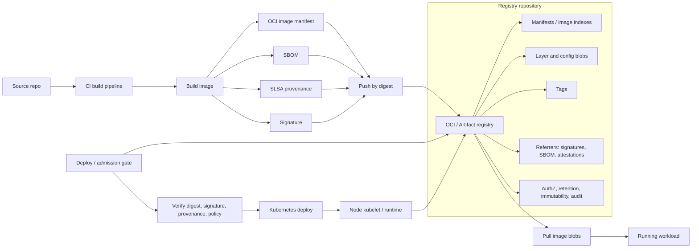

#### Границы ответственности
Registry гарантирует хранение и выдачу артефактов по API, но не доказывает автоматически, что image безопасен, подписан правильным субъектом или собран из допустимого source. Команда отвечает за authn/authz, immutable digest-based deployment, tag immutability для релизных tags, подписи, provenance, retention, управление уязвимостями и audit trail.

Artifact registry не должен быть единственным control point. Даже если registry блокирует часть unsafe images, deploy gate должен независимо проверять digest, подпись, builder identity, provenance и решение политики перед попаданием workload в рабочую среду.

#### Типовые рабочие паттерны
- Private registry с IAM/RBAC и отдельными repositories по средам или доменам.
- Развертывание только по digest (`image@sha256:...`), tags используются для удобства discovery, а не как trust anchor.
- Tag immutability для релизных tags и запрет перезаписи релизных tags.
- Подпись images и публикация SBOM/provenance как OCI artifacts/referrers.
- Admission/deploy gate, который проверяет signature, trusted builder identity, SLSA provenance и политику уязвимостей.
- Retention policy для старых images, но с сохранением артефактов, нужных для rollback, incident response и audit.
- Pull-through cache с отдельной trust policy для upstream images.
- Журналирование аудита для push/delete/tag mutation/anomalous pull patterns.

#### Связанные файлы из проекта
- `content/supply-chain/slsa-provenance/overview.ru.md` / `overview.en.md` — provenance, verification policy и trusted builders.
- `content/supply-chain/container-image-security/playbook.ru.md` / `playbook.en.md` — baseline безопасности container image и OCI registry.
- `content/platform-security/kubernetes/cluster-security-review/playbook.ru.md` / `playbook.en.md` — registry как часть deployment chain и релизный gate.
- `content/platform-security/kubernetes/adversarial-validation/playbook.ru.md` / `playbook.en.md` — проверки private registry exposure, image history и supply-chain abuse paths.
- `content/platform-security/kubernetes/pod-security/playbook.ru.md` / `playbook.en.md` — runtime последствия запуска недоверенного image.

### Helm

#### Для чего используется
Helm используется как package manager для Kubernetes: шаблонизация манифестов, управление релизами и распространение приложений через charts. В рабочих средах он часто применяется для установки платформенных компонентов, ingress controllers, monitoring stack, policy engines и внутренних приложений.

#### Модель работы
Chart — пакет Kubernetes-манифестов и шаблонов для одного приложения или компонента платформы. Template содержит Kubernetes YAML с Go templating. `values.yaml` и environment-specific values задают параметры рендера: image tag, replicas, resources, ingress, service account, RBAC, security context и другие настройки.

Release — установленный экземпляр chart в конкретном namespace с конкретным набором values. Repository хранит charts и версии charts. Dependency позволяет chart включать другие charts, например базу данных или sidecar-компонент. Hook запускает Kubernetes resources в определенные моменты lifecycle, например до установки, после upgrade или перед удалением.

Helm рендерит manifests из templates и values, затем отправляет итоговые Kubernetes objects в cluster API. Состояние release хранится в Kubernetes, а обновления выполняются через `helm upgrade`: Helm сравнивает новую версию chart/values с текущим release и применяет изменения.

В связке с GitOps Helm часто не запускается вручную оператором. GitOps controller берет chart и values из Git или registry, рендерит их или делегирует рендер Helm, затем синхронизирует итоговые objects с Kubernetes.

#### Схема взаимодействия
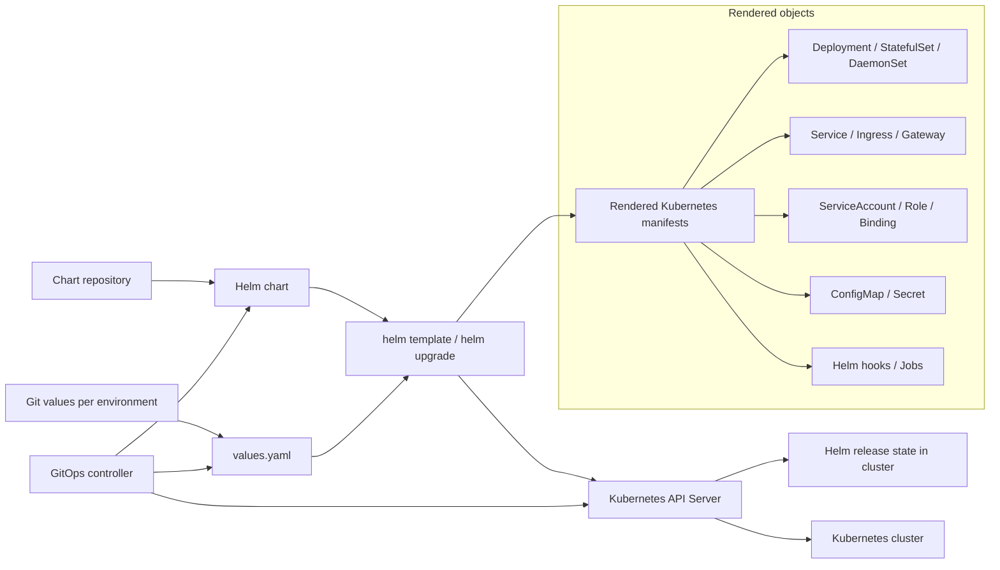

#### Границы ответственности
Helm не определяет безопасность итоговой конфигурации. Chart может создать privileged workload, wildcard RBAC, небезопасный ingress или secret с чувствительными значениями.

Команда отвечает за ревью отрендеренных manifests, контроль values, provenance chart, pinning версий, ограничения на hooks и проверку прав, которые chart создает в кластере.

#### Типовые рабочие паттерны
- Internal chart repository.
- Pinning chart/app versions.
- Separate values per environment.
- Rendering manifests в CI с policy checks.
- GitOps-controller применяет chart вместо ручного `helm install`.
- Подпись/provenance для third-party charts.
- Минимизация post-install hooks и privileged jobs.

#### Связанные файлы из проекта
- `content/platform-security/kubernetes/cluster-security-review/playbook.ru.md` / `playbook.en.md` — Helm часто является источником RBAC, workload и ingress-конфигураций для review.
- `content/platform-security/kubernetes/pod-security/playbook.ru.md` / `playbook.en.md` — проверка итоговых pod specs после рендера chart.
- `content/supply-chain/slsa-provenance/overview.ru.md` / `overview.en.md` — доверие к артефактам, включая charts и deployment packages.

## Container Platform и Kubernetes Runtime

### Среды выполнения контейнеров (container runtimes)

#### Для чего используется
Container runtime запускает контейнеры на node: скачивает образы, подготавливает filesystem, namespace, cgroups и передает запуск низкоуровневому runtime. В Kubernetes runtime обычно работает через CRI и является частью каждой worker node.

#### Модель работы
CRI — интерфейс между kubelet и runtime. Благодаря CRI kubelet не зависит от конкретной реализации и может работать с containerd, CRI-O или другим совместимым runtime. Runtime получает от kubelet запросы на создание pod sandbox, pull image, запуск container, остановку container и сбор статуса.

OCI image spec описывает формат image, а OCI runtime spec — как из этого image запустить container с нужными namespace, cgroups, mounts, capabilities и процессом entrypoint. Image store хранит скачанные images локально на node. Snapshotter подготавливает filesystem layers так, чтобы container получил свое рабочее представление filesystem без полного копирования образа.

Pod sandbox представляет инфраструктурную оболочку pod: сеть, namespace и базовые ресурсы, внутри которых запускаются application containers. Shim process удерживает связь с запущенным container и позволяет runtime не держать весь lifecycle в одном процессе.

Типовая цепочка выглядит так: kubelet получает pod assignment, вызывает CRI runtime, runtime скачивает image из registry, подготавливает snapshot/layers, создает sandbox, затем вызывает OCI runtime, например `runc` или Kata Containers. Низкоуровневый runtime создает Linux-изоляцию и запускает процесс приложения.

#### Схема взаимодействия
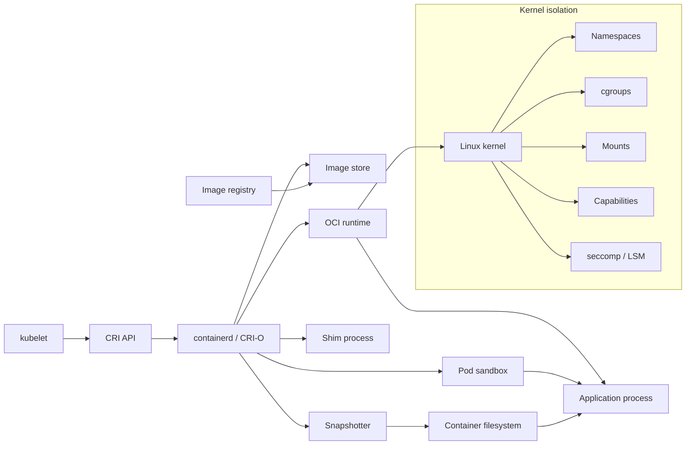

#### Границы ответственности
Runtime исполняет контейнер с заданными ограничениями, но не решает сам, какие permissions безопасны. Если Kubernetes workload запрошен как privileged, с опасными capabilities, `hostPath`, `hostPID` или `hostNetwork`, runtime технически выполнит эту конфигурацию.

За policy, admission control и baseline отвечает платформа.

#### Типовые рабочие паттерны
- containerd как runtime в managed Kubernetes.
- CRI-O в кластерах, ориентированных на Kubernetes-native runtime stack.
- RuntimeClass для изоляции отдельных workload.
- gVisor или Kata Containers для workload с повышенными требованиями к изоляции.
- Централизованная настройка runtime на node images.
- Monitoring runtime events и audit на уровне node.

#### Связанные файлы из проекта
- `content/platform-security/kubernetes/container-escape-capability-abuse/overview.ru.md` / `overview.en.md` — связь runtime-изоляции, capabilities и escape-сценариев.
- `content/platform-security/kubernetes/pod-security/playbook.ru.md` / `playbook.en.md` — workload-настройки, которые runtime применяет на node.
- `content/platform-security/kubernetes/seccomp/checklist.ru.md` / `checklist.en.md` — syscall filtering как часть усиления защиты runtime.

### Kubernetes

#### Для чего используется
Kubernetes используется для оркестрации контейнеризированных приложений: scheduling, service discovery, rollout, autoscaling, конфигурация, секреты, сетевое взаимодействие и управление жизненным циклом workload. В рабочих средах он часто является базовой платформой для микросервисов, batch-задач, internal platforms и cloud-native инфраструктуры.

#### Модель работы
API Server является центральной точкой управления: через него проходят команды пользователей, контроллеров, kubelet и внешних интеграций. Он валидирует запросы, применяет authentication/authorization/admission и сохраняет желаемое состояние в etcd. etcd хранит состояние кластера: объекты workload, services, secrets, bindings, конфигурацию и метаданные.

Scheduler выбирает node для pod на основе ресурсов, constraints, affinity, taints/tolerations и других правил размещения. Controller-manager запускает контроллеры, которые постоянно сравнивают желаемое состояние с фактическим: например, создают новые pods для Deployment, заменяют упавшие pods или синхронизируют endpoints для Service. Admission controllers работают на входе в API и могут изменять или отклонять объекты до сохранения.

На каждой worker node kubelet получает назначенные pods через API Server и просит container runtime запустить нужные containers. Container runtime скачивает images и создает containers. CNI plugin настраивает сетевую связность pod, а kube-proxy или eBPF/CNI-замена обеспечивает service networking.

Pod — минимальная исполняемая единица Kubernetes: один или несколько containers с общей сетевой identity и volumes. Deployment управляет stateless replicas и rollout, StatefulSet — stateful workload со стабильной identity, DaemonSet — agent на каждой подходящей node. Service дает стабильную сетевую точку доступа к динамическому набору pods, Ingress или Gateway публикует HTTP/TCP-вход в кластер. ConfigMap хранит несекретную конфигурацию, Secret — чувствительные значения, ServiceAccount задает identity workload. RBAC связывает roles/clusterroles с subjects через rolebindings/clusterrolebindings. NetworkPolicy описывает разрешенные сетевые потоки между pods и внешними адресами.

В рабочем потоке пользователь применяет manifest через API Server, объект сохраняется в etcd, контроллер создает или обновляет дочерние объекты, scheduler назначает pod на node, kubelet запускает containers через runtime, а сетевые компоненты делают workload доступным другим сервисам.

#### Схема взаимодействия
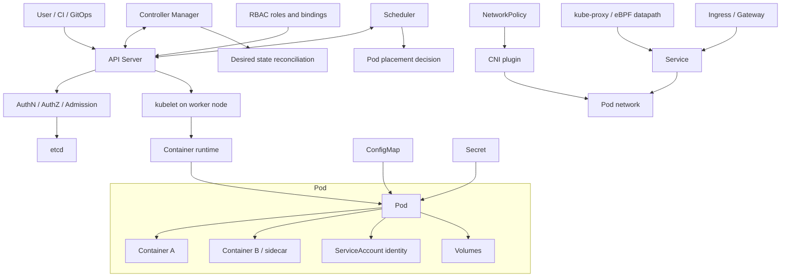

#### Границы ответственности
Kubernetes предоставляет API и механизмы управления workload, но не гарантирует безопасную конфигурацию кластера и приложений сам по себе. Платформенная команда отвечает за RBAC, isolation, admission policies, сетевые политики, audit logs, усиление защиты node, upgrade lifecycle и интеграцию с IAM, secrets и registry.

Команды приложений отвечают за безопасные pod specs, health checks, resource limits, секреты, конфигурацию ingress и поведение приложения.

#### Типовые рабочие паттерны
- Managed Kubernetes: EKS, GKE, AKS или аналог.
- GitOps через Argo CD или Flux.
- Разделение namespace по средам, командам или blast radius.
- Отдельные node pools для trusted/untrusted, stateful, GPU или privileged workload.
- Ingress controller или Gateway API.
- External Secrets Operator или CSI driver для секретов.
- Policy engine: Kyverno или OPA Gatekeeper.
- Private control plane и ограниченный доступ к Kubernetes API.

#### Связанные файлы из проекта
- `content/platform-security/kubernetes/cluster-security-review/playbook.ru.md` / `playbook.en.md` — комплексный security review Kubernetes-кластера.
- `content/platform-security/kubernetes/pod-security/playbook.ru.md` / `playbook.en.md` — требования к безопасной конфигурации pod/workload.
- `content/platform-security/kubernetes/seccomp/checklist.ru.md` / `checklist.en.md` — проверка seccomp-профилей.
- `content/platform-security/kubernetes/container-escape-capability-abuse/overview.ru.md` / `overview.en.md` — container escape и misuse Linux capabilities.

### CNI / Kubernetes networking

#### Для чего используется
CNI и Kubernetes networking обеспечивают сетевую связность pod'ов, service discovery, Service load balancing, egress/ingress paths и enforcement сетевых политик. В рабочих средах это один из главных слоев blast-radius control: именно CNI решает, может ли workload из одного namespace достучаться до другого workload, metadata endpoint, control-plane endpoint или внешней системы.

Типичные реализации: Cilium, Calico, cloud-provider CNI, Flannel и другие plugins. Cilium делает акцент на eBPF datapath, observability и kube-proxy replacement. Calico широко используется для Kubernetes NetworkPolicy и расширенных policy-моделей, включая GlobalNetworkPolicy в Calico-стеке. Некоторые managed clusters используют cloud-native CNI, где pod IPs интегрированы напрямую с VPC/VNet.

#### Модель работы
Kubernetes задает общую сетевую модель: pod получает IP, pod'ы могут обращаться друг к другу, Service дает стабильный virtual IP или DNS name для набора endpoints, а NetworkPolicy описывает разрешенные ingress/egress потоки. Kubernetes API хранит объекты, но сам не применяет NetworkPolicy на datapath. Enforcement делает CNI plugin или связанный policy engine.

CNI plugin вызывается kubelet/container runtime при создании pod sandbox. Он выделяет IP, подключает network interface pod'а, программирует routes, rules, eBPF maps или iptables/nftables, а затем поддерживает состояние при изменении pods, nodes, services и policies. DNS обычно обеспечивается CoreDNS, а Service traffic реализуется kube-proxy через iptables/IPVS или CNI datapath, если используется kube-proxy replacement.

NetworkPolicy — это namespace-scoped Kubernetes resource. Она выбирает pods через labels и задает, какой ingress и egress разрешен. Важная семантика: pod без подходящей policy обычно остается non-isolated для соответствующего направления. Как только pod выбран ingress или egress policy, разрешены только явно описанные потоки для этого направления. Поэтому default-deny требует отдельной policy, а не просто наличия CNI.

Cilium может заменить kube-proxy и реализовать Service load balancing через eBPF. В такой модели Cilium agents программируют eBPF datapath на nodes, используют maps для service/backend lookup, могут собирать flow visibility через Hubble и применять L3/L4/L7 policies. Calico может применять Kubernetes NetworkPolicy и собственные расширенные политики, включая ordered rules, tiers и host endpoints в зависимости от edition/configuration. Практический вывод для review: нужно проверять не только YAML policy, но и фактический CNI, режим datapath, поддержку egress, namespace selectors, DNS/FQDN policies и observability.

#### Схема взаимодействия
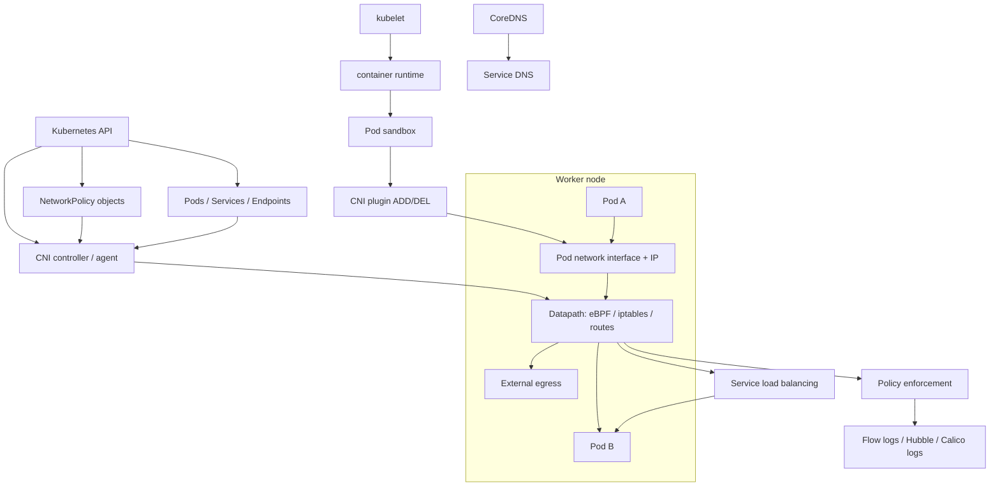

#### Границы ответственности
CNI обеспечивает datapath и может применять NetworkPolicy, но не знает бизнес-семантику сервисов. Платформа отвечает за выбор CNI, включение policy enforcement, default-deny baseline, egress strategy, observability, upgrade compatibility и проверку того, что policy действительно действует.

Команды приложений отвечают за корректные labels, описание нужных service-to-service потоков, отказ от неявной "namespace isolation" модели и тестирование connectivity после изменений.

#### Типовые рабочие паттерны
- Default-deny ingress и egress для рабочих и high-value namespaces.
- Явные allow rules для service-to-service потоков, DNS и нужного egress.
- Разделение node pools или clusters для workload'ов с разным trust level.
- Cilium/Hubble или Calico flow logs для расследования сетевых событий.
- kube-proxy replacement только после проверки совместимости с cloud load balancers, service mesh, NodePort/LoadBalancer behavior и observability.
- Egress gateway/NAT strategy для стабильной идентификации исходящего трафика.
- NetworkPolicy re-test после изменений namespace labels, pod labels, CNI version и service selectors.
- Отдельные controls для metadata endpoints и cloud control-plane endpoints.

#### Связанные файлы из проекта
- `content/platform-security/kubernetes/cluster-security-review/playbook.ru.md` / `playbook.en.md` — review service boundaries, egress и NetworkPolicy baseline.
- `content/platform-security/kubernetes/adversarial-validation/playbook.ru.md` / `playbook.en.md` — проверки namespace bypass, SSRF, NodePort exposure и фактической reachability.
- `content/platform-security/kubernetes/pod-security/playbook.ru.md` / `playbook.en.md` — pod-level controls дополняют, но не заменяют network isolation.
- `content/review/architecture/checklist.ru.md` / `checklist.en.md` — анализ trust boundaries и data flows.

### Ingress / Gateway / API Gateway

#### Для чего используется
Ingress, Gateway и API Gateway публикуют сервисы за пределы кластера или между сетевыми зонами. Они принимают client traffic, завершают TLS или передают TLS дальше, маршрутизируют запросы к Kubernetes Services, применяют authentication/authorization integrations, rate limits, WAF/API security policies, header normalization и observability.

В рабочих средах встречаются разные реализации: NGINX Ingress Controller, cloud load balancer controllers, Envoy Gateway, Kong Gateway/Kong Ingress Controller, HAProxy/Contour/Traefik и gateway-компоненты service mesh. Kubernetes Ingress остается stable API для HTTP/HTTPS routing, но его развитие заморожено; новые возможности Kubernetes networking в основном развиваются в Gateway API. Если controller реализован Istio, этот раздел описывает north-south entry point, а mesh-семантика Istio (`VirtualService`, `DestinationRule`, `PeerAuthentication`, `AuthorizationPolicy`, sidecar/ambient) рассматривается отдельно в разделе Istio.

#### Модель работы
Ingress resource описывает host/path routing к backend Service. Сам по себе Ingress не работает без Ingress Controller. Controller наблюдает Kubernetes API, выбирает Ingress objects по `ingressClassName`, генерирует конфигурацию proxy/load balancer и обеспечивает внешний endpoint через Service type `LoadBalancer`, NodePort, cloud load balancer или edge appliance.

Gateway API разделяет роли явнее. `GatewayClass` описывает тип controller. `Gateway` описывает listener'ы, addresses, ports, TLS и правила, какие Routes могут к нему подключаться. `HTTPRoute`, `GRPCRoute`, `TCPRoute`, `TLSRoute` и другие route resources описывают application-level routing. `allowedRoutes` и cross-namespace attachment model формируют trust boundary между platform team, которая владеет Gateway, и application teams, которые владеют Routes. Не путайте Kubernetes Gateway API `Gateway` с Istio `networking.istio.io/Gateway`: названия похожи, но ownership, deployment model и набор route resources отличаются.

API Gateway добавляет слой API-management: plugins/policies для auth, JWT/OIDC validation, API keys, rate limiting, request/response transformation, WAF, bot protection, schema validation, developer portals или analytics. В Kubernetes это может быть тот же controller, который читает Ingress/Gateway API resources и генерирует конфигурацию gateway data plane.

Критичные точки security review: где завершается TLS, доверяется ли `X-Forwarded-*`, кто может создавать routes для публичных hostnames, как защищены wildcard hosts, есть ли upstream mTLS, как enforced authentication, как работает WAF/rate limiting, кто может менять annotations/plugins и не обходят ли они baseline.

#### Схема взаимодействия
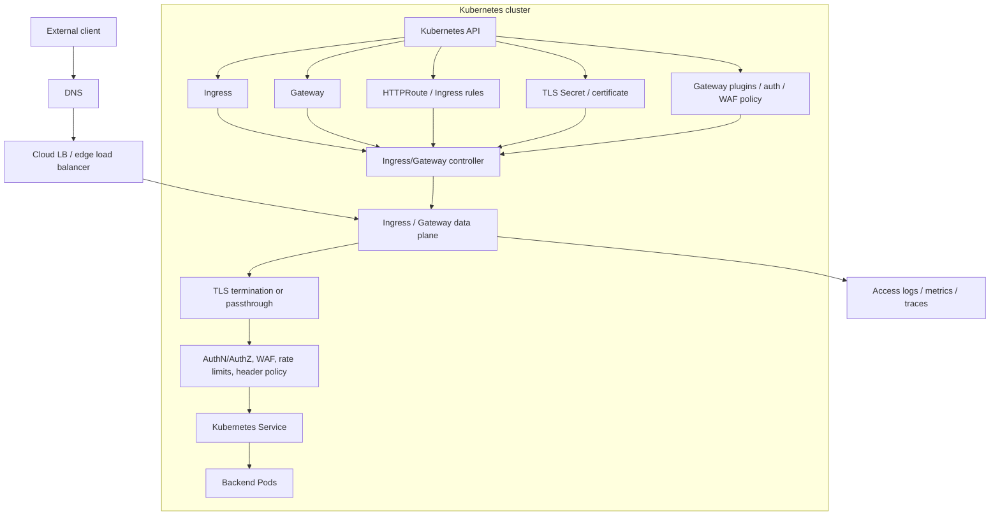

#### Границы ответственности
Ingress/Gateway слой контролирует network entry point, но не заменяет application authorization. Если gateway проверяет только наличие токена, приложение все равно должно проверять business authorization и tenant boundaries. Если TLS завершается на gateway, нужно явно решить, нужен ли mTLS или шифрование до upstream service.

Платформа отвечает за усиление защиты controller, class ownership, public exposure, certificate lifecycle, baseline annotations/plugins, default security headers, журналирование и guardrails для cross-namespace routes. Application teams отвечают за route ownership, backend readiness, корректные host/path rules и совместимость приложения с proxy headers/timeouts.

#### Типовые рабочие паттерны
- Gateway API для новых deployments, Ingress для existing workloads там, где migration еще не завершен.
- Отдельные ingress/gateway classes для public, internal и admin traffic.
- TLS termination на gateway с управляемым certificate lifecycle; upstream mTLS для sensitive backends.
- Strict policy на `X-Forwarded-*`, `Forwarded`, `Host` и client IP headers; приложение доверяет только заголовкам от approved proxy.
- WAF/API security и rate limiting на public routes.
- Запрет wildcard hosts или отдельный approval для wildcard routing.
- Cross-namespace route attachment только через явные `allowedRoutes`/ReferenceGrant и ownership rules.
- Access logs с correlation ID, request outcome, upstream service и policy decision.
- Защита controller service account: он часто может читать Secrets и менять gateway/proxy configuration.

#### Связанные файлы из проекта
- `content/platform-security/kubernetes/cluster-security-review/playbook.ru.md` / `playbook.en.md` — inventory entry points, service exposure и ownership.
- `content/platform-security/kubernetes/adversarial-validation/playbook.ru.md` / `playbook.en.md` — проверки NodePort/Ingress/Gateway reachability и SSRF/internal exposure.
- `content/application-security/web/owasp-top-10/playbook.ru.md` / `playbook.en.md` — application-layer risks за gateway.
- `content/review/architecture/checklist.ru.md` / `checklist.en.md` — trust boundaries, external integrations и подтверждения для архитектурного review.

### Istio

#### Для чего используется
Istio используется как service mesh для управления сетевым взаимодействием между сервисами: mTLS, traffic routing, retries, telemetry, authorization policies и постепенные релизы. В рабочих средах он чаще всего встречается в Kubernetes-кластерах с большим количеством внутренних сервисов и строгими требованиями к service-to-service security.

#### Модель работы
Istiod — это control plane mesh. Он принимает Kubernetes/Istio configuration, выпускает и распространяет конфигурацию для data plane, управляет service discovery и участвует в certificate distribution для mTLS. Data plane представлен Envoy proxy рядом с приложением в sidecar-модели или компонентами ambient mesh, если используется ambient-режим. В ambient mode базовый L4 secure overlay обеспечивает `ztunnel` на node, а L7-функции добавляются через waypoint proxies.

Envoy proxy перехватывает входящий и исходящий трафик workload, устанавливает mTLS, применяет routing rules, retry/timeout policy, authorization policy и собирает telemetry. Ingress gateway принимает внешний трафик в mesh, egress gateway централизует контролируемый выход из mesh во внешние системы.

Ключевые CRD задают поведение mesh. В Istio API `VirtualService` описывает маршрутизацию и traffic shifting. `DestinationRule` задает subsets, load balancing и connection policy для upstream. `Gateway` управляет точками входа/выхода в mesh. `PeerAuthentication` определяет mTLS-режим, а `AuthorizationPolicy` — кто к кому может обращаться. Отдельно Istio поддерживает Kubernetes Gateway API; в этой модели `Gateway`, `HTTPRoute` и другие route resources приходят из `gateway.networking.k8s.io`, а не из Istio API.

В связке с Kubernetes приложение остается обычным Deployment/Pod, но его трафик проходит через data plane. Istiod наблюдает за сервисами и политиками в Kubernetes API, пересчитывает конфигурацию и отправляет ее proxy. Proxy уже на пути трафика применяет mTLS, routing, policy и telemetry без изменения бизнес-кода приложения.

#### Схема взаимодействия
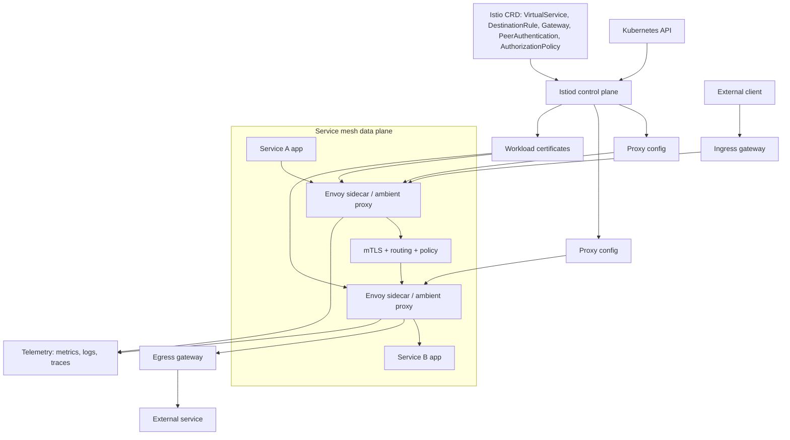

#### Границы ответственности
Istio может обеспечить mTLS между workload и централизованную mesh-policy, но не исправляет слабую аутентификацию внутри приложения и не заменяет Kubernetes RBAC, NetworkPolicy, CNI datapath policy или API security. NetworkPolicy по-прежнему нужен для L3/L4 blast-radius control и для ограничения traffic, который не должен полагаться только на mesh enrollment.

Платформа отвечает за корректный mesh onboarding, certificate lifecycle, policy model, gateway exposure и совместимость с приложениями.

#### Типовые рабочие паттерны
- Mesh только для selected namespaces, а не сразу для всего кластера.
- Strict mTLS для внутренних сервисов.
- AuthorizationPolicy для service-to-service доступа.
- Отдельные ingress/egress gateways, если north-south или outbound traffic должен проходить через контролируемые mesh edge points.
- Явное решение, какой API используется для routing: Istio `VirtualService`/`Gateway`, Kubernetes Gateway API или оба в переходный период.
- Canary/blue-green routing через VirtualService и DestinationRule.
- Интеграция telemetry с Prometheus, Grafana или OpenTelemetry.
- Постепенная миграция с sidecar на ambient mesh там, где это оправдано.

#### Связанные файлы из проекта
- `content/platform-security/kubernetes/cluster-security-review/playbook.ru.md` / `playbook.en.md` — применимо к mesh как части Kubernetes control/data plane.
- `content/platform-security/kubernetes/pod-security/playbook.ru.md` / `playbook.en.md` — sidecar/mesh workload остаются Kubernetes workload и наследуют pod security требования.
- `content/review/architecture/checklist.ru.md` / `checklist.en.md` — полезно для анализа trust boundaries и service-to-service взаимодействия.
- Прямого отдельного playbook по Istio пока нет.

### Policy Engines

#### Для чего используется
Policy engines используются для автоматической проверки и enforcement технических правил: Kubernetes admission policies, IaC checks, CI quality gates, image verification, configuration validation и governance. Типичные инструменты: OPA, Gatekeeper, Kyverno и Conftest.

#### Модель работы
OPA является general-purpose policy engine: приложение или tool передает structured input, policy code принимает решение, а enforcement point применяет результат. Conftest использует OPA/Rego для проверки structured files в CI или локально: Kubernetes manifests, Terraform plans, Helm outputs, YAML/JSON configs.

В Kubernetes policy engine обычно работает как dynamic admission controller. API Server после authentication и authorization отправляет AdmissionReview в validating или mutating webhook. Policy engine проверяет object, userInfo, namespace, labels, image references и внешний контекст там, где он поддерживается, затем разрешает, отклоняет или изменяет request до сохранения в etcd.

Gatekeeper строится вокруг constraint templates и constraints, поддерживает admission validation и audit существующих resources. Kyverno использует Kubernetes-native policy resources и поддерживает validate, mutate, generate, cleanup/delete и image verification patterns. Для rollout policies обычно используют режимы audit/dry-run/warn перед enforce, иначе можно заблокировать deploy критичных workloads из-за непроверенного правила.

CI policy и runtime admission policy решают разные задачи. CI policy проверяет proposed config до merge/deploy и дает быстрый feedback разработчику. Runtime admission policy защищает cluster от обхода CI, ручных изменений, скомпрометированных deploy-учетных данных и drift, но должна быть высокодоступной, наблюдаемой и аккуратно настроенной по failure policy.

#### Схема взаимодействия
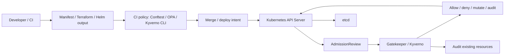

#### Границы ответственности
Policy engine принимает решения по заданным правилам, но не определяет правильную security policy сам. Команда отвечает за ownership правил, tests, rollout mode, исключения, failure behavior, versioning, observability, performance impact и соответствие правил реальным risk scenarios.

#### Типовые рабочие паттерны
- CI checks для pull requests и Terraform/Kubernetes changes.
- Admission enforcement для критичных Kubernetes controls.
- Audit mode перед enforce для новых или рискованных policies.
- Явная модель исключений с owner, reason, expiry и review.
- Policy unit tests и fixtures для known-good/known-bad manifests.
- Separate policy bundles по environment или risk tier.
- Monitoring webhook latency, denial rates, audit violations и policy engine availability.
- Image verification policies для digest, signature и attestations на рабочих workload'ах.

#### Связанные файлы из проекта
- `content/platform-security/kubernetes/cluster-security-review/playbook.ru.md` / `playbook.en.md` — admission control и cluster policy gates.
- `content/platform-security/kubernetes/pod-security/playbook.ru.md` / `playbook.en.md` — workload controls, которые можно enforcing через policy engine.
- `content/supply-chain/slsa-provenance/overview.ru.md` / `overview.en.md` — image/provenance verification перед deploy.
- Прямого отдельного playbook по policy engines пока нет.

## Identity, Secrets и Access

### Cloud IAM / Workload Identity

#### Для чего используется
Cloud IAM управляет доступом к cloud resources: compute, storage, databases, queues, KMS, secrets, networking и managed services. Workload identity связывает workload identity из runtime, например Kubernetes ServiceAccount или CI job identity, с cloud identity без хранения long-lived access keys внутри приложения или pipeline.

#### Модель работы
IAM обычно состоит из principals и policies. Principal может быть user, group, service account, managed identity, role или federated subject. Policy определяет разрешенные actions над resources и conditions, например account, project, region, tag, resource name или token claims. В AWS ключевыми объектами являются IAM users, groups, roles, policies и STS. В Google Cloud — principals/service accounts, IAM roles и allow policies. В Azure — Microsoft Entra identities, managed identities, app registrations и Azure RBAC role assignments.

Short-lived учетные данные выдаются через federation. Workload получает signed token от доверенного issuer, например Kubernetes API server или CI/CD platform. Cloud IAM проверяет OIDC issuer, audience, subject и conditions, затем выдает временный access token или role session. В Kubernetes это реализуется через cloud-specific integration: AWS IAM Roles for Service Accounts, GCP Workload Identity Federation for GKE и Microsoft Entra Workload ID for AKS.

Metadata service — отдельная важная граница. На cloud VM/node metadata endpoint может выдавать учетные данные для instance/node identity. Если pod может обратиться к metadata service и node role слишком широкая, компрометация workload превращается в lateral movement из Kubernetes в cloud control plane. Workload identity снижает этот риск, но только если node metadata access ограничен, service accounts разделены, trust policy узкая, а cloud permissions минимальны.

Trust policies должны привязываться к стабильным workload attributes, а не только к человекочитаемому имени. Для Kubernetes привязывайте issuer, audience, namespace, service account и, где provider поддерживает, cluster/project/account identity. Для CI/CD привязывайте issuer, audience, repository или immutable repository ID там, где это доступно, protected ref или environment, workflow identity и ожидаемый trigger. Wildcard subject, позволяющий любому workload в namespace, repository или organization принять live cloud role, считается production finding.

Kubernetes RBAC и cloud IAM решают разные задачи. Kubernetes RBAC управляет доступом к Kubernetes API objects. Cloud IAM управляет cloud resources вне Kubernetes. ServiceAccount с минимальным Kubernetes RBAC может иметь опасно широкие cloud permissions, и наоборот.

#### Схема взаимодействия
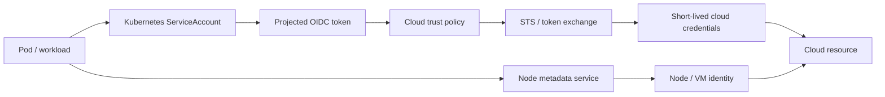

#### Границы ответственности
Cloud provider отвечает за IAM primitives, token exchange и enforcement на cloud API. Платформенная команда отвечает за identity mapping, trust policies, node metadata restrictions, least privilege, audit logs, credential lifetime, break-glass access и separation между environments. Команды приложений отвечают за выбор правильной workload identity, отсутствие embedded keys и корректную обработку token refresh.

#### Типовые рабочие паттерны
- Отдельная cloud identity на service или bounded workload group.
- Federation через OIDC вместо static cloud access keys.
- Trust policy с привязкой к issuer, audience, namespace, service account, repository, branch/tag или environment.
- Короткий lifetime для federated sessions; live deploy и runtime sessions обычно должны измеряться минутами или несколькими часами, а не днями.
- Запрет wildcard assume-role или token-exchange subjects для production identities.
- Запрет доступа workload к node metadata service, если он не нужен.
- Узкие permissions на data-plane actions, без wildcard admin policies.
- Отдельные identities для build, deploy и runtime.
- Audit по AssumeRole/token exchange, key creation, policy changes и anomalous API calls.

#### Связанные файлы из проекта
- `content/application-security/identity/oidc-oauth/playbook.ru.md` / `playbook.en.md` — OIDC concepts, token validation и trust boundaries.
- `content/platform-security/kubernetes/cluster-security-review/playbook.ru.md` / `playbook.en.md` — Kubernetes-to-cloud attack paths и cluster identity.
- `content/platform-security/secrets/vault/playbook.ru.md` / `playbook.en.md` — динамические учетные данные и secrets delivery.
- Прямого отдельного playbook по Cloud IAM / workload identity пока нет.

### Vault

#### Для чего используется
HashiCorp Vault используется для централизованного управления секретами, динамическими учетными данными, encryption-as-a-service и доступом к чувствительным материалам. В рабочих средах он часто стоит между приложениями, CI/CD, Kubernetes и внешними системами: базами данных, cloud IAM, PKI, SSH и message brokers.

#### Модель работы
Vault server принимает API-запросы, выполняет аутентификацию, проверяет policy, обращается к secret engines и пишет audit events. Storage backend хранит зашифрованное состояние Vault: конфигурацию, metadata, policies и данные secret engines. Seal/unseal защищает master key material: пока Vault sealed, он не может расшифровать хранилище и обслуживать обычные запросы.

Auth methods связывают внешнюю identity с Vault identity: Kubernetes service account, OIDC subject, AppRole, cloud IAM principal или другой источник. Policy определяет, какие paths и operations доступны. Token является результатом аутентификации и несет набор policy. Lease задает срок жизни выданного секрета или credential и позволяет Vault отзывать или обновлять его.

Secret engines выполняют конкретную работу. KV хранит статические secrets. Database engine выдает динамические учетные данные database. PKI engine выпускает сертификаты. Transit engine выполняет криптографические операции без раскрытия ключевого материала клиенту. Audit devices записывают запросы и ответы в audit log с маскированием чувствительных значений.

Обычный поток такой: workload аутентифицируется через auth method, получает token с ограниченной policy, обращается к path secret engine, а Vault возвращает секрет, динамический credential или результат криптографической операции. Если секрет leased, Vault отслеживает срок жизни и может выполнить renew или revoke.

#### Схема взаимодействия
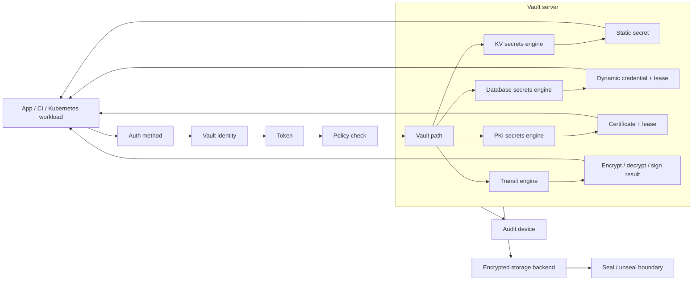

#### Границы ответственности
Vault защищает выдачу и lifecycle секретов, но не делает безопасным любое приложение, которое эти секреты получает. Команды отвечают за минимальные policies, короткие TTL, audit logs, ротацию, безопасную доставку секретов в runtime, защиту root/admin tokens и отказ от долгоживущих статических секретов там, где возможны динамические.

#### Типовые рабочие паттерны
- HA Vault cluster.
- Auto-unseal через cloud KMS или HSM.
- Kubernetes auth method для workload.
- Динамические учетные данные database.
- PKI engine для internal certificates.
- External Secrets Operator или Vault Agent Injector.
- Централизованные audit devices.
- Разделение namespace, mount и policy по командам и средам.

#### Связанные файлы из проекта
- `content/platform-security/secrets/vault/playbook.ru.md` / `playbook.en.md` — основной playbook по Vault, policies, auth methods, audit и операционному усилению защиты.
- `content/platform-security/kubernetes/cluster-security-review/playbook.ru.md` / `playbook.en.md` — если Vault интегрирован с Kubernetes auth или secret delivery.
- `content/review/architecture/checklist.ru.md` / `checklist.en.md` — полезно для анализа trust boundaries вокруг секретов.

## Automation и Configuration Management

### Ansible

#### Для чего используется
Ansible используется для configuration management, provisioning, автоматизации инфраструктурных операций и оркестрации изменений на серверах, сетевых устройствах и платформах. В рабочих средах он часто встречается в bootstrap-процессах, усилении защиты, patch management, настройке middleware и операционных runbook.

#### Модель работы
Inventory описывает managed nodes и группирует их по средам, ролям или другим признакам. Playbook задает последовательность plays: на какие hosts идти, с какими variables, какие tasks выполнить и с какими privilege escalation настройками. Task вызывает module, а module выполняет конкретное действие: устанавливает пакет, меняет файл, управляет service, создает пользователя или обращается к API.

Role упаковывает повторно используемые tasks, handlers, templates, defaults и files. Variables параметризуют поведение playbook и role для разных окружений. Facts — данные, собранные с managed node, например OS, network interfaces, mounts и package state. Collections поставляют модули, plugins и роли как распространяемые пакеты. Ansible Vault шифрует чувствительные переменные или файлы, если секреты хранятся рядом с playbooks.

Control node выполняет playbook против managed nodes, обычно через SSH или WinRM. Ansible копирует или вызывает module на целевой системе, получает результат и переходит к следующему task. Handlers выполняются при изменениях, например перезапускают service после изменения конфигурации.

В связке с инфраструктурой Ansible часто подготавливает hosts до подключения к Kubernetes, Kafka, RabbitMQ или Vault: ставит пакеты, раскладывает конфигурацию, управляет service units и применяет базовое усиление защиты.

#### Схема взаимодействия
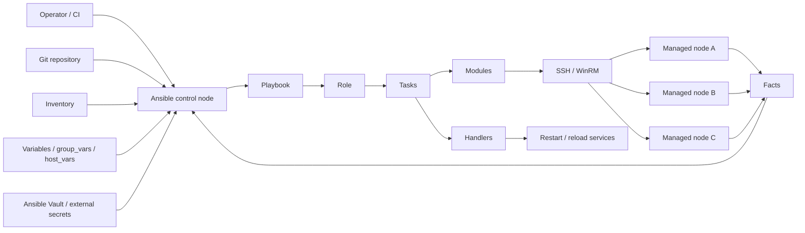

#### Границы ответственности
Ansible применяет описанные изменения, но не гарантирует, что playbook безопасен. Команда отвечает за контроль доступа к control node, секреты в inventory/vars, review изменений, idempotency, ограничение blast radius, безопасные privilege escalation настройки и воспроизводимость запусков.

Ошибка в playbook может массово распространить небезопасную конфигурацию.

#### Типовые рабочие паттерны
- Git-hosted playbooks с review.
- Разделение inventory по средам.
- Ansible Vault или внешний secrets manager для чувствительных переменных.
- Запуск через AWX/Automation Controller или CI с audit trail.
- Ограничение `become` и SSH-доступа.
- Dry-run/check mode для рискованных изменений.
- Роли для базового усиления защиты и patch management.

#### Связанные файлы из проекта
- `content/review/architecture/checklist.ru.md` / `checklist.en.md` — применимо к change management, privileged automation и trust boundaries.
- `content/platform-security/secrets/vault/playbook.ru.md` / `playbook.en.md` — если Ansible получает секреты из Vault или хранит чувствительные переменные.
- Прямого отдельного playbook по Ansible пока нет.

### Terraform / OpenTofu

#### Для чего используется
Terraform и OpenTofu используются для Infrastructure as Code: описания, создания и изменения cloud-ресурсов, Kubernetes-объектов, IAM policies, DNS-записей, управляемых баз данных, сетевых компонентов и SaaS-конфигурации через декларативный код. В рабочих средах они часто являются основным механизмом изменения production-инфраструктуры, поэтому их нужно рассматривать как привилегированную автоматизацию, а не как обычный репозиторий с конфигурацией.

#### Модель работы
Configuration описывает desired state через resources, data sources, variables, outputs, providers и modules. Provider знает API конкретной платформы: cloud, Kubernetes, Vault, DNS, monitoring или SaaS. CLI строит dependency graph, читает текущее состояние из state, формирует plan, а затем apply вызывает provider operations, чтобы привести инфраструктуру к нужному состоянию.

State связывает configuration с реальными remote objects и содержит атрибуты созданных ресурсов. Это критичный артефакт: state часто включает internal identifiers, connection strings, сгенерированные пароли, private endpoints, IAM bindings и другие чувствительные значения, даже если переменные помечены как sensitive. Remote backend нужен не только для совместной работы, но и для контроля доступа, аудита, шифрования и locking. Locking защищает от параллельных apply, которые могут повредить state или создать конфликтующие изменения.

Modules дают повторное использование, но создают supply-chain границу. Public modules, provider versions и transitive module sources должны быть pinned и проходить ревью так же, как application dependencies. Plan является важным артефактом ревью, но не абсолютной гарантией: drift, изменения вне IaC, provider behavior и data sources могут изменить итоговый apply.

В рабочих средах Terraform/OpenTofu обычно запускается из CI/CD или специализированной платформы, а не с ноутбука оператора. Pipeline получает short-lived учетные данные через OIDC/workload identity, строит plan, сохраняет его как подтверждение, проходит approval и применяет изменения с ограниченной role. Ручной apply допустим только как break-glass процесс с audit trail и последующей синхронизацией state.

#### Схема взаимодействия
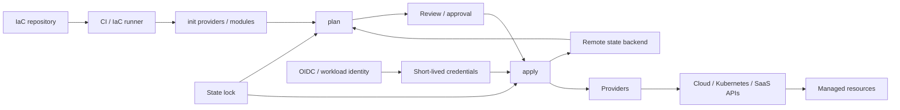

#### Границы ответственности
Terraform/OpenTofu применяет изменения инфраструктуры, но не решает, безопасна ли сама архитектура. Команда отвечает за ревью модулей, provider pinning, безопасность remote state, separation of duties, учетные данные с минимально необходимыми привилегиями, drift detection, plan/apply approvals, policy-as-code gates и восстановимость state.

State backend должен считаться high-value хранилищем. Доступ к нему часто эквивалентен доступу к topology, IAM bindings и секретам инфраструктуры.

#### Типовые рабочие паттерны
- Remote state backend с encryption, access control, audit logs, backup/versioning и locking.
- Раздельные state/workspaces или backends для сред, accounts, blast-radius зон и ownership domains.
- Plan в pull request или change request; apply только после approval.
- Short-lived cloud учетные данные через OIDC/workload identity вместо long-lived access keys.
- Provider и module versions pinned; external module sources проходят review.
- Policy-as-code для запрета public exposure, broad IAM, нешифрованных хранилищ и небезопасных Kubernetes resources.
- Drift detection и import workflow для ресурсов, измененных вне IaC.
- Запрет хранения plaintext secrets в variables, outputs, state-sharing outputs и CI logs.

#### Связанные файлы из проекта
- `content/review/architecture/checklist.ru.md` / `checklist.en.md` — применимо к trust boundaries, data flows и изменению архитектуры через IaC.
- `content/review/release-governance/playbook.ru.md` / `playbook.en.md` — approvals, релизные подтверждения и separation of duties для инфраструктурных изменений.
- `content/application-security/identity/oidc-oauth/playbook.ru.md` / `playbook.en.md` — OIDC federation для CI/CD и workload identity.
- `content/platform-security/secrets/vault/playbook.ru.md` / `playbook.en.md` — если Terraform/OpenTofu получает учетные данные или secrets из Vault.
- Прямого отдельного playbook по Terraform/OpenTofu пока нет.

## Data Stores, Search и Messaging

### Object Storage

#### Для чего используется
Object storage используется для хранения файлов и blobs: user uploads, backups, logs, artifacts, data lake objects, static assets, ML datasets и exports. Типичные реализации: Amazon S3, Google Cloud Storage, Azure Blob Storage и S3-compatible systems вроде MinIO.

#### Модель работы
Bucket или container является верхним контейнером хранения. Object хранит content, metadata, key/name и версии, если versioning включен. Prefix не является настоящей директорией в большинстве object storage систем, но используется как namespace convention для группировки objects, lifecycle policies и IAM conditions.

Доступ управляется комбинацией IAM policies, bucket/container policies, ACL или legacy access models. В рабочих средах предпочтительна централизованная IAM/policy-модель с запретом public access по умолчанию; ACL стоит использовать только там, где они действительно нужны и понятны. Signed URLs, presigned URLs и SAS tokens дают ограниченный по времени доступ к upload/download без выдачи пользователю cloud-учетных данных. Такой URL сам становится bearer credential до истечения срока или отзыва signing credential.

Encryption может быть provider-managed, customer-managed через KMS или client-side. Versioning, retention, soft delete и object lock/immutability помогают защищаться от accidental deletion, ransomware и destructive insider actions, но увеличивают стоимость и требуют lifecycle management. Access logs и cloud audit logs нужны для расследований: кто читал, писал, удалял или менял policy.

#### Схема взаимодействия
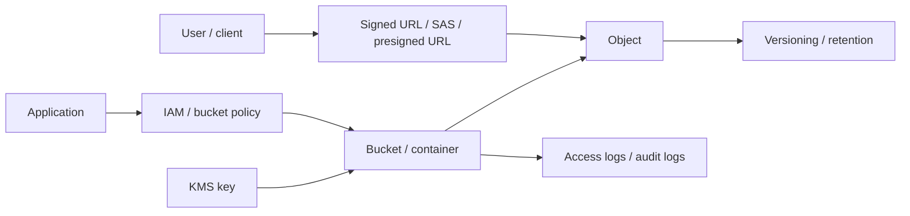

#### Границы ответственности
Object storage надежно хранит objects и применяет access policy, но не понимает бизнес-семантику данных. Команда отвечает за bucket ownership, public exposure, object naming, signed URL scope/lifetime, malware scanning для uploads, encryption/KMS policy, lifecycle, retention, backup restore tests и защиту sensitive data в logs/artifacts.

#### Типовые рабочие паттерны
- Private buckets/containers по умолчанию и явный процесс исключений для public access.
- Separate buckets по environment, data sensitivity или ownership domain.
- Presigned upload/download с коротким TTL и ограниченным method/object key.
- Server-side encryption с KMS для sensitive данных.
- Versioning/soft delete/retention для backups и critical artifacts.
- Object lock или immutable retention для compliance archives и ransomware-resistant backups.
- Access logs/audit logs с отдельным write-only destination.
- Lifecycle policies для old versions, incomplete uploads и temporary exports.

#### Связанные файлы из проекта
- `content/review/architecture/checklist.ru.md` / `checklist.en.md` — data flows, trust boundaries и storage exposure.
- `content/supply-chain/slsa-provenance/overview.ru.md` / `overview.en.md` — artifacts, SBOM и provenance storage.
- Прямого отдельного playbook по object storage пока нет.

### PostgreSQL / Relational Databases

#### Для чего используется
PostgreSQL и другие relational databases используются для transactional state, accounts, orders, billing, authorization data, audit records и других данных, где важны consistency, relational integrity и query flexibility.

#### Модель работы
Database содержит schemas, tables, indexes, views, functions и roles. Schema группирует database objects и часто используется для разделения domains или tenants, хотя сама по себе не заменяет access control. Role может быть login role для подключения или group role для выдачи privileges. Privileges задают, кто может подключаться, читать, писать, менять schema, запускать functions или управлять objects.

Connection pooling снижает нагрузку на database и управляет количеством active connections. В рабочих средах часто используются PgBouncer или managed poolers; важно понимать режим pooling, потому что transaction/session pooling влияет на prepared statements, temp tables, session variables и role switching. Migrations меняют schema и должны быть versioned, reviewed, reversible where practical и совместимы с rolling deploy.

Row-level security может ограничивать строки на уровне database policy и полезна для tenant isolation, но требует строгой модели ownership, тестов bypass-сценариев и контроля privileged roles. Backups и point-in-time recovery опираются на base backups и WAL/archive logs. Read replicas разгружают reads и помогают recovery, но создают отдельные риски доступа к тем же данным и lag-sensitive logic.

Extensions, superuser-like privileges и procedural languages расширяют возможности database, но увеличивают blast radius. Audit должен покрывать privileged actions, DDL, auth failures и доступ к sensitive tables там, где это требуется.

#### Границы ответственности
Database engine обеспечивает storage, transactions, privileges и replication primitives. Команда отвечает за schema ownership, least-privilege roles, secret rotation, migration safety, backup restore tests, encryption, network exposure, audit, tenant isolation и защиту sensitive data в queries, dumps и replicas.

#### Типовые рабочие паттерны
- Managed PostgreSQL с private networking.
- Separate app roles для read/write, migrations и admin operations.
- Connection pooling с явно выбранным режимом.
- Backups с регулярными restore drills и измеренным RPO/RTO.
- PITR для critical transactional systems.
- Read replicas с отдельными access policies.
- RLS для high-risk multi-tenant tables после отдельного threat model.
- Журналирование аудита для privileged operations и sensitive data access.

#### Связанные файлы из проекта
- `content/review/architecture/checklist.ru.md` / `checklist.en.md` — data classification, tenant isolation и trust boundaries.
- `content/application-security/business-logic/business-logic-abuse/playbook.ru.md` / `playbook.en.md` — integrity-sensitive flows и abuse cases.
- Прямого отдельного playbook по database security пока нет.

### Redis

#### Для чего используется
Redis используется как cache, session store, rate-limit store, lightweight queue, distributed lock backend и fast key-value database. В рабочих средах Redis часто находится на критическом пути authentication, authorization decisions, shopping carts, background jobs и anti-abuse controls.

#### Модель работы
Redis хранит keys разных типов: strings, hashes, lists, sets, sorted sets, streams и другие structures. Данные обычно находятся в memory, а persistence настраивается через RDB snapshots, AOF или их комбинацию. Replication и clustering используются для availability и scale, но требуют понимания consistency, failover и key distribution.

AUTH и ACL ограничивают доступ клиентов к commands и key patterns. TLS защищает network traffic. Dangerous commands, например administrative, persistence-changing, scripting или bulk key operations, могут привести к data loss, credential exposure, DoS или обходу tenant boundaries, если доступны приложению без необходимости.

Eviction policy определяет, какие keys будут удаляться при memory pressure. Для cache это нормальное поведение, для session store или queue usage — потенциальный incident. Multi-tenant Redis требует особенно строгого key namespace, ACL, memory quotas и operational separation; часто надежнее использовать отдельные instances для разных trust domains.

#### Границы ответственности
Redis дает быстрый in-memory data store и primitives для persistence/replication, но не гарантирует безопасную семантику cache, session или lock logic. Команда отвечает за network isolation, AUTH/ACL/TLS, command restrictions, key namespace, memory limits, eviction behavior, backups where needed, monitoring и защиту secrets/PII в values.

#### Типовые рабочие паттерны
- Managed Redis или isolated private deployment.
- TLS и ACL с отдельными users для приложений и operations.
- Запрет dangerous commands для app users.
- Separate instances для cache, sessions, queues и rate limiting.
- Явные TTL для cache/session keys.
- Memory limits и eviction policy, соответствующие назначению.
- Monitoring memory, evictions, blocked clients, replication lag и command latency.

#### Связанные файлы из проекта
- `content/application-security/business-logic/business-logic-abuse/playbook.ru.md` / `playbook.en.md` — rate limits, sessions и abuse controls.
- `content/review/architecture/checklist.ru.md` / `checklist.en.md` — state management и data flow review.
- Прямого отдельного playbook по Redis пока нет.

### Векторная БД / Vector DB

#### Для чего используется
Векторная БД хранит embeddings и выполняет similarity search по векторам. В рабочих средах она чаще всего используется для RAG, semantic search, рекомендаций, deduplication, anomaly detection и других сценариев, где нужно искать не точное совпадение, а близость по смыслу или признакам.

#### Модель работы
Embedding model преобразует текст, изображение, событие или другой объект в vector embedding — числовое представление фиксированной размерности. Векторная БД хранит embedding, object ID, metadata и, в некоторых архитектурах, ссылку на исходный документ или chunk. При запросе приложение строит embedding для query и ищет nearest neighbors по similarity metric, например cosine similarity, dot product или Euclidean distance.

Index ускоряет поиск, часто с approximate nearest neighbor algorithms. Это создает важный tradeoff: latency и cost улучшаются за счет допустимой approximation, поэтому качество retrieval нужно измерять отдельно, а не считать свойством БД по умолчанию. Metadata filters ограничивают выдачу по tenant, document class, source, ACL или другим атрибутам; в RAG они должны быть частью authorization model, а не только удобным search-фильтром.

Векторная БД обычно не заменяет source-of-truth storage. Исходные документы, permissions, lifecycle и deletion workflow часто живут в object storage, database или document store, а vector index является производным представлением. При обновлении или удалении исходного документа нужно обновить embeddings, metadata и search index; иначе stale retrieval может вернуть данные, которые уже недоступны или удалены по policy.

#### Границы ответственности
Векторная БД обеспечивает хранение embeddings и retrieval по similarity, но не гарантирует корректную authorization semantics, качество источников данных или безопасность извлеченного контекста. Команда отвечает за tenant isolation, document-level authorization, metadata integrity, ingestion validation, deletion propagation, encryption, backups, audit logs, monitoring и защиту от poisoned corpus, утечек через embeddings и unbounded retrieval.

#### Типовые рабочие паттерны
- Separate indexes или namespaces по tenant, environment и sensitivity там, где shared index усложняет isolation.
- Permission-aware retrieval: фильтры доступа применяются до выдачи контекста модели.
- Metadata schema с owner, source, classification, tenant, document version и deletion state.
- Ingestion pipeline с validation, malware/content checks, provenance и deduplication.
- Retrieval limits: `top_k`, score threshold, payload size limit и rate limits.
- Набор evaluation-тестов для retrieval quality и утечек перед изменениями в рабочих средах.
- Журналирование аудита для queries, retrieved document IDs, metadata filters и administrative changes.
- Регулярная пересборка/очистка index после document deletion, permission changes и embedding model upgrades.

#### Связанные файлы из проекта
- `content/ai-security/securing-ai/overview.ru.md` / `overview.en.md` — LLMSecOps lifecycle, RAG data pipeline и controls для векторной БД.
- `content/ai-security/owasp-llm-top-10/overview.ru.md` / `overview.en.md` — LLM08 Vector and Embedding Weaknesses.
- Прямого отдельного playbook по безопасности векторных БД пока нет.

### Elasticsearch / OpenSearch

#### Для чего используется
Elasticsearch и OpenSearch используются для search, log analytics, observability, security analytics и document indexing. В рабочих средах они часто хранят application logs, audit events, customer-visible search indexes и operational telemetry.

#### Модель работы
Cluster состоит из nodes и хранит indexes. Index содержит documents и mapping, который описывает fields и types. Shards делят index для scale и replication. Ingest pipeline может преобразовывать documents перед записью: парсить logs, добавлять fields, нормализовать events или удалять часть данных.

Доступ может задаваться на уровне cluster, index, document и field в зависимости от distribution, edition и configuration. Dashboards/OpenSearch Dashboards/Kibana дают UI для поиска и визуализации, но при неправильной экспозиции становятся прямым окном в logs, PII, tokens и internal infrastructure data.

Snapshot repositories используются для backup/restore и migration. Они часто лежат в object storage, поэтому их IAM и retention так же важны, как и permissions самого cluster. Logs и traces нужно считать sensitive data: они могут содержать authorization headers, session IDs, emails, payload fragments, stack traces и internal hostnames.

#### Границы ответственности
Search cluster индексирует и ищет documents, но не определяет, какие данные безопасно логировать и кому их можно видеть. Команда отвечает за network exposure, authentication, authorization, tenant/index isolation, field masking, ingest redaction, dashboard access, snapshot security, retention и cost/cardinality controls.

#### Типовые рабочие паттерны
- Managed or dedicated cluster в private network.
- Separate indexes или clusters для environments и sensitivity levels.
- Index lifecycle management для retention и cost control.
- Ingest redaction для secrets, tokens и PII.
- Least-privilege dashboard roles.
- Snapshot repository с restricted IAM и restore drills.
- Alerting на auth failures, public exposure, disk watermarks и ingestion spikes.

#### Связанные файлы из проекта
- `content/review/architecture/checklist.ru.md` / `checklist.en.md` — sensitive data flows и observability surfaces.
- `content/application-security/web/browser-security/playbook.ru.md` / `playbook.en.md` — если frontend logs/telemetry содержат browser-side data.
- Прямого отдельного playbook по Elasticsearch/OpenSearch пока нет.

### Kafka

#### Для чего используется
Apache Kafka используется как distributed event streaming platform: event bus, ingestion pipeline, audit/event log, integration backbone, stream processing source и буфер между сервисами. В рабочих средах Kafka часто является критичной shared-платформой, через которую проходят бизнес-события, telemetry и интеграции.

#### Модель работы
Broker хранит данные topic partitions и обслуживает producers/consumers. Topic — логическая категория событий, например `orders.created`. Partition — упорядоченный append-only log внутри topic; именно partition дает масштабирование и параллелизм. Replica — копия partition на другом broker для отказоустойчивости. Controller управляет metadata кластера, leader election для partitions и изменениями состояния.

Producer публикует records в topic, выбирая partition явно или через partitioner. Consumer читает records из partitions и продвигает offset — позицию чтения. Consumer group позволяет нескольким экземплярам одного приложения разделить partitions между собой: одна partition в рамках group читается только одним consumer instance в момент времени. Это дает горизонтальное масштабирование обработки.

Schema Registry хранит схемы событий и помогает контролировать совместимость producer и consumer контрактов. Kafka Connect запускает connectors для интеграции Kafka с базами данных, object storage, search engines и другими системами. ACL описывают, кто может читать, писать, создавать или администрировать topics, groups и cluster resources.

Актуальные Kafka `4.x` clusters работают в KRaft mode без ZooKeeper; старые `3.x` clusters могут сохранять ZooKeeper на время migration. В рабочем потоке producer отправляет событие broker leader для partition, broker записывает его в log и реплицирует followers, consumer group читает события и фиксирует offsets, а downstream-сервисы используют эти события для обработки, интеграции или аналитики.

#### Схема взаимодействия
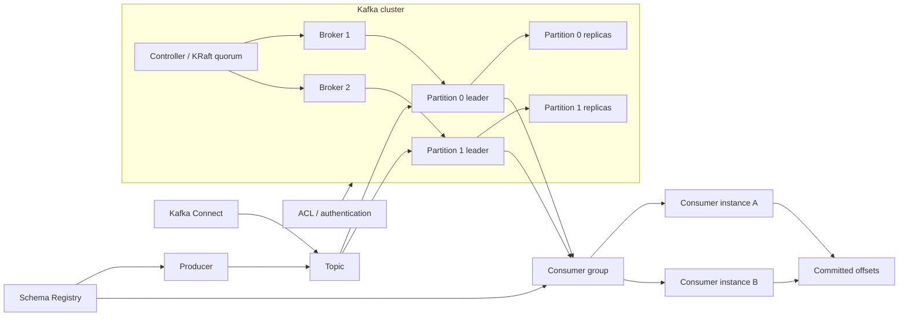

#### Границы ответственности
Kafka обеспечивает доставку, хранение и репликацию событий, но не решает семантику доступа к данным за приложение. Команды отвечают за topic ownership, ACL, tenant isolation, encryption in transit, retention, schema governance, защиту PII/secrets в событиях и корректную обработку повторной доставки.

Kafka не гарантирует, что consumer безопасно интерпретирует сообщение.

#### Типовые рабочие паттерны
- Managed Kafka или выделенный platform cluster; для self-managed Kafka `4.x` явно эксплуатируйте KRaft quorum и считайте любую оставшуюся зависимость от ZooKeeper legacy migration scope.
- TLS для client-broker и inter-broker traffic.
- SASL, OAuth или mTLS для аутентификации.
- ACL по topic и group.
- Schema Registry для контрактов.
- Separate clusters или prefixes для сред и доменов.
- Kafka Connect с отдельной моделью секретов.
- Monitoring lag, under-replicated partitions, auth failures и retention pressure.

#### Связанные файлы из проекта
- `content/review/architecture/checklist.ru.md` / `checklist.en.md` — применимо к event-driven архитектуре, trust boundaries и data flow review.
- `content/platform-security/secrets/vault/playbook.ru.md` / `playbook.en.md` — если учетные данные, certificates или connector secrets выдаются через Vault.
- Прямого отдельного playbook по Kafka пока нет.

### RabbitMQ

#### Для чего используется
RabbitMQ используется как message broker для очередей, routing, asynchronous processing, task distribution и интеграции сервисов. В рабочих средах он часто встречается в background jobs, transactional messaging, integration queues и системах, где важны routing semantics, acknowledgements и backpressure.

#### Модель работы
Broker принимает сообщения, хранит очереди и доставляет сообщения consumers. Virtual host разделяет логическое пространство RabbitMQ: exchanges, queues, bindings, users permissions и policies живут внутри vhost. Exchange принимает публикации от producers и решает, в какие queues направить message. Queue хранит сообщения до чтения consumer. Binding связывает exchange и queue с routing rule.

Routing key используется exchange для выбора подходящих bindings. Direct exchange маршрутизирует по точному routing key, topic exchange — по шаблонам, fanout — во все связанные queues, headers — по headers сообщения. Consumer читает message из queue и отправляет acknowledgement после успешной обработки. Если ack не получен, broker может вернуть сообщение в очередь или отправить его по dead-letter topology в зависимости от настроек.

Policy задает поведение queues и exchanges: TTL, max length, dead-letter exchange, quorum settings и другие параметры. User/permission определяет, какие operations разрешены внутри vhost: configure, write и read.

Рабочий поток выглядит так: producer публикует message в exchange, exchange по routing key и bindings выбирает queue, broker хранит message, consumer забирает его и подтверждает обработку. Если обработка неуспешна или сообщение просрочено, DLX/retry topology решает, будет ли оно повторено, отложено или отправлено в dead-letter queue.

#### Схема взаимодействия
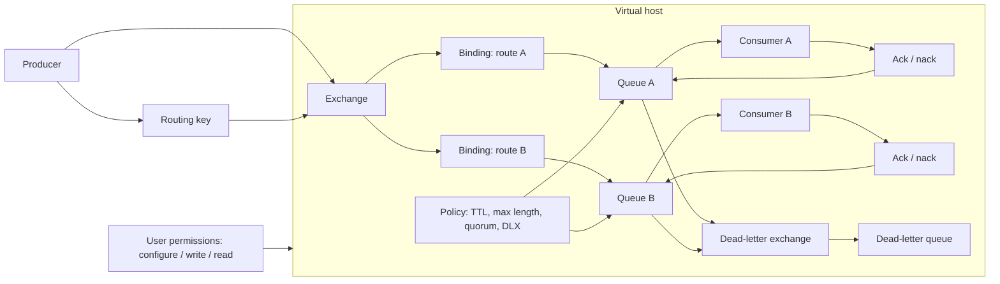

#### Границы ответственности
RabbitMQ отвечает за брокерскую доставку и routing, но не за безопасность содержимого сообщений и бизнес-семантику обработки. Команда отвечает за TLS, users/permissions, vhost isolation, queue policies, DLQ, TTL, ограничение management UI, защиту учетных данных и контроль payload, особенно если сообщения содержат персональные данные или команды для внутренних систем.

#### Типовые рабочие паттерны
- Clustered RabbitMQ с quorum queues для критичных очередей; не проектируйте новые HA paths на classic mirrored queues, которые удалены в RabbitMQ `4.x`.
- Отдельные vhosts для доменов, сред или команд.
- TLS для client connections.
- Least-privilege permissions на exchanges и queues.
- DLQ и retry topology.
- Policies для TTL, max length и quorum settings.
- Ограниченный доступ к management UI.
- Monitoring queue depth, consumer count, unacked messages и publish/ack rates.

#### Связанные файлы из проекта
- `content/review/architecture/checklist.ru.md` / `checklist.en.md` — применимо к asynchronous flows, trust boundaries и обработке сообщений.
- `content/platform-security/secrets/vault/playbook.ru.md` / `playbook.en.md` — если учетные данные broker или TLS materials управляются через Vault.
- Прямого отдельного playbook по RabbitMQ пока нет.
---

## Связанные материалы

- [Плейбук безопасности container images](../../content/supply-chain/container-image-security/playbook.ru.md)
- [Плейбук ревью безопасности Kubernetes-кластера](../../content/platform-security/kubernetes/cluster-security-review/playbook.ru.md)
- [Плейбук Vault](../../content/platform-security/secrets/vault/playbook.ru.md)
- [Обзор безопасности AI](../../content/ai-security/securing-ai/overview.ru.md)
