# Справочник инфраструктурных технологий

Этот документ описывает, как работают ключевые технологии, которые часто встречаются в рабочей инфраструктуре и при проверке ее безопасности. Он не заменяет плейбуки: здесь фокус на назначении, модели работы, границах ответственности и типовых эксплуатационных паттернах.

Разделы сгруппированы по роли технологии в рабочей системе: сборка и цепочка поставки ПО, контейнерная платформа, учетные записи и секреты, автоматизация, хранилища данных и обмен сообщениями.

## Оглавление

- [Сборка, доставка и цепочка поставки](#сборка-доставка-и-цепочка-поставки)
  - [Платформы CI/CD](#платформы-cicd)
  - [Docker](#docker)
  - [Реестр OCI и артефактов](#реестр-oci-и-артефактов)
  - [Helm](#helm)
  - [GitOps / Argo CD / Flux](#gitops--argo-cd--flux)
- [Контейнерная платформа и среда выполнения Kubernetes](#контейнерная-платформа-и-среда-выполнения-kubernetes)
  - [Среды выполнения контейнеров](#среды-выполнения-контейнеров-container-runtimes)
  - [Kubernetes](#kubernetes)
  - [CNI и сеть Kubernetes](#cni-и-сеть-kubernetes)
  - [Ingress / Gateway / API Gateway](#ingress--gateway--api-gateway)
  - [Istio](#istio)
  - [Механизмы политик](#механизмы-политик)
- [Учетные записи, секреты и доступ](#учетные-записи-секреты-и-доступ)
  - [Облачный IAM и идентификация рабочих нагрузок](#облачный-iam-и-идентификация-рабочих-нагрузок)
  - [Vault](#vault)
  - [PKI / cert-manager](#pki--cert-manager)
  - [KMS / HSM](#kms--hsm)
- [Автоматизация и управление конфигурацией](#автоматизация-и-управление-конфигурацией)
  - [Ansible](#ansible)
  - [Terraform / OpenTofu](#terraform--opentofu)
- [Хранилища данных, поиск и обмен сообщениями](#хранилища-данных-поиск-и-обмен-сообщениями)
  - [Объектное хранилище](#объектное-хранилище)
  - [PostgreSQL и реляционные базы данных](#postgresql-и-реляционные-базы-данных)
  - [Redis](#redis)
  - [Векторная база данных](#векторная-база-данных)
  - [Elasticsearch / OpenSearch](#elasticsearch--opensearch)
  - [Kafka](#kafka)
  - [RabbitMQ](#rabbitmq)
- [Связанные материалы](#связанные-материалы)

## Сборка, доставка и цепочка поставки

### Платформы CI/CD

#### Для чего используется
Платформы CI/CD собирают, тестируют, упаковывают, публикуют и развертывают программные артефакты. Типичные примеры: GitHub Actions, GitLab CI, Jenkins, Buildkite и TeamCity. В рабочей инфраструктуре это центральная часть цепочки поставки ПО: конвейер получает доступ к исходному коду, секретам, реестрам пакетов, облачным учетным записям, артефактам и средам развертывания.

#### Модель работы
Конвейер описывает последовательность заданий. Исполнитель или агент выполняет шаги задания: получение исходного кода, установку зависимостей, тесты, проверки безопасности, сборку, загрузку артефакта, публикацию образа и развертывание. Исполнитель может быть управляемым поставщиком CI/CD или собственным, размещенным в сети, облачной учетной записи или кластере Kubernetes команды.

Артефакты передают результаты сборки между заданиями и этапами. Кеш ускоряет повторные сборки, сохраняя зависимости и промежуточные результаты. Среда задает целевое окружение, например `staging` или `prod`, и правила защиты: обязательные согласования, задержки перед запуском, ограничения веток и тегов, доступные в этой среде секреты. Хранилище секретов содержит токены, пароли, сертификаты и ключи подписи, доступные конвейеру при выполнении заданий.

Современная схема использует федерацию OIDC вместо долгоживущих статических секретов. Платформа CI/CD выпускает краткоживущий токен OIDC для конкретного задания или процесса с утверждениями о репозитории, ветке или теге, конвейере, среде и инициаторе. Облачный поставщик или Vault проверяет `issuer`, `audience`, `subject` и дополнительные утверждения, затем выдает временные учетные данные с ограниченными правами.

Конвейер развертывания не должен быть единственной точкой доверия. Конвейер собирает и публикует артефакт, а проверка допуска отдельно сверяет дайджест, подпись, происхождение, результат политики, согласование среды и допустимость релиза. Граница обычно проходит при передаче неизменяемого артефакта и запроса развертывания в Kubernetes, контроллер GitOps, оркестратор выпуска или облачный сервис развертывания.

Входные данные конвейера из недоверенных источников образуют отдельную границу доверия. Заголовки и содержимое запросов на слияние, комментарии к задачам, имена веток и тегов, примечания к выпуску, сообщения коммитов и код сторонних копий репозитория считаются подконтрольными атакующему при передаче в скрипты оболочки, команды развертывания, примечания к выпуску, шаги с ИИ или входные данные политик.

#### Схема взаимодействия
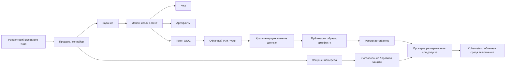
```mermaid
flowchart LR
  Repo["Репозиторий исходного кода"] --> Pipeline["Процесс / конвейер"]
  Pipeline --> Job["Задание"]
  Job --> Runner["Исполнитель / агент"]
  Runner --> Cache["Кеш"]
  Runner --> Artifacts["Артефакты"]
  Runner --> OIDC["Токен OIDC"]
  OIDC --> Cloud["Облачный IAM / Vault"]
  Cloud --> TempCreds["Краткоживущие учетные данные"]
  TempCreds --> Publish["Публикация образа / артефакта"]
  Publish --> Registry["Реестр артефактов"]
  Pipeline --> Env["Защищенная среда"]
  Env --> Approval["Согласование / правила защиты"]
  Approval --> DeployGate["Проверка развертывания или допуска"]
  Registry --> DeployGate
  DeployGate --> Runtime["Kubernetes / облачная среда выполнения"]
```

#### Границы ответственности
Платформа CI/CD запускает автоматизацию и предоставляет механизмы работы с секретами, исполнителями, артефактами, согласованиями и федерацией идентичностей, но не гарантирует безопасность конвейера. Команда отвечает за минимальные разрешения заданий, доверенные компоненты автоматизации и плагины, изоляцию собственных исполнителей, защиту веток, тегов и сред, секреты, защиту от отравления кеша, целостность артефактов и разделение ролей сборки и развертывания.

Управляемые исполнители снижают нагрузку на эксплуатацию и обычно предоставляют чистую одноразовую среду. Собственные исполнители нужны для закрытых сетей, специализированного оборудования или обязательных требований, но требуют усиления защиты, очистки, контроля исходящих соединений, обновлений и защиты от сохранения присутствия атакующего между заданиями.

#### Типовые рабочие паттерны
- Защищенные ветки и теги, используемые для выпуска.
- Обязательное согласование развертывания в рабочую среду.
- Федерация OIDC с облачным поставщиком или Vault вместо статических секретов развертывания.
- Привязка доверия OIDC к `issuer`, `audience`, защищенной ветке, тегу или среде, идентичности процесса и репозитория. Широкое доверие всей организации не должно быть настройкой по умолчанию для развертывания в рабочую среду.
- Отдельные исполнители для доверенных и недоверенных рабочих нагрузок.
- Одноразовые собственные исполнители для сборок запросов на слияние с недоверенным кодом.
- Отсутствие секретов рабочей среды, ключей подписи и учетных данных развертывания на исполнителях недоверенного кода из сторонней копии репозитория или ветки.
- Передача артефактов с привязкой к неизменяемому идентификатору и проверяемому дайджесту; публикация SBOM, сведений о происхождении и подписей.
- Токен доступа к исходному коду только для чтения по умолчанию; права записи только у отдельных заданий.
- Проверка допуска к развертыванию, не полагающаяся только на успешное завершение конвейера.

#### Проверка безопасности и эксплуатации

Считайте содержимое репозитория, метаданные запросов на слияние, скрипты зависимостей, кеши и артефакты недоверенных заданий входными данными под контролем атакующего. Последующее привилегированное задание не должно выполнять их содержимое только потому, что предыдущее задание завершилось успешно. Отделяйте выполнение недоверенной сборки от подписи и развертывания; перед переносом в канал выпуска проверяйте систему сборки, версию исходного кода, дайджест и обязательные сведения о происхождении.

Подтвердите, что недоверенное изменение не получает токен с правом записи, облачную сессию развертывания, ключи подписи или доступ к внутренним сервисам. Для собственных исполнителей проверяйте одноразовость всей среды выполнения либо ее изоляцию между заданиями: удаление регистрации исполнителя не устраняет закрепление атакующего на хосте. Разделяйте права записи в кеш и области доверия, чтобы недоверенное задание не могло передать исполняемое содержимое кеша заданиям выпуска.

В GitHub Actions проверяйте привилегированные события, включая `pull_request_target` и `workflow_run`: получение исходного кода, чтение артефактов и выполнение зависимостей. Не отключайте защиту платформы ради выполнения недоверенной версии кода с привилегированными учетными данными. Закрепляйте сторонние компоненты GitHub Actions на проверенных неизменяемых версиях, а метаданные событий передавайте как данные, не подставляя их в текст команд оболочки.

#### Связанные файлы из проекта
- `content/supply-chain/slsa-provenance/overview.ru.md` / `overview.en.md`: доверенные системы сборки, происхождение и политика проверки.
- `content/review/release-governance/playbook.ru.md` / `playbook.en.md`: защищенные среды, подтверждения готовности релиза и согласования.
- `content/platform-security/secrets/vault/playbook.ru.md` / `playbook.en.md`: выдача краткоживущих секретов и учетных данных для конвейера.
- Отдельного плейбука по безопасности CI/CD пока нет.

### Docker

#### Для чего используется
Docker используется для сборки, упаковки и запуска приложений в контейнерах. В рабочей инфраструктуре он чаще служит инструментом сборки образов, локальной разработки и конвейеров CI/CD, оставаясь частью цепочки поставки контейнеров даже тогда, когда в Kubernetes их запускает containerd или CRI-O.

#### Модель работы
`Dockerfile` описывает базовый образ, установку пакетов, копирование файлов, переменные окружения, пользователя, рабочий каталог и команду запуска. При сборке инструкции формируют изменения файловой системы и конфигурацию образа. Слои сохраняют изменения файловой системы; инструкции вроде `ENV` и `CMD` задают метаданные и параметры запуска, поэтому не каждой инструкции соответствует новый файловый слой. Итоговый образ становится переносимым артефактом для хранения в реестре и запуска в разных средах.

В OCI исполняемый образ не является одним непрозрачным файлом. Манифест образа для конкретной платформы ссылается на объект конфигурации и упорядоченный набор дескрипторов слоев файловой системы. Конфигурация хранит параметры запуска по умолчанию: точку входа, команду, окружение, пользователя, объявленные порты, тома, метки и метаданные корневой файловой системы. Слои фиксируют изменения файловой системы и сами по себе не содержат конфигурацию выполнения. Индекс образов, часто называемый в Docker списком манифестов, ссылается на один или несколько платформенных манифестов.

Реестр хранит и выдает образы. Docker CLI передает команды сборки, публикации и запуска от разработчика или CI. Демон Docker исполняет их на хосте: собирает образ, создает контейнер, подключает тома и сети, задает ограничения и передает низкоуровневый запуск среде выполнения.

Контейнер представляет собой запущенный процесс с изолированным представлением файловой системы, процессов, сети и ресурсов. Том сохраняет данные при пересоздании контейнера. Сеть определяет взаимодействие контейнера с другими контейнерами, хостом и внешними системами.

Обычная последовательность: разработчик или CI собирает образ из `Dockerfile`, публикует в реестре, затем среда выполнения скачивает образ и запускает контейнер из неизменяемых слоев с заданными пространствами имен, cgroups, capabilities, подключенными файловыми системами и сетью. В Kubernetes Docker чаще остается средством сборки и упаковки, а запуском на узле занимается среда выполнения контейнеров.

При ревью различайте `tag`, `digest` и ID образа. Тег является изменяемой ссылкой в реестре, если политика не запрещает его изменение. Дайджест идентифицирует содержимое: индекс, манифест, конфигурацию или слой. ID образа вычисляется из конфигурации и полезен локально, но политика развертывания в рабочую среду должна привязываться к дайджесту реестра, по которому Kubernetes и среда выполнения скачивают образ.

#### Схема взаимодействия
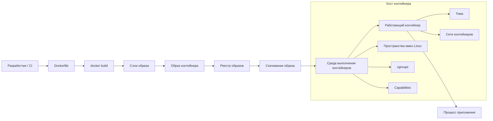
```mermaid
flowchart LR
  Dev["Разработчик / CI"] --> Dockerfile["Dockerfile"]
  Dockerfile --> Build["docker build"]
  Build --> Layers["Слои образа"]
  Layers --> Image["Образ контейнера"]
  Image --> Registry["Реестр образов"]

  Registry --> Pull["Скачивание образа"]
  Pull --> Runtime["Среда выполнения контейнеров"]
  Runtime --> Container["Работающий контейнер"]

  subgraph Host["Хост контейнера"]
    Runtime --> Namespaces["Пространства имен Linux"]
    Runtime --> Cgroups["cgroups"]
    Runtime --> Caps["Capabilities"]
    Container --> Volumes["Тома"]
    Container --> Networks["Сети контейнеров"]
  end

  Container --> App["Процесс приложения"]
```

#### Границы ответственности
Docker упаковывает приложение и задает параметры запуска, но не делает образ безопасным автоматически. Команда отвечает за минимизацию базового образа, отсутствие секретов в слоях, закрепление версий, сканирование зависимостей, запуск без прав root, ограничение capabilities и корректную публикацию в реестре.

Приложение по-прежнему отвечает за собственную аутентификацию, авторизацию, обработку входных данных и безопасную работу с секретами.

#### Типовые рабочие паттерны
- Сборка образов в CI.
- Хранение образов в закрытом реестре.
- Многоэтапные сборки.
- Минимальные базовые образы.
- Сканирование образов перед публикацией или развертыванием.
- Подпись образов и подтверждение происхождения для критичных сервисов.
- Развертывание по дайджесту; теги служат для поиска или обозначения каналов выпуска, но не являются основанием доверия к выпуску.
- Запуск контейнеров в Kubernetes через containerd или CRI-O, а не напрямую через Docker Engine.

#### Проверка безопасности и эксплуатации

Считайте доступ к демону Docker, работающему с правами root, административным доступом к хосту. Не подключайте его сокет к контейнерам приложений и недоверенным заданиям сборки. Подключение сокета только для чтения не делает API доступным только для чтения: клиент с доступом по-прежнему может отправлять запросы, меняющие состояние. Защищайте удаленный доступ аутентифицированным SSH или TLS и ограничивайте доступ к API демона.

Проверяйте демон Docker и контекст подключения, фактически используемые в CI; инструкция `USER` в образе не подтверждает работу демона без прав root. Для режима rootless подтвердите режим работы демона и работу ограничений ресурсов и необходимых сетевых функций на используемом хосте. Этот режим снижает привилегии на хосте, но не защищает от вредоносного задания файлы и учетные данные, доступные пользователю, от имени которого работает демон.

Для недоверенных изменений используйте изолированные одноразовые среды сборки. На синтетических секретах проверяйте слои и настройки образа, журналы сборки и экспортированные кеши на утечки; удаление файла в последующем слое не удаляет его из предыдущих слоев. Отдельно от сканирования образа проверяйте привилегии процесса, подключения файловых систем, capabilities и ограничения ресурсов.

#### Связанные файлы из проекта
- `content/supply-chain/container-image-security/playbook.ru.md` / `playbook.en.md`: модель образов OCI, требования к Dockerfile, продвижение между реестрами, закрепление дайджестов, сканирование и подпись.
- `content/platform-security/kubernetes/container-escape-capability-abuse/overview.ru.md` / `overview.en.md`: риски выхода из контейнера через capabilities и опасные параметры.
- `content/platform-security/kubernetes/pod-security/playbook.ru.md` / `playbook.en.md`: безопасные настройки рабочих нагрузок Kubernetes.
- `content/supply-chain/slsa-provenance/overview.ru.md` / `overview.en.md`: происхождение артефактов, цепочка поставки и доверие к сборкам.

### Реестр OCI и артефактов

#### Для чего используется
OCI-реестр хранит и выдает образы контейнеров и связанные артефакты: SBOM, подписи, аттестации происхождения, результаты сканирования, пакеты Helm и другие OCI-совместимые объекты. Реестр обычно связывает сборку, развертывание и выполнение: CI публикует артефакты, механизм контроля допуска проверяет их, а узлы Kubernetes скачивают образы по дайджесту для запуска рабочих нагрузок.

#### Модель работы
OCI Distribution Specification описывает API публикации и загрузки содержимого. Основные объекты: двоичный объект (blob), манифест, индекс образов, дайджест и тег. Двоичный объект хранит слой или конфигурацию. Манифест описывает образ или артефакт и ссылается на двоичные объекты по дайджесту. Индекс объединяет платформенные манифесты, например для `linux/amd64` и `linux/arm64`. Дайджест идентифицирует содержимое по его хешу; тег является человекочитаемой ссылкой на манифест или индекс и может меняться, если политика это разрешает.

Репозиторий внутри реестра группирует связанные артефакты, например `prod/payments/api`. Клиент публикует двоичные объекты и манифест, затем может назначить тег. При загрузке он запрашивает манифест или индекс по тегу либо дайджесту, получает дескрипторы и скачивает указанные объекты. Для многоплатформенного образа клиент сначала может получить индекс, а затем выбрать манифест для своей ОС и архитектуры. Развертывание в рабочую среду Kubernetes должно ссылаться на образ по дайджесту: тег не является надежной неизменяемой ссылкой без отдельной политики его неизменяемости.

Перенос между реестрами должен сохранять проверенный артефакт. Копирование образа может изменить ссылку на репозиторий, а иногда и верхнеуровневый дайджест, если меняется копируемый объект, тип содержимого или структура индекса. Поэтому подтверждения ревью должны содержать исходную и целевую ссылки, точный развернутый дайджест, набор платформенных манифестов и объект подписи или аттестации происхождения, принятый политикой.

Современный реестр часто хранит связанные артефакты (referrers): подписи, SBOM и сведения о происхождении, привязанные к дайджесту объекта. Например, у образа `sha256:...` могут быть отдельные OCI-артефакты с подписью cosign, аттестацией SLSA и SBOM. Проверка допуска получает дайджест образа, находит связанные аттестации, проверяет подпись, идентичность системы сборки, содержимое аттестации происхождения и результат политики.

Реестр также управляет авторизацией, сроками хранения, репликацией, сканированием уязвимостей, кешированием образов при загрузке из внешнего реестра (pull-through cache) и журналами аудита. В облаке это часто отдельный управляемый сервис с политиками IAM; в самостоятельно размещенных вариантах, например Harbor или реестре на основе CNCF Distribution, команда сама отвечает за хранилище, TLS, аутентификацию, репликацию и очистку.

#### Схема взаимодействия
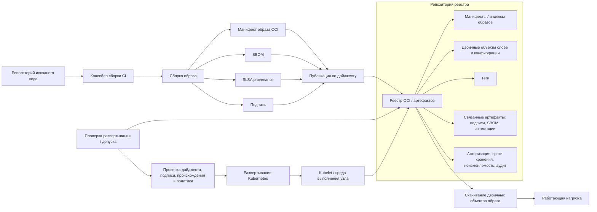
```mermaid
flowchart LR
  Source["Репозиторий исходного кода"] --> CI["Конвейер сборки CI"]
  CI --> Build["Сборка образа"]
  Build --> Image["Манифест образа OCI"]
  Build --> SBOM["SBOM"]
  Build --> Prov["SLSA provenance"]
  Build --> Sig["Подпись"]

  Image --> Push["Публикация по дайджесту"]
  SBOM --> Push
  Prov --> Push
  Sig --> Push
  Push --> Registry["Реестр OCI / артефактов"]

  subgraph RegistryBox["Репозиторий реестра"]
    Registry --> Manifests["Манифесты / индексы образов"]
    Registry --> Blobs["Двоичные объекты слоев и конфигурации"]
    Registry --> Tags["Теги"]
    Registry --> Referrers["Связанные артефакты: подписи, SBOM, аттестации"]
    Registry --> Policy["Авторизация, сроки хранения, неизменяемость, аудит"]
  end

  DeployGate["Проверка развертывания / допуска"] --> Registry
  DeployGate --> Verify["Проверка дайджеста, подписи, происхождения и политики"]
  Verify --> Kubernetes["Развертывание Kubernetes"]
  Kubernetes --> Node["Kubelet / среда выполнения узла"]
  Node --> Registry
  Registry --> Pull["Скачивание двоичных объектов образа"]
  Pull --> Workload["Работающая нагрузка"]
```

#### Границы ответственности
Реестр обеспечивает хранение и выдачу артефактов по API, но не доказывает безопасность образа, принадлежность подписи доверенному подписанту или допустимость исходного кода. Команда отвечает за аутентификацию и авторизацию, развертывание по неизменяемому дайджесту, неизменяемость релизных тегов, подписи, происхождение, сроки хранения, управление уязвимостями и аудит.

Реестр не должен быть единственной точкой контроля. Даже если он блокирует часть небезопасных образов, проверка развертывания должна независимо сверять дайджест, подпись, идентичность системы сборки, происхождение и решение политики до допуска рабочей нагрузки.

#### Типовые рабочие паттерны
- Закрытый реестр с IAM/RBAC и отдельными репозиториями по средам или доменам.
- Развертывание только по дайджесту (`image@sha256:...`); теги используются для удобства поиска, а не как основание доверия.
- Неизменяемость релизных тегов и запрет их перезаписи.
- Подпись образов и публикация SBOM и сведений о происхождении как связанных OCI-артефактов.
- Проверка допуска, сверяющая подпись, идентичность доверенной системы сборки, происхождение по SLSA и политику уязвимостей.
- Политика хранения старых образов с сохранением артефактов для отката, расследования и аудита.
- Кеш образов из внешнего реестра (pull-through cache) с отдельной политикой доверия для исходных образов.
- Аудит публикации, удаления, изменения тегов и аномальных загрузок.

#### Проверка безопасности и эксплуатации

Разделяйте учетные записи для публикации сборок, переноса в канал релизов, чтения образов рабочими нагрузками и удаления артефактов. Подтвердите, что учетные данные для чтения не позволяют публиковать или удалять содержимое, а задание сборки не может перезаписать согласованный канал релизов. Ограничивайте права конкретными репозиториями и проверяйте фактический доступ к подписям и аттестациям наряду с образами.

Проверяйте фактическую область политики неизменяемости: правила выбора тегов, исключения, права на изменение самой политики и взаимодействие с удалением и сроками хранения. Семантика зависит от реестра; запрет перезаписи существующего тега сам по себе не подтверждает запрет удаления или повторного создания. На тестовом репозитории проверьте перезапись, удаление и повторную публикацию релизного тега через API и репликацию. Учетная запись сборки не должна менять правила защиты; разрешенные административные изменения должны оставлять след в аудите.

Проверяйте перенос и очистку на индексе образа с платформенными манифестами, подписями, SBOM и подтверждением происхождения. После репликации и очистки подтвердите дайджест в целевом реестре, доступность и проверяемость всех обязательных подтверждений. Отсутствие обязательного подтверждения должно блокировать развертывание; наличие образа не доказывает, что связанные подтверждения сохранились.

Удаление артефакта из реестра не останавливает контейнеры и не удаляет копии из кешей узлов, зеркал и экспортированных архивов. При компрометации блокируйте новые развертывания по затронутому дайджесту, находите и заменяйте рабочие нагрузки, меняйте раскрытые учетные данные. Проверьте процедуру реагирования на образе, уже находящемся в кеше. Очистка реестра и сборка мусора управляют хранилищем, но не отзывают артефакт.

#### Связанные файлы из проекта
- `content/supply-chain/slsa-provenance/overview.ru.md` / `overview.en.md`: происхождение, политика проверки и доверенные системы сборки.
- `content/supply-chain/container-image-security/playbook.ru.md` / `playbook.en.md`: требования безопасности образов контейнеров и реестров OCI.
- `content/platform-security/kubernetes/cluster-security-review/playbook.ru.md` / `playbook.en.md`: реестр в цепочке развертывания и проверка допуска к выпуску.
- `content/platform-security/kubernetes/adversarial-validation/playbook.ru.md` / `playbook.en.md`: доступность закрытого реестра извне, история образов и пути атак на цепочку поставки.
- `content/platform-security/kubernetes/pod-security/playbook.ru.md` / `playbook.en.md`: последствия запуска недоверенного образа.

### Helm

#### Для чего используется
Helm служит менеджером пакетов Kubernetes: формирует манифесты по шаблонам, управляет релизами и распространяет приложения в пакетах (charts, чарты). В рабочих средах им устанавливают платформенные компоненты, контроллеры входящего трафика, средства мониторинга, механизмы политик и внутренние приложения.

#### Модель работы
Пакет Helm содержит манифесты Kubernetes и шаблоны одного приложения или компонента платформы. Шаблоны используют YAML Kubernetes и язык шаблонов Go. Файл `values.yaml` и значения для конкретной среды задают параметры формирования манифестов: тег образа, число реплик, ресурсы, входящий трафик, сервисную учетную запись, RBAC, контекст безопасности и другие настройки.

Релиз Helm представляет собой установленный экземпляр пакета в конкретном пространстве имен с заданными значениями. Репозиторий хранит пакеты и их версии. Зависимости позволяют включать другие пакеты, например БД или вспомогательный контейнер. Обработчик (hook) запускает ресурсы Kubernetes на определенных этапах жизненного цикла: до установки, после обновления или перед удалением.

CLI Helm формирует манифесты из шаблонов и значений и отправляет объекты в API Kubernetes. Состояние релиза Helm по умолчанию хранится в Kubernetes; `helm upgrade` использует историю релиза и желаемую конфигурацию для обновления. У интеграций GitOps модель может отличаться: Argo CD использует Helm для формирования манифестов и сам управляет синхронизацией, а Flux Helm Controller управляет релизами Helm. Проверяйте выполнение и удаление ресурсов обработчиков, откат и историю релиза для выбранного контроллера. `helm uninstall` не удаляет ресурсы обработчиков автоматически; при необходимости задайте политику удаления обработчика или TTL задания.

В GitOps Helm часто запускает не оператор, а контроллер: он получает пакет и значения из Git или реестра, формирует манифесты сам или через Helm, затем синхронизирует итоговые объекты с Kubernetes.

#### Схема взаимодействия
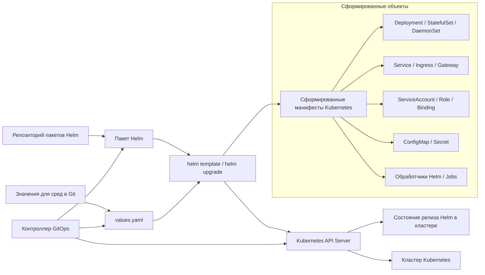
```mermaid
flowchart LR
  ChartRepo["Репозиторий пакетов Helm"] --> Chart["Пакет Helm"]
  ValuesRepo["Значения для сред в Git"] --> Values["values.yaml"]
  Chart --> Render["helm template / helm upgrade"]
  Values --> Render
  Render --> Manifests["Сформированные манифесты Kubernetes"]

  subgraph Objects["Сформированные объекты"]
    Manifests --> Deploy["Deployment / StatefulSet / DaemonSet"]
    Manifests --> Service["Service / Ingress / Gateway"]
    Manifests --> RBAC["ServiceAccount / Role / Binding"]
    Manifests --> Config["ConfigMap / Secret"]
    Manifests --> Hooks["Обработчики Helm / Jobs"]
  end

  Render --> API["Kubernetes API Server"]
  API --> Release["Состояние релиза Helm в кластере"]
  API --> Cluster["Кластер Kubernetes"]

  GitOps["Контроллер GitOps"] --> Chart
  GitOps --> Values
  GitOps --> API
```

#### Границы ответственности
Helm не определяет безопасность итоговой конфигурации. Пакет может создать привилегированную рабочую нагрузку, широкие разрешения RBAC, небезопасный входящий маршрут или Secret с чувствительными значениями.

Команда отвечает за ревью итоговых манифестов, контроль значений, происхождение пакета, закрепление версий, ограничения обработчиков и проверку создаваемых в кластере прав.

#### Типовые рабочие паттерны
- Внутренний репозиторий пакетов Helm.
- Закрепление версий пакетов Helm и образов приложения по дайджесту. Поле `appVersion` является метаданными и не определяет версию образа, которую используют шаблоны.
- Отдельные значения для каждой среды.
- Формирование манифестов в CI с проверкой политиками.
- Применение пакета контроллером GitOps вместо ручного `helm install`.
- Подпись и подтверждение происхождения сторонних пакетов.
- Минимизация обработчиков после установки и привилегированных заданий.

#### Проверка безопасности и эксплуатации

Рассматривайте установку пакета как выполнение действий с правами учетной записи развертывания в Kubernetes. Прежде чем расширять ее права, проверяйте итоговые настройки RBAC, объекты уровня кластера, обработчики и зависимые пакеты. Проверяйте именно тот пакет и значения, которые предназначены для целевой среды; успешное формирование манифестов не подтверждает прохождение контроля допуска или готовность приложения.

Не включайте действующие секреты в значения, сохраняемые в Git, и аргументы командной строки. Хранилище релизов Helm может сохранять переданные значения и сформированные объекты Secret в нескольких версиях релиза. Ограничивайте доступ к этому хранилищу, защищайте вывод формирования манифестов и пробного запуска. На синтетических секретах подтвердите отсутствие утечек в журналах и артефактах CI. Если пакет поддерживает ссылки на отдельно управляемые секреты, предпочитайте этот способ передачи.

В изолированной среде проверяйте установку, обновление, откат и удаление релиза. Отдельно учитывайте сохраняемые тома, ресурсы обработчиков и определения пользовательских ресурсов; успешное удаление релиза не подтверждает полное удаление данных или отзыв учетных данных. Откат объектов Kubernetes не отменяет миграции базы данных и внешние последствия работы обработчиков.

Для ресурсов обработчиков Helm задавайте явную политику удаления `helm.sh/hook-delete-policy`; для завершенных заданий при необходимости используйте `ttlSecondsAfterFinished`. Не рассчитывайте, что `helm uninstall` удалит их автоматически. Проверьте остаточные Job, Secret, ServiceAccount и разрешения после успешного и неуспешного запуска, повторной установки и удаления релиза. Очистка задания не отменяет созданные им внешние ресурсы; назначьте владельца их удаления и отзыва выданных учетных данных. Сохраняйте необходимые диагностические данные до очистки, исключая секреты из журналов.

Для определений CRD из каталога `crds/` Helm не выполняет обычное обновление или удаление вместе с релизом; уже существующее определение при установке пропускается. Назначьте владельца обновления CRD и согласуйте совместимость схемы с контроллером и существующими пользовательскими ресурсами. Проверяйте фактическую схему в кластере после обновления пакета, а не только версию релиза. Если CRD управляются шаблонами, обработчиками или отдельным контроллером, отдельно проверьте их жизненный цикл и последствия удаления.

#### Связанные файлы из проекта
- `content/platform-security/kubernetes/cluster-security-review/playbook.ru.md` / `playbook.en.md`: проверка создаваемых Helm настроек RBAC, рабочих нагрузок и входящего трафика.
- `content/platform-security/kubernetes/pod-security/playbook.ru.md` / `playbook.en.md`: проверка итоговых спецификаций Pod после формирования манифестов.
- `content/supply-chain/slsa-provenance/overview.ru.md` / `overview.en.md`: доверие к артефактам, включая пакеты Helm и развертывания.

### GitOps / Argo CD / Flux

#### Для чего используется
Контроллеры GitOps приводят рабочую среду к конфигурации, объявленной в Git или источнике артефактов. Argo CD и Flux часто используются для развертывания нагрузок Kubernetes. Репозиторий получает полномочия на развертывание: проверенный коммит может вызвать изменение рабочих ресурсов без передачи учетных данных кластера исполнителю CI.

#### Модель работы
Контроллер получает версию исходного кода, формирует манифесты или вызывает Helm/Kustomize, сравнивает результат с рабочими объектами и применяет изменения от своей учетной записи Kubernetes. Автоматическая синхронизация, исправление дрейфа, удаление лишних объектов и оценка работоспособности являются отдельными функциями. Синхронизированное приложение может быть неработоспособным; удаление манифеста при включенном удалении лишних объектов может удалить рабочий ресурс.

Argo CD использует Application и AppProject для ограничения источников и назначений; Flux приводит ресурсы источников, Kustomization и HelmRelease к объявленному состоянию и может действовать от выделенных ServiceAccount. Эти ограничения дополняют RBAC Kubernetes. Плагины формирования манифестов, внешние базовые конфигурации, зависимости пакетов и расшифрованные секреты создают дополнительные границы исполнения и доступа к данным.

#### Границы ответственности
Защищайте запись в репозиторий, конфигурацию контроллера, учетные данные, средства формирования манифестов и объекты выбора источников. Ограничивайте проекты и учетные записи контроллеров разрешенными репозиториями, пространствами имен, кластерами и типами ресурсов. Арендатор не должен перенаправлять приложение на репозиторий нарушителя, выбирать привилегированную ServiceAccount или менять собственное пространство имен контроллера.

#### Типовые рабочие паттерны
- Проверенные неизменяемые ревизии исходников и образы с закрепленным дайджестом.
- Отдельные учетные записи и области доверия контроллеров для арендаторов с несовместимыми привилегиями.
- Явные настройки удаления лишних объектов и исправления дрейфа; управляемая приостановка приведения к объявленному состоянию при реагировании на инцидент.
- Получение или расшифровка секретов от учетной записи с ограниченными правами; исключение расшифрованных манифестов из журналов и общедоступных кешей.

#### Проверка безопасности и эксплуатации
От имени фактической роли арендатора попробуйте выбрать запрещенный источник, назначение, ресурс уровня кластера и ServiceAccount. Проверьте решение GitOps и запрет Kubernetes. Выполните откат к проверенной ревизии, приостановку при инциденте и перезапуск контроллера; зафиксируйте примененную ревизию, работоспособность и удаленные ресурсы. Проверьте обработчики ресурсов и защиту от удаления для БД и других объектов с состоянием.

В Argo CD отдельно проверяйте удаление `Application`: финализатор `resources-finalizer.argocd.argoproj.io` запускает каскадное удаление управляемых ресурсов. Отключение автоматического удаления лишних объектов при синхронизации не является защитой от этого пути. На тестовом приложении проверьте удаление с каскадом и без него, включая дочерние приложения; заранее определите, кто сохраняет управление оставшимися ресурсами и как защищаются данные. Резервная копия манифестов не заменяет резервную копию содержимого БД или томов.

В Argo CD список разрешенных репозиториев ограничивает исходный репозиторий, но не все источники зависимостей Helm и удаленных базовых конфигураций Kustomize. Проверяйте и закрепляйте эти зависимости отдельно, ограничивайте исходящие соединения компонента формирования манифестов и отключайте ненужные инструменты. На тестовом приложении попробуйте подключить зависимость из запрещенного источника: зафиксируйте, какой механизм отклоняет загрузку или не допускает ее результат к развертыванию. Разрешенный основной репозиторий сам по себе не подтверждает доверие ко всем сформированным ресурсам.

#### Связанные файлы из проекта
- `content/review/release-governance/playbook.ru.md`: полномочия на развертывание, согласования и подтверждения релиза.
- `content/platform-security/kubernetes/cluster-security-review/playbook.ru.md`: RBAC контроллера и контроль допуска.

## Контейнерная платформа и среда выполнения Kubernetes

### Среды выполнения контейнеров (container runtimes)

#### Для чего используется
Среда выполнения контейнеров запускает их на узле: скачивает образы, подготавливает файловую систему, пространства имен и cgroups, затем передает запуск низкоуровневой среде выполнения. В Kubernetes среда выполнения работает на каждом рабочем узле и принимает запросы kubelet через CRI.

#### Модель работы
CRI связывает kubelet со средой выполнения, позволяя использовать containerd, CRI-O или другую совместимую реализацию. Через CRI kubelet запрашивает создание изолированного окружения Pod, загрузку образа, запуск и остановку контейнера, а также его состояние.

OCI Image Specification определяет формат образа. OCI Runtime Specification задает пакет среды выполнения с корневой файловой системой и `config.json`, где описаны процесс, подключения файловых систем, пространства имен, cgroups и capabilities. Компоненты более высокого уровня скачивают и распаковывают образ, затем подготавливают этот пакет; низкоуровневая среда выполнения вроде `runc` сама не скачивает OCI-образ. Хранилище образов сохраняет скачанные образы на узле. Механизм снимков (snapshotter) подготавливает слои файловой системы, предоставляя контейнеру рабочее представление без полного копирования образа.

Изолированное окружение Pod включает сеть, пространства имен и базовые ресурсы для контейнеров приложения. Промежуточный процесс (shim) поддерживает связь с работающим контейнером, чтобы управление работающим контейнером не зависело от непрерывной работы основного процесса среды выполнения.

Типовая последовательность: kubelet получает назначение Pod, обращается к среде выполнения через CRI, та скачивает образ из реестра, подготавливает снимки и слои, создает изолированное окружение и вызывает реализацию OCI, например `runc` или Kata Containers. Низкоуровневая среда создает изоляцию Linux и запускает процесс приложения.

#### Схема взаимодействия
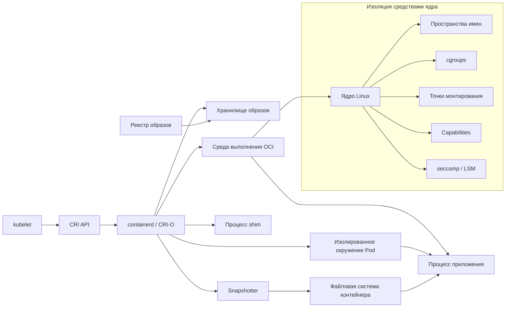
```mermaid
flowchart LR
  Kubelet["kubelet"] --> CRI["CRI API"]
  CRI --> Runtime["containerd / CRI-O"]
  Runtime --> ImageStore["Хранилище образов"]
  Registry["Реестр образов"] --> ImageStore
  Runtime --> Snapshotter["Snapshotter"]
  Snapshotter --> FS["Файловая система контейнера"]
  Runtime --> Sandbox["Изолированное окружение Pod"]
  Runtime --> Shim["Процесс shim"]
  Runtime --> OCI["Среда выполнения OCI"]
  OCI --> Kernel["Ядро Linux"]

  subgraph KernelFeatures["Изоляция средствами ядра"]
    Kernel --> NS["Пространства имен"]
    Kernel --> CG["cgroups"]
    Kernel --> Mounts["Точки монтирования"]
    Kernel --> Caps["Capabilities"]
    Kernel --> Seccomp["seccomp / LSM"]
  end

  OCI --> Process["Процесс приложения"]
  Sandbox --> Process
  FS --> Process
```

#### Границы ответственности
Среда выполнения запускает контейнер с заданными ограничениями, но сама не оценивает, безопасны ли предоставленные контейнеру разрешения. Если рабочая нагрузка Kubernetes запрашивает привилегированный режим, опасные capabilities, `hostPath`, `hostPID` или `hostNetwork`, среда выполнения применит эту конфигурацию.

Платформенная команда отвечает за политики, контроль допуска и базовые требования к защите.

#### Типовые рабочие паттерны
- containerd в управляемом Kubernetes.
- CRI-O в кластерах, ориентированных на специализированную среду выполнения Kubernetes.
- RuntimeClass для изоляции отдельных рабочих нагрузок.
- gVisor или Kata Containers для нагрузок с повышенными требованиями к изоляции.
- Централизованная настройка среды выполнения в образах узлов.
- Мониторинг событий среды выполнения и аудит на уровне узла.

#### Проверка безопасности и эксплуатации

Проверяйте фактический обработчик среды выполнения и настройки узлов для каждого выбранного RuntimeClass. Название RuntimeClass само по себе не подтверждает применение требуемого механизма изоляции. Ограничивайте размещение узлами с настроенным обработчиком и защищайте метки, используемые для выбора узлов. Проверяйте запуск на поддерживаемых узлах и отказ при неподдерживаемой конфигурации; не допускайте незаметного перехода на режим без обязательной изоляции.

Ограничивайте доступ к сокетам среды выполнения и не подключайте их к контейнерам приложений. Через CRI узла проверьте подключения файловых систем, capabilities, настройки seccomp и ограничения ресурсов работающего тестового контейнера. Они должны соответствовать согласованным настройкам рабочей нагрузки. Если настройки сами по себе не доказывают применение ограничения, проверяйте поведение процесса. Повторяйте соответствующие проверки после обновления образа узла или среды выполнения.

#### Связанные файлы из проекта
- `content/platform-security/kubernetes/container-escape-capability-abuse/overview.ru.md` / `overview.en.md`: связь изоляции среды выполнения, capabilities и выхода из контейнера.
- `content/platform-security/kubernetes/pod-security/playbook.ru.md` / `playbook.en.md`: параметры рабочих нагрузок, применяемые средой выполнения на узле.
- `content/platform-security/kubernetes/seccomp/checklist.ru.md` / `checklist.en.md`: фильтрация системных вызовов для усиления защиты среды выполнения.

### Kubernetes

#### Для чего используется
Kubernetes управляет контейнерными приложениями: планирует их размещение, обеспечивает обнаружение сервисов, обновление, автоматическое масштабирование, конфигурацию, секреты, сеть и жизненный цикл рабочих нагрузок. В рабочих средах он часто служит платформой микросервисов, пакетных заданий, внутренних платформ и облачной инфраструктуры.

#### Модель работы
API Server является центральной точкой управления для пользователей, контроллеров, kubelet и внешних интеграций. Он проверяет запросы, выполняет аутентификацию, авторизацию и контроль допуска, затем сохраняет желаемое состояние в etcd. etcd хранит объекты рабочих нагрузок, сервисов, секретов, привязок, конфигурацию и метаданные кластера.

Планировщик выбирает узел для Pod с учетом ресурсов, ограничений, правил предпочтения и совместного размещения (`affinity`), ограничений узлов (`taints`) и допусков Pod (`tolerations`). Controller Manager запускает контроллеры, постоянно сопоставляющие желаемое и фактическое состояние: они создают Pod для Deployment, заменяют отказавшие Pod и обновляют сведения о сетевых адресах Pod, обслуживающих Service. Контроллеры допуска могут менять или отклонять объекты до сохранения.

На каждом рабочем узле kubelet получает назначенные Pod через API Server и поручает среде выполнения запустить контейнеры. Она скачивает образы и создает контейнеры. Плагин CNI настраивает сеть Pod, а kube-proxy или его замена на eBPF/CNI обеспечивает сетевую работу Service.

Pod является минимальной исполняемой единицей Kubernetes: один или несколько контейнеров с общей сетевой идентичностью и томами. Deployment управляет репликами без состояния и их обновлением; StatefulSet управляет нагрузкой с состоянием и стабильной идентичностью; DaemonSet запускает агент на каждом подходящем узле. Service дает стабильную сетевую точку доступа к динамическому набору Pod, Ingress или Gateway публикует HTTP/TCP-вход в кластер. ConfigMap хранит несекретную конфигурацию, Secret содержит чувствительные значения, ServiceAccount задает идентичность рабочей нагрузки. RBAC связывает Role и ClusterRole с субъектами через RoleBinding и ClusterRoleBinding. NetworkPolicy определяет разрешенные потоки между Pod и внешними адресами.

Пользователь применяет манифест через API Server; объект сохраняется в etcd; контроллер создает или обновляет дочерние объекты; планировщик назначает Pod узлу; kubelet запускает контейнеры через среду выполнения; сетевые компоненты обеспечивают доступность нагрузки другим сервисам.

#### Схема взаимодействия
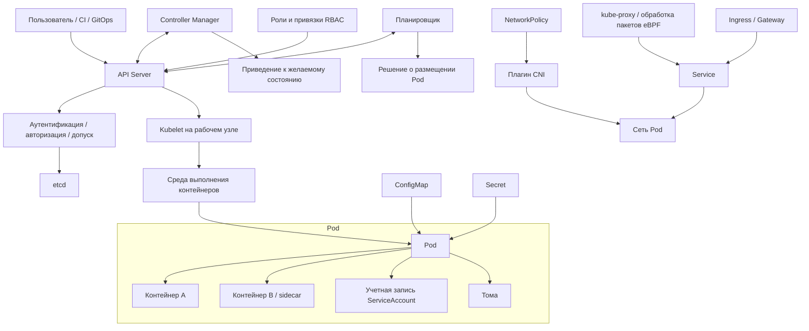
```mermaid
flowchart TB
  User["Пользователь / CI / GitOps"] --> API["API Server"]
  API --> Auth["Аутентификация / авторизация / допуск"]
  Auth --> ETCD["etcd"]

  Controller["Controller Manager"] <--> API
  Scheduler["Планировщик"] <--> API
  Controller --> Desired["Приведение к желаемому состоянию"]
  Scheduler --> Placement["Решение о размещении Pod"]

  API --> Kubelet["Kubelet на рабочем узле"]
  Kubelet --> Runtime["Среда выполнения контейнеров"]
  Runtime --> Pod["Pod"]

  subgraph PodBox["Pod"]
    Pod --> C1["Контейнер A"]
    Pod --> C2["Контейнер B / sidecar"]
    Pod --> SA["Учетная запись ServiceAccount"]
    Pod --> Vol["Тома"]
  end

  CNI["Плагин CNI"] --> PodNet["Сеть Pod"]
  KubeProxy["kube-proxy / обработка пакетов eBPF"] --> Service["Service"]
  Ingress["Ingress / Gateway"] --> Service
  Service --> PodNet

  ConfigMap["ConfigMap"] --> Pod
  Secret["Secret"] --> Pod
  RBAC["Роли и привязки RBAC"] --> API
  NetworkPolicy["NetworkPolicy"] --> CNI
```

#### Границы ответственности
Kubernetes предоставляет API и управление рабочими нагрузками, но сам по себе не гарантирует безопасную конфигурацию. Платформенная команда отвечает за RBAC, изоляцию, политики допуска и сети, аудит, усиление защиты узлов, обновления и интеграцию с IAM, секретами и реестрами.

Команды приложений отвечают за безопасные настройки в спецификациях Pod, проверки работоспособности, лимиты ресурсов, секреты, входящий трафик и поведение приложения.

#### Типовые рабочие паттерны
- Управляемый Kubernetes: EKS, GKE, AKS или аналогичная платформа.
- GitOps через Argo CD или Flux.
- Разделение пространств имен по средам, командам или зонам поражения.
- Отдельные пулы узлов для доверенных, недоверенных, привилегированных нагрузок, нагрузок с состоянием или GPU.
- Контроллер Ingress или Gateway API.
- External Secrets Operator или драйвер CSI для секретов.
- Механизм политик: Kyverno или OPA Gatekeeper.
- Закрытый контур управления и ограниченный доступ к API Kubernetes.

#### Проверка безопасности и эксплуатации

Проверяйте разрешенные и запрещенные операции API от имени типичных рабочих нагрузок и учетных записей развертывания. Проверка авторизации не подтверждает прохождение контроля допуска или применение ограничений при выполнении. Включайте в проверку доступ между пространствами имен, чтение Secret, создание рабочих нагрузок, изменение привязок ролей и применимые права действовать от чужого имени или повышать привилегии.

Проверяйте сетевую изоляцию из реальных Pod с используемым CNI: разрешенные зависимости и запрещенные адреса других арендаторов, сервисов метаданных и компонентов управления. Разделение пространств имен само по себе не создает сетевую границу. Подтвердите отказ в допуске небезопасных настроек и применение согласованных настроек в работающей тестовой нагрузке.

После обновлений или изменений политик повторяйте затронутые проверки и проверяйте полноту аудита. Используйте синтетические ресурсы и учетные данные; проверка не должна превращаться в выгрузку значений Secret рабочей среды. Назначайте ответственных за существующие нарушения и подтверждайте их устранение: исправный кластер и успешное развертывание сами по себе не доказывают безопасность.

#### Связанные файлы из проекта
- `content/platform-security/kubernetes/cluster-security-review/playbook.ru.md` / `playbook.en.md`: комплексная проверка безопасности Kubernetes-кластера.
- `content/platform-security/kubernetes/pod-security/playbook.ru.md` / `playbook.en.md`: безопасная конфигурация Pod и рабочих нагрузок.
- `content/platform-security/kubernetes/seccomp/checklist.ru.md` / `checklist.en.md`: проверка seccomp-профилей.
- `content/platform-security/kubernetes/container-escape-capability-abuse/overview.ru.md` / `overview.en.md`: выход из контейнера и злоупотребление Linux capabilities.

### CNI и сеть Kubernetes

#### Для чего используется
CNI и сетевые механизмы Kubernetes обеспечивают связность Pod, обнаружение сервисов, балансировку Service, входящие и исходящие соединения и применение сетевых политик. Это один из основных уровней ограничения зоны поражения: CNI определяет, сможет ли нагрузка одного пространства имен обратиться к другой нагрузке, метаданным, контуру управления или внешней системе.

Типичные реализации: Cilium, Calico, CNI облачных поставщиков, Flannel и другие плагины. Cilium делает акцент на обработке трафика через eBPF, наблюдаемости и замене kube-proxy. Calico применяется для NetworkPolicy и расширенных политик, включая GlobalNetworkPolicy. В некоторых управляемых кластерах CNI интегрирует адреса Pod непосредственно с VPC/VNet.

#### Модель работы
Kubernetes задает общую сетевую модель: Pod получает IP, Pod могут взаимодействовать, Service предоставляет стабильный виртуальный IP или DNS-имя для набора эндпоинтов, а NetworkPolicy описывает разрешенные входящие и исходящие потоки. API Kubernetes хранит объекты, но не применяет NetworkPolicy в сетевом тракте. Это делает плагин CNI или связанный движок политик.

kubelet и среда выполнения вызывают плагин CNI при создании окружения Pod. Он выделяет IP, подключает сетевой интерфейс, настраивает маршруты, правила, карты eBPF или iptables/nftables и поддерживает состояние при изменении Pod, узлов, сервисов и политик. DNS обычно обеспечивает CoreDNS. На Linux трафик Service обрабатывает kube-proxy в режиме iptables или nftables либо CNI, заменяющий kube-proxy. IPVS считается устаревшим начиная с Kubernetes 1.35; для существующей установки планируйте переход на поддерживаемый режим. При смене режима проверьте ядро, совместимость CNI, доступность NodePort на нужных адресах и правила межсетевого экрана: поведение nftables не полностью совпадает с iptables.

NetworkPolicy действует в пространстве имен Kubernetes, выбирает Pod по меткам и задает разрешенный входящий и исходящий трафик. Pod без подходящей политики обычно не изолирован в соответствующем направлении. После выбора Pod политикой разрешены только описанные ею потоки для этого направления. Поэтому запрет по умолчанию требует отдельной политики, а не просто наличия CNI.

Cilium может заменить kube-proxy и балансировать Service через eBPF. Агенты Cilium настраивают сетевой тракт узлов, используют карты для поиска сервисов и их обработчиков, могут предоставлять видимость потоков через Hubble и применять политики L3/L4/L7. Calico поддерживает NetworkPolicy и собственные расширения: упорядоченные правила, уровни политик и эндпоинты хостов в зависимости от редакции и настроек. При ревью проверяйте не только YAML, но и фактическую реализацию CNI, режим обработки трафика, поддержку исходящих правил, селекторов пространств имен, DNS/FQDN-политик и наблюдаемости.

#### Схема взаимодействия
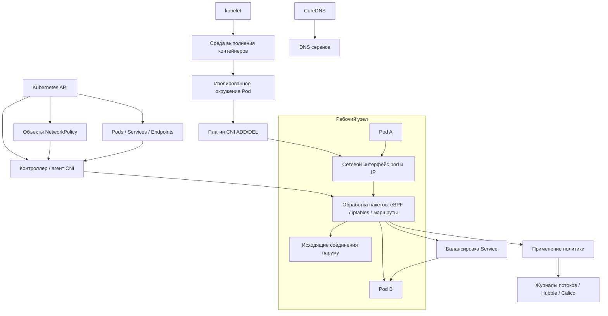
```mermaid
flowchart TB
  API["Kubernetes API"] --> Pods["Pods / Services / Endpoints"]
  API --> NP["Объекты NetworkPolicy"]
  API --> CNIController["Контроллер / агент CNI"]

  Kubelet["kubelet"] --> Runtime["Среда выполнения контейнеров"]
  Runtime --> Sandbox["Изолированное окружение Pod"]
  Sandbox --> CNIPlugin["Плагин CNI ADD/DEL"]
  CNIPlugin --> PodIF["Сетевой интерфейс pod и IP"]

  CNIController --> Datapath["Обработка пакетов: eBPF / iptables / маршруты"]
  NP --> CNIController
  Pods --> CNIController
  Datapath --> Policy["Применение политики"]
  Datapath --> ServiceLB["Балансировка Service"]
  CoreDNS["CoreDNS"] --> ServiceDNS["DNS сервиса"]

  subgraph Node["Рабочий узел"]
    PodA["Pod A"] --> PodIF
    PodIF --> Datapath
    Datapath --> PodB["Pod B"]
    Datapath --> Egress["Исходящие соединения наружу"]
  end

  ServiceLB --> PodB
  Policy --> FlowLogs["Журналы потоков / Hubble / Calico"]
```

#### Границы ответственности
CNI обеспечивает сетевой тракт и может применять NetworkPolicy, но не знает бизнес-смысл сервисов. Платформа отвечает за выбор CNI, включение принудительного применения политик, запрет по умолчанию, исходящие соединения, наблюдаемость, совместимость обновлений и проверку фактического действия правил.

Команды приложений отвечают за правильные метки, описание нужных межсервисных потоков и проверку связности после изменений. Само пространство имен не следует считать неявной сетевой изоляцией.

#### Типовые рабочие паттерны
- Запрет входящего и исходящего трафика по умолчанию для рабочих пространств имен и пространств с ценными активами.
- Явные разрешения межсервисных соединений, DNS и необходимых исходящих потоков.
- Отдельные пулы узлов или кластеры для нагрузок с разным уровнем доверия.
- Cilium/Hubble или журналы потоков Calico для расследования сетевых событий.
- Замена kube-proxy только после проверки совместимости с облачными балансировщиками, сервисной сетью, поведением NodePort/LoadBalancer и средствами наблюдаемости.
- Схема исходящего шлюза и NAT для стабильной идентификации исходящего трафика.
- Повторная проверка NetworkPolicy после изменения меток пространств имен и Pod, версии CNI и селекторов Service.
- Отдельная защита интерфейсов доступа к метаданным и облачного контура управления.

#### Проверка безопасности и эксплуатации

Стандартная NetworkPolicy объединяет разрешающие правила: любая подходящая политика может разрешить поток. Если оба конца соединения изолированы, соединение должны разрешать и исходящая политика отправителя, и входящая политика получателя. Приоритета правил и перекрывающего запрета у этой модели нет; политики поставщика могут работать иначе. Само наличие пространства имен не обеспечивает изоляцию.

Поведение NetworkPolicy для Pod с `hostNetwork` зависит от сетевого плагина и не имеет единой гарантии: плагин может применять правила к таким Pod либо учитывать их трафик как трафик узла. Стандартная модель также допускает входящий трафик к Pod от его собственного узла. Не используйте обычную NetworkPolicy как доказательство изоляции от скомпрометированного узла; ограничивайте `hostNetwork`, применяйте поддерживаемую защиту сети узлов и проверяйте потоки с того же и другого узла отдельно.

После применения политик проверьте доступность из типичных Pod: DNS, прямые IP Pod, IP Service, интерфейсы доступа к метаданным и используемый путь `hostNetwork`. По данным о потоках отличайте блокировку политикой от недоступности сервиса; повторяйте проверку после обновления CNI или изменения селекторов.

Запрет исходящего трафика по умолчанию блокирует и DNS. Разрешайте доступ к используемому резолверу, а не ко всем адресатам на порту 53; проверяйте UDP и TCP для обычного DNS. Учитывайте фактический адрес в `/etc/resolv.conf` Pod, включая локальный DNS-кеш узла, если он используется. Из того же Pod проверьте полное имя сервиса с пространством имен и внешнее имя, затем отдельно соединение с полученным адресом. При сбое проверьте Service и EndpointSlice DNS, журналы CoreDNS и его права чтения ресурсов Kubernetes. Успешное разрешение имени не подтверждает доступность сервиса или применение сетевой политики.

#### Связанные файлы из проекта
- `content/platform-security/kubernetes/cluster-security-review/playbook.ru.md` / `playbook.en.md`: границы сервисов, исходящий трафик и требования NetworkPolicy.
- `content/platform-security/kubernetes/adversarial-validation/playbook.ru.md` / `playbook.en.md`: обход границ пространств имен, SSRF, доступность NodePort и фактическая достижимость.
- `content/platform-security/kubernetes/pod-security/playbook.ru.md` / `playbook.en.md`: меры контроля на уровне Pod дополняют сетевую изоляцию, сохраняя необходимость ее применения.
- `content/review/architecture/checklist.ru.md` / `checklist.en.md`: анализ границ доверия и потоков данных.

### Ingress / Gateway / API Gateway

#### Для чего используется
Ingress, Gateway и API-шлюзы публикуют сервисы за пределами кластера или между сетевыми зонами. Они принимают клиентский трафик, завершают TLS или передают его дальше, маршрутизируют запросы к Service, интегрируют аутентификацию и авторизацию, ограничивают частоту запросов, применяют WAF и политики защиты API, нормализуют заголовки и обеспечивают наблюдаемость.

В рабочих средах встречаются NGINX Ingress Controller, контроллеры облачных балансировщиков, Envoy Gateway, Kong Gateway/Kong Ingress Controller, HAProxy, Contour, Traefik и шлюзы сервисной сети. Kubernetes Ingress остается стабильным API маршрутизации HTTP/HTTPS, но его развитие заморожено; новые сетевые возможности в основном развиваются в Gateway API. Для контроллера Istio этот раздел описывает внешнюю точку входа. Механизмы Istio (`VirtualService`, `DestinationRule`, `PeerAuthentication`, `AuthorizationPolicy`, sidecar/ambient) разобраны отдельно.

#### Модель работы
Ресурс Ingress описывает маршрутизацию по хосту и пути к целевому Service. Без контроллера Ingress он не работает. Контроллер наблюдает за API Kubernetes, выбирает объекты по `ingressClassName`, формирует конфигурацию прокси или балансировщика и предоставляет внешнюю точку доступа через Service типа `LoadBalancer`, NodePort, облачный балансировщик или пограничное устройство.

Gateway API явно разделяет роли. `GatewayClass` описывает тип контроллера, а `Gateway` задает обработчики соединений, адреса, порты, TLS и правила подключения маршрутов. `HTTPRoute`, `GRPCRoute`, `TCPRoute`, `TLSRoute` и другие ресурсы определяют маршрутизацию приложений. `allowedRoutes` и правила подключения между пространствами имен образуют границу доверия между платформенной командой, управляющей Gateway, и командами приложений, управляющими маршрутами. Не путайте Kubernetes Gateway API `Gateway` с Istio `networking.istio.io/Gateway`: у них различаются модель владения, режим развертывания и ресурсы маршрутов.

API-шлюз добавляет управление API: плагины и политики аутентификации и авторизации, проверку JWT/OIDC, API-ключи, ограничения частоты, преобразование запросов и ответов, WAF, защиту от ботов, проверку схем, порталы разработчиков и аналитику. В Kubernetes тот же контроллер может читать ресурсы Ingress/Gateway API и формировать конфигурацию сетевого контура шлюза.

При проверке безопасности выясняйте, где завершается TLS, как ограничено доверие к `X-Forwarded-*`, кто может создавать маршруты публичных имен хостов, как ограничены шаблоны хостов, есть ли mTLS до целевого сервиса, как применяется аутентификация, работают WAF и лимиты частоты, кто может менять аннотации и плагины и не обходят ли они базовые требования.

#### Схема взаимодействия
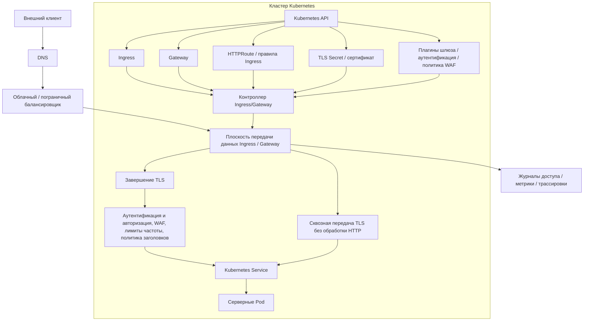
```mermaid
flowchart TB
  Client["Внешний клиент"] --> DNS["DNS"]
  DNS --> LB["Облачный / пограничный балансировщик"]
  LB --> GatewayDP["Плоскость передачи данных Ingress / Gateway"]

  subgraph K8s["Кластер Kubernetes"]
    API["Kubernetes API"] --> Ingress["Ingress"]
    API --> Gateway["Gateway"]
    API --> Route["HTTPRoute / правила Ingress"]
    API --> Secret["TLS Secret / сертификат"]
    API --> Policy["Плагины шлюза / аутентификация / политика WAF"]

    Controller["Контроллер Ingress/Gateway"] --> GatewayDP
    Ingress --> Controller
    Gateway --> Controller
    Route --> Controller
    Secret --> Controller
    Policy --> Controller

    GatewayDP --> TLS["Завершение TLS"]
    TLS --> Auth["Аутентификация и авторизация, WAF, лимиты частоты, политика заголовков"]
    Auth --> Service["Kubernetes Service"]
    Service --> Pod["Серверные Pod"]
    GatewayDP --> Passthrough["Сквозная передача TLS без обработки HTTP"]
    Passthrough --> Service
  end

  GatewayDP --> Logs["Журналы доступа / метрики / трассировки"]
```

#### Границы ответственности
Ingress и Gateway контролируют сетевую точку входа, но не заменяют авторизацию приложения. Если шлюз проверяет только наличие токена, приложение все равно проверяет права на бизнес-операции и границы арендаторов. Если TLS завершается на шлюзе, отдельно определите необходимость mTLS или шифрования до целевого сервиса.

Платформа отвечает за защиту контроллера, управление классами, внешнюю доступность, жизненный цикл сертификатов, базовые аннотации и плагины, заголовки безопасности, журналирование и ограничения маршрутов между пространствами имен. Команды приложений отвечают за свои маршруты, готовность целевых сервисов, правила хостов и путей, совместимость с заголовками и тайм-аутами прокси.

#### Типовые рабочие паттерны
- Gateway API для новых развертываний; Ingress для существующих нагрузок с незавершенной миграцией.
- Отдельные классы Ingress/Gateway для публичного, внутреннего и административного трафика.
- Завершение TLS на шлюзе с управляемым жизненным циклом сертификатов; mTLS до чувствительных целевых сервисов.
- Строгая политика для `X-Forwarded-*`, `Forwarded`, `Host` и заголовков IP клиента; приложение доверяет им только от согласованного прокси.
- WAF, защита API и ограничение частоты на публичных маршрутах.
- Запрет широких шаблонов имен хостов или отдельное согласование такой маршрутизации.
- Подключение Route к Gateway ограничивается через `allowedRoutes` обработчика соединений и `parentRefs` маршрута. Для ссылки на целевой сервис или сертификат в другом пространстве имен требуется `ReferenceGrant` от владельца целевого пространства. Эти механизмы разрешают разные виды связей.
- Журналы доступа с идентификатором корреляции, результатом запроса, целевым сервисом и решением политики.
- Защита сервисной учетной записи контроллера: она часто позволяет читать Secret и менять конфигурацию шлюза или прокси.

#### Проверка безопасности и эксплуатации

При сквозной передаче TLS шлюз не расшифровывает HTTP: проверка токенов, WAF, изменение заголовков и ограничения по HTTP-запросам должны выполняться там, где завершается TLS. Не считайте наличие плагина на шлюзе подтверждением работы этих мер; проверьте их на фактическом пути запроса. При завершении TLS на шлюзе шифрование соединения до сервиса настраивается отдельно. Для Gateway API проверьте поддержку `BackendTLSPolicy` установленным контроллером, доверенный CA и имя сервера; соединение с недоверенным или неподходящим по имени сертификатом должно отклоняться.

Поддержка контроллера Kubernetes `ingress-nginx`, развиваемого сообществом, завершилась в марте 2026 года, включая выпуск исправлений безопасности. Это отдельный проект, его нельзя отождествлять с продуктами поставщиков под названием NGINX Ingress Controller. Определите фактически используемые образ, репозиторий и класс контроллера; замените `ingress-nginx` сообщества поддерживаемой реализацией. Для временного исключения нужны владелец, срок действия и срок миграции.

Для общего Gateway отдельно проверьте неразрешенное подключение Route, ссылки на сервисы и TLS Secret в другом пространстве имен. Изучите состояния `Accepted`, `ResolvedRefs` и `Programmed`, где они применимы, затем проверьте публичную точку доступа: принятие конфигурации не доказывает корректную аутентификацию, доверие к заголовкам или шифрование до целевого сервиса.

#### Связанные файлы из проекта
- `content/platform-security/kubernetes/cluster-security-review/playbook.ru.md` / `playbook.en.md`: реестр точек входа, доступность сервисов и ответственность за них.
- `content/platform-security/kubernetes/adversarial-validation/playbook.ru.md` / `playbook.en.md`: достижимость NodePort/Ingress/Gateway, SSRF и доступность внутренних систем.
- `content/application-security/web/owasp-top-10/playbook.ru.md` / `playbook.en.md`: риски уровня приложения за шлюзом.
- `content/review/architecture/checklist.ru.md` / `checklist.en.md`: границы доверия, внешние интеграции и подтверждения архитектурного ревью.

### Istio

#### Для чего используется
Istio создает сервисную сеть (service mesh) для управления взаимодействием сервисов: mTLS, маршрутизация, повторы, телеметрия, политики авторизации и постепенный выпуск. Он часто применяется в Kubernetes с большим числом внутренних сервисов и строгими требованиями к защите межсервисного взаимодействия.

#### Модель работы
Istiod управляет сервисной сетью: принимает конфигурацию Kubernetes/Istio, формирует и распространяет настройки сетевого контура, управляет обнаружением сервисов и распределением сертификатов mTLS. Трафик обрабатывают прокси Envoy рядом с приложением в модели sidecar либо компоненты ambient mesh. В ambient-режиме защищенный сетевой слой L4 обеспечивает `ztunnel` на узле, а функции L7 добавляют прокси waypoint.

Прокси Envoy перехватывает входящий и исходящий трафик нагрузки, устанавливает mTLS, применяет маршрутизацию, правила повторов, тайм-аутов и авторизации, собирает телеметрию. Входящий шлюз принимает внешний трафик, а исходящий централизует контролируемый доступ к внешним системам.

Поведение сервисной сети задают CRD. В Istio API `VirtualService` описывает маршрутизацию и перераспределение трафика; `DestinationRule` задает подмножества, балансировку и правила соединений с целевыми сервисами; `Gateway` управляет входом и выходом; `PeerAuthentication` задает режим mTLS; `AuthorizationPolicy` определяет разрешенное взаимодействие. Istio также поддерживает Kubernetes Gateway API: в этой модели `Gateway`, `HTTPRoute` и другие маршруты относятся к `gateway.networking.k8s.io`, а не к Istio API.

В Kubernetes приложение остается обычным Deployment/Pod, но его трафик проходит через сетевой контур Istio. Istiod отслеживает сервисы и политики, пересчитывает конфигурацию и передает ее прокси. Прокси применяют mTLS, правила маршрутизации и политики, а также собирают телеметрию без изменения бизнес-кода.

#### Схема взаимодействия
Схема ниже показывает модель sidecar. В ambient трафик L4 проходит через `ztunnel` на узлах; для функций L7 на соответствующем пути требуется waypoint.

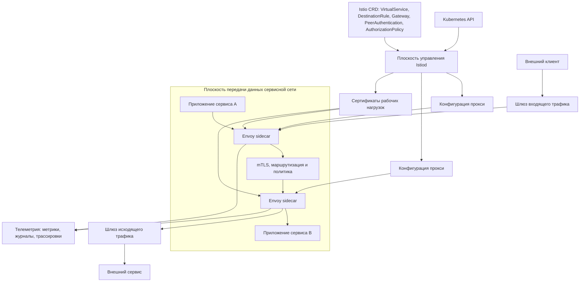
```mermaid
flowchart TB
  K8sAPI["Kubernetes API"] --> Istiod["Плоскость управления Istiod"]
  IstioCRD["Istio CRD: VirtualService, DestinationRule, Gateway, PeerAuthentication, AuthorizationPolicy"] --> Istiod
  Istiod --> ConfigA["Конфигурация прокси"]
  Istiod --> ConfigB["Конфигурация прокси"]
  Istiod --> Certs["Сертификаты рабочих нагрузок"]

  subgraph Mesh["Плоскость передачи данных сервисной сети"]
    ServiceA["Приложение сервиса A"] --> EnvoyA["Envoy sidecar"]
    EnvoyA --> MTLS["mTLS, маршрутизация и политика"]
    MTLS --> EnvoyB["Envoy sidecar"]
    EnvoyB --> ServiceB["Приложение сервиса B"]
  end

  ConfigA --> EnvoyA
  ConfigB --> EnvoyB
  Certs --> EnvoyA
  Certs --> EnvoyB

  External["Внешний клиент"] --> IngressGW["Шлюз входящего трафика"]
  IngressGW --> EnvoyA
  EnvoyB --> EgressGW["Шлюз исходящего трафика"]
  EgressGW --> ExternalAPI["Внешний сервис"]

  EnvoyA --> Telemetry["Телеметрия: метрики, журналы, трассировки"]
  EnvoyB --> Telemetry
```

#### Границы ответственности
Istio обеспечивает mTLS между рабочими нагрузками и централизованные политики сервисной сети, но не исправляет слабую аутентификацию приложения и не заменяет RBAC Kubernetes, NetworkPolicy, политики сетевого тракта CNI или защиту API. NetworkPolicy остается необходимой для ограничения зоны поражения на L3/L4 и трафика, который нельзя защищать только включением в сервисную сеть.

Платформа отвечает за корректное подключение к сервисной сети, жизненный цикл сертификатов, модель политик, доступность шлюзов извне и совместимость приложений.

#### Типовые рабочие паттерны
- Подключение только выбранных пространств имен, а не всего кластера сразу.
- Строгий режим mTLS для внутренних сервисов.
- `AuthorizationPolicy` для межсервисного доступа.
- Отдельные входящие и исходящие шлюзы, если внешний трафик должен проходить через контролируемые границы сервисной сети.
- Явный выбор API маршрутизации: Istio `VirtualService`/`Gateway`, Kubernetes Gateway API или оба на время перехода.
- Канареечное развертывание и переключение между двумя версиями через `VirtualService`/`DestinationRule` на поддерживаемых путях с sidecar или через маршруты Gateway API для ambient waypoint. Проверяйте поддержку в установленной версии Istio; не считайте, что маршрутизация и привязка политик из модели sidecar работают в ambient без изменений.
- Интеграция телеметрии с Prometheus, Grafana или OpenTelemetry.
- Постепенная миграция с sidecar на ambient mesh, где это оправдано.

#### Проверка безопасности и эксплуатации

В режиме ambient `ztunnel` обеспечивает транспорт и идентичность на L4; маршрутизация и авторизация L7 требуют прохождения соответствующего трафика через подключенный waypoint. Привязывайте `AuthorizationPolicy` уровня L7 к нужному waypoint или ресурсу поддерживаемым способом и проверяйте фактический путь. Наличие waypoint или соединения mTLS само по себе не подтверждает авторизацию приложения. Прямой доступ по IP Pod и смешанные пути sidecar/ambient во время миграции требуют отдельных негативных тестов.

Установка шлюза исходящего трафика сама по себе не обеспечивает прохождение всех соединений через него. Убедитесь, что маршрутизация и сетевые ограничения запрещают прямой доступ нагрузок к внешним адресатам; проверьте отказ шлюза и попытку обхода.

#### Связанные файлы из проекта
- `content/platform-security/kubernetes/cluster-security-review/playbook.ru.md` / `playbook.en.md`: сервисная сеть как часть контуров управления и передачи данных Kubernetes.
- `content/platform-security/kubernetes/pod-security/playbook.ru.md` / `playbook.en.md`: рабочие нагрузки со вспомогательным контейнером sidecar или сервисной сетью остаются рабочими нагрузками Kubernetes и наследуют требования Pod Security.
- `content/review/architecture/checklist.ru.md` / `checklist.en.md`: анализ границ доверия и межсервисного взаимодействия.
- Отдельного плейбука по Istio пока нет.

### Механизмы политик

#### Для чего используется
Механизмы политик автоматически проверяют и принудительно применяют технические правила: допуск Kubernetes, проверки IaC и критериев качества в CI, проверку образов и конфигурации, требования управления. Типичные инструменты: OPA, Gatekeeper, Kyverno и Conftest.

#### Модель работы
OPA является универсальным механизмом политик: приложение или инструмент передает структурированные входные данные, код политики принимает решение, а вызывающий компонент разрешает или запрещает операцию на основании этого решения. Conftest использует OPA/Rego для проверки структурированных файлов локально или в CI: манифестов Kubernetes, планов Terraform, вывода Helm и конфигураций YAML/JSON.

В Kubernetes механизм политик обычно действует как динамический контроллер допуска. После аутентификации и авторизации API Server отправляет `AdmissionReview` проверяющему (validating) или изменяющему (mutating) webhook. Механизм проверяет объект, `userInfo`, пространство имен, метки, ссылки на образы и доступный внешний контекст, затем разрешает, отклоняет или меняет запрос до сохранения в etcd.

Gatekeeper использует шаблоны ограничений (ConstraintTemplate) и созданные по ним ограничения, поддерживает проверку допуска и аудит существующих ресурсов. Kyverno использует ресурсы политик Kubernetes для проверки, изменения, создания, очистки и удаления объектов, а также проверки образов. Новые политики обычно сначала включают в режимах аудита, пробного запуска или предупреждений, чтобы непроверенное правило не заблокировало критичные нагрузки.

Для проверок, выражаемых через CEL по данным запроса и параметрам политики, рассмотрите встроенный `ValidatingAdmissionPolicy` вместе с `ValidatingAdmissionPolicyBinding`: он выполняется в API Server без внешнего webhook. Наличие политики без подходящей привязки не обеспечивает применение; для обязательного запрета проверяйте `validationActions: [Deny]`, условия соответствия и обработку ошибок. Проверка внешних подписей и получение произвольного внешнего контекста требуют другого механизма.

Политики CI и допуска в рабочую среду решают разные задачи. CI проверяет предлагаемую конфигурацию до слияния или развертывания и быстро сообщает разработчику о нарушениях. Контроль допуска защищает кластер от обхода CI, ручных изменений, скомпрометированных учетных данных развертывания и дрейфа. Он требует высокой доступности, наблюдаемости и аккуратной настройки поведения при отказе.

#### Схема взаимодействия
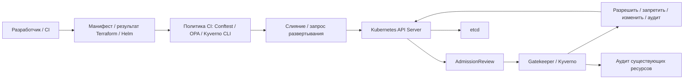
```mermaid
flowchart LR
  Developer["Разработчик / CI"] --> Config["Манифест / результат Terraform / Helm"]
  Config --> CIPolicy["Политика CI: Conftest / OPA / Kyverno CLI"]
  CIPolicy --> Merge["Слияние / запрос развертывания"]
  Merge --> APIServer["Kubernetes API Server"]
  APIServer --> Admission["AdmissionReview"]
  Admission --> Engine["Gatekeeper / Kyverno"]
  Engine --> Decision["Разрешить / запретить / изменить / аудит"]
  Decision --> APIServer
  APIServer --> ETCD["etcd"]
  Engine --> Audit["Аудит существующих ресурсов"]
```

#### Границы ответственности
Механизм принимает решения по заданным правилам, но сам не определяет, какие требования безопасности нужны системе. Команда отвечает за владельцев правил, тесты, режим внедрения, исключения, поведение при отказе, версии, наблюдаемость, влияние на производительность и соответствие реальным сценариям риска.

#### Типовые рабочие паттерны
- Проверки CI для запросов на слияние и изменений Terraform/Kubernetes.
- Принудительное применение критичных требований Kubernetes при допуске.
- Режим аудита перед блокировкой для новых или рискованных политик.
- Явные исключения с владельцем, обоснованием, сроком действия и проверкой.
- Модульные тесты политик с заведомо допустимыми и недопустимыми манифестами.
- Отдельные наборы политик по средам или уровням риска.
- Мониторинг задержек webhook, доли отказов, нарушений, выявленных аудитом, и доступности механизма политик.
- Проверка образов по дайджесту, подписи и аттестациям для рабочих нагрузок.

#### Проверка безопасности и эксплуатации

Для обязательных проверок задавайте `failurePolicy: Fail` у соответствующего проверяющего webhook. Подтвердите отказ в допуске при недоступности обработчика и превышении времени ожидания. Выбирайте `timeoutSeconds` по измеренной задержке и отслеживайте ошибки вызова webhook на API Server. Подготовьте процедуру восстановления контроллера с записью действий в аудит; не предоставляйте командам приложений возможность произвольно обходить проверки. Для изменяющего webhook режим `Ignore` допустим, только если независимая проверка отклоняет объекты без обязательных свойств безопасности.

Защищайте политики, настройки webhook, ресурсы исключений и метки, используемые в `namespaceSelector` или `objectSelector`. Владелец рабочей нагрузки не должен обходить проверку сменой метки или созданием исключения. Проверьте создание и обновление объектов, Pod, создаваемые контроллерами, и соответствующие подресурсы с фактически развернутыми правилами.

Контроль допуска проверяет соответствующие запросы, но не устраняет нарушения в уже существующих объектах. Для замечаний фонового аудита назначайте ответственных и сроки устранения. Отчет аудита сам по себе не изменяет объект. Отдельно настроенные правила изменения, создания и очистки объектов выполняют действия со своими правами и последствиями. Проверьте существующий объект с нарушением, новый недопустимый запрос и допустимый объект; подтвердите и записи в отчетах, и фактические решения при допуске.

#### Связанные файлы из проекта
- `content/platform-security/kubernetes/cluster-security-review/playbook.ru.md` / `playbook.en.md`: контроль допуска и проверки политик кластера.
- `content/platform-security/kubernetes/pod-security/playbook.ru.md` / `playbook.en.md`: требования к нагрузкам, обеспечиваемые механизмом политик.
- `content/supply-chain/slsa-provenance/overview.ru.md` / `overview.en.md`: проверка образа и происхождения до развертывания.
- Отдельного плейбука по механизмам политик пока нет.

## Учетные записи, секреты и доступ

### Облачный IAM и идентификация рабочих нагрузок

#### Для чего используется
Облачный IAM управляет доступом к облачным вычислениям, хранилищам, БД, очередям, KMS, секретам, сети и управляемым сервисам. Идентификация рабочих нагрузок (workload identity) связывает учетную запись нагрузки в среде выполнения, например ServiceAccount Kubernetes или задания CI, с облачной учетной записью без долгоживущих ключей внутри приложения или конвейера.

#### Модель работы
IAM состоит из субъектов доступа (principals) и политик. Субъектом может быть пользователь, группа, сервисная учетная запись, управляемая идентичность, роль или федеративный субъект. Политика задает действия над ресурсами и условия: учетную запись, проект, регион, тег, имя ресурса или утверждения токена. В AWS используются пользователи, группы, роли, политики IAM и STS. В Google Cloud используются субъекты и сервисные учетные записи, роли IAM и разрешающие политики. В Azure используются идентичности Microsoft Entra, управляемые идентичности (managed identities), регистрации приложений и назначения ролей Azure RBAC.

Краткоживущие учетные данные выдаются через федерацию. Нагрузка получает подписанный токен доверенного издателя, например API Server Kubernetes или платформы CI/CD. Облачный IAM проверяет `issuer`, `audience`, `subject` и условия, затем выдает временный токен доступа или сессию роли. В Kubernetes применяются интеграции поставщиков: AWS IAM Roles for Service Accounts, GCP Workload Identity Federation for GKE и Microsoft Entra Workload ID for AKS.

EKS Pod Identity работает иначе: агент на узле обращается к EKS Auth API, используя привязку кластера, пространства имен, ServiceAccount и роли IAM. Для каждого кластера не требуется отдельный OIDC-провайдер IAM. Ограничивайте привязку и доверие роли поддерживаемыми атрибутами или тегами сессии; проверяйте, что цепочка поиска учетных данных SDK не выбирает раньше статические ключи или учетные данные узла. Политики доверия IRSA нельзя переносить в эту интеграцию без изменений.

Сервис метаданных образует отдельную границу доверия. На облачной ВМ или узле он может выдавать учетные данные идентичности этого экземпляра. Если Pod имеет доступ к метаданным, а роль узла слишком широка, компрометация нагрузки позволяет продвинуться из Kubernetes в облачный контур управления. Идентификация рабочих нагрузок снижает риск только при ограниченном доступе к метаданным узла, разделенных сервисных учетных записях, узкой политике доверия и минимальных облачных разрешениях.

Привязывайте политики доверия к стабильным атрибутам нагрузки, а не только к понятному человеку имени. Для Kubernetes учитывайте `issuer`, `audience`, пространство имен, сервисную учетную запись и, где поддерживается, идентичность кластера, проекта или учетной записи. Для CI/CD учитывайте `issuer`, `audience`, репозиторий или его неизменяемый ID, защищенную ветку, тег или среду, идентичность процесса и событие запуска. Считайте замечанием широкий шаблон `subject`, который позволяет любой нагрузке из пространства имен, репозитория или организации получить полномочия облачной роли рабочей среды.

Kubernetes RBAC управляет доступом к объектам API Kubernetes, а облачный IAM управляет облачными ресурсами вне Kubernetes. ServiceAccount с минимальными правами RBAC может иметь опасно широкие облачные разрешения, и наоборот.

#### Схема взаимодействия
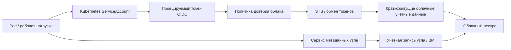
```mermaid
flowchart LR
  Pod["Pod / рабочая нагрузка"] --> KSA["Kubernetes ServiceAccount"]
  KSA --> Token["Проецируемый токен OIDC"]
  Token --> Trust["Политика доверия облака"]
  Trust --> STS["STS / обмен токенов"]
  STS --> Creds["Краткоживущие облачные учетные данные"]
  Creds --> Resource["Облачный ресурс"]

  Pod --> Metadata["Сервис метаданных узла"]
  Metadata --> NodeRole["Учетная запись узла / ВМ"]
  NodeRole --> Resource
```

#### Границы ответственности
Облачный поставщик отвечает за механизмы IAM, обмен токенами и применение ограничений в API. Платформенная команда отвечает за сопоставление идентичностей, политики доверия, ограничение доступа к метаданным узлов, минимальные привилегии, аудит, срок действия учетных данных, аварийный доступ и разделение сред. Команды приложений выбирают подходящую учетную запись нагрузки, исключают встроенные ключи и правильно обрабатывают обновление токенов.

#### Типовые рабочие паттерны
- Отдельная облачная идентичность для сервиса или ограниченной группы нагрузок.
- Федерация OIDC вместо статических облачных ключей доступа.
- Привязка политики доверия к `issuer`, `audience`, пространству имен, сервисной учетной записи, репозиторию, ветке, тегу или среде.
- Короткий срок федеративных сессий: сессии развертывания и выполнения в рабочей среде обычно измеряются минутами или несколькими часами, а не днями.
- Запрет широких шаблонов в правилах допуска субъектов к получению роли или обмену токенами рабочей среды.
- Запрет ненужного доступа нагрузки к метаданным узла.
- Узкие разрешения операций с данными без широких административных политик.
- Отдельные идентичности сборки, развертывания и выполнения.
- Аудит AssumeRole, обмена токенами, создания ключей, изменения политик и аномальных вызовов API.

#### Проверка безопасности и эксплуатации

Проверяйте, кто может запускать или изменять рабочие нагрузки под ServiceAccount, привязанным к облачной роли. Право создавать Pod или менять шаблон контроллера может позволить использовать такую учетную запись даже без права читать Secret; отдельно учитывайте выдачу токенов через `serviceaccounts/token` и доступ к уже работающим контейнерам. Разделяйте пространства имен по уровню доверия и ограничивайте выбор ServiceAccount политикой допуска. На тестовой нагрузке подтвердите, что субъект с меньшими полномочиями не может выбрать защищенный ServiceAccount, изменить его облачную привязку или получить доступ к его учетным данным.

Разделяйте запрет выдачи новых токенов и прекращение доступа по уже выданным учетным данным. В AWS изменение политики доверия роли не отменяет существующие сессии роли. Применяйте подходящий механизм отзыва сессий или запрета операций и проверяйте безопасную операцию с ресурсом через существующую сессию. Измеряйте задержку применения и учитывайте цепочки принятия ролей; запрос сведений об идентичности сам по себе не подтверждает отзыв доступа к ресурсам.

Проверяйте разрешенные и запрещенные субъекты федерации, фактическую облачную идентичность и отказы обновления учетных данных. Приложение не должно переходить на встроенные ключи или непредусмотренную идентичность узла или разработчика.

#### Связанные файлы из проекта
- `content/application-security/identity/oidc-oauth/playbook.ru.md` / `playbook.en.md`: понятия OIDC, проверка токенов и границы доверия.
- `content/platform-security/kubernetes/cluster-security-review/playbook.ru.md` / `playbook.en.md`: пути атак из Kubernetes в облако и идентичность кластера.
- `content/platform-security/secrets/vault/playbook.ru.md` / `playbook.en.md`: динамические учетные данные и доставка секретов.
- Отдельного плейбука по Cloud IAM и Workload Identity пока нет.

### Vault

#### Для чего используется
HashiCorp Vault централизует управление секретами, динамическими учетными данными, криптографическими операциями как сервисом и доступом к чувствительным материалам. Он часто связывает приложения, CI/CD и Kubernetes с БД, Cloud IAM, PKI, SSH и брокерами сообщений.

#### Модель работы
Сервер Vault принимает запросы API, аутентифицирует клиента, проверяет политику, обращается к механизмам секретов и пишет события аудита. Подсистема хранения содержит зашифрованное состояние: конфигурацию, метаданные, политики и данные механизмов секретов. Механизм seal/unseal защищает корневой ключевой материал: в запечатанном состоянии (`sealed`) Vault не может расшифровать хранилище и обслуживать обычные запросы.

Методы аутентификации связывают внешнюю идентичность с Vault: сервисную учетную запись Kubernetes, OIDC subject, AppRole, субъект Cloud IAM или другой источник. Политика определяет доступные пути и операции. После аутентификации выдается токен с набором политик. Запись lease определяет срок действия выданного секрета или учетных данных и используется для их продления и отзыва.

Механизмы секретов (secrets engines) выполняют отдельные задачи: KV хранит статические секреты, механизм Database выдает динамические учетные данные БД, механизм PKI выпускает сертификаты, механизм Transit выполняет криптографические операции без раскрытия ключей клиенту. Устройства аудита записывают запросы и ответы. По умолчанию большинство строковых значений хешируются с HMAC, но это не защищает каждое поле. Отдельно проверяйте заголовки, нестроковые значения, исключения из хеширования и настройку `log_raw`.

Нагрузка аутентифицируется выбранным методом, получает токен с ограниченными правами и обращается к пути механизма секретов. Vault возвращает секрет, динамические учетные данные или результат криптографической операции. Для секрета с lease Vault отслеживает срок действия и может продлить или отозвать его. Статические значения KV не получают автоматическую ротацию или отзыв в целевой системе от TTL токена. У сертификатов PKI собственная модель срока действия и отзыва; `generate_lease` в роли по умолчанию равен `false`, поэтому отзыв токена нельзя считать отзывом выпущенных сертификатов. Определите порядок отзыва сертификатов и использование CRL или OCSP сервисами, которые их проверяют.

#### Схема взаимодействия
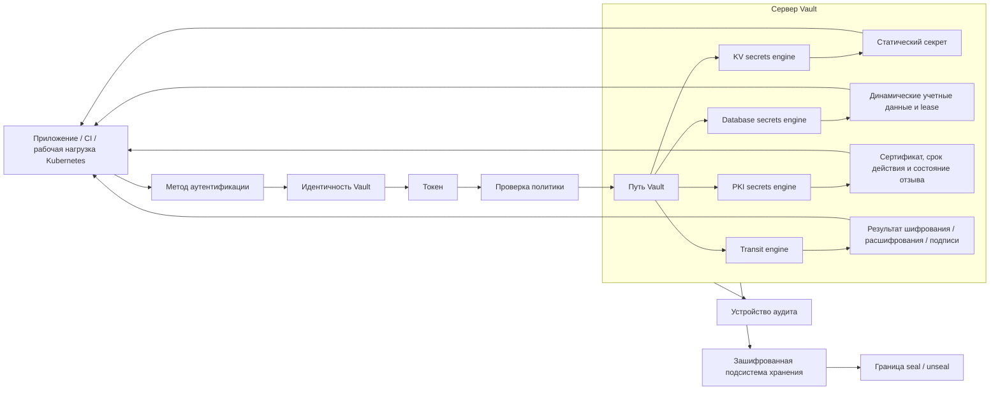
```mermaid
flowchart LR
  Workload["Приложение / CI / рабочая нагрузка Kubernetes"] --> AuthMethod["Метод аутентификации"]
  AuthMethod --> Identity["Идентичность Vault"]
  Identity --> Token["Токен"]
  Token --> Policy["Проверка политики"]
  Policy --> Path["Путь Vault"]

  subgraph VaultServer["Сервер Vault"]
    Path --> KV["KV secrets engine"]
    Path --> DB["Database secrets engine"]
    Path --> PKI["PKI secrets engine"]
    Path --> Transit["Transit engine"]
    KV --> StaticSecret["Статический секрет"]
    DB --> DynamicCred["Динамические учетные данные и lease"]
    PKI --> Certificate["Сертификат, срок действия и состояние отзыва"]
    Transit --> CryptoResult["Результат шифрования / расшифрования / подписи"]
  end

  VaultServer --> Audit["Устройство аудита"]
  VaultServer --> Storage["Зашифрованная подсистема хранения"]
  Storage --> Seal["Граница seal / unseal"]

  StaticSecret --> Workload
  DynamicCred --> Workload
  Certificate --> Workload
  CryptoResult --> Workload
```

#### Границы ответственности
Vault защищает выдачу и жизненный цикл секретов, но не делает безопасными получающие их приложения. Команды отвечают за минимальные политики, короткие сроки действия, аудит, ротацию, безопасную доставку в среду выполнения, защиту корневых и административных токенов и замену долгоживущих статических секретов динамическими, где это возможно.

#### Типовые рабочие паттерны
- Отказоустойчивый кластер Vault.
- Автоматическое снятие печати (auto-unseal) через облачный KMS или HSM.
- Метод аутентификации Kubernetes для рабочих нагрузок.
- Динамические учетные данные БД.
- Механизм PKI для внутренних сертификатов.
- External Secrets Operator или Vault Agent Injector.
- Централизованные устройства аудита.
- Разделение точек подключения и политик по командам и средам; пространства имен Vault применяются в Vault Enterprise и поддерживающих их управляемых развертываниях. Они не являются пространствами имен Kubernetes. В Community Edition используйте проверенные ACL для отдельных путей и точек подключения либо отдельные кластеры, если требуется независимое администрирование или более сильная изоляция.

#### Проверка безопасности и эксплуатации

Проверяйте отказ в доступе к секретам другого сервиса, отказ в продлении срока выданных учетных данных и их фактический отзыв в системе, которая их принимает. Удаление записи о выданных учетных данных (lease) в Vault не доказывает отзыв, если база данных или другой сервис все еще принимает эти учетные данные. Для статических секретов проверяйте смену у издателя и загрузку нового значения приложением, а не полагайтесь на истечение срока действия токена Vault.

В изолированной среде проверяйте отказ устройства аудита и восстановление. Запись событий аудита влияет на доступность сервиса: отслеживайте блокировку записи, свободное место и задержку. Подтвердите поведение используемой конфигурации аудита, не отключая обязательное журналирование как обычный способ устранения отказа. Проверка восстановления должна включать доступ к исходному механизму снятия печати или ключевому материалу и фактическое чтение секрета после аутентификации; успешная загрузка файла снимка сама по себе не доказывает завершение восстановления.

#### Связанные файлы из проекта
- `content/platform-security/secrets/vault/playbook.ru.md` / `playbook.en.md`: основной плейбук Vault, политики, методы аутентификации, аудит и усиление защиты.
- `content/platform-security/kubernetes/cluster-security-review/playbook.ru.md` / `playbook.en.md`: интеграция Vault с аутентификацией Kubernetes и доставкой секретов.
- `content/review/architecture/checklist.ru.md` / `checklist.en.md`: анализ границ доверия при работе с секретами.

### PKI / cert-manager

#### Для чего используется
PKI связывает сведения о субъектах с открытыми ключами через сертификаты и доверенных издателей. cert-manager автоматизирует выдачу и обновление сертификатов в Kubernetes через ACME, Vault или другого настроенного издателя. Автоматизация жизненного цикла сертификата сама не определяет, каким субъектам доверяет приложение и какие права им предоставляет.

#### Модель работы
Ресурс `Certificate` задает имена, назначение, издателя и целевой Secret. cert-manager создает запросы, выполняет проверку выбранного издателя и сохраняет сертификат с закрытым ключом в Secret. `Issuer` действует в пространстве имен, `ClusterIssuer` действует на уровне кластера. Приложение, контроллер входящего трафика или шлюз должны действительно загрузить новые данные. Успешное обновление не доказывает, что рабочая конечная точка перестала использовать старый сертификат.

#### Границы ответственности
Ограничивайте круг пользователей издателя и перечень субъектов, для которых они могут запрашивать сертификаты. Разрешение Kubernetes на создание запроса не дает права получить сертификат с произвольным SAN. Защищайте ключи CA, учетные данные проверки DNS, учетные записи ACME и TLS Secret; отделяйте проверку публичных сертификатов от идентификации внутренних рабочих нагрузок. Определите, как каждый проверяющий компонент получает обновленные наборы доверия, учитывает смену ключей и проверяет отзыв сертификатов.

#### Типовые рабочие паттерны
- Автоматическое обновление и явная политика ротации закрытого ключа, поддерживаемая установленной версией cert-manager.
- Учетные данные проверки DNS с правами только на нужные зоны проверки.
- Контролируемый доступ к издателю и политика SAN, назначений и срока действия сертификата.
- Замена CA с периодом совместного доверия и проверенным удалением старого корня доверия.
- Распространение доверенных CA отдельно от TLS Secret сервера. Клиенту, которому нужен только набор доверия, не выдавайте доступ к закрытому ключу сервера ради чтения `ca.crt`. Состав набора доверия утверждается отдельно: наличие CA в сертификате сервера или его Secret само по себе не является основанием доверять этому CA.

#### Проверка безопасности и эксплуатации
Проверьте отклонение запроса с запрещенным именем или издателем, поведение обновления при недоступности издателя и восстановление до истечения срока сертификата. Изучите сертификат, который фактически предъявляет сервис после ротации Secret и перезапуска процесса. Статуса готовности сертификата недостаточно. Проверьте цепочку доверия и соответствие сертификата ожидаемому субъекту, а также отзыв там, где его поддерживают протокол и клиенты.

От имени клиентской рабочей нагрузки подтвердите доступ к набору доверия и отказ чтения TLS Secret сервера; проверьте также фактически смонтированные файлы, поскольку ограничение API не удаляет уже выданную копию ключа. Замена сертификата сервера на сертификат от неутвержденного CA не должна автоматически менять доверие клиента. После завершения смены CA новое соединение с сертификатом от удаленного корня отклоняется; отдельно определите порядок завершения уже установленных соединений, если требуется немедленно прекратить доступ.

#### Связанные файлы из проекта
- `content/platform-security/secrets/vault/playbook.ru.md`: выдача и отзыв PKI.
- `content/platform-security/kubernetes/secrets/playbook.ru.md`: доступ к TLS Secret и их доставка.

### KMS / HSM

#### Для чего используется
KMS предоставляет управление жизненным циклом ключей и криптографические API. HSM защищает операции с ключами аппаратной границей безопасности; он может обслуживать KMS или работать отдельно. Типовые задачи включают конвертное шифрование, подпись и защиту зависимостей механизма seal Vault или резервных копий.

#### Модель работы
При конвертном шифровании ключ данных шифрует содержимое, а ключ шифрования ключей защищает этот ключ данных. Запись содержит шифротекст, защищенный ключ данных, идентификатор ключа и версии, а также параметры алгоритма для восстановления. API KMS может возвращать ключи данных в открытом виде авторизованным клиентам, поэтому аппаратная защита главного ключа не означает, что открытые данные и все ключи данных остаются внутри HSM.

#### Границы ответственности
Разделяйте администрирование ключей и права приложения на шифрование и расшифровку, защищайте разрешения и политики ключей, ограничивайте контекст операций там, где это поддерживается. Аутентифицируемый контекст шифрования должен связывать ожидаемые метаданные, но не заменяет авторизацию. Не включайте в него секреты и PII: поставщик может записывать контекст в журнал аудита. Ротация не обязательно повторно шифрует существующие записи; отключение или удаление ключа может сделать рабочие данные и резервные копии недоступными.

#### Типовые рабочие паттерны
- Отдельные ключи и учетные записи для разных сред и назначений.
- Минимальные права криптографических операций и аудит изменения политик ключей и разрешений.
- План ротации, сохранение версий ключей, необходимых для расшифровки, и защита от случайного удаления ключа.
- Определенное поведение при недоступности KMS и явные ограничения кеширования ключей данных в открытом виде.

#### Проверка безопасности и эксплуатации
Попробуйте расшифровать данные от имени роли без необходимых прав и с неверным контекстом, затем восстановите старую резервную копию с учетом ключей, от которых она зависит. Проверьте отклонение неавторизованного запроса, ограничение частоты запросов и контролируемый отказ сервиса. Измерьте время восстановления и убедитесь, что защита от удаления ключа действует весь срок хранения данных, включая копии для аварийного восстановления.

Если приложение кеширует ключи данных в открытом виде, отключение ключа в KMS не останавливает операции с уже полученными ключами. Проверяйте отказ и отзыв доступа как с заполненным кешем, так и после его очистки или перезапуска процесса. Зафиксируйте допустимую задержку прекращения доступа и процедуру очистки кешей; успешная работа с кешем не доказывает доступность KMS или сохранность ключей для последующего восстановления. Ограничения срока хранения и повторного использования задавайте по возможностям используемого SDK и модели угроз.

#### Связанные файлы из проекта
- `content/platform-security/secrets/vault/playbook.ru.md`: конвертное шифрование и восстановление автоматического распечатывания (auto-unseal).
- `content/review/architecture/checklist.ru.md`: границы криптографического доверия и проектирование восстановления.

## Автоматизация и управление конфигурацией

### Ansible

#### Для чего используется
Ansible управляет конфигурацией, подготавливает ресурсы, автоматизирует инфраструктурные операции и согласованно применяет изменения на серверах, сетевых устройствах и платформах. В рабочих средах его используют для начальной настройки, усиления защиты, установки исправлений, настройки промежуточного ПО и выполнения эксплуатационных инструкций.

#### Модель работы
Список управляемых узлов (inventory) описывает узлы и группы по средам, ролям или другим признакам. Сценарий Ansible (playbook) задает последовательность действий: целевые хосты, переменные, задачи и настройки повышения привилегий. Задача вызывает модуль, который устанавливает пакет, меняет файл, управляет службой, создает пользователя или обращается к API.

Роль объединяет повторно используемые задачи, обработчики, шаблоны, настройки по умолчанию и файлы. Переменные адаптируют сценарий и роль к среде. Собранные сведения об узле (facts) описывают ОС, сетевые интерфейсы, подключенные файловые системы и состояние пакетов. Модули, плагины и роли распространяются в составе коллекций. Ansible Vault шифрует чувствительные переменные и файлы, хранящиеся рядом со сценариями.

Управляющий узел выполняет сценарий на целевых узлах, обычно через SSH или WinRM. Ansible копирует или вызывает модуль, получает результат и переходит к следующей задаче. Обработчики срабатывают при изменениях, например перезапускают службу после обновления конфигурации.

Ansible часто подготавливает хосты до подключения к Kubernetes, Kafka, RabbitMQ или Vault: устанавливает пакеты, размещает конфигурацию, управляет службами и применяет базовые меры защиты.

#### Схема взаимодействия
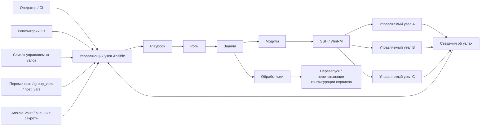
```mermaid
flowchart LR
  Operator["Оператор / CI"] --> Control["Управляющий узел Ansible"]
  Git["Репозиторий Git"] --> Control
  Inventory["Список управляемых узлов"] --> Control
  Vars["Переменные / group_vars / host_vars"] --> Control
  VaultVars["Ansible Vault / внешние секреты"] --> Control

  Control --> Playbook["Playbook"]
  Playbook --> Role["Роль"]
  Role --> Tasks["Задачи"]
  Tasks --> Modules["Модули"]
  Modules --> SSH["SSH / WinRM"]

  SSH --> HostA["Управляемый узел A"]
  SSH --> HostB["Управляемый узел B"]
  SSH --> HostC["Управляемый узел C"]

  HostA --> Facts["Сведения об узлах"]
  HostB --> Facts
  HostC --> Facts
  Facts --> Control

  Tasks --> Handlers["Обработчики"]
  Handlers --> Restart["Перезапуск / перечитывание конфигурации сервисов"]
```

#### Границы ответственности
Ansible применяет описанные изменения, но не гарантирует безопасность сценария. Команда отвечает за доступ к управляющему узлу, секреты в списке узлов и переменных, ревью, идемпотентность, ограничение зоны поражения, безопасное повышение привилегий и воспроизводимость запусков.

Ошибка в сценарии может массово распространить небезопасную конфигурацию.

#### Типовые рабочие паттерны
- Хранение сценариев в Git с обязательным ревью.
- Разделение списков узлов по средам.
- Ansible Vault или внешняя система управления секретами для чувствительных переменных.
- Запуск через AWX/Automation Controller или CI с журналом аудита.
- Ограничение `become` и SSH-доступа.
- Проверка ключей SSH-хостов с доверенным первоначальным получением ключей и согласованной процедурой их замены. Не отключайте проверку глобально ради автоматического запуска; подмена ключа целевого узла должна приводить к отказу соединения.
- Пробный запуск или проверочный режим (`check`) для рискованных изменений.
- Роли для базового усиления защиты и установки исправлений.

#### Проверка безопасности и эксплуатации

Учитывайте место выполнения каждой задачи: `delegate_to`, `local_action` и локальное подключение могут выполнять код на управляющем узле или другом назначенном хосте. Ограничение списка целевых узлов само по себе не ограничивает делегированные действия. Проверяйте такие задачи и доступные им учетные данные до запуска сторонней роли; защищайте управляющий узел как привилегированную среду исполнения, а не только как клиент SSH.

Проверочный режим моделирует изменение в пределах возможностей конкретного модуля. Задачи, использующие модули без такой поддержки, могут быть пропущены; условия выполнения могут зависеть от результатов предыдущих задач, недоступных в проверочном режиме, а `check_mode: false` позволяет выполнить задачу даже при проверочном запуске. Изучите выбранные модули и планируемые изменения конфигурации; перед массовым применением проверьте привилегированные изменения на ограниченной группе узлов.

Ansible Vault защищает сохраненные файлы, но не открытые значения после расшифровки. Применяйте `no_log` для чувствительных задач, не выводите значения через отладочные задачи или режим показа различий (`diff`). `no_log` не защищает от отладочного вывода самого Ansible. Не включайте этот отладочный вывод в рабочей среде с реальными секретами. На синтетическом секрете проверьте обычный запуск и разрешенные режимы диагностики: значение не должно попадать в журналы контроллера, вывод плагинов обработки результатов или сохраняемые артефакты заданий. Если параметры модулей попадают во временные файлы на управляющем или целевом узле, проверьте ограниченные права доступа и очистку после выполнения, включая отказ задачи. Не включайте `world_readable_temp` для задач с секретами; при использовании общей группы проверьте всех ее участников. Pipelining сокращает использование временных файлов, но не поддерживается всеми модулями и не заменяет проверку прав.

#### Связанные файлы из проекта
- `content/review/architecture/checklist.ru.md` / `checklist.en.md`: управление изменениями, привилегированная автоматизация и границы доверия.
- `content/platform-security/secrets/vault/playbook.ru.md` / `playbook.en.md`: если Ansible получает секреты из Vault или хранит чувствительные переменные.
- Отдельного плейбука по Ansible пока нет.

### Terraform / OpenTofu

#### Для чего используется
Terraform и OpenTofu описывают, создают и меняют инфраструктуру декларативным кодом: облачные ресурсы, объекты Kubernetes, политики IAM, DNS-записи, управляемые БД, сеть и конфигурацию SaaS. Часто это основной механизм изменения рабочей инфраструктуры, поэтому его следует рассматривать как привилегированную автоматизацию, а не просто репозиторий конфигурации.

#### Модель работы
Конфигурация описывает желаемое состояние через ресурсы, источники данных, переменные, выходные значения, провайдеры и модули. Провайдер взаимодействует с API платформы: облака, Kubernetes, Vault, DNS, мониторинга или SaaS. CLI строит граф зависимостей, читает сохраненное состояние, формирует план, а при применении вызывает операции провайдера для достижения нужного состояния.

Состояние связывает конфигурацию с реальными удаленными объектами и хранит их атрибуты. Это критичный артефакт: он часто содержит внутренние идентификаторы, строки подключения, сгенерированные пароли, закрытые эндпоинты, привязки IAM и другие чувствительные значения, даже если переменные помечены как `sensitive`. Выбирайте удаленную подсистему с необходимыми контролем доступа, аудитом, шифрованием, восстановлением и блокировкой: удаленное размещение само по себе не обеспечивает все эти меры. Блокировка предотвращает параллельное применение, способное повредить состояние или создать конфликтующие изменения.

Модули обеспечивают повторное использование, но создают границу доверия цепочки поставки. Публичные модули, версии провайдеров и транзитивные источники модулей закрепляются и проверяются как зависимости приложения. План важен для ревью, но не гарантирует результат: дрейф, изменения вне IaC, поведение провайдера и источники данных могут изменить итог применения.

В рабочих средах Terraform/OpenTofu обычно запускают из CI/CD или специализированной платформы, а не с ноутбука оператора. Конвейер получает краткоживущие учетные данные через OIDC или федерацию идентичностей рабочих нагрузок, строит и сохраняет план, проходит согласование и применяет его с ограниченной ролью. Ручное применение допустимо только в порядке аварийного доступа с аудитом и последующей синхронизацией состояния.

#### Схема взаимодействия
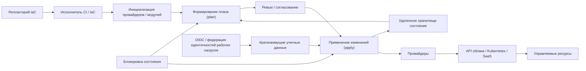
```mermaid
flowchart LR
  Repo["Репозиторий IaC"] --> CI["Исполнитель CI / IaC"]
  CI --> Init["Инициализация провайдеров / модулей"]
  Init --> Plan["Формирование плана (plan)"]
  Plan --> Approval["Ревью / согласование"]
  Approval --> Apply["Применение изменений (apply)"]

  State["Удаленное хранилище состояния"] --> Plan
  Apply --> State
  Lock["Блокировка состояния"] --> Plan
  Lock --> Apply

  OIDC["OIDC / федерация идентичностей рабочих нагрузок"] --> Creds["Краткоживущие учетные данные"]
  Creds --> Apply
  Apply --> Providers["Провайдеры"]
  Providers --> Cloud["API облака / Kubernetes / SaaS"]
  Cloud --> Resources["Управляемые ресурсы"]
```

#### Границы ответственности
Terraform/OpenTofu меняет инфраструктуру, но не определяет безопасность архитектуры. Команда отвечает за ревью модулей, закрепление провайдеров, защиту удаленного состояния, разделение обязанностей, минимальные привилегии, обнаружение дрейфа, согласование плана и применения, проверки политик как кода и восстановление состояния.

Хранилище состояния следует считать ценным активом: доступ к нему часто раскрывает топологию, привязки IAM и секреты инфраструктуры.

#### Типовые рабочие паттерны
- Удаленное хранилище состояния с шифрованием, контролем доступа, аудитом, резервным копированием, версионированием и блокировкой.
- Отдельные конфигурации и хранилища состояния с независимыми правами доступа и учетными данными для сред и областей ответственности, требующих изоляции.
- План в запросе на слияние или изменение; применение только после согласования.
- Краткоживущие облачные учетные данные через OIDC или федерацию идентичностей рабочих нагрузок вместо долгоживущих ключей.
- Закрепление версий провайдеров и модулей; ревью внешних источников модулей.
- Политики как код, запрещающие публичную доступность, широкие права IAM, нешифрованные хранилища и небезопасные ресурсы Kubernetes.
- Обнаружение дрейфа и процесс импорта ресурсов, измененных вне IaC.
- Отсутствие секретов в переменных, сохраняемых в Git, публикуемых выходных значениях и журналах CI; ограниченный доступ и шифрование для состояния и планов, содержащих секреты.

#### Проверка безопасности и эксплуатации

Признак `sensitive` скрывает значение при обычном выводе, но сам по себе не шифрует и не исключает его из состояния или сохраненного плана. Если конкретные версии CLI и провайдера поддерживают временные значения и аргументы только для записи, эти возможности позволяют избежать сохранения значений. Проверяйте фактическое состояние и план. Сохраненный план определяет выполняемые изменения и требует защиты как чувствительный артефакт: согласовывайте и применяйте один защищенный план, связанный с версией исходного кода и средой.

Машиночитаемый вывод также требует защиты: `terraform output -json` и `-raw` раскрывают чувствительные значения без обычного маскирования. Не публикуйте такой вывод в комментариях PR, общих журналах или отчетах стороннего сервиса без проверки состава данных. Для передачи плана между заданиями задавайте ограниченный доступ и срок хранения; проверяйте связь согласования с точным артефактом, а при замене плана требуйте новое согласование. Проверьте отказ применения подмененного артефакта и отсутствие контрольного секрета в общедоступных результатах конвейера.

Рабочие пространства CLI разделяют состояния внутри одной конфигурации, но не создают независимую границу доступа. Не используйте только переключение workspace для изоляции тестовой и рабочей среды. Проверьте, что учетные данные тестового конвейера не позволяют читать или менять состояние рабочей среды и обращаться к ее ресурсам. Рабочие пространства HCP Terraform имеют другую модель доступа; оценивайте ее отдельно.

Возможности подсистем хранения различаются. Проверьте, что второй процесс не может одновременно получить блокировку состояния; снимайте блокировку только в порядке исключения. Для текущих версий Terraform с хранилищем S3 включайте `use_lockfile`; блокировка через DynamoDB объявлена устаревшей. Совместимость с OpenTofu и разными клиентами проверяйте отдельно, не копируйте настройки без проверки.

В Terraform файл `.terraform.lock.hcl` фиксирует версии и контрольные суммы провайдеров, но не версии удаленных модулей. Храните его в Git и проверяйте изменения; модули закрепляйте отдельно точной версией или неизменяемой ревизией источника. Контрольная сумма подтверждает совпадение с ранее выбранным пакетом, а не безопасность его кода. Проверяйте первоначальный источник и издателя до принятия нового файла фиксации; повторная инициализация в CI не должна незаметно обновлять согласованные зависимости.

#### Связанные файлы из проекта
- `content/review/architecture/checklist.ru.md` / `checklist.en.md`: границы доверия, потоки данных и изменения архитектуры через IaC.
- `content/review/release-governance/playbook.ru.md` / `playbook.en.md`: согласования, подтверждения готовности релиза и разделение обязанностей для инфраструктурных изменений.
- `content/application-security/identity/oidc-oauth/playbook.ru.md` / `playbook.en.md`: федерация OIDC для CI/CD и рабочих нагрузок.
- `content/platform-security/secrets/vault/playbook.ru.md` / `playbook.en.md`: получение учетных данных и секретов из Vault.
- Отдельного плейбука по Terraform/OpenTofu пока нет.

## Хранилища данных, поиск и обмен сообщениями

### Объектное хранилище

#### Для чего используется
Объектное хранилище содержит файлы и двоичные объекты: пользовательские загрузки, резервные копии, журналы, артефакты, данные аналитических хранилищ, статические ресурсы, наборы данных ML и экспорт. Примеры: Amazon S3, Google Cloud Storage, Azure Blob Storage и S3-совместимые системы, включая MinIO.

#### Модель работы
Бакет или контейнер является верхнеуровневой единицей хранения. Объект содержит данные, метаданные, ключ или имя и версии, если версионирование включено. Префикс в большинстве объектных хранилищ не является настоящим каталогом: это соглашение об именовании для группировки объектов, политик жизненного цикла и условий IAM.

Доступ определяется политиками IAM, политиками бакета (bucket) или контейнера, ACL и устаревшими моделями доступа. В рабочих средах предпочтительна централизованная модель IAM с запретом публичного доступа по умолчанию; ACL нужны только для понятных и необходимых случаев. Подписанные ссылки (signed URL, presigned URL) и токены SAS дают временный доступ к загрузке или скачиванию без выдачи облачных учетных данных. Сама ссылка является учетными данными предъявителя; фактический срок действия и отзыв зависят от поставщика, способа подписи, срока действия учетных данных и текущей политики доступа.

Шифрованием может управлять поставщик, заказчик через KMS или клиентское приложение. Версионирование, сроки хранения, мягкое удаление и Object Lock или другие механизмы неизменяемости защищают от случайного удаления, шифровальщиков и разрушительных действий внутренних нарушителей, но увеличивают стоимость и требуют управления жизненным циклом. Журналы доступа и облачного аудита позволяют установить, кто читал, записывал, удалял объекты или менял политику.

#### Схема взаимодействия
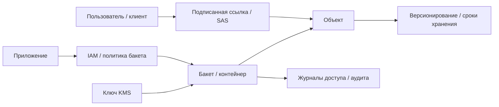
```mermaid
flowchart LR
  App["Приложение"] --> IAM["IAM / политика бакета"]
  IAM --> Bucket["Бакет / контейнер"]
  User["Пользователь / клиент"] --> SignedURL["Подписанная ссылка / SAS"]
  SignedURL --> Object["Объект"]
  Bucket --> Object
  Object --> Versioning["Версионирование / сроки хранения"]
  Bucket --> Logs["Журналы доступа / аудита"]
  KMS["Ключ KMS"] --> Bucket
```

#### Границы ответственности
Объектное хранилище надежно хранит данные и применяет политику доступа, но не понимает их бизнес-смысл. Команда отвечает за владение бакетом, публичную доступность, именование, область и срок подписанных ссылок, проверку загрузок на вредоносное содержимое, шифрование и KMS, жизненный цикл, сроки хранения, тесты восстановления и защиту чувствительных данных в журналах и артефактах.

#### Типовые рабочие паттерны
- Закрытые бакеты и контейнеры по умолчанию; явный процесс исключений для публичного доступа.
- Отдельные бакеты по средам, чувствительности данных и областям ответственности.
- Подписанные ссылки на загрузку и скачивание с коротким TTL и ограничениями метода и ключа объекта.
- Серверное шифрование с KMS для чувствительных данных.
- Версионирование, мягкое удаление и заданные сроки хранения резервных копий и критичных артефактов.
- Object Lock или неизменяемое хранение для архивов по обязательным требованиям и резервных копий, устойчивых к шифровальщикам.
- Журналы доступа и аудита в отдельном хранилище, куда отправитель имеет только право записи.
- Политики жизненного цикла для старых версий, незавершенных загрузок и временного экспорта.

#### Проверка безопасности и эксплуатации

Подписанная ссылка обычно допускает повторное использование в течение срока действия; она не является одноразовым разрешением. Отзыв зависит от поставщика и способа подписи, поэтому нельзя обещать, что отзыв одних учетных данных немедленно отменит все ссылки. Не допускайте попадания ссылок в журналы и заголовки Referer, ограничивайте операцию и объект, проверяйте истечение срока и отзыв на используемом механизме.

Для пользовательских загрузок проверяйте на сервере право использовать заданный ключ объекта, исключайте перезапись объекта другого арендатора и проверяйте размер, тип и содержимое завершенного объекта перед публикацией. Подпись запроса загрузки не доказывает безопасность полученного файла.

Не публикуйте изменяемый ключ объекта только на основании ранее успешной проверки: действующая ссылка на загрузку может позволить заменить содержимое после сканирования. Принимайте файл в закрытую область, связывайте результат проверки с конкретной версией или неизменяемым содержимым и публикуйте именно проверенный объект в область, куда клиент не имеет права записи. Проверяйте повторную и параллельную загрузку по той же ссылке во время сканирования и после него: непроверенное содержимое не должно получить статус проверенного файла.

В S3 с включенным версионированием обычный `DELETE` без `versionId` создает маркер удаления, а не уничтожает старые версии. Для требований удаления проверяйте все версии объекта, правила удаления нетекущих версий и копии, охваченные политикой хранения. Ответ `404` на обычное чтение не доказывает удаления данных. Учитывайте ограничения неизменяемого хранения и отдельно проверяйте, может ли роль приложения читать старую версию по идентификатору.

#### Связанные файлы из проекта
- `content/review/architecture/checklist.ru.md` / `checklist.en.md`: потоки данных, границы доверия и доступность хранилища извне.
- `content/supply-chain/slsa-provenance/overview.ru.md` / `overview.en.md`: хранение артефактов, SBOM и сведений о происхождении.
- Отдельного плейбука по объектным хранилищам пока нет.

### PostgreSQL и реляционные базы данных

#### Для чего используется
PostgreSQL и другие реляционные БД хранят транзакционное состояние, учетные записи, заказы, расчеты, данные авторизации, записи аудита и другие сведения, для которых важны согласованность, ссылочная целостность и гибкость запросов.

#### Модель работы
База данных содержит схемы, таблицы, индексы, представления, функции и роли. Схема группирует объекты и часто разделяет предметные области или арендаторов, но сама по себе не заменяет контроль доступа. Роль может разрешать вход или объединять привилегии группы. Привилегии определяют право подключения, чтения, записи, изменения схемы, вызова функций и управления объектами.

Повторное использование соединений через пул снижает нагрузку на базу данных и ограничивает количество активных соединений. В рабочих средах часто используются PgBouncer или управляемые сервисы пулов соединений; важно понимать выбранный режим, поскольку объединение соединений на уровне транзакций или сессий влияет на подготовленные запросы, временные таблицы, переменные сессии и переключение ролей. Миграции изменяют схему данных: их нужно версионировать, проверять, по возможности делать обратимыми и обеспечивать совместимость с поэтапным развертыванием.

Безопасность на уровне строк (RLS) ограничивает строки политикой БД и помогает изоляции арендаторов, но требует строгой модели владения, тестов обхода и контроля привилегированных ролей. Резервное копирование и восстановление на момент времени опираются на базовые копии и WAL или архивные журналы. Реплики для чтения снижают нагрузку и помогают восстановлению, но требуют отдельного контроля доступа и учета задержки репликации в логике приложения.

Расширения, привилегии уровня суперпользователя и процедурные языки расширяют возможности БД и зону поражения. Аудит должен охватывать привилегированные действия, DDL, неудачную аутентификацию и доступ к чувствительным таблицам, где это требуется.

#### Границы ответственности
СУБД обеспечивает хранение, транзакции, привилегии и репликацию. Команда отвечает за владение схемой, минимальные права ролей, ротацию секретов, безопасность миграций, тесты восстановления, шифрование, сетевую доступность, аудит, изоляцию арендаторов и защиту чувствительных данных в запросах, дампах и репликах.

#### Типовые рабочие паттерны
- Управляемый PostgreSQL в закрытой сети.
- Отдельные роли для чтения и записи приложения, миграций и администрирования.
- Пул соединений с явно выбранным режимом.
- Резервные копии с регулярной проверкой восстановления и измеренными RPO/RTO.
- PITR для критичных транзакционных систем.
- Реплики для чтения с отдельными политиками доступа.
- RLS для общих таблиц арендаторов с высоким риском после отдельного моделирования угроз.
- Аудит привилегированных операций и доступа к чувствительным данным.

#### Проверка безопасности и эксплуатации

В PostgreSQL суперпользователи и роли с `BYPASSRLS` всегда обходят RLS. Владельцы таблиц обычно тоже обходят политики; `FORCE ROW LEVEL SECURITY` подчиняет владельца политикам, но не ограничивает суперпользователей и `BYPASSRLS`. Роль приложения не должна владеть таблицами арендаторов или иметь возможность перейти в роль, обходящую RLS. Проверяйте функции `SECURITY DEFINER` и сочетание разрешающих и ограничивающих политик.

RLS не ограничивает операции уровня таблицы, включая `TRUNCATE` и `REFERENCES`: соответствующие права проверяйте отдельно. Проверки уникальности, первичного и внешнего ключа обходят RLS ради целостности данных и могут раскрывать существование скрытой записи через результат операции. Для общих таблиц проверяйте конфликт уникальности и ссылку на объект другого арендатора; включайте контекст арендатора в ограничения там, где это соответствует бизнес-инварианту, и не раскрывайте внутренние детали ошибок клиенту. Не считайте отказ `SELECT` доказательством отсутствия таких каналов раскрытия.

Проверяйте чтение и запись через фактическую роль приложения и пул соединений, включая повторное использование соединения другим арендатором и подмену контекста арендатора. Если идентичность арендатора хранится в настройке сессии, безопасно сбрасывайте ее; выбранное клиентом значение не является независимым доказательством прав. После восстановления резервной копии проверяйте права и политики RLS.

Для функций `SECURITY DEFINER` задавайте защищенный `search_path`, исключая схемы, доступные недоверенным пользователям для записи, и явно помещая `pg_temp` последним. Ограничивайте право `EXECUTE`: новые функции по умолчанию доступны `PUBLIC`, поэтому в одной транзакции создавайте функцию, явно отзывайте право выполнения у `PUBLIC` и предоставляйте его только разрешенным ролям. Назначение права выбранной роли само по себе не отменяет доступ `PUBLIC`. Проверьте подмену объекта через временную таблицу и вызов от имени роли, которой функция не предназначена.

Для PITR нужна базовая физическая копия и непрерывная цепочка WAL до выбранной точки восстановления; дамп `pg_dump` не заменяет такую копию. Проверяйте восстановление на заданный момент в изолированной среде, измеряйте фактические RPO/RTO и контролируйте задержку архивации и свободное место в `pg_wal`. Конфигурация `postgresql.conf`, `pg_hba.conf` и `pg_ident.conf` не восстанавливается проигрыванием WAL: сохраняйте ее отдельно и проверяйте после восстановления.

#### Связанные файлы из проекта
- `content/review/architecture/checklist.ru.md` / `checklist.en.md`: классификация данных, изоляция арендаторов и границы доверия.
- `content/application-security/business-logic/business-logic-abuse/playbook.ru.md` / `playbook.en.md`: операции с требованиями к целостности и сценарии злоупотребления.
- Отдельного плейбука по безопасности БД пока нет.

### Redis

#### Для чего используется
Redis используют как кеш, хранилище сессий и счетчиков для ограничения частоты запросов, простую очередь, основу распределенных блокировок и быструю БД «ключ-значение». В рабочих средах Redis часто участвует в аутентификации, авторизации, корзине покупок, фоновых заданиях и защите от злоупотреблений.

#### Модель работы
Redis хранит строки, хеши, списки, множества, упорядоченные множества, потоки и другие структуры. Данные обычно находятся в памяти; сохранение настраивается через снимки RDB, AOF или их сочетание. Репликация и кластеризация повышают доступность и масштабируемость, но требуют понимания согласованности, переключения при отказе и распределения ключей.

AUTH и ACL ограничивают доступ клиентов к командам и шаблонам ключей. TLS защищает сетевой трафик. Ненужные приложению административные команды, изменения настроек сохранения данных, скрипты и массовые операции с ключами могут привести к потере данных, раскрытию учетных данных, DoS или обходу границ арендаторов.

Политика вытеснения определяет удаляемые при нехватке памяти ключи. Для кеша это штатное поведение, для сессий или очереди возможен инцидент. При совместном использовании Redis необходимы контроль доступа к ключам и каналам и проверенная изоляция ресурсов; одни префиксы ключей не ограничивают потребление памяти отдельным арендатором. Для разных зон доверия часто надежнее отдельные экземпляры.

#### Границы ответственности
Redis предоставляет быстрое хранилище данных в памяти и механизмы сохранения и репликации, но корректность и безопасность использования кеша, сессий и блокировок зависят от приложения. Команда отвечает за сетевую изоляцию, AUTH/ACL/TLS, ограничения команд, пространства имен ключей, лимиты памяти, поведение вытеснения, резервные копии там, где они нужны, мониторинг и защиту секретов и персональных данных в значениях.

#### Типовые рабочие паттерны
- Управляемый Redis или изолированное частное развертывание.
- TLS и ACL с отдельными пользователями для приложений и эксплуатации.
- Запрет опасных команд для пользователей приложений.
- Отдельные экземпляры для кеша, сессий, очередей и ограничений частоты.
- Явные TTL ключей кеша и сессий.
- Лимиты памяти и политика вытеснения с учетом назначения.
- Мониторинг памяти, вытеснений, заблокированных клиентов, задержки репликации и выполнения команд.

#### Проверка безопасности и эксплуатации

Префиксы ключей и нумерованные логические базы не являются самостоятельными границами безопасности. Используйте именованных пользователей ACL с ограниченным набором команд, шаблонов ключей и при необходимости каналов Pub/Sub. Проверяйте фактические команды: ограничение по шаблону ключей не заменяет отдельной проверки доступа к административным операциям, сценариям и каналам. Обычный Redis не предоставляет квоты памяти арендаторов только потому, что ключи имеют разные префиксы.

Шаблоны ключей ACL не фильтруют результаты перечисления всей базы: разрешенные `SCAN` и `KEYS` могут раскрыть имена чужих ключей, даже если чтение их значений запрещено. Не выдавайте эти команды пользователю приложения без необходимости; параметр `MATCH`, выбранный клиентом, не является ограничением доступа. Проверяйте перечисление от имени каждого ограниченного пользователя с шаблоном `*`, а не только отказ `GET` для чужого ключа.

Репликация Redis асинхронна. При переключении на реплику может потеряться недавнее изменение блокировки или счетчика; после истечения срока действия блокировки ее прежний владелец может продолжить работу, когда блокировку уже получил другой процесс. При снятии блокировки проверяйте владельца. Для записей, требующих строгой корректности, применяйте проверяемые целевым ресурсом маркеры владения (fencing tokens) либо транзакционный механизм. Проверяйте сохранение бизнес-инварианта при переключении на реплику и истечении срока действия блокировки. Определите и протестируйте, отклоняются ли запросы или применяется ограниченный режим при недоступности Redis для аутентификации и ограничения частоты.

Отключение пользователя ACL через `off` запрещает новую аутентификацию, но не закрывает уже аутентифицированные соединения. При отзыве доступа проверяйте как новое подключение, так и действующий пул приложения; при необходимости завершайте существующие соединения поддерживаемым административным механизмом. Ротация пароля без проверки старого соединения не доказывает немедленного отзыва доступа.

Если Redis хранит данные, которые нельзя восстановить из другого источника, выбирайте RDB/AOF и `appendfsync` с учетом допустимой потери данных и задержки записи. Снимок RDB не сохраняет последующие изменения; включение AOF не означает, что каждая подтвержденная запись уже достигла устойчивого носителя. Проверяйте восстановление из сохраненного комплекта файлов и потерю записей после аварийного завершения. Отслеживайте ошибки сохранения, свободное место на диске и влияние снимков и переписывания AOF на память и задержку запросов.

#### Связанные файлы из проекта
- `content/application-security/business-logic/business-logic-abuse/playbook.ru.md` / `playbook.en.md`: ограничения частоты, сессии и защита от злоупотреблений.
- `content/review/architecture/checklist.ru.md` / `checklist.en.md`: управление состоянием и проверка потоков данных.
- Отдельного плейбука по Redis пока нет.

### Векторная база данных

#### Для чего используется
Векторная БД хранит векторные представления и ищет близкие векторы. Ее применяют для RAG, семантического поиска, рекомендаций, удаления дубликатов, обнаружения аномалий и других задач поиска по смыслу или признакам вместо точного совпадения.

#### Модель работы
Модель векторных представлений преобразует текст, изображение, событие или другой объект в числовой вектор фиксированной размерности. БД хранит вектор, ID объекта, метаданные и иногда ссылку на исходный документ или фрагмент. Приложение строит вектор запроса и ищет ближайших соседей по метрике сходства, например косинусному сходству, скалярному произведению или евклидову расстоянию.

Индекс ускоряет поиск, часто используя алгоритмы приближенного поиска ближайших соседей. Такой поиск снижает задержку и стоимость, но может пропускать подходящие результаты; качество выдачи нужно измерять отдельно. Фильтры метаданных ограничивают выдачу по арендатору, классу документа, источнику, ACL и другим атрибутам. В RAG они должны участвовать в авторизации, а не только упрощать поиск.

Векторная БД обычно не заменяет основное хранилище. Исходные документы и разрешения часто хранятся в объектном хранилище, БД или хранилище документов, где также управляют их жизненным циклом и удалением, а векторный индекс является производным представлением. При обновлении или удалении документа обновляйте векторы, метаданные и индекс, иначе поиск может вернуть уже недоступные или удаленные по политике данные.

#### Границы ответственности
Векторная БД хранит векторы и ищет сходные векторы, но не гарантирует корректную авторизацию, качество источников и безопасность найденного контекста. Команда отвечает за изоляцию арендаторов, проверку прав доступа к документам, целостность метаданных, проверку поступающих данных, удаление соответствующих записей во всех производных хранилищах, шифрование, резервные копии, аудит, мониторинг и защиту от отравления набора исходных документов, утечек через векторы и поиска без ограничений на потребление ресурсов.

#### Типовые рабочие паттерны
- Отдельные индексы или пространства имен по арендатору, среде и чувствительности, если общий индекс усложняет изоляцию.
- Поиск с учетом разрешений: фильтрация доступа до передачи контекста модели.
- Схема метаданных с владельцем, источником, классификацией, арендатором, версией документа и состоянием удаления.
- Конвейер загрузки с проверкой формата, вредоносного содержимого, происхождения и дубликатов.
- Лимиты поиска: `top_k`, порог оценки сходства, размер результата и частота запросов.
- Набор тестов качества поиска и утечек перед изменениями рабочей среды.
- Запись в журнал аудита запросов, идентификаторов найденных документов, фильтров метаданных и административных изменений.
- Регулярная пересборка или очистка индекса после удаления документов, изменения разрешений и обновления модели векторных представлений.

#### Проверка безопасности и эксплуатации

Формируйте фильтры арендатора и прав на сервере по аутентифицированному субъекту, а не по ответу модели или выбранным клиентом метаданным. Если разрешения индекса могут отставать, проверяйте текущие права на найденные документы в исходном хранилище до возврата их содержимого. Пространство имен индекса не защищает данные, если клиент может выбрать другое пространство или выполнить запрос без обязательного фильтра.

Проверьте запросы между арендаторами, прямое получение объекта, отзыв прав, удаленные документы, кеш поиска и экспорт индекса. Измерьте задержку удаления и отзыва доступа в источнике, индексе и кешах, учитывайте сроки хранения резервных копий. Защищайте векторы и журналы запросов как чувствительные производные данные.

#### Связанные файлы из проекта
- `content/ai-security/securing-ai/overview.ru.md` / `overview.en.md`: жизненный цикл LLMSecOps, конвейер данных RAG и защита векторной БД.
- `content/ai-security/owasp-llm-top-10/overview.ru.md` / `overview.en.md`: LLM08 Vector and Embedding Weaknesses.
- Отдельного плейбука по безопасности векторных БД пока нет.

### Elasticsearch / OpenSearch

#### Для чего используется
Elasticsearch и OpenSearch используют для поиска, анализа журналов, наблюдаемости, аналитики безопасности и индексирования документов. Они часто хранят журналы приложений, события аудита, поисковые индексы для клиентов и эксплуатационную телеметрию.

#### Модель работы
Кластер состоит из узлов и хранит индексы. Индекс содержит документы и описание полей и типов (mapping). Шарды разделяют индекс для масштабирования и репликации. Конвейер загрузки может преобразовывать документы: разбирать журналы, добавлять поля, нормализовать события или удалять часть данных.

Доступ задается на уровне кластера, индекса, документа и поля в зависимости от дистрибутива, редакции и конфигурации. OpenSearch Dashboards и Kibana предоставляют поиск и визуализацию, но при неправильной публикации открывают доступ к журналам, персональным данным, токенам и сведениям о внутренней инфраструктуре.

Репозитории снимков служат для резервного копирования, восстановления и миграции. Они часто находятся в объектном хранилище, поэтому их IAM и сроки хранения не менее важны, чем права кластера. Журналы и трассировки считаются чувствительными данными: в них могут быть заголовки авторизации, ID сессий, адреса почты, фрагменты запросов, трассировки стека и внутренние имена хостов.

#### Границы ответственности
Поисковый кластер индексирует документы, но безопасное журналирование и права читателей настраивает команда. Она отвечает за сетевую доступность, аутентификацию, авторизацию, изоляцию арендаторов и индексов, маскирование полей, очистку при загрузке, доступ к панелям, защиту снимков, сроки хранения, стоимость и число уникальных значений полей (кардинальность).

#### Типовые рабочие паттерны
- Управляемый или выделенный кластер в частной сети.
- Отдельные индексы или кластеры по средам и чувствительности.
- Управление жизненным циклом индексов для контроля хранения и стоимости.
- Маскирование секретов, токенов и персональных данных при загрузке.
- Минимальные права ролей доступа к панелям.
- Репозиторий снимков с ограниченным IAM и проверками восстановления.
- Оповещения о неудачной аутентификации, публичной доступности, порогах заполнения диска и всплесках загрузки.

#### Проверка безопасности и эксплуатации

Разделяйте учетные записи для загрузки данных и для поиска и работы с панелями. Ограничения доступа на уровне документов и полей действуют при чтении; они не означают, что разрешенная запись ограничена только видимыми документами или полями. Проверяйте итоговые права по всем назначенным ролям: в Elasticsearch другая роль с неограниченным доступом к тому же индексу снимает соответствующее ограничение на документы или поля. Разрешения нескольких ролей объединяются, поэтому узкая роль не сужает доступ, уже предоставленный широкой. Включите в тест назначение дополнительных групп и ролей: скрытые поля и документы не должны становиться доступными без предусмотренного решения о расширении прав. Проверяйте прямые обращения к API, а не только интерфейс панели.

На синтетических документах двух арендаторов проверьте поиск, получение документа по идентификатору, пакетный поиск, экспорт и все разрешенные API записи. Подтвердите, что учетная запись загрузки не может читать посторонние индексы, а пользователи поиска не могут менять схемы полей, сроки хранения, роли или репозитории резервных копий. Прежде чем полагаться на ограничения доступа к документам и полям, проверьте их поддержку в установленном дистрибутиве и редакции.

Для резервного копирования Elasticsearch используйте штатные снимки кластера: копии каталогов данных узлов и снимки файловой системы не заменяют поддерживаемую резервную копию, даже при остановленных узлах. Не удаляйте и не меняйте отдельные файлы репозитория снимков средствами объектного хранилища; управляйте снимками через API Elasticsearch, иначе последующее восстановление может завершиться ошибкой или незаметной потерей данных.

Восстанавливайте снимки в изолированной среде и явно выбирайте индексы данных, глобальное состояние и состояния компонентов (feature states). В Elasticsearch восстановление состояния `security` перезаписывает системные индексы аутентификации; заранее подготовьте проверенную процедуру восстановления и независимый путь доступа. До подключения приложений проверьте восстановленные правила доступа, права на репозиторий и сроки хранения. Восстановление старых данных не должно незаметно возвращать документы, для которых по-прежнему требуется удаление или отзыв доступа.

#### Связанные файлы из проекта
- `content/review/architecture/checklist.ru.md` / `checklist.en.md`: потоки чувствительных данных и интерфейсы наблюдаемости.
- `content/application-security/web/browser-security/playbook.ru.md` / `playbook.en.md`: журналы и телеметрия клиентского кода с браузерными данными.
- Отдельного плейбука по Elasticsearch/OpenSearch пока нет.

### Kafka

#### Для чего используется
Apache Kafka обеспечивает распределенное хранение и передачу потоков событий. Ее используют как шину событий, конвейер загрузки, журнал аудита, источник данных для потоковой обработки и буфер между сервисами. Часто от этой общей платформы зависят бизнес-операции, телеметрия и интеграции.

#### Модель работы
Брокер хранит разделы (partitions) топика и обслуживает производителей и потребителей сообщений. Топик (topic) является логической категорией событий, например `orders.created`. Раздел хранит упорядоченную последовательность записей; новые записи добавляются в конец. Разделение топика позволяет обрабатывать его части параллельно. Реплика является копией раздела на другом брокере для отказоустойчивости. Контроллер управляет метаданными кластера, выбором лидеров разделов и изменениями состояния.

Производитель публикует записи в топик, выбирая раздел явно или через механизм распределения. Потребитель читает записи и меняет позицию чтения, обозначенную смещением (offset). Обычная группа потребителей распределяет разделы между экземплярами приложения: каждый раздел в группе в один момент читает только один экземпляр. Это обеспечивает горизонтальное масштабирование обработки.

Schema Registry хранит схемы событий и проверяет совместимость контрактов производителей и потребителей. Kafka Connect запускает коннекторы, которые передают данные между Kafka и БД, объектными хранилищами, поисковыми системами или другими сервисами. ACL определяют право чтения, записи, создания и администрирования топиков, групп и ресурсов кластера.

Кластеры Kafka `4.x` работают в режиме KRaft без ZooKeeper; старые кластеры `3.x` могут сохранять ZooKeeper на время миграции. Производитель отправляет событие брокеру-лидеру раздела; брокер записывает его в журнал и передает копии на брокеры с репликами раздела; группа потребителей читает события и фиксирует смещения; зависимые сервисы используют события для обработки, интеграции или аналитики.

#### Схема взаимодействия
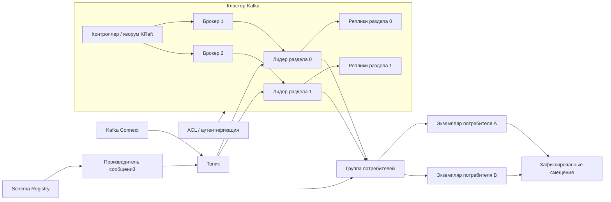
```mermaid
flowchart LR
  Producer["Производитель сообщений"] --> Topic["Топик"]
  Topic --> P0["Лидер раздела 0"]
  Topic --> P1["Лидер раздела 1"]

  subgraph KafkaCluster["Кластер Kafka"]
    Broker1["Брокер 1"] --> P0
    Broker2["Брокер 2"] --> P1
    P0 --> R0["Реплики раздела 0"]
    P1 --> R1["Реплики раздела 1"]
    Controller["Контроллер / кворум KRaft"] --> Broker1
    Controller --> Broker2
  end

  P0 --> CG["Группа потребителей"]
  P1 --> CG
  CG --> C1["Экземпляр потребителя A"]
  CG --> C2["Экземпляр потребителя B"]
  C1 --> Offsets["Зафиксированные смещения"]
  C2 --> Offsets

  Schema["Schema Registry"] --> Producer
  Schema --> CG
  Connect["Kafka Connect"] --> Topic
  ACL["ACL / аутентификация"] --> KafkaCluster
```

#### Границы ответственности
Kafka обеспечивает доставку, хранение и репликацию событий, но не определяет права доступа вместо приложения. Команды отвечают за владельцев топиков, ACL, изоляцию арендаторов, шифрование при передаче, сроки хранения, управление схемами, защиту персональных данных и секретов в событиях и обработку повторной доставки.

Kafka не гарантирует безопасную интерпретацию сообщения потребителем.

#### Типовые рабочие паттерны
- Управляемая Kafka или выделенный платформенный кластер. Для собственной Kafka `4.x` явно обеспечивайте работу кворума KRaft, а оставшуюся зависимость от ZooKeeper рассматривайте как незавершенную миграцию.
- TLS для соединений клиентов с брокерами и между брокерами.
- SASL, OAuth или mTLS для аутентификации.
- ACL по топику и группе.
- Schema Registry для контрактов.
- Отдельные кластеры по границам доверия либо разделение имен топиков и групп по средам и предметным областям с явно настроенными ACL. Префикс имени сам по себе не ограничивает доступ.
- Отдельное управление секретами Kafka Connect.
- Мониторинг отставания потребителей, разделов с неполным набором синхронизированных реплик, ошибок аутентификации и нагрузки на хранилище.

#### Проверка безопасности и эксплуатации

Обычная группа потребителей назначает каждый раздел одному потребителю одновременно, но это не обеспечивает однократное выполнение внешних действий. Фиксируйте смещения после требуемого надежно сохраненного результата и делайте повторы идемпотентными. Транзакции Kafka могут согласованно фиксировать записи Kafka и смещения, но не выполняют автоматически атомарную фиксацию платежа, изменения БД или вызова внешнего API. Группы совместного потребления (share groups) используют другую модель доставки; предположения обычных групп нельзя переносить на них без проверки.

Если потребитель должен видеть только завершенные транзакции Kafka, задайте `isolation.level=read_committed`; режим `read_uncommitted` может выдавать записи отмененных и еще открытых транзакций. Проверьте отмену транзакции и перезапуск: такие записи не должны запускать бизнес-действия, а позиция потребителя после отмены должна позволять повторить незавершенную обработку. Этот режим также возвращает нетранзакционные записи и не проверяет их бизнес-корректность.

Для надежной публикации проверьте действующие настройки производителя `acks=all`, `enable.idempotence=true`, совместимые настройки повторов и неподтвержденных запросов, а также требования топика к репликации и минимальному числу синхронизированных реплик. Проверьте отказ брокера, сокращение ISR, перезапуск после обработки до фиксации смещения и повторные события. Защищайте Schema Registry и Kafka Connect отдельно: это дополнительные сервисы и учетные данные, а не автоматически защищенные ACL топика компоненты.

#### Связанные файлы из проекта
- `content/review/architecture/checklist.ru.md` / `checklist.en.md`: событийная архитектура, границы доверия и проверка потоков данных.
- `content/platform-security/secrets/vault/playbook.ru.md` / `playbook.en.md`: выдача учетных данных, сертификатов и секретов подключений через Vault.
- Отдельного плейбука по Kafka пока нет.

### RabbitMQ

#### Для чего используется
RabbitMQ служит брокером сообщений для очередей, маршрутизации, асинхронной обработки, распределения задач и интеграции сервисов. Его используют для фоновых заданий, транзакционного обмена и интеграционных очередей, где важны правила маршрутизации, подтверждения обработки и замедление приема сообщений при перегрузке потребителей (backpressure).

#### Модель работы
Брокер принимает сообщения, хранит очереди и доставляет их потребителям. Виртуальный хост (virtual host, vhost) разделяет логическое пространство RabbitMQ: обменники, очереди, привязки, разрешения и политики существуют внутри виртуального хоста. Обменник (exchange) принимает публикации и выбирает очереди назначения. Очередь хранит сообщения для доставки; при ручном подтверждении чтение потребителем само по себе не удаляет сообщение окончательно. Удаление или повторная доставка зависят от подтверждения и правил очереди. Привязка связывает обменник с очередью по правилу маршрутизации.

Маршрутизация зависит от типа обменника и привязок. Тип `direct` сопоставляет ключи точно, `topic` использует шаблоны ключей, `fanout` отправляет во все связанные очереди независимо от ключа, `headers` выбирает по заголовкам сообщения. При ручных подтверждениях потребитель подтверждает доставку после требуемого результата обработки; сообщение остается неподтвержденным до положительного или отрицательного подтверждения либо закрытия канала. Автоматическое подтверждение считает доставку завершенной при отправке и может привести к потере работы при отказе потребителя.

Учитывайте тайм-аут подтверждения доставки: при его срабатывании брокер закрывает канал с `PRECONDITION_FAILED` и возвращает неподтвержденные доставки этого канала в очередь. Начиная с RabbitMQ `4.3`, этот механизм поддерживается только для quorum queues. Согласуйте настроенный тайм-аут с длительностью обработки и проверьте зависшего потребителя; не рассчитывайте, что временной лимит автоматически отправит сообщение в DLQ.

Политика задает поведение очередей и обменников: TTL, максимальную длину, обменник недоставленных сообщений (dead-letter exchange, DLX), параметры кворума и другие настройки. Операторская политика ограничивает клиентские аргументы и обычные политики, особенно по ресурсам. Разрешения пользователя определяют операции внутри виртуального хоста: `configure`, `write` и `read`.

Производитель публикует сообщение в обменник; тип обменника и привязки определяют места назначения; брокер хранит сообщение; потребитель получает и подтверждает его обработку. При ошибке обработки или истечении срока хранения настроенная схема DLX и повторных доставок определяет, повторить ли доставку, отложить сообщение или отправить его в очередь недоставленных сообщений.

#### Схема взаимодействия
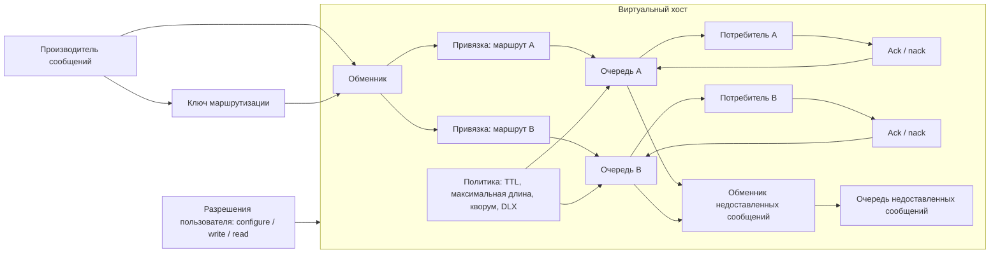
```mermaid
flowchart LR
  Producer["Производитель сообщений"] --> Exchange["Обменник"]
  Producer --> RoutingKey["Ключ маршрутизации"]
  RoutingKey --> Exchange

  subgraph VHost["Виртуальный хост"]
    Exchange --> BindingA["Привязка: маршрут A"]
    Exchange --> BindingB["Привязка: маршрут B"]
    BindingA --> QueueA["Очередь A"]
    BindingB --> QueueB["Очередь B"]
    QueueA --> ConsumerA["Потребитель A"]
    QueueB --> ConsumerB["Потребитель B"]
    ConsumerA --> AckA["Ack / nack"]
    ConsumerB --> AckB["Ack / nack"]
    QueueA --> DLX["Обменник недоставленных сообщений"]
    QueueB --> DLX
    DLX --> DLQ["Очередь недоставленных сообщений"]
    Policy["Политика: TTL, максимальная длина, кворум, DLX"] --> QueueA
    Policy --> QueueB
  end

  Permissions["Разрешения пользователя: configure / write / read"] --> VHost
  AckA --> QueueA
  AckB --> QueueB
```

#### Границы ответственности
RabbitMQ отвечает за доставку и маршрутизацию, но не за безопасность содержимого и корректность бизнес-операции при обработке. Команда отвечает за TLS, пользователей и разрешения, изоляцию vhost, политики очередей, DLQ, TTL, доступ к интерфейсу управления, учетные данные и проверку содержимого, особенно персональных данных и команд внутренним системам.

#### Типовые рабочие паттерны
- Кластер RabbitMQ с quorum queues для критичных очередей. Не проектируйте новые отказоустойчивые решения на classic mirrored queues, удаленных в RabbitMQ `4.x`.
- Постоянные очереди для рабочих сообщений. Временные неэксклюзивные классические очереди объявлены устаревшими в RabbitMQ `4.3+` и не должны использоваться как новая модель рабочей среды. Для временного состояния используйте эксклюзивные очереди с именами, назначенными сервером, или постоянные очереди с TTL.
- Отдельные виртуальные хосты по предметным областям, средам или командам.
- TLS для клиентских соединений.
- Минимально необходимые разрешения на обменники и очереди.
- Очередь недоставленных сообщений и схема повторной доставки.
- Обычные и операторские политики для TTL, максимальной длины, кворума и верхних лимитов ресурсов.
- Ограниченный доступ к интерфейсу управления.
- Мониторинг глубины очередей, числа потребителей, неподтвержденных сообщений и частоты публикации и подтверждений.

#### Проверка безопасности и эксплуатации

При ручных подтверждениях AMQP 0-9-1 доставка остается неподтвержденной, пока канал открыт; отсутствие подтверждения само по себе не означает отправку в очередь недоставленных сообщений. Закрытие канала или соединения обычно возвращает неподтвержденные сообщения в очередь с учетом лимитов доставок. `basic.nack` или `basic.reject` с `requeue=false` направляют сообщение в DLX только при его настройке, иначе сообщение удаляется. Ограничивайте число повторов и явно задавайте место хранения сообщений с неустранимой ошибкой.

Подтверждение публикации (publisher confirm) сообщает о результате приема брокером, а не о завершении обработки потребителем. Используйте подтверждения и обрабатывайте публикации без маршрута, например через `mandatory` и возвращенные сообщения: такая публикация тоже может получить подтверждение. Для критичных задач используйте подходящие постоянные очереди и сохраняемые сообщения, ручное подтверждение после надежной фиксации бизнес-результата, ограничение числа неподтвержденных доставок потребителю и идемпотентную обработку. Проверьте потерю соединения до подтверждения публикации, отказ потребителя до подтверждения обработки, недоступность целевой очереди DLX и повторную обработку из очереди ошибок.

Настройка DLX сама по себе не гарантирует сохранность: по умолчанию внутренняя перепубликация выполняется без подтверждений, и сообщение может потеряться при недоступности целевой очереди. Если потеря недопустима, проверяйте поддерживаемый режим `at-least-once` для исходной quorum queue и все его условия в используемой версии. Учитывайте возможные дубликаты и накопление сообщений при недоступности целевой очереди; проверьте восстановление маршрутизации и отсутствие повторного выполнения бизнес-операции.

Для этого режима в политике исходной очереди задайте `dead-letter-strategy=at-least-once`, `overflow=reject-publish` и `dead-letter-exchange`; проверьте необходимые флаги функций установленной версии. Значение `drop-head` приводит к передаче с гарантией `at-most-once`, даже без лимита длины. Ограничьте накопление через `max-length` или `max-length-bytes` и проверьте реакцию производителей на отказ в приеме новых сообщений при длительной недоступности целевой очереди. Не переключайте режим на `at-most-once` или `overflow` на `drop-head`, пока остаются сообщения без подтверждения целевых очередей: такое изменение удаляет их из исходной очереди.

#### Связанные файлы из проекта
- `content/review/architecture/checklist.ru.md` / `checklist.en.md`: асинхронные процессы, границы доверия и обработка сообщений.
- `content/platform-security/secrets/vault/playbook.ru.md` / `playbook.en.md`: управление учетными данными брокера и материалами TLS через Vault.
- Отдельного плейбука по RabbitMQ пока нет.
---

## Связанные материалы

- [Плейбук безопасности образов контейнеров](../../content/supply-chain/container-image-security/playbook.ru.md)
- [Плейбук ревью безопасности Kubernetes-кластера](../../content/platform-security/kubernetes/cluster-security-review/playbook.ru.md)
- [Плейбук Vault](../../content/platform-security/secrets/vault/playbook.ru.md)
- [Обзор безопасности ИИ](../../content/ai-security/securing-ai/overview.ru.md)
