# Справочник инфраструктурных технологий

Этот документ описывает, как работают ключевые технологии, которые часто встречаются в рабочей инфраструктуре и при проверке ее безопасности. Он не заменяет плейбуки: здесь фокус на назначении, модели работы, границах ответственности и типовых эксплуатационных паттернах.

Разделы сгруппированы по роли технологии в рабочей системе: сборка и цепочка поставки ПО, контейнерная платформа, идентичности и секреты, автоматизация, хранилища данных и обмен сообщениями.

## Оглавление

- [Сборка, доставка и цепочка поставки](#сборка-доставка-и-цепочка-поставки)
  - [Платформы CI/CD](#платформы-cicd)
  - [Docker](#docker)
  - [Реестр OCI и артефактов](#реестр-oci-и-артефактов)
  - [Helm](#helm)
- [Контейнерная платформа и среда выполнения Kubernetes](#контейнерная-платформа-и-среда-выполнения-kubernetes)
  - [Среды выполнения контейнеров](#среды-выполнения-контейнеров-container-runtimes)
  - [Kubernetes](#kubernetes)
  - [CNI и сеть Kubernetes](#cni-и-сеть-kubernetes)
  - [Ingress / Gateway / API Gateway](#ingress--gateway--api-gateway)
  - [Istio](#istio)
  - [Механизмы политик](#механизмы-политик)
- [Учетные записи, секреты и доступ](#учетные-записи-секреты-и-доступ)
  - [Облачный IAM и идентификация рабочих нагрузок](#облачный-iam-и-идентификация-рабочих-нагрузок)
  - [Vault](#vault)
- [Автоматизация и управление конфигурацией](#автоматизация-и-управление-конфигурацией)
  - [Ansible](#ansible)
  - [Terraform / OpenTofu](#terraform--opentofu)
- [Хранилища данных, поиск и обмен сообщениями](#хранилища-данных-поиск-и-обмен-сообщениями)
  - [Объектное хранилище](#объектное-хранилище)
  - [PostgreSQL и реляционные базы данных](#postgresql-и-реляционные-базы-данных)
  - [Redis](#redis)
  - [Векторная база данных](#векторная-база-данных)
  - [Elasticsearch / OpenSearch](#elasticsearch--opensearch)
  - [Kafka](#kafka)
  - [RabbitMQ](#rabbitmq)
- [Связанные материалы](#связанные-материалы)

## Сборка, доставка и цепочка поставки

### Платформы CI/CD

#### Для чего используется
Платформы CI/CD собирают, тестируют, упаковывают, публикуют и развертывают программные артефакты. Типичные примеры: GitHub Actions, GitLab CI, Jenkins, Buildkite и TeamCity. В рабочей инфраструктуре это центральная часть цепочки поставки ПО: конвейер получает доступ к исходному коду, секретам, реестрам пакетов, облачным учетным записям, артефактам и средам развертывания.

#### Модель работы
Конвейер описывает последовательность заданий. Исполнитель или агент выполняет шаги задания: получение исходного кода, установку зависимостей, тесты, проверки безопасности, сборку, загрузку артефакта, публикацию образа и развертывание. Исполнитель может быть управляемым поставщиком CI/CD или собственным, размещенным в сети, облачной учетной записи или кластере Kubernetes команды.

Артефакты передают результаты сборки между заданиями и этапами. Кеш ускоряет повторные сборки, сохраняя зависимости и промежуточные результаты. Среда задает целевое окружение, например `staging` или `prod`, и правила защиты: обязательных проверяющих, задержки, ограничения веток и тегов, привязанные секреты. Хранилище секретов содержит токены, пароли, сертификаты и ключи подписи, доступные конвейеру при выполнении заданий.

Современная схема использует федерацию OIDC вместо долгоживущих статических секретов. Платформа CI/CD выпускает краткоживущий токен OIDC для конкретного задания или процесса с утверждениями о репозитории, ветке или теге, конвейере, среде и инициаторе. Облачный поставщик или Vault проверяет `issuer`, `audience`, `subject` и дополнительные утверждения, затем выдает временные учетные данные с ограниченными правами.

Конвейер развертывания не должен быть единственной точкой доверия. Конвейер собирает и публикует артефакт, а проверка допуска отдельно сверяет дайджест, подпись, происхождение, результат политики, согласование среды и допустимость релиза. Граница обычно проходит при передаче неизменяемого артефакта и запроса развертывания в Kubernetes, контроллер GitOps, оркестратор выпуска или облачный сервис развертывания.

Недоверенный ввод процесса образует отдельную границу доверия. Заголовки и содержимое запросов на слияние, комментарии к задачам, имена веток и тегов, примечания к выпуску, сообщения коммитов и код сторонних копий репозитория считаются подконтрольными атакующему при передаче в скрипты оболочки, команды развертывания, примечания к выпуску, шаги с ИИ или входные данные политик.

#### Схема взаимодействия
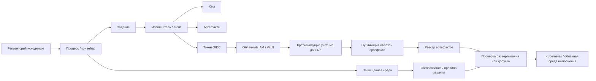
```mermaid
flowchart LR
  Repo["Репозиторий исходников"] --> Pipeline["Процесс / конвейер"]
  Pipeline --> Job["Задание"]
  Job --> Runner["Исполнитель / агент"]
  Runner --> Cache["Кеш"]
  Runner --> Artifacts["Артефакты"]
  Runner --> OIDC["Токен OIDC"]
  OIDC --> Cloud["Облачный IAM / Vault"]
  Cloud --> TempCreds["Краткоживущие учетные данные"]
  TempCreds --> Publish["Публикация образа / артефакта"]
  Publish --> Registry["Реестр артефактов"]
  Pipeline --> Env["Защищенная среда"]
  Env --> Approval["Согласование / правила защиты"]
  Approval --> DeployGate["Проверка развертывания или допуска"]
  Registry --> DeployGate
  DeployGate --> Runtime["Kubernetes / облачная среда выполнения"]
```

#### Границы ответственности
Платформа CI/CD запускает автоматизацию и предоставляет механизмы работы с секретами, исполнителями, артефактами, согласованиями и федерацией идентичностей, но не гарантирует безопасность конвейера. Команда отвечает за минимальные разрешения процессов, доверенные действия и плагины, изоляцию собственных исполнителей, защиту веток, тегов и сред, секреты, защиту от отравления кеша, целостность артефактов и разделение ролей сборки и развертывания.

Управляемые исполнители снижают нагрузку на эксплуатацию и обычно предоставляют чистую одноразовую среду. Собственные исполнители нужны для закрытых сетей, специализированного оборудования или обязательных требований, но требуют усиления защиты, очистки, контроля исходящих соединений, обновлений и защиты от сохранения присутствия атакующего между заданиями.

#### Типовые рабочие паттерны
- Защищенные ветки и теги для релизных ссылок.
- Согласование среды для развертывания в рабочую среду.
- Федерация OIDC с облачным поставщиком или Vault вместо статических секретов развертывания.
- Привязка доверия OIDC к `issuer`, `audience`, защищенной ветке, тегу или среде, идентичности процесса и репозитория. Широкое доверие всей организации не должно быть настройкой по умолчанию для развертывания в рабочую среду.
- Отдельные исполнители для доверенных и недоверенных рабочих нагрузок.
- Одноразовые собственные исполнители для сборок запросов на слияние с недоверенным кодом.
- Отсутствие секретов рабочей среды, ключей подписи и учетных данных развертывания на исполнителях недоверенного кода из сторонней копии репозитория или ветки.
- Загрузка артефактов по дайджесту и публикация SBOM, сведений о происхождении и подписей.
- Токен доступа к исходному коду только для чтения по умолчанию; права записи только у отдельных заданий.
- Проверка допуска к развертыванию, не полагающаяся только на успешное завершение конвейера.

#### Связанные файлы из проекта
- `content/supply-chain/slsa-provenance/overview.ru.md` / `overview.en.md`: доверенные системы сборки, происхождение и политика проверки.
- `content/review/release-governance/playbook.ru.md` / `playbook.en.md`: защищенные среды, релизные подтверждения и согласования.
- `content/platform-security/secrets/vault/playbook.ru.md` / `playbook.en.md`: выдача краткоживущих секретов и учетных данных для конвейера.
- Отдельного плейбука по безопасности CI/CD пока нет.

### Docker

#### Для чего используется
Docker используется для сборки, упаковки и запуска приложений в контейнерах. В рабочей инфраструктуре он чаще служит инструментом сборки образов, локальной разработки и конвейеров CI/CD, оставаясь частью цепочки поставки контейнеров даже тогда, когда в Kubernetes их запускает containerd или CRI-O.

#### Модель работы
`Dockerfile` описывает базовый образ, установку пакетов, копирование файлов, переменные окружения, пользователя, рабочий каталог и команду запуска. При сборке Docker превращает инструкции в слои. Каждый слой фиксирует изменение файловой системы, а итоговый образ становится переносимым артефактом для хранения в реестре и запуска в разных средах.

В OCI исполняемый образ не является одним непрозрачным файлом. Манифест образа для конкретной платформы ссылается на объект конфигурации и упорядоченный набор дескрипторов слоев файловой системы. Конфигурация хранит параметры запуска по умолчанию: точку входа, команду, окружение, пользователя, открытые порты, тома, метки и метаданные корневой файловой системы. Слои фиксируют изменения файловой системы и сами по себе не содержат конфигурацию выполнения. Индекс образов, часто называемый в Docker списком манифестов, ссылается на один или несколько платформенных манифестов.

Реестр хранит и выдает образы. Docker CLI передает команды сборки, публикации и запуска от разработчика или CI. Демон Docker исполняет их на хосте: собирает образ, создает контейнер, подключает тома и сети, задает ограничения и передает низкоуровневый запуск среде выполнения.

Контейнер представляет собой запущенный процесс с изолированным представлением файловой системы, процессов, сети и ресурсов. Том сохраняет данные при пересоздании контейнера. Сеть определяет взаимодействие контейнера с другими контейнерами, хостом и внешними системами.

Обычная последовательность: разработчик или CI собирает образ из `Dockerfile`, публикует в реестре, затем среда выполнения скачивает образ и запускает контейнер из неизменяемых слоев с заданными пространствами имен, cgroups, capabilities, монтированиями и сетью. В Kubernetes Docker чаще остается средством сборки и упаковки, а запуском на узле занимается среда выполнения контейнеров.

При ревью различайте `tag`, `digest` и ID образа. Тег является изменяемой ссылкой в реестре, если политика не запрещает его изменение. Дайджест идентифицирует содержимое: индекс, манифест, конфигурацию или слой. ID образа вычисляется из конфигурации и полезен локально, но политика развертывания в рабочую среду должна привязываться к дайджесту реестра, по которому Kubernetes и среда выполнения скачивают образ.

#### Схема взаимодействия
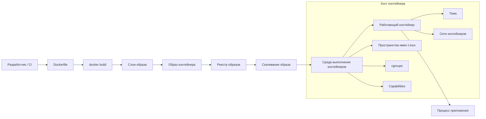
```mermaid
flowchart LR
  Dev["Разработчик / CI"] --> Dockerfile["Dockerfile"]
  Dockerfile --> Build["docker build"]
  Build --> Layers["Слои образа"]
  Layers --> Image["Образ контейнера"]
  Image --> Registry["Реестр образов"]

  Registry --> Pull["Скачивание образа"]
  Pull --> Runtime["Среда выполнения контейнеров"]
  Runtime --> Container["Работающий контейнер"]

  subgraph Host["Хост контейнера"]
    Runtime --> Namespaces["Пространства имен Linux"]
    Runtime --> Cgroups["cgroups"]
    Runtime --> Caps["Capabilities"]
    Container --> Volumes["Тома"]
    Container --> Networks["Сети контейнеров"]
  end

  Container --> App["Процесс приложения"]
```

#### Границы ответственности
Docker упаковывает приложение и задает параметры запуска, но не делает образ безопасным автоматически. Команда отвечает за минимизацию базового образа, отсутствие секретов в слоях, закрепление версий, сканирование зависимостей, запуск без root, ограничение capabilities и корректную публикацию в реестре.

Приложение по-прежнему отвечает за собственную аутентификацию, авторизацию, обработку входных данных и безопасную работу с секретами.

#### Типовые рабочие паттерны
- Сборка образов в CI.
- Хранение образов в закрытом реестре.
- Многоэтапные сборки.
- Минимальные базовые образы.
- Сканирование образов перед публикацией или развертыванием.
- Подпись образов и подтверждение происхождения для критичных сервисов.
- Развертывание по дайджесту; теги служат для поиска или обозначения каналов выпуска, но не являются основанием доверия к релизу.
- Запуск контейнеров в Kubernetes через containerd или CRI-O, а не напрямую через Docker Engine.

#### Связанные файлы из проекта
- `content/supply-chain/container-image-security/playbook.ru.md` / `playbook.en.md`: модель образов OCI, требования к Dockerfile, продвижение между реестрами, закрепление дайджестов, сканирование и подпись.
- `content/platform-security/kubernetes/container-escape-capability-abuse/overview.ru.md` / `overview.en.md`: риски выхода из контейнера через capabilities и опасные параметры.
- `content/platform-security/kubernetes/pod-security/playbook.ru.md` / `playbook.en.md`: безопасные настройки рабочих нагрузок Kubernetes.
- `content/supply-chain/slsa-provenance/overview.ru.md` / `overview.en.md`: происхождение артефактов, цепочка поставки и доверие к сборкам.

### Реестр OCI и артефактов

#### Для чего используется
OCI-реестр хранит и выдает образы контейнеров и связанные артефакты: SBOM, подписи, аттестации происхождения, результаты сканирования, пакеты Helm и другие OCI-совместимые объекты. Реестр обычно связывает сборку, развертывание и выполнение: CI публикует артефакты, проверка допуска проверяет их, а узлы Kubernetes скачивают образы по дайджесту для запуска рабочих нагрузок.

#### Модель работы
OCI Distribution Specification описывает API публикации и загрузки содержимого. Основные объекты: двоичный объект (blob), манифест, индекс образов, дайджест и тег. Двоичный объект хранит слой или конфигурацию. Манифест описывает образ или артефакт и ссылается на двоичные объекты по дайджесту. Индекс объединяет платформенные манифесты, например для `linux/amd64` и `linux/arm64`. Дайджест идентифицирует содержимое по его хешу; тег является человекочитаемой ссылкой на манифест или индекс и может меняться, если политика это разрешает.

Репозиторий внутри реестра группирует связанные артефакты, например `prod/payments/api`. Клиент публикует двоичные объекты и манифест, затем может назначить тег. При загрузке он запрашивает манифест или индекс по тегу либо дайджесту, получает дескрипторы и скачивает указанные объекты. Для многоплатформенного образа клиент сначала может получить индекс, а затем выбрать манифест для своей ОС и архитектуры. Развертывание в рабочую среду Kubernetes должно ссылаться на образ по дайджесту: тег не является надежной неизменяемой ссылкой без отдельной политики его неизменяемости.

Продвижение между реестрами должно сохранять проверенный артефакт. Копирование образа может изменить ссылку на репозиторий, а иногда и верхнеуровневый дайджест, если меняется копируемый объект, тип содержимого или структура индекса. Поэтому подтверждения ревью должны содержать исходную и целевую ссылки, точный развернутый дайджест, набор платформенных манифестов и объект подписи или аттестации происхождения, принятый политикой.

Современный реестр часто хранит связанные артефакты (referrers): подписи, SBOM и сведения о происхождении, привязанные к дайджесту объекта. Например, у образа `sha256:...` могут быть отдельные OCI-артефакты с подписью cosign, аттестацией SLSA и SBOM. Проверка допуска получает дайджест образа, находит связанные аттестации, проверяет подпись, идентичность системы сборки, содержимое аттестации происхождения и результат политики.

Реестр также управляет авторизацией, сроками хранения, репликацией, сканированием уязвимостей, pull-through-кэшем и журналами аудита. В облаке это часто отдельный управляемый сервис с политиками IAM; в самостоятельно размещенных вариантах, например Harbor или реестре на основе CNCF Distribution, команда сама отвечает за хранилище, TLS, аутентификацию, репликацию и очистку.

#### Схема взаимодействия
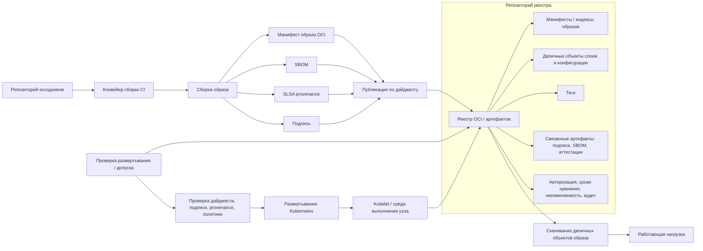
```mermaid
flowchart LR
  Source["Репозиторий исходников"] --> CI["Конвейер сборки CI"]
  CI --> Build["Сборка образа"]
  Build --> Image["Манифест образа OCI"]
  Build --> SBOM["SBOM"]
  Build --> Prov["SLSA provenance"]
  Build --> Sig["Подпись"]

  Image --> Push["Публикация по дайджесту"]
  SBOM --> Push
  Prov --> Push
  Sig --> Push
  Push --> Registry["Реестр OCI / артефактов"]

  subgraph RegistryBox["Репозиторий реестра"]
    Registry --> Manifests["Манифесты / индексы образов"]
    Registry --> Blobs["Двоичные объекты слоев и конфигурации"]
    Registry --> Tags["Теги"]
    Registry --> Referrers["Связанные артефакты: подписи, SBOM, аттестации"]
    Registry --> Policy["Авторизация, сроки хранения, неизменяемость, аудит"]
  end

  DeployGate["Проверка развертывания / допуска"] --> Registry
  DeployGate --> Verify["Проверка дайджеста, подписи, provenance, политики"]
  Verify --> Kubernetes["Развертывание Kubernetes"]
  Kubernetes --> Node["Kubelet / среда выполнения узла"]
  Node --> Registry
  Registry --> Pull["Скачивание двоичных объектов образа"]
  Pull --> Workload["Работающая нагрузка"]
```

#### Границы ответственности
Реестр обеспечивает хранение и выдачу артефактов по API, но не доказывает безопасность образа, правильность подписанта или допустимость исходного кода. Команда отвечает за аутентификацию и авторизацию, развертывание по неизменяемому дайджесту, неизменяемость релизных тегов, подписи, происхождение, сроки хранения, управление уязвимостями и аудит.

Реестр не должен быть единственной точкой контроля. Даже если он блокирует часть небезопасных образов, проверка развертывания должна независимо сверять дайджест, подпись, идентичность системы сборки, происхождение и решение политики до допуска рабочей нагрузки.

#### Типовые рабочие паттерны
- Закрытый реестр с IAM/RBAC и отдельными репозиториями по средам или доменам.
- Развертывание только по дайджесту (`image@sha256:...`); теги используются для удобства поиска, а не как основание доверия.
- Неизменяемость релизных тегов и запрет их перезаписи.
- Подпись образов и публикация SBOM и сведений о происхождении как связанных OCI-артефактов.
- Проверка допуска, сверяющая подпись, идентичность доверенной системы сборки, происхождение по SLSA и политику уязвимостей.
- Политика хранения старых образов с сохранением артефактов для отката, расследования и аудита.
- Pull-through-кэш с отдельной политикой доверия для исходных образов.
- Аудит публикации, удаления, изменения тегов и аномальных загрузок.

#### Связанные файлы из проекта
- `content/supply-chain/slsa-provenance/overview.ru.md` / `overview.en.md`: происхождение, политика проверки и доверенные системы сборки.
- `content/supply-chain/container-image-security/playbook.ru.md` / `playbook.en.md`: требования безопасности образов контейнеров и реестров OCI.
- `content/platform-security/kubernetes/cluster-security-review/playbook.ru.md` / `playbook.en.md`: реестр в цепочке развертывания и проверка допуска к выпуску.
- `content/platform-security/kubernetes/adversarial-validation/playbook.ru.md` / `playbook.en.md`: доступность закрытого реестра извне, история образов и пути атак на цепочку поставки.
- `content/platform-security/kubernetes/pod-security/playbook.ru.md` / `playbook.en.md`: последствия запуска недоверенного образа.

### Helm

#### Для чего используется
Helm служит менеджером пакетов Kubernetes: формирует манифесты по шаблонам, управляет релизами и распространяет приложения в пакетах (charts). В рабочих средах им устанавливают платформенные компоненты, контроллеры входящего трафика, средства мониторинга, механизмы политик и внутренние приложения.

#### Модель работы
Пакет Helm содержит манифесты Kubernetes и шаблоны одного приложения или компонента платформы. Шаблоны используют YAML Kubernetes и язык шаблонов Go. Файл `values.yaml` и значения для конкретной среды задают параметры формирования манифестов: тег образа, число реплик, ресурсы, входящий трафик, сервисную учетную запись, RBAC, контекст безопасности и другие настройки.

Релиз Helm представляет собой установленный экземпляр пакета в конкретном пространстве имен с заданными значениями. Репозиторий хранит пакеты и их версии. Зависимости позволяют включать другие пакеты, например БД или вспомогательный контейнер. Обработчик (hook) запускает ресурсы Kubernetes на определенных этапах жизненного цикла: до установки, после обновления или перед удалением.

Helm формирует манифесты из шаблонов и значений, затем передает объекты в API кластера. Состояние релиза хранится в Kubernetes. При `helm upgrade` Helm сравнивает новую версию пакета и значений с текущим релизом и применяет изменения.

В GitOps Helm часто запускает не оператор, а контроллер: он получает пакет и значения из Git или реестра, формирует манифесты сам или через Helm, затем синхронизирует итоговые объекты с Kubernetes.

#### Схема взаимодействия
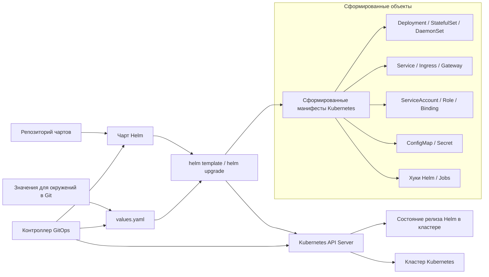
```mermaid
flowchart LR
  ChartRepo["Репозиторий чартов"] --> Chart["Чарт Helm"]
  ValuesRepo["Значения для окружений в Git"] --> Values["values.yaml"]
  Chart --> Render["helm template / helm upgrade"]
  Values --> Render
  Render --> Manifests["Сформированные манифесты Kubernetes"]

  subgraph Objects["Сформированные объекты"]
    Manifests --> Deploy["Deployment / StatefulSet / DaemonSet"]
    Manifests --> Service["Service / Ingress / Gateway"]
    Manifests --> RBAC["ServiceAccount / Role / Binding"]
    Manifests --> Config["ConfigMap / Secret"]
    Manifests --> Hooks["Хуки Helm / Jobs"]
  end

  Render --> API["Kubernetes API Server"]
  API --> Release["Состояние релиза Helm в кластере"]
  API --> Cluster["Кластер Kubernetes"]

  GitOps["Контроллер GitOps"] --> Chart
  GitOps --> Values
  GitOps --> API
```

#### Границы ответственности
Helm не определяет безопасность итоговой конфигурации. Пакет может создать привилегированную рабочую нагрузку, широкие разрешения RBAC, небезопасный входящий маршрут или Secret с чувствительными значениями.

Команда отвечает за ревью итоговых манифестов, контроль значений, происхождение пакета, закрепление версий, ограничения обработчиков и проверку создаваемых в кластере прав.

#### Типовые рабочие паттерны
- Внутренний репозиторий пакетов Helm.
- Закрепление версий пакета и приложения.
- Отдельные значения для каждой среды.
- Формирование манифестов в CI с проверкой политиками.
- Применение пакета контроллером GitOps вместо ручного `helm install`.
- Подпись и подтверждение происхождения сторонних пакетов.
- Минимизация обработчиков после установки и привилегированных заданий.

#### Связанные файлы из проекта
- `content/platform-security/kubernetes/cluster-security-review/playbook.ru.md` / `playbook.en.md`: проверка создаваемых Helm настроек RBAC, рабочих нагрузок и входящего трафика.
- `content/platform-security/kubernetes/pod-security/playbook.ru.md` / `playbook.en.md`: проверка итоговых спецификаций Pod после формирования манифестов.
- `content/supply-chain/slsa-provenance/overview.ru.md` / `overview.en.md`: доверие к артефактам, включая пакеты Helm и развертывания.

## Контейнерная платформа и среда выполнения Kubernetes

### Среды выполнения контейнеров (container runtimes)

#### Для чего используется
Среда выполнения контейнеров запускает их на узле: скачивает образы, подготавливает файловую систему, пространства имен и cgroups, затем передает запуск низкоуровневой среде выполнения. В Kubernetes она обычно взаимодействует через CRI и работает на каждом рабочем узле.

#### Модель работы
CRI связывает kubelet со средой выполнения, позволяя использовать containerd, CRI-O или другую совместимую реализацию. Через CRI kubelet запрашивает создание изолированного окружения Pod, загрузку образа, запуск и остановку контейнера, а также его состояние.

OCI Image Specification определяет формат образа, а OCI Runtime Specification описывает запуск контейнера с нужными пространствами имен, cgroups, монтированиями, capabilities и точкой входа. Хранилище образов держит загруженные образы на узле. Механизм снимков (snapshotter) подготавливает слои файловой системы, предоставляя контейнеру рабочее представление без полного копирования образа.

Изолированное окружение Pod включает сеть, пространства имен и базовые ресурсы для контейнеров приложения. Промежуточный процесс (shim) поддерживает связь с работающим контейнером, чтобы весь жизненный цикл не зависел от одного процесса среды выполнения.

Типовая последовательность: kubelet получает назначение Pod, обращается к среде выполнения через CRI, та скачивает образ из реестра, подготавливает снимки и слои, создает изолированное окружение и вызывает реализацию OCI, например `runc` или Kata Containers. Низкоуровневая среда создает изоляцию Linux и запускает процесс приложения.

#### Схема взаимодействия
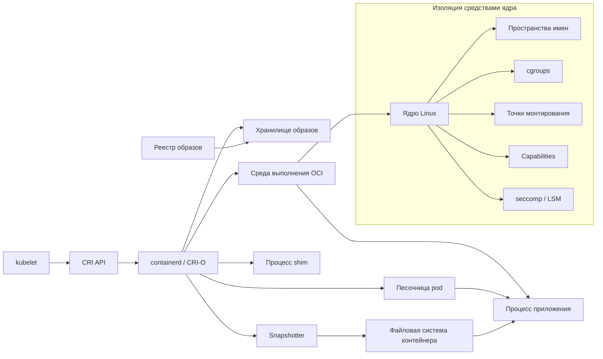
```mermaid
flowchart LR
  Kubelet["kubelet"] --> CRI["CRI API"]
  CRI --> Runtime["containerd / CRI-O"]
  Runtime --> ImageStore["Хранилище образов"]
  Registry["Реестр образов"] --> ImageStore
  Runtime --> Snapshotter["Snapshotter"]
  Snapshotter --> FS["Файловая система контейнера"]
  Runtime --> Sandbox["Песочница pod"]
  Runtime --> Shim["Процесс shim"]
  Runtime --> OCI["Среда выполнения OCI"]
  OCI --> Kernel["Ядро Linux"]

  subgraph KernelFeatures["Изоляция средствами ядра"]
    Kernel --> NS["Пространства имен"]
    Kernel --> CG["cgroups"]
    Kernel --> Mounts["Точки монтирования"]
    Kernel --> Caps["Capabilities"]
    Kernel --> Seccomp["seccomp / LSM"]
  end

  OCI --> Process["Процесс приложения"]
  Sandbox --> Process
  FS --> Process
```

#### Границы ответственности
Среда выполнения запускает контейнер с заданными ограничениями, но сама не определяет безопасность разрешений. Если рабочая нагрузка Kubernetes запрашивает привилегированный режим, опасные capabilities, `hostPath`, `hostPID` или `hostNetwork`, среда выполнения применит эту конфигурацию.

За политики, контроль допуска и базовые требования отвечает платформа.

#### Типовые рабочие паттерны
- containerd в управляемом Kubernetes.
- CRI-O в кластерах, ориентированных на специализированную среду выполнения Kubernetes.
- RuntimeClass для изоляции отдельных рабочих нагрузок.
- gVisor или Kata Containers для нагрузок с повышенными требованиями к изоляции.
- Централизованная настройка среды выполнения в образах узлов.
- Мониторинг событий среды выполнения и аудит на уровне узла.

#### Связанные файлы из проекта
- `content/platform-security/kubernetes/container-escape-capability-abuse/overview.ru.md` / `overview.en.md`: связь изоляции среды выполнения, capabilities и выхода из контейнера.
- `content/platform-security/kubernetes/pod-security/playbook.ru.md` / `playbook.en.md`: параметры рабочих нагрузок, применяемые средой выполнения на узле.
- `content/platform-security/kubernetes/seccomp/checklist.ru.md` / `checklist.en.md`: фильтрация системных вызовов для усиления защиты среды выполнения.

### Kubernetes

#### Для чего используется
Kubernetes оркестрирует контейнерные приложения: планирует размещение, обеспечивает обнаружение сервисов, обновление, автоматическое масштабирование, конфигурацию, секреты, сеть и жизненный цикл рабочих нагрузок. В рабочих средах он часто служит платформой микросервисов, пакетных заданий, внутренних платформ и облачной инфраструктуры.

#### Модель работы
API Server является центральной точкой управления для пользователей, контроллеров, kubelet и внешних интеграций. Он проверяет запросы, выполняет аутентификацию, авторизацию и контроль допуска, затем сохраняет желаемое состояние в etcd. etcd хранит объекты рабочих нагрузок, сервисов, секретов, привязок, конфигурацию и метаданные кластера.

Планировщик выбирает узел для Pod с учетом ресурсов, ограничений, affinity, taints/tolerations и других правил размещения. Controller Manager запускает контроллеры, постоянно сопоставляющие желаемое и фактическое состояние: они создают Pod для Deployment, заменяют отказавшие Pod и синхронизируют эндпоинты Service. Контроллеры допуска могут менять или отклонять объекты до сохранения.

На каждом рабочем узле kubelet получает назначенные Pod через API Server и поручает среде выполнения запустить контейнеры. Она скачивает образы и создает контейнеры. Плагин CNI настраивает сеть Pod, а kube-proxy или его замена на eBPF/CNI обеспечивает сетевую работу Service.

Pod является минимальной исполняемой единицей Kubernetes: один или несколько контейнеров с общей сетевой идентичностью и томами. Deployment управляет репликами без состояния и их обновлением; StatefulSet управляет нагрузкой с состоянием и стабильной идентичностью; DaemonSet запускает агент на каждом подходящем узле. Service дает стабильную сетевую точку доступа к динамическому набору Pod, Ingress или Gateway публикует HTTP/TCP-вход в кластер. ConfigMap хранит несекретную конфигурацию, Secret содержит чувствительные значения, ServiceAccount задает идентичность рабочей нагрузки. RBAC связывает Role и ClusterRole с субъектами через RoleBinding и ClusterRoleBinding. NetworkPolicy определяет разрешенные потоки между Pod и внешними адресами.

Пользователь применяет манифест через API Server; объект сохраняется в etcd; контроллер создает или обновляет дочерние объекты; планировщик назначает Pod узлу; kubelet запускает контейнеры через среду выполнения; сетевые компоненты обеспечивают доступность нагрузки другим сервисам.

#### Схема взаимодействия
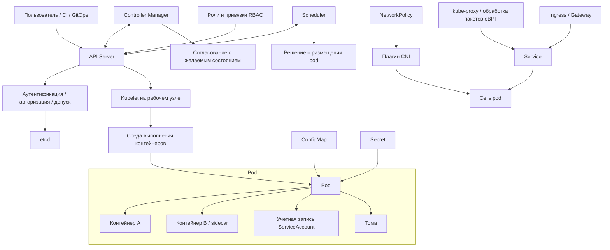
```mermaid
flowchart TB
  User["Пользователь / CI / GitOps"] --> API["API Server"]
  API --> Auth["Аутентификация / авторизация / допуск"]
  Auth --> ETCD["etcd"]

  Controller["Controller Manager"] <--> API
  Scheduler["Scheduler"] <--> API
  Controller --> Desired["Согласование с желаемым состоянием"]
  Scheduler --> Placement["Решение о размещении pod"]

  API --> Kubelet["Kubelet на рабочем узле"]
  Kubelet --> Runtime["Среда выполнения контейнеров"]
  Runtime --> Pod["Pod"]

  subgraph PodBox["Pod"]
    Pod --> C1["Контейнер A"]
    Pod --> C2["Контейнер B / sidecar"]
    Pod --> SA["Учетная запись ServiceAccount"]
    Pod --> Vol["Тома"]
  end

  CNI["Плагин CNI"] --> PodNet["Сеть pod"]
  KubeProxy["kube-proxy / обработка пакетов eBPF"] --> Service["Service"]
  Ingress["Ingress / Gateway"] --> Service
  Service --> PodNet

  ConfigMap["ConfigMap"] --> Pod
  Secret["Secret"] --> Pod
  RBAC["Роли и привязки RBAC"] --> API
  NetworkPolicy["NetworkPolicy"] --> CNI
```

#### Границы ответственности
Kubernetes предоставляет API и управление рабочими нагрузками, но сам по себе не гарантирует безопасную конфигурацию. Платформенная команда отвечает за RBAC, изоляцию, политики допуска и сети, аудит, усиление защиты узлов, обновления и интеграцию с IAM, секретами и реестрами.

Команды приложений отвечают за безопасные спецификации Pod, проверки работоспособности, лимиты ресурсов, секреты, входящий трафик и поведение приложения.

#### Типовые рабочие паттерны
- Managed Kubernetes: EKS, GKE, AKS или аналог.
- GitOps через Argo CD или Flux.
- Разделение пространств имен по средам, командам или зонам поражения.
- Отдельные пулы узлов для доверенных, недоверенных, привилегированных нагрузок, нагрузок с состоянием или GPU.
- Контроллер Ingress или Gateway API.
- External Secrets Operator или драйвер CSI для секретов.
- Механизм политик: Kyverno или OPA Gatekeeper.
- Private контур управления и ограниченный доступ к Kubernetes API.

#### Связанные файлы из проекта
- `content/platform-security/kubernetes/cluster-security-review/playbook.ru.md` / `playbook.en.md`: комплексная проверка безопасности Kubernetes-кластера.
- `content/platform-security/kubernetes/pod-security/playbook.ru.md` / `playbook.en.md`: безопасная конфигурация Pod и рабочих нагрузок.
- `content/platform-security/kubernetes/seccomp/checklist.ru.md` / `checklist.en.md`: проверка seccomp-профилей.
- `content/platform-security/kubernetes/container-escape-capability-abuse/overview.ru.md` / `overview.en.md`: выход из контейнера и злоупотребление Linux capabilities.

### CNI и сеть Kubernetes

#### Для чего используется
CNI и сетевые механизмы Kubernetes обеспечивают связность Pod, обнаружение сервисов, балансировку Service, входящие и исходящие соединения и применение сетевых политик. Это один из основных уровней ограничения зоны поражения: CNI определяет, сможет ли нагрузка одного пространства имен обратиться к другой нагрузке, метаданным, контуру управления или внешней системе.

Типичные реализации: Cilium, Calico, CNI облачных поставщиков, Flannel и другие плагины. Cilium делает акцент на обработке трафика через eBPF, наблюдаемости и замене kube-proxy. Calico применяется для NetworkPolicy и расширенных политик, включая GlobalNetworkPolicy. В некоторых управляемых кластерах CNI интегрирует адреса Pod непосредственно с VPC/VNet.

#### Модель работы
Kubernetes задает общую сетевую модель: Pod получает IP, Pod могут взаимодействовать, Service предоставляет стабильный виртуальный IP или DNS-имя для набора эндпоинтов, а NetworkPolicy описывает разрешенные входящие и исходящие потоки. API Kubernetes хранит объекты, но не применяет NetworkPolicy в сетевом тракте. Это делает плагин CNI или связанный движок политик.

kubelet и среда выполнения вызывают плагин CNI при создании окружения Pod. Он выделяет IP, подключает сетевой интерфейс, настраивает маршруты, правила, карты eBPF или iptables/nftables и поддерживает состояние при изменении Pod, узлов, сервисов и политик. DNS обычно обеспечивает CoreDNS. Трафик Service обрабатывает kube-proxy через iptables/IPVS либо CNI, заменяющий kube-proxy.

NetworkPolicy действует в пространстве имен Kubernetes, выбирает Pod по меткам и задает разрешенный входящий и исходящий трафик. Pod без подходящей политики обычно не изолирован в соответствующем направлении. После выбора Pod политикой разрешены только описанные ею потоки для этого направления. Поэтому запрет по умолчанию требует отдельной политики, а не просто наличия CNI.

Cilium может заменить kube-proxy и балансировать Service через eBPF. Агенты Cilium настраивают сетевой тракт узлов, используют карты для поиска сервисов и их обработчиков, могут предоставлять видимость потоков через Hubble и применять политики L3/L4/L7. Calico поддерживает NetworkPolicy и собственные расширения: упорядоченные правила, уровни политик и эндпоинты хостов в зависимости от редакции и настроек. При ревью проверяйте не только YAML, но и фактическую реализацию CNI, режим обработки трафика, поддержку исходящих правил, селекторов пространств имен, DNS/FQDN-политик и наблюдаемости.

#### Схема взаимодействия
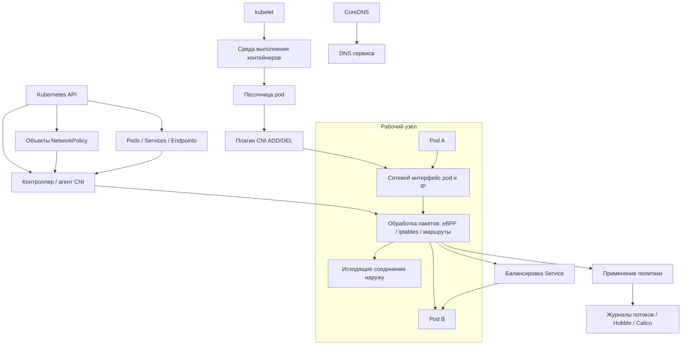
```mermaid
flowchart TB
  API["Kubernetes API"] --> Pods["Pods / Services / Endpoints"]
  API --> NP["Объекты NetworkPolicy"]
  API --> CNIController["Контроллер / агент CNI"]

  Kubelet["kubelet"] --> Runtime["Среда выполнения контейнеров"]
  Runtime --> Sandbox["Песочница pod"]
  Sandbox --> CNIPlugin["Плагин CNI ADD/DEL"]
  CNIPlugin --> PodIF["Сетевой интерфейс pod и IP"]

  CNIController --> Datapath["Обработка пакетов: eBPF / iptables / маршруты"]
  NP --> CNIController
  Pods --> CNIController
  Datapath --> Policy["Применение политики"]
  Datapath --> ServiceLB["Балансировка Service"]
  CoreDNS["CoreDNS"] --> ServiceDNS["DNS сервиса"]

  subgraph Node["Рабочий узел"]
    PodA["Pod A"] --> PodIF
    PodIF --> Datapath
    Datapath --> PodB["Pod B"]
    Datapath --> Egress["Исходящие соединения наружу"]
  end

  ServiceLB --> PodB
  Policy --> FlowLogs["Журналы потоков / Hubble / Calico"]
```

#### Границы ответственности
CNI обеспечивает сетевой тракт и может применять NetworkPolicy, но не знает бизнес-смысл сервисов. Платформа отвечает за выбор CNI, включение принудительного применения политик, запрет по умолчанию, исходящие соединения, наблюдаемость, совместимость обновлений и проверку фактического действия правил.

Команды приложений отвечают за правильные метки, описание нужных межсервисных потоков и проверку связности после изменений. Само пространство имен не следует считать неявной сетевой изоляцией.

#### Типовые рабочие паттерны
- Запрет входящего и исходящего трафика по умолчанию для рабочих пространств имен и пространств с ценными активами.
- Явные разрешения межсервисных соединений, DNS и необходимых исходящих потоков.
- Отдельные пулы узлов или кластеры для нагрузок с разным уровнем доверия.
- Cilium/Hubble или журналы потоков Calico для расследования сетевых событий.
- Замена kube-proxy только после проверки совместимости с облачными балансировщиками, service mesh, поведением NodePort/LoadBalancer и средствами наблюдаемости.
- Схема исходящего шлюза и NAT для стабильной идентификации исходящего трафика.
- Повторная проверка NetworkPolicy после изменения меток пространств имен и Pod, версии CNI и селекторов Service.
- Отдельная защита эндпоинтов метаданных и облачного контура управления.

#### Связанные файлы из проекта
- `content/platform-security/kubernetes/cluster-security-review/playbook.ru.md` / `playbook.en.md`: границы сервисов, исходящий трафик и требования NetworkPolicy.
- `content/platform-security/kubernetes/adversarial-validation/playbook.ru.md` / `playbook.en.md`: обход границ пространств имен, SSRF, доступность NodePort и фактическая достижимость.
- `content/platform-security/kubernetes/pod-security/playbook.ru.md` / `playbook.en.md`: меры контроля на уровне Pod дополняют, но не заменяют сетевая изоляция.
- `content/review/architecture/checklist.ru.md` / `checklist.en.md`: анализ границы доверия и потоки данных.

### Ingress / Gateway / API Gateway

#### Для чего используется
Ingress, Gateway и API-шлюзы публикуют сервисы за пределами кластера или между сетевыми зонами. Они принимают клиентский трафик, завершают TLS или передают его дальше, маршрутизируют запросы к Service, интегрируют аутентификацию и авторизацию, ограничивают частоту, применяют WAF и политики защиты API, нормализуют заголовки и обеспечивают наблюдаемость.

В рабочих средах встречаются NGINX Ingress Controller, контроллеры облачных балансировщиков, Envoy Gateway, Kong Gateway/Kong Ingress Controller, HAProxy, Contour, Traefik и шлюзы service mesh. Kubernetes Ingress остается стабильным API маршрутизации HTTP/HTTPS, но его развитие заморожено; новые сетевые возможности в основном развиваются в Gateway API. Для контроллера Istio этот раздел описывает внешнюю точку входа. Механизмы Istio (`VirtualService`, `DestinationRule`, `PeerAuthentication`, `AuthorizationPolicy`, sidecar/ambient) разобраны отдельно.

#### Модель работы
Ресурс Ingress описывает маршрутизацию по хосту и пути к целевому Service. Без контроллера Ingress он не работает. Контроллер наблюдает за API Kubernetes, выбирает объекты по `ingressClassName`, формирует конфигурацию прокси или балансировщика и предоставляет внешний эндпоинт через Service типа `LoadBalancer`, NodePort, облачный балансировщик или пограничное устройство.

Gateway API явно разделяет роли. `GatewayClass` описывает тип контроллера, а `Gateway` задает обработчики соединений, адреса, порты, TLS и правила подключения маршрутов. `HTTPRoute`, `GRPCRoute`, `TCPRoute`, `TLSRoute` и другие ресурсы определяют маршрутизацию приложений. `allowedRoutes` и правила межпространственного подключения образуют границу доверия между платформенной командой, управляющей Gateway, и командами приложений, управляющими маршрутами. Не путайте Kubernetes Gateway API `Gateway` с Istio `networking.istio.io/Gateway`: у них различаются модель владения, режим развертывания и ресурсы маршрутов.

API-шлюз добавляет управление API: плагины и политики аутентификации и авторизации, проверку JWT/OIDC, API-ключи, ограничения частоты, преобразование запросов и ответов, WAF, защиту от ботов, проверку схем, порталы разработчиков и аналитику. В Kubernetes тот же контроллер может читать ресурсы Ingress/Gateway API и формировать конфигурацию сетевого контура шлюза.

При проверке безопасности выясняйте, где завершается TLS, как проверяется доверие к `X-Forwarded-*`, кто может создавать маршруты публичных имен хостов, как ограничены шаблоны хостов, есть ли mTLS до целевого сервиса, как применяется аутентификация, работают WAF и лимиты частоты, кто может менять аннотации и плагины и не обходят ли они базовые требования.

#### Схема взаимодействия
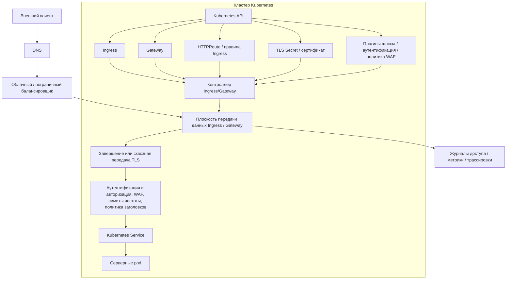
```mermaid
flowchart TB
  Client["Внешний клиент"] --> DNS["DNS"]
  DNS --> LB["Облачный / пограничный балансировщик"]
  LB --> GatewayDP["Плоскость передачи данных Ingress / Gateway"]

  subgraph K8s["Кластер Kubernetes"]
    API["Kubernetes API"] --> Ingress["Ingress"]
    API --> Gateway["Gateway"]
    API --> Route["HTTPRoute / правила Ingress"]
    API --> Secret["TLS Secret / сертификат"]
    API --> Policy["Плагины шлюза / аутентификация / политика WAF"]

    Controller["Контроллер Ingress/Gateway"] --> GatewayDP
    Ingress --> Controller
    Gateway --> Controller
    Route --> Controller
    Secret --> Controller
    Policy --> Controller

    GatewayDP --> TLS["Завершение или сквозная передача TLS"]
    TLS --> Auth["Аутентификация и авторизация, WAF, лимиты частоты, политика заголовков"]
    Auth --> Service["Kubernetes Service"]
    Service --> Pod["Серверные pod"]
  end

  GatewayDP --> Logs["Журналы доступа / метрики / трассировки"]
```

#### Границы ответственности
Ingress и Gateway контролируют сетевую точку входа, но не заменяют авторизацию приложения. Если шлюз проверяет только наличие токена, приложение все равно проверяет права на бизнес-операции и границы арендаторов. Если TLS завершается на шлюзе, отдельно определите необходимость mTLS или шифрования до целевого сервиса.

Платформа отвечает за защиту контроллера, управление классами, внешнюю доступность, жизненный цикл сертификатов, базовые аннотации и плагины, заголовки безопасности, журналирование и ограничения межпространственных маршрутов. Команды приложений отвечают за свои маршруты, готовность целевых сервисов, правила хостов и путей, совместимость с заголовками и тайм-аутами прокси.

#### Типовые рабочие паттерны
- Gateway API для новых развертываний; Ingress для существующих нагрузок с незавершенной миграцией.
- Отдельные классы Ingress/Gateway для публичного, внутреннего и административного трафика.
- Завершение TLS на шлюзе с управляемым жизненным циклом сертификатов; mTLS до чувствительных целевых сервисов.
- Строгая политика для `X-Forwarded-*`, `Forwarded`, `Host` и заголовков IP клиента; приложение доверяет им только от согласованного прокси.
- WAF, защита API и ограничение частоты на публичных маршрутах.
- Запрет широких шаблонов имен хостов или отдельное согласование такой маршрутизации.
- Межпространственное подключение маршрутов только через явные `allowedRoutes`, ReferenceGrant и правила владения.
- Журналы доступа с идентификатором корреляции, результатом запроса, целевым сервисом и решением политики.
- Защита сервисной учетной записи контроллера: она часто позволяет читать Secret и менять конфигурацию шлюза или прокси.

#### Связанные файлы из проекта
- `content/platform-security/kubernetes/cluster-security-review/playbook.ru.md` / `playbook.en.md`: реестр точек входа, доступность сервисов и ответственность за них.
- `content/platform-security/kubernetes/adversarial-validation/playbook.ru.md` / `playbook.en.md`: достижимость NodePort/Ingress/Gateway, SSRF и доступность внутренних систем.
- `content/application-security/web/owasp-top-10/playbook.ru.md` / `playbook.en.md`: риски уровня приложения за шлюзом.
- `content/review/architecture/checklist.ru.md` / `checklist.en.md`: границы доверия, внешние интеграции и подтверждения архитектурного ревью.

### Istio

#### Для чего используется
Istio служит service mesh для управления взаимодействием сервисов: mTLS, маршрутизация, повторы, телеметрия, политики авторизации и постепенный выпуск. Он часто применяется в Kubernetes с большим числом внутренних сервисов и строгими требованиями к защите межсервисного взаимодействия.

#### Модель работы
Istiod управляет service mesh: принимает конфигурацию Kubernetes/Istio, формирует и распространяет настройки сетевого контура, управляет обнаружением сервисов и распределением сертификатов mTLS. Трафик обрабатывают прокси Envoy рядом с приложением в модели sidecar либо компоненты ambient mesh. В ambient-режиме защищенный сетевой слой L4 обеспечивает `ztunnel` на узле, а функции L7 добавляют прокси waypoint.

Прокси Envoy перехватывает входящий и исходящий трафик нагрузки, устанавливает mTLS, применяет маршрутизацию, правила повторов, тайм-аутов и авторизации, собирает телеметрию. Входящий шлюз принимает внешний трафик, а исходящий централизует контролируемый доступ к внешним системам.

Поведение service mesh задают CRD. В Istio API `VirtualService` описывает маршрутизацию и перераспределение трафика; `DestinationRule` задает подмножества, балансировку и правила соединений с целевыми сервисами; `Gateway` управляет входом и выходом; `PeerAuthentication` задает режим mTLS; `AuthorizationPolicy` определяет разрешенное взаимодействие. Istio также поддерживает Kubernetes Gateway API: в этой модели `Gateway`, `HTTPRoute` и другие маршруты относятся к `gateway.networking.k8s.io`, а не к Istio API.

В Kubernetes приложение остается обычным Deployment/Pod, но его трафик проходит через сетевой контур Istio. Istiod наблюдает за сервисами и политиками, пересчитывает конфигурацию и передает прокси. Те применяют mTLS, маршрутизацию, политики и телеметрию без изменения бизнес-кода.

#### Схема взаимодействия
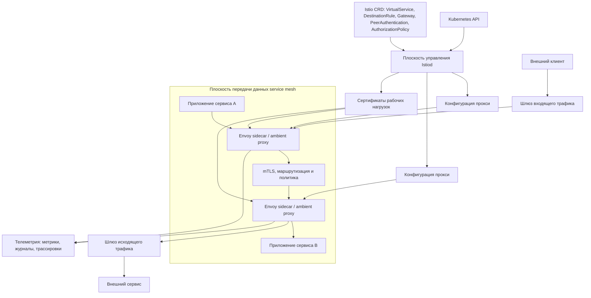
```mermaid
flowchart TB
  K8sAPI["Kubernetes API"] --> Istiod["Плоскость управления Istiod"]
  IstioCRD["Istio CRD: VirtualService, DestinationRule, Gateway, PeerAuthentication, AuthorizationPolicy"] --> Istiod
  Istiod --> ConfigA["Конфигурация прокси"]
  Istiod --> ConfigB["Конфигурация прокси"]
  Istiod --> Certs["Сертификаты рабочих нагрузок"]

  subgraph Mesh["Плоскость передачи данных service mesh"]
    ServiceA["Приложение сервиса A"] --> EnvoyA["Envoy sidecar / ambient proxy"]
    EnvoyA --> MTLS["mTLS, маршрутизация и политика"]
    MTLS --> EnvoyB["Envoy sidecar / ambient proxy"]
    EnvoyB --> ServiceB["Приложение сервиса B"]
  end

  ConfigA --> EnvoyA
  ConfigB --> EnvoyB
  Certs --> EnvoyA
  Certs --> EnvoyB

  External["Внешний клиент"] --> IngressGW["Шлюз входящего трафика"]
  IngressGW --> EnvoyA
  EnvoyB --> EgressGW["Шлюз исходящего трафика"]
  EgressGW --> ExternalAPI["Внешний сервис"]

  EnvoyA --> Telemetry["Телеметрия: метрики, журналы, трассировки"]
  EnvoyB --> Telemetry
```

#### Границы ответственности
Istio обеспечивает mTLS между рабочими нагрузками и централизованные политики service mesh, но не исправляет слабую аутентификацию приложения и не заменяет RBAC Kubernetes, NetworkPolicy, политики сетевого тракта CNI или защиту API. NetworkPolicy остается необходимой для ограничения зоны поражения на L3/L4 и трафика, который нельзя защищать только включением в service mesh.

Платформа отвечает за корректное подключение к service mesh, жизненный цикл сертификатов, модель политик, доступность шлюзов извне и совместимость приложений.

#### Типовые рабочие паттерны
- Подключение только выбранных пространств имен, а не всего кластера сразу.
- Strict mTLS для внутренних сервисов.
- AuthorizationPolicy для межсервисного доступа.
- Отдельные входящие и исходящие шлюзы, если внешний трафик должен проходить через контролируемые границы service mesh.
- Явный выбор API маршрутизации: Istio `VirtualService`/`Gateway`, Kubernetes Gateway API или оба на время перехода.
- Канареечное или сине-зеленое развертывание через VirtualService и DestinationRule.
- Интеграция телеметрии с Prometheus, Grafana или OpenTelemetry.
- Постепенная миграция с sidecar на ambient mesh, где это оправдано.

#### Связанные файлы из проекта
- `content/platform-security/kubernetes/cluster-security-review/playbook.ru.md` / `playbook.en.md`: service mesh как часть контуров управления и передачи данных Kubernetes.
- `content/platform-security/kubernetes/pod-security/playbook.ru.md` / `playbook.en.md`: рабочие нагрузки с sidecar или service mesh остаются рабочими нагрузками Kubernetes и наследуют требования Pod Security.
- `content/review/architecture/checklist.ru.md` / `checklist.en.md`: полезно для анализа границ доверия и межсервисного взаимодействия.
- Отдельного плейбука по Istio пока нет.

### Механизмы политик

#### Для чего используется
Движки политик автоматически проверяют и принудительно применяют технические правила: допуск Kubernetes, проверки IaC и качества CI, проверку образов и конфигурации, требования управления. Типичные инструменты: OPA, Gatekeeper, Kyverno и Conftest.

#### Модель работы
OPA: универсальный движок политик: приложение или инструмент передает структурированные входные данные, код политики принимает решение, а точка принудительного применения реализует результат. Conftest использует OPA/Rego для проверки структурированных файлов локально или в CI: манифестов Kubernetes, планов Terraform, вывода Helm и конфигураций YAML/JSON.

В Kubernetes движок политик обычно действует как динамический контроллер допуска. После аутентификации и авторизации API Server отправляет AdmissionReview в validating или mutating webhook. Движок проверяет объект, `userInfo`, пространство имен, метки, ссылки на образы и доступный внешний контекст, затем разрешает, отклоняет или меняет запрос до сохранения в etcd.

Gatekeeper использует constraint templates и constraints, поддерживает проверку допуска и аудит существующих ресурсов. Kyverno использует ресурсы политик Kubernetes для проверки, изменения, создания, очистки и удаления объектов, а также проверки образов. Новые политики обычно сначала включают в режимах аудита, пробного запуска или предупреждений, чтобы непроверенное правило не заблокировало критичные нагрузки.

Политики CI и допуска в рабочую среду решают разные задачи. CI проверяет предлагаемую конфигурацию до слияния или развертывания и быстро возвращает результат разработчику. Контроль допуска защищает кластер от обхода CI, ручных изменений, скомпрометированных учетных данных развертывания и дрейфа. Он требует высокой доступности, наблюдаемости и аккуратной настройки поведения при отказе.

#### Схема взаимодействия
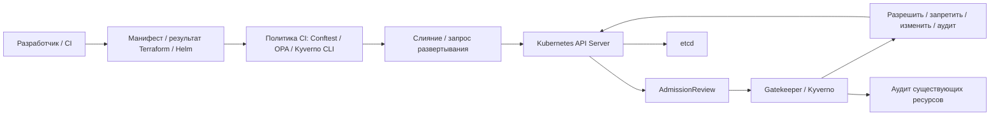
```mermaid
flowchart LR
  Developer["Разработчик / CI"] --> Config["Манифест / результат Terraform / Helm"]
  Config --> CIPolicy["Политика CI: Conftest / OPA / Kyverno CLI"]
  CIPolicy --> Merge["Слияние / запрос развертывания"]
  Merge --> APIServer["Kubernetes API Server"]
  APIServer --> Admission["AdmissionReview"]
  Admission --> Engine["Gatekeeper / Kyverno"]
  Engine --> Decision["Разрешить / запретить / изменить / аудит"]
  Decision --> APIServer
  APIServer --> ETCD["etcd"]
  Engine --> Audit["Аудит существующих ресурсов"]
```

#### Границы ответственности
Движок принимает решения по заданным правилам, но сам не определяет правильную политику безопасности. Команда отвечает за владельцев правил, тесты, режим внедрения, исключения, поведение при отказе, версии, наблюдаемость, влияние на производительность и соответствие реальным сценариям риска.

#### Типовые рабочие паттерны
- проверки CI для запрос на слияние и изменений Terraform/Kubernetes.
- Принудительное применение критичных требований Kubernetes при допуске.
- Режим аудита перед блокировкой для новых или рискованных политик.
- Явные исключения с владельцем, обоснованием, сроком действия и проверкой.
- Модульные тесты политик с заведомо допустимыми и недопустимыми манифестами.
- Отдельные наборы политик по средам или уровням риска.
- Мониторинг задержек webhook, доли отказов, нарушений аудита и доступности движка политик.
- Проверка образов по дайджесту, подписи и аттестациям для рабочих нагрузок.

#### Связанные файлы из проекта
- `content/platform-security/kubernetes/cluster-security-review/playbook.ru.md` / `playbook.en.md`: контроль допуска и проверки политик кластера.
- `content/platform-security/kubernetes/pod-security/playbook.ru.md` / `playbook.en.md`: требования к нагрузкам, обеспечиваемые движком политик.
- `content/supply-chain/slsa-provenance/overview.ru.md` / `overview.en.md`: проверка образа и происхождения до развертывания.
- Отдельного плейбука по движкам политик пока нет.

## Учетные записи, секреты и доступ

### Облачный IAM и идентификация рабочих нагрузок

#### Для чего используется
Cloud IAM управляет доступом к облачным вычислениям, хранилищам, БД, очередям, KMS, секретам, сети и управляемым сервисам. Workload identity связывает идентичность нагрузки в среде выполнения, например ServiceAccount Kubernetes или задания CI, с облачной идентичностью без долгоживущих ключей внутри приложения или конвейера.

#### Модель работы
IAM состоит из субъектов доступа (principals) и политик. Субъектом может быть пользователь, группа, сервисная учетная запись, managed identity, роль или федеративный субъект. Политика задает действия над ресурсами и условия: учетную запись, проект, регион, тег, имя ресурса или claims токена. В AWS используются пользователи, группы, роли, политики IAM и STS. В Google Cloud используются субъекты и сервисные учетные записи, роли IAM и разрешающие политики. В Azure используются идентичности Microsoft Entra, managed identities, регистрации приложений и назначения ролей Azure RBAC.

Краткоживущие учетные данные выдаются через федерацию. Нагрузка получает подписанный токен доверенного издателя, например API Server Kubernetes или платформы CI/CD. Cloud IAM проверяет `issuer`, `audience`, `subject` и условия, затем выдает временный токен доступа или сессию роли. В Kubernetes применяются интеграции поставщиков: AWS IAM Roles for Service Accounts, GCP Workload Identity Federation for GKE и Microsoft Entra Workload ID for AKS.

Сервис метаданных образует отдельную границу доверия. На облачной ВМ или узле он может выдавать учетные данные идентичности этого экземпляра. Если Pod имеет доступ к метаданным, а роль узла слишком широка, компрометация нагрузки позволяет продвинуться из Kubernetes в облачный контур управления. Workload identity снижает риск только при ограниченном доступе к метаданным узла, разделенных сервисных учетных записях, узкой политике доверия и минимальных облачных разрешениях.

Привязывайте политики доверия к стабильным атрибутам нагрузки, а не только к понятному человеку имени. Для Kubernetes учитывайте `issuer`, `audience`, пространство имен, сервисную учетную запись и, где поддерживается, идентичность кластера, проекта или учетной записи. Для CI/CD учитывайте `issuer`, `audience`, репозиторий или его неизменяемый ID, защищенную ветку, тег или среду, идентичность процесса и событие запуска. Широкий шаблон `subject`, позволяющий любой нагрузке пространства имен, репозитория или организации принять облачную роль рабочей среды, считается замечанием.

Kubernetes RBAC управляет доступом к объектам API Kubernetes, а Cloud IAM управляет облачными ресурсами вне Kubernetes. ServiceAccount с минимальными правами RBAC может иметь опасно широкие облачные разрешения, и наоборот.

#### Схема взаимодействия
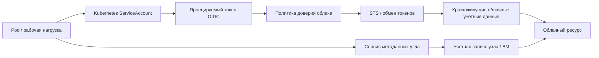
```mermaid
flowchart LR
  Pod["Pod / рабочая нагрузка"] --> KSA["Kubernetes ServiceAccount"]
  KSA --> Token["Проецируемый токен OIDC"]
  Token --> Trust["Политика доверия облака"]
  Trust --> STS["STS / обмен токенов"]
  STS --> Creds["Краткоживущие облачные учетные данные"]
  Creds --> Resource["Облачный ресурс"]

  Pod --> Metadata["Сервис метаданных узла"]
  Metadata --> NodeRole["Учетная запись узла / ВМ"]
  NodeRole --> Resource
```

#### Границы ответственности
Облачный поставщик отвечает за механизмы IAM, обмен токенами и применение ограничений в API. Платформенная команда отвечает за сопоставление идентичностей, политики доверия, ограничения метаданных узлов, минимальные привилегии, аудит, срок действия учетных данных, аварийный доступ и разделение сред. Команды приложений выбирают подходящую идентичность нагрузки, исключают встроенные ключи и правильно обрабатывают обновление токенов.

#### Типовые рабочие паттерны
- Отдельная облачная идентичность для сервиса или ограниченной группы нагрузок.
- Федерация OIDC вместо статических облачных ключей доступа.
- Привязка политики доверия к `issuer`, `audience`, пространству имен, сервисной учетной записи, репозиторию, ветке, тегу или среде.
- Короткий срок федеративных сессий: сессии развертывания и выполнения в рабочей среде обычно измеряются минутами или несколькими часами, а не днями.
- Запрет широких шаблонов субъектов принятия роли или обмена токенами для идентичностей рабочей среды.
- Запрет ненужного доступа нагрузки к метаданным узла.
- Узкие разрешения операций с данными без широких административных политик.
- Отдельные идентичности сборки, развертывания и выполнения.
- Аудит AssumeRole, обмена токенами, создания ключей, изменения политик и аномальных вызовов API.

#### Связанные файлы из проекта
- `content/application-security/identity/oidc-oauth/playbook.ru.md` / `playbook.en.md`: понятия OIDC, проверка токенов и границы доверия.
- `content/platform-security/kubernetes/cluster-security-review/playbook.ru.md` / `playbook.en.md`: пути атак из Kubernetes в облако и идентичность кластера.
- `content/platform-security/secrets/vault/playbook.ru.md` / `playbook.en.md`: динамические учетные данные и доставка секретов.
- Отдельного плейбука по Cloud IAM и Workload Identity пока нет.

### Vault

#### Для чего используется
HashiCorp Vault централизует управление секретами, динамическими учетными данными, криптографическими операциями как сервисом и доступом к чувствительным материалам. Он часто связывает приложения, CI/CD и Kubernetes с БД, Cloud IAM, PKI, SSH и брокерами сообщений.

#### Модель работы
Сервер Vault принимает запросы API, аутентифицирует клиента, проверяет политику, обращается к secret engines и пишет события аудита. Подсистема хранения содержит зашифрованное состояние: конфигурацию, метаданные, политики и данные secret engines. Механизм seal/unseal защищает корневой ключевой материал: в состоянии sealed Vault не может расшифровать хранилище и обслуживать обычные запросы.

Методы аутентификации связывают внешнюю идентичность с Vault: сервисную учетную запись Kubernetes, OIDC subject, AppRole, субъект Cloud IAM или другой источник. Политика определяет доступные пути и операции. После аутентификации выдается токен с набором политик. Lease определяет срок жизни выданного секрета или учетных данных и позволяет продлевать или отзывать их.

Secret engines выполняют отдельные задачи: KV хранит статические секреты, Database engine выдает динамические учетные данные БД, PKI engine выпускает сертификаты, Transit engine выполняет криптографические операции без раскрытия ключей клиенту. Устройства аудита записывают запросы и ответы с маскированием чувствительных значений.

Нагрузка аутентифицируется выбранным методом, получает токен с ограниченной политикой и обращается к пути secret engine. Vault возвращает секрет, динамические учетные данные или результат криптографической операции. Для секрета с lease Vault отслеживает срок действия и может продлить или отозвать его.

#### Схема взаимодействия
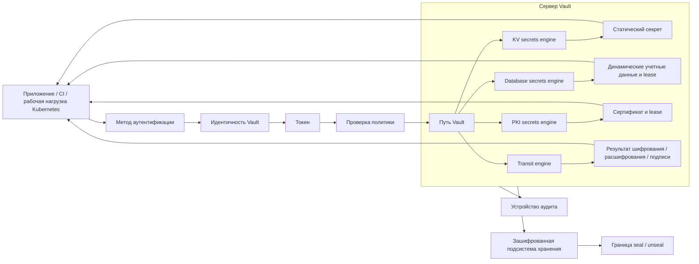
```mermaid
flowchart LR
  Workload["Приложение / CI / рабочая нагрузка Kubernetes"] --> AuthMethod["Метод аутентификации"]
  AuthMethod --> Identity["Идентичность Vault"]
  Identity --> Token["Токен"]
  Token --> Policy["Проверка политики"]
  Policy --> Path["Путь Vault"]

  subgraph VaultServer["Сервер Vault"]
    Path --> KV["KV secrets engine"]
    Path --> DB["Database secrets engine"]
    Path --> PKI["PKI secrets engine"]
    Path --> Transit["Transit engine"]
    KV --> StaticSecret["Статический секрет"]
    DB --> DynamicCred["Динамические учетные данные и lease"]
    PKI --> Certificate["Сертификат и lease"]
    Transit --> CryptoResult["Результат шифрования / расшифрования / подписи"]
  end

  VaultServer --> Audit["Устройство аудита"]
  VaultServer --> Storage["Зашифрованная подсистема хранения"]
  Storage --> Seal["Граница seal / unseal"]

  StaticSecret --> Workload
  DynamicCred --> Workload
  Certificate --> Workload
  CryptoResult --> Workload
```

#### Границы ответственности
Vault защищает выдачу и жизненный цикл секретов, но не делает безопасными получающие их приложения. Команды отвечают за минимальные политики, короткие TTL, аудит, ротацию, безопасную доставку в среду выполнения, защиту корневых и административных токенов и замену долгоживущих статических секретов динамическими, где это возможно.

#### Типовые рабочие паттерны
- Отказоустойчивый кластер Vault.
- Auto-unseal через облачный KMS или HSM.
- Метод аутентификации Kubernetes для рабочих нагрузок.
- Динамические учетные данные БД.
- PKI engine для внутренних сертификатов.
- External Secrets Operator или Vault Agent Injector.
- Централизованные устройства аудита.
- Разделение пространств имен, точек подключения и политик по командам и средам.

#### Связанные файлы из проекта
- `content/platform-security/secrets/vault/playbook.ru.md` / `playbook.en.md`: основной плейбук Vault, политики, методы аутентификации, аудит и усиление защиты.
- `content/platform-security/kubernetes/cluster-security-review/playbook.ru.md` / `playbook.en.md`: интеграция Vault с аутентификацией Kubernetes и доставкой секретов.
- `content/review/architecture/checklist.ru.md` / `checklist.en.md`: полезно для анализа границы доверия вокруг секретов.

## Автоматизация и управление конфигурацией

### Ansible

#### Для чего используется
Ansible управляет конфигурацией, подготавливает ресурсы, автоматизирует инфраструктурные операции и согласованно применяет изменения на серверах, сетевых устройствах и платформах. В рабочих средах его используют для начальной настройки, усиления защиты, установки исправлений, настройки промежуточного ПО и выполнения эксплуатационных инструкций.

#### Модель работы
Inventory описывает управляемые узлы и группы по средам, ролям или другим признакам. Playbook задает последовательность сценариев: целевые хосты, переменные, задачи и настройки повышения привилегий. Задача вызывает модуль, который устанавливает пакет, меняет файл, управляет службой, создает пользователя или обращается к API.

Роль объединяет повторно используемые задачи, обработчики, шаблоны, настройки по умолчанию и файлы. Переменные адаптируют playbook и роль к среде. Facts содержат сведения узла: ОС, сетевые интерфейсы, монтирования и состояние пакетов. Коллекции распространяют модули, плагины и роли. Ansible Vault шифрует чувствительные переменные и файлы, хранящиеся рядом со сценариями.

Управляющий узел выполняет playbook на целевых узлах, обычно через SSH или WinRM. Ansible копирует или вызывает модуль, получает результат и переходит к следующей задаче. Обработчики срабатывают при изменениях, например перезапускают службу после обновления конфигурации.

Ansible часто подготавливает хосты до подключения к Kubernetes, Kafka, RabbitMQ или Vault: устанавливает пакеты, размещает конфигурацию, управляет службами и применяет базовые меры защиты.

#### Схема взаимодействия
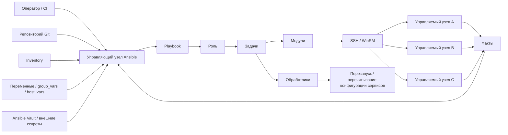
```mermaid
flowchart LR
  Operator["Оператор / CI"] --> Control["Управляющий узел Ansible"]
  Git["Репозиторий Git"] --> Control
  Inventory["Inventory"] --> Control
  Vars["Переменные / group_vars / host_vars"] --> Control
  VaultVars["Ansible Vault / внешние секреты"] --> Control

  Control --> Playbook["Playbook"]
  Playbook --> Role["Роль"]
  Role --> Tasks["Задачи"]
  Tasks --> Modules["Модули"]
  Modules --> SSH["SSH / WinRM"]

  SSH --> HostA["Управляемый узел A"]
  SSH --> HostB["Управляемый узел B"]
  SSH --> HostC["Управляемый узел C"]

  HostA --> Facts["Факты"]
  HostB --> Facts
  HostC --> Facts
  Facts --> Control

  Tasks --> Handlers["Обработчики"]
  Handlers --> Restart["Перезапуск / перечитывание конфигурации сервисов"]
```

#### Границы ответственности
Ansible применяет описанные изменения, но не гарантирует безопасность сценария. Команда отвечает за доступ к управляющему узлу, секреты в inventory и переменных, ревью, идемпотентность, ограничение зоны поражения, безопасное повышение привилегий и воспроизводимость запусков.

Ошибка в playbook может массово распространить небезопасную конфигурацию.

#### Типовые рабочие паттерны
- Хранение сценариев в Git с обязательным ревью.
- Разделение inventory по средам.
- Ansible Vault или внешняя система управления секретами для чувствительных переменных.
- Запуск через AWX/Automation Controller или CI с журнал аудита.
- Ограничение `become` и SSH-доступа.
- Пробный запуск или режим check для рискованных изменений.
- Роли для базового усиления защиты и установки исправлений.

#### Связанные файлы из проекта
- `content/review/architecture/checklist.ru.md` / `checklist.en.md`: управление изменениями, привилегированная автоматизация и границы доверия.
- `content/platform-security/secrets/vault/playbook.ru.md` / `playbook.en.md`: если Ansible получает секреты из Vault или хранит чувствительные переменные.
- Отдельного плейбука по Ansible пока нет.

### Terraform / OpenTofu

#### Для чего используется
Terraform и OpenTofu описывают, создают и меняют инфраструктуру декларативным кодом: облачные ресурсы, объекты Kubernetes, политики IAM, DNS-записи, управляемые БД, сеть и конфигурацию SaaS. Часто это основной механизм изменения рабочей инфраструктуры, поэтому его следует рассматривать как привилегированную автоматизацию, а не просто репозиторий конфигурации.

#### Модель работы
Конфигурация описывает желаемое состояние через ресурсы, источники данных, переменные, выходные значения, провайдеры и модули. Провайдер взаимодействует с API платформы: облака, Kubernetes, Vault, DNS, мониторинга или SaaS. CLI строит граф зависимостей, читает сохраненное состояние, формирует план, а при применении вызывает операции провайдера для достижения нужного состояния.

State связывает конфигурацию с реальными удаленными объектами и хранит их атрибуты. Это критичный артефакт: он часто содержит внутренние идентификаторы, строки подключения, сгенерированные пароли, закрытые эндпоинты, привязки IAM и другие чувствительные значения, даже если переменные помечены как sensitive. Удаленная подсистема хранения обеспечивает совместную работу, контроль доступа, аудит, шифрование и блокировку. Блокировка предотвращает параллельное применение, способное повредить состояние или создать конфликтующие изменения.

Модули обеспечивают повторное использование, но создают границу доверия цепочки поставки. Публичные модули, версии провайдеров и транзитивные источники модулей закрепляются и проверяются как зависимости приложения. План важен для ревью, но не гарантирует результат: дрейф, изменения вне IaC, поведение провайдера и источники данных могут изменить итог применения.

В рабочих средах Terraform/OpenTofu обычно запускают из CI/CD или специализированной платформы, а не с ноутбука оператора. Конвейер получает краткоживущие учетные данные через OIDC или workload identity, строит и сохраняет план, проходит согласование и применяет его с ограниченной ролью. Ручное применение допустимо только в порядке аварийного доступа с аудитом и последующей синхронизацией состояния.

#### Схема взаимодействия
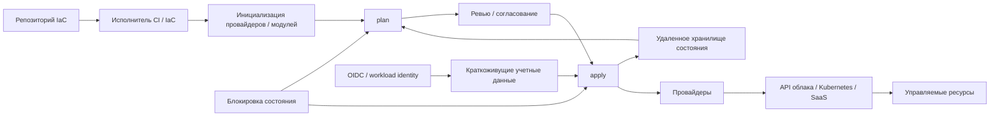
```mermaid
flowchart LR
  Repo["Репозиторий IaC"] --> CI["Исполнитель CI / IaC"]
  CI --> Init["Инициализация провайдеров / модулей"]
  Init --> Plan["plan"]
  Plan --> Approval["Ревью / согласование"]
  Approval --> Apply["apply"]

  State["Удаленное хранилище состояния"] --> Plan
  Apply --> State
  Lock["Блокировка состояния"] --> Plan
  Lock --> Apply

  OIDC["OIDC / workload identity"] --> Creds["Краткоживущие учетные данные"]
  Creds --> Apply
  Apply --> Providers["Провайдеры"]
  Providers --> Cloud["API облака / Kubernetes / SaaS"]
  Cloud --> Resources["Управляемые ресурсы"]
```

#### Границы ответственности
Terraform/OpenTofu меняет инфраструктуру, но не определяет безопасность архитектуры. Команда отвечает за ревью модулей, закрепление провайдеров, защиту удаленного состояния, разделение обязанностей, минимальные привилегии, обнаружение дрейфа, согласование плана и применения, проверки политик как кода и восстановление состояния.

Хранилище состояния следует считать ценным активом: доступ к нему часто раскрывает топологию, привязки IAM и секреты инфраструктуры.

#### Типовые рабочие паттерны
- Удаленное хранилище состояния с шифрованием, контролем доступа, аудитом, резервным копированием, версионированием и блокировкой.
- Отдельные состояния, рабочие пространства или хранилища по средам, учетным записям, зонам поражения и областям ответственности.
- План в запросе на слияние или изменение; применение только после согласования.
- Краткоживущие облачные учетные данные через OIDC или workload identity вместо долгоживущих ключей.
- Закрепление версий провайдеров и модулей; ревью внешних источников модулей.
- Политики как код, запрещающие публичную доступность, широкие права IAM, нешифрованные хранилища и небезопасные ресурсы Kubernetes.
- Обнаружение дрейфа и процесс импорта ресурсов, измененных вне IaC.
- Запрет открытых секретов в переменных, выходных значениях, данных обмена состоянием и журналах CI.

#### Связанные файлы из проекта
- `content/review/architecture/checklist.ru.md` / `checklist.en.md`: применимо к границы доверия, потоки данных и изменению архитектуры через IaC.
- `content/review/release-governance/playbook.ru.md` / `playbook.en.md`: согласования, релизные подтверждения и разделение обязанностей для инфраструктурных изменений.
- `content/application-security/identity/oidc-oauth/playbook.ru.md` / `playbook.en.md`: федерация OIDC для CI/CD и workload identity.
- `content/platform-security/secrets/vault/playbook.ru.md` / `playbook.en.md`: получение учетных данных и секретов из Vault.
- Отдельного плейбука по Terraform/OpenTofu пока нет.

## Хранилища данных, поиск и обмен сообщениями

### Объектное хранилище

#### Для чего используется
Объектное хранилище содержит файлы и двоичные объекты: пользовательские загрузки, резервные копии, журналы, артефакты, данные аналитических хранилищ, статические ресурсы, наборы данных ML и экспорт. Примеры: Amazon S3, Google Cloud Storage, Azure Blob Storage и S3-совместимые системы, включая MinIO.

#### Модель работы
Bucket или container является верхнеуровневым контейнером хранения. Объект содержит данные, метаданные, ключ или имя и версии, если версионирование включено. Префикс в большинстве объектных хранилищ не является настоящим каталогом: это соглашение об именовании для группировки объектов, политик жизненного цикла и условий IAM.

Доступ определяется политиками IAM, политиками bucket или container, ACL и устаревшими моделями доступа. В рабочих средах предпочтительна централизованная модель IAM с запретом публичного доступа по умолчанию; ACL нужны только для понятных и необходимых случаев. Signed URL, presigned URL и SAS token дают временный доступ к загрузке или скачиванию без выдачи облачных учетных данных. Сама ссылка становится учетными данными предъявителя до истечения срока или отзыва учетных данных подписи.

Шифрованием может управлять поставщик, заказчик через KMS или клиентское приложение. Версионирование, сроки хранения, мягкое удаление и Object Lock или другие механизмы неизменяемости защищают от случайного удаления, шифровальщиков и разрушительных действий внутренних нарушителей, но увеличивают стоимость и требуют управления жизненным циклом. Журналы доступа и облачного аудита позволяют установить, кто читал, записывал, удалял объекты или менял политику.

#### Схема взаимодействия
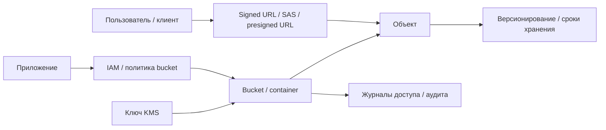
```mermaid
flowchart LR
  App["Приложение"] --> IAM["IAM / политика bucket"]
  IAM --> Bucket["Bucket / container"]
  User["Пользователь / клиент"] --> SignedURL["Signed URL / SAS / presigned URL"]
  SignedURL --> Object["Объект"]
  Bucket --> Object
  Object --> Versioning["Версионирование / сроки хранения"]
  Bucket --> Logs["Журналы доступа / аудита"]
  KMS["Ключ KMS"] --> Bucket
```

#### Границы ответственности
Объектное хранилище надежно хранит данные и применяет политику доступа, но не понимает их бизнес-смысл. Команда отвечает за владение bucket, публичную доступность, именование, область и срок подписанных ссылок, проверку загрузок на вредоносное содержимое, шифрование и KMS, жизненный цикл, сроки хранения, тесты восстановления и защиту чувствительных данных в журналах и артефактах.

#### Типовые рабочие паттерны
- Закрытые bucket и контейнеры по умолчанию; явный процесс исключений для публичного доступа.
- Отдельные bucket по средам, чувствительности данных и областям ответственности.
- Подписанные ссылки на загрузку и скачивание с коротким TTL и ограничениями метода и ключа объекта.
- Серверное шифрование с KMS для чувствительных данных.
- Версионирование, мягкое удаление и заданные сроки хранения резервных копий и критичных артефактов.
- Object Lock или неизменяемое хранение для архивов по обязательным требованиям и резервных копий, устойчивых к шифровальщикам.
- Журналы доступа и аудита в отдельном хранилище, куда отправитель имеет только право записи.
- Политики жизненного цикла для старых версий, незавершенных загрузок и временного экспорта.

#### Связанные файлы из проекта
- `content/review/architecture/checklist.ru.md` / `checklist.en.md`: потоки данных, границы доверия и доступность хранилища извне.
- `content/supply-chain/slsa-provenance/overview.ru.md` / `overview.en.md`: хранение артефактов, SBOM и сведений о происхождении.
- Отдельного плейбука по объектным хранилищам пока нет.

### PostgreSQL и реляционные базы данных

#### Для чего используется
PostgreSQL и другие реляционные БД хранят транзакционное состояние, учетные записи, заказы, расчеты, данные авторизации, записи аудита и другие сведения, для которых важны согласованность, ссылочная целостность и гибкость запросов.

#### Модель работы
База данных содержит схемы, таблицы, индексы, представления, функции и роли. Схема группирует объекты и часто разделяет предметные области или арендаторов, но сама по себе не заменяет контроль доступа. Роль может разрешать вход или объединять привилегии группы. Привилегии определяют право подключения, чтения, записи, изменения схемы, вызова функций и управления объектами.

Пулинг соединений снижает нагрузку на базу данных и ограничивает количество активных соединений. В рабочих средах часто используются PgBouncer или управляемые пулеры; важно понимать режим пулинга, поскольку пулинг транзакций и сессий влияет на подготовленные запросы, временные таблицы, переменные сессии и переключение ролей. Миграции изменяют схему данных: их нужно версионировать, проверять, по возможности делать обратимыми и обеспечивать совместимость с поэтапным развертыванием.

Безопасность на уровне строк (RLS) ограничивает строки политикой БД и помогает изоляции арендаторов, но требует строгой модели владения, тестов обхода и контроля привилегированных ролей. Резервное копирование и восстановление на момент времени опираются на базовые копии и WAL или архивные журналы. Реплики для чтения снижают нагрузку и помогают восстановлению, но требуют отдельного контроля доступа и учета задержки репликации в логике приложения.

Расширения, привилегии уровня суперпользователя и процедурные языки расширяют возможности БД и зону поражения. Аудит должен охватывать привилегированные действия, DDL, неудачную аутентификацию и доступ к чувствительным таблицам, где это требуется.

#### Границы ответственности
СУБД обеспечивает хранение, транзакции, привилегии и репликацию. Команда отвечает за владение схемой, минимальные права ролей, ротацию секретов, безопасность миграций, тесты восстановления, шифрование, сетевую доступность, аудит, изоляцию арендаторов и защиту чувствительных данных в запросах, дампах и репликах.

#### Типовые рабочие паттерны
- Управляемый PostgreSQL в закрытой сети.
- Отдельные роли для чтения и записи приложения, миграций и администрирования.
- Пул соединений с явно выбранным режимом.
- Резервные копии с регулярной проверкой восстановления и измеренными RPO/RTO.
- PITR для критичных транзакционных систем.
- Реплики для чтения с отдельными политиками доступа.
- RLS для общих таблиц арендаторов с высоким риском после отдельного моделирования угроз.
- Аудит привилегированных операций и доступа к чувствительным данным.

#### Связанные файлы из проекта
- `content/review/architecture/checklist.ru.md` / `checklist.en.md`: классификация данных, изоляция арендаторов и границы доверия.
- `content/application-security/business-logic/business-logic-abuse/playbook.ru.md` / `playbook.en.md`: операции с требованиями к целостности и сценарии злоупотребления.
- Отдельного плейбука по безопасности БД пока нет.

### Redis

#### Для чего используется
Redis используют как кеш, хранилище сессий и счетчиков частоты, легкую очередь, основу распределенных блокировок и быструю БД «ключ-значение». В рабочих средах Redis часто участвует в аутентификации, авторизации, корзине покупок, фоновых заданиях и защите от злоупотреблений.

#### Модель работы
Redis хранит строки, хеши, списки, множества, упорядоченные множества, потоки и другие структуры. Данные обычно находятся в памяти; сохранение настраивается через снимки RDB, AOF или их сочетание. Репликация и кластеризация повышают доступность и масштабируемость, но требуют понимания согласованности, переключения при отказе и распределения ключей.

AUTH и ACL ограничивают доступ клиентов к командам и шаблонам ключей. TLS защищает сетевой трафик. Ненужные приложению административные команды, изменения сохранения данных, скрипты и массовые операции с ключами могут привести к потере данных, раскрытию учетных данных, DoS или обходу границ арендаторов.

Политика вытеснения определяет удаляемые при нехватке памяти ключи. Для кеша это штатное поведение, для сессий или очереди возможен инцидент. Redis с несколькими арендаторами требует строгого разделения имен ключей, ACL, квот памяти и эксплуатационных процессов. Для разных зон доверия часто надежнее отдельные экземпляры.

#### Границы ответственности
Redis предоставляет быстрое хранилище данных в памяти и механизмы сохранения и репликации, но не гарантирует безопасную семантику кэша, сессий или блокировок. Команда отвечает за сетевую изоляцию, AUTH/ACL/TLS, ограничения команд, пространства имен ключей, лимиты памяти, поведение вытеснения, резервные копии там, где они нужны, мониторинг и защиту секретов и PII в значениях.

#### Типовые рабочие паттерны
- Управляемый Redis или изолированное частное развертывание.
- TLS и ACL с отдельными пользователями для приложений и эксплуатации.
- Запрет опасных команд для пользователей приложений.
- Отдельные экземпляры для кеша, сессий, очередей и ограничений частоты.
- Явные TTL ключей кеша и сессий.
- Лимиты памяти и политика вытеснения с учетом назначения.
- Мониторинг памяти, вытеснений, заблокированных клиентов, задержки репликации и выполнения команд.

#### Связанные файлы из проекта
- `content/application-security/business-logic/business-logic-abuse/playbook.ru.md` / `playbook.en.md`: ограничения частоты, сессии и защита от злоупотреблений.
- `content/review/architecture/checklist.ru.md` / `checklist.en.md`: управление состоянием и проверка потоков данных.
- Отдельного плейбука по Redis пока нет.

### Векторная база данных

#### Для чего используется
Векторная БД хранит векторные представления и ищет близкие векторы. Ее применяют для RAG, семантического поиска, рекомендаций, удаления дубликатов, обнаружения аномалий и других задач поиска по смыслу или признакам вместо точного совпадения.

#### Модель работы
Модель векторных представлений преобразует текст, изображение, событие или другой объект в числовой вектор фиксированной размерности. БД хранит вектор, ID объекта, метаданные и иногда ссылку на исходный документ или фрагмент. Приложение строит вектор запроса и ищет ближайших соседей по метрике сходства, например косинусному сходству, скалярному произведению или евклидову расстоянию.

Индекс ускоряет поиск, часто используя приближенные алгоритмы ближайших соседей. Снижение задержки и стоимости достигается ценой приближения, поэтому качество поиска нужно измерять отдельно. Фильтры метаданных ограничивают выдачу по арендатору, классу документа, источнику, ACL и другим атрибутам. В RAG они должны участвовать в авторизации, а не только упрощать поиск.

Векторная БД обычно не заменяет основное хранилище. Исходные документы, разрешения, жизненный цикл и процедуры удаления часто находятся в объектном хранилище, БД или хранилище документов, а векторный индекс является производным представлением. При обновлении или удалении документа обновляйте векторы, метаданные и индекс, иначе поиск может вернуть уже недоступные или удаленные по политике данные.

#### Границы ответственности
Векторная БД хранит векторы и ищет похожие, но не гарантирует правильную авторизацию, качество источников и безопасность найденного контекста. Команда отвечает за изоляцию арендаторов, авторизацию документов, целостность метаданных, проверку поступающих данных, распространение удаления, шифрование, резервные копии, аудит, мониторинг и защиту от отравления корпуса, утечек через векторы и неограниченного поиска.

#### Типовые рабочие паттерны
- Отдельные индексы или пространства имен по арендатору, среде и чувствительности, если общий индекс усложняет изоляцию.
- Поиск с учетом разрешений: фильтрация доступа до передачи контекста модели.
- Схема метаданных с владельцем, источником, классификацией, арендатором, версией документа и состоянием удаления.
- Конвейер загрузки с валидацией, проверкой вредоносного содержимого, происхождения и дубликатов.
- Лимиты поиска: `top_k`, порог оценки сходства, размер результата и частота запросов.
- Набор тестов качества поиска и утечек перед изменениями рабочей среды.
- Журналирование аудита для запросов, идентификаторов найденных документов, фильтров метаданных и административных изменений.
- Регулярная пересборка или очистка индекса после удаления документов, изменения разрешений и обновления модели векторных представлений.

#### Связанные файлы из проекта
- `content/ai-security/securing-ai/overview.ru.md` / `overview.en.md`: жизненный цикл LLMSecOps, конвейер данных RAG и защита векторной БД.
- `content/ai-security/owasp-llm-top-10/overview.ru.md` / `overview.en.md`: LLM09 Vector and Embedding Weaknesses.
- Отдельного плейбука по безопасности векторных БД пока нет.

### Elasticsearch / OpenSearch

#### Для чего используется
Elasticsearch и OpenSearch используют для поиска, анализа журналов, наблюдаемости, аналитики безопасности и индексирования документов. Они часто хранят журналы приложений, события аудита, поисковые индексы для клиентов и эксплуатационную телеметрию.

#### Модель работы
Кластер состоит из узлов и хранит индексы. Индекс содержит документы и описание полей и типов (mapping). Шарды разделяют индекс для масштабирования и репликации. Конвейер загрузки может преобразовывать документы: разбирать журналы, добавлять поля, нормализовать события или удалять часть данных.

Доступ задается на уровне кластера, индекса, документа и поля в зависимости от дистрибутива, редакции и конфигурации. OpenSearch Dashboards и Kibana предоставляют поиск и визуализацию, но при неправильной публикации открывают доступ к журналам, персональным данным, токенам и сведениям о внутренней инфраструктуре.

Репозитории снимков служат для резервного копирования, восстановления и миграции. Они часто находятся в объектном хранилище, поэтому их IAM и сроки хранения не менее важны, чем права кластера. Журналы и трассировки считаются чувствительными данными: в них могут быть заголовки авторизации, ID сессий, адреса почты, фрагменты запросов, трассировки стека и внутренние имена хостов.

#### Границы ответственности
Поисковый кластер индексирует документы, но не определяет безопасность журналирования и круг читателей. Команда отвечает за сетевую доступность, аутентификацию, авторизацию, изоляцию арендаторов и индексов, маскирование полей, очистку при загрузке, доступ к панелям, защиту снимков, сроки хранения, стоимость и кардинальность.

#### Типовые рабочие паттерны
- Управляемый или выделенный кластер в частной сети.
- Отдельные индексы или кластеры по средам и чувствительности.
- Управление жизненным циклом индексов для контроля хранения и стоимости.
- Маскирование секретов, токенов и персональных данных при загрузке.
- Минимальные права ролей доступа к панелям.
- Репозиторий снимков с ограниченным IAM и проверками восстановления.
- Оповещения о неудачной аутентификации, публичной доступности, порогах заполнения диска и всплесках загрузки.

#### Связанные файлы из проекта
- `content/review/architecture/checklist.ru.md` / `checklist.en.md`: потоки чувствительных данных и интерфейсы наблюдаемости.
- `content/application-security/web/browser-security/playbook.ru.md` / `playbook.en.md`: журналы и телеметрия клиентского кода с браузерными данными.
- Отдельного плейбука по Elasticsearch/OpenSearch пока нет.

### Kafka

#### Для чего используется
Apache Kafka служит распределенной платформой потоковой обработки событий: шиной событий, конвейером загрузки, журналом аудита, основой интеграций, источником потоковой обработки и буфером между сервисами. Часто это общая критичная платформа для бизнес-событий, телеметрии и интеграций.

#### Модель работы
Брокер хранит разделы (partitions) topic и обслуживает производителей и потребителей сообщений. Topic является логической категорией событий, например `orders.created`. Раздел представляет собой упорядоченный журнал только с добавлением записей и обеспечивает параллелизм. Реплика является копией раздела на другом брокере для отказоустойчивости. Контроллер управляет метаданными кластера, выбором лидеров разделов и изменениями состояния.

Производитель публикует записи в topic, выбирая раздел явно или через механизм распределения. Потребитель читает разделы и продвигает offset, то есть позицию чтения. Группа потребителей разделяет разделы между экземплярами приложения: каждый раздел в группе в один момент читает только один экземпляр. Это обеспечивает горизонтальное масштабирование обработки.

Schema Registry хранит схемы событий и проверяет совместимость контрактов производителей и потребителей. Kafka Connect запускает подключения к БД, объектным хранилищам, поисковым системам и другим сервисам. ACL определяют право чтения, записи, создания и администрирования topic, групп и ресурсов кластера.

Кластеры Kafka `4.x` работают в режиме KRaft без ZooKeeper; старые кластеры `3.x` могут сохранять ZooKeeper на время миграции. Производитель отправляет событие брокеру-лидеру раздела; брокер записывает его в журнал и реплицирует на ведомые узлы; группа потребителей читает события и фиксирует offsets; зависимые сервисы используют события для обработки, интеграции или аналитики.

#### Схема взаимодействия
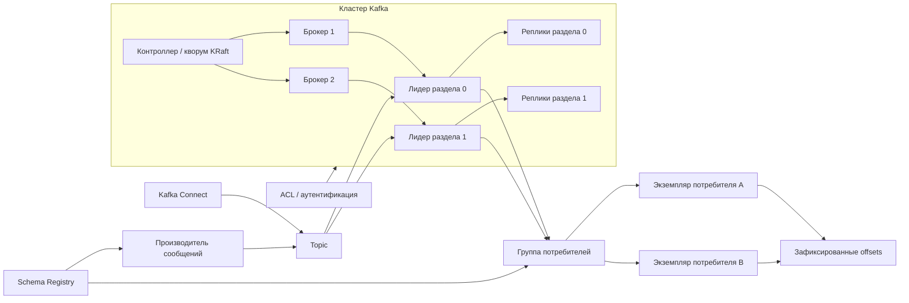
```mermaid
flowchart LR
  Producer["Производитель сообщений"] --> Topic["Topic"]
  Topic --> P0["Лидер раздела 0"]
  Topic --> P1["Лидер раздела 1"]

  subgraph KafkaCluster["Кластер Kafka"]
    Broker1["Брокер 1"] --> P0
    Broker2["Брокер 2"] --> P1
    P0 --> R0["Реплики раздела 0"]
    P1 --> R1["Реплики раздела 1"]
    Controller["Контроллер / кворум KRaft"] --> Broker1
    Controller --> Broker2
  end

  P0 --> CG["Группа потребителей"]
  P1 --> CG
  CG --> C1["Экземпляр потребителя A"]
  CG --> C2["Экземпляр потребителя B"]
  C1 --> Offsets["Зафиксированные offsets"]
  C2 --> Offsets

  Schema["Schema Registry"] --> Producer
  Schema --> CG
  Connect["Kafka Connect"] --> Topic
  ACL["ACL / аутентификация"] --> KafkaCluster
```

#### Границы ответственности
Kafka обеспечивает доставку, хранение и репликацию событий, но не определяет права доступа вместо приложения. Команды отвечают за владельцев topic, ACL, изоляцию арендаторов, шифрование при передаче, сроки хранения, управление схемами, защиту персональных данных и секретов в событиях и обработку повторной доставки.

Kafka не гарантирует безопасную интерпретацию сообщения потребителем.

#### Типовые рабочие паттерны
- Управляемая Kafka или выделенный платформенный кластер. Для собственной Kafka `4.x` явно обеспечивайте работу кворума KRaft, а оставшуюся зависимость от ZooKeeper рассматривайте как незавершенную миграцию.
- TLS для соединений клиентов с брокерами и между брокерами.
- SASL, OAuth или mTLS для аутентификации.
- ACL по topic и группе.
- Schema Registry для контрактов.
- Отдельные кластеры или префиксы по средам и предметным областям.
- Kafka Connect с отдельной моделью секретов.
- Мониторинг отставания потребителей, недостаточно реплицированных разделов, ошибок аутентификации и нагрузки, связанной с хранением.

#### Связанные файлы из проекта
- `content/review/architecture/checklist.ru.md` / `checklist.en.md`: событийная архитектура, границы доверия и проверка потоков данных.
- `content/platform-security/secrets/vault/playbook.ru.md` / `playbook.en.md`: выдача учетных данных, сертификатов и секретов подключений через Vault.
- Отдельного плейбука по Kafka пока нет.

### RabbitMQ

#### Для чего используется
RabbitMQ служит брокером сообщений для очередей, маршрутизации, асинхронной обработки, распределения задач и интеграции сервисов. Его используют для фоновых заданий, транзакционного обмена и интеграционных очередей, где важны правила маршрутизации, подтверждения обработки и обратное давление.

#### Модель работы
Брокер принимает сообщения, хранит очереди и доставляет их потребителям. Virtual host разделяет логическое пространство RabbitMQ: exchange, очереди, привязки, разрешения и политики существуют внутри vhost. Exchange принимает публикации и выбирает очереди назначения. Очередь хранит сообщения до чтения потребителем, а привязка связывает exchange с очередью по правилу маршрутизации.

Exchange использует ключ маршрутизации для выбора привязок. Тип direct сопоставляет точный ключ, topic использует шаблоны, fanout отправляет во все связанные очереди, headers выбирает по заголовкам. Потребитель читает сообщение и подтверждает успешную обработку. Если подтверждение не получено, брокер может вернуть сообщение в очередь или направить по схеме обработки недоставленных сообщений в зависимости от настроек.

Политика задает поведение очередей и exchange: TTL, максимальную длину, dead-letter exchange, параметры кворума и другие настройки. Операторская политика ограничивает клиентские аргументы и обычные политики, особенно по ресурсам. Разрешения пользователя определяют операции внутри vhost: configure, write и read.

Производитель публикует сообщение в exchange; ключ маршрутизации и привязки определяют очередь; брокер хранит сообщение; потребитель получает и подтверждает его обработку. При ошибке или истечении срока схема DLX и повторов определяет, повторить ли доставку, отложить сообщение или отправить в очередь недоставленных сообщений.

#### Схема взаимодействия
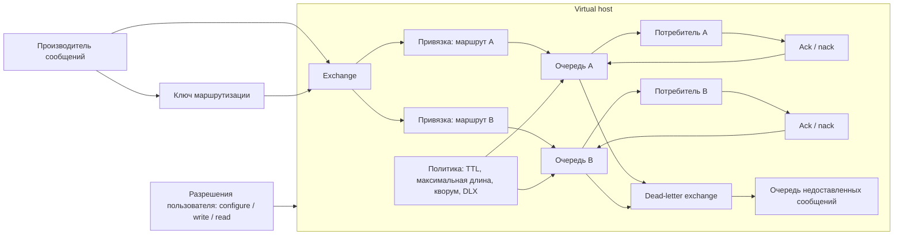
```mermaid
flowchart LR
  Producer["Производитель сообщений"] --> Exchange["Exchange"]
  Producer --> RoutingKey["Ключ маршрутизации"]
  RoutingKey --> Exchange

  subgraph VHost["Virtual host"]
    Exchange --> BindingA["Привязка: маршрут A"]
    Exchange --> BindingB["Привязка: маршрут B"]
    BindingA --> QueueA["Очередь A"]
    BindingB --> QueueB["Очередь B"]
    QueueA --> ConsumerA["Потребитель A"]
    QueueB --> ConsumerB["Потребитель B"]
    ConsumerA --> AckA["Ack / nack"]
    ConsumerB --> AckB["Ack / nack"]
    QueueA --> DLX["Dead-letter exchange"]
    QueueB --> DLX
    DLX --> DLQ["Очередь недоставленных сообщений"]
    Policy["Политика: TTL, максимальная длина, кворум, DLX"] --> QueueA
    Policy --> QueueB
  end

  Permissions["Разрешения пользователя: configure / write / read"] --> VHost
  AckA --> QueueA
  AckB --> QueueB
```

#### Границы ответственности
RabbitMQ отвечает за доставку и маршрутизацию, но не за безопасность содержимого и бизнес-смысл обработки. Команда отвечает за TLS, пользователей и разрешения, изоляцию vhost, политики очередей, DLQ, TTL, доступ к интерфейсу управления, учетные данные и проверку содержимого, особенно персональных данных и команд внутренним системам.

#### Типовые рабочие паттерны
- Кластер RabbitMQ с quorum queues для критичных очередей. Не проектируйте новые отказоустойчивые решения на classic mirrored queues, удаленных в RabbitMQ `4.x`.
- Постоянные очереди для рабочих сообщений. Временные неэксклюзивные классические очереди объявлены устаревшими в RabbitMQ `4.3+` и не должны использоваться как новая модель рабочей среды. Для временного состояния используйте эксклюзивные очереди с именами, назначенными сервером, или постоянные очереди с TTL.
- Отдельные vhost по предметным областям, средам или командам.
- TLS для клиентских соединений.
- Минимально необходимые разрешения на exchange и очереди.
- Очередь недоставленных сообщений и схема повторной доставки.
- Обычные и операторские политики для TTL, максимальной длины, кворума и верхних лимитов ресурсов.
- Ограниченный доступ к интерфейсу управления.
- Мониторинг глубины очередей, числа потребителей, неподтвержденных сообщений и частоты публикации и подтверждений.

#### Связанные файлы из проекта
- `content/review/architecture/checklist.ru.md` / `checklist.en.md`: асинхронные процессы, границы доверия и обработка сообщений.
- `content/platform-security/secrets/vault/playbook.ru.md` / `playbook.en.md`: управление учетными данными брокера и материалами TLS через Vault.
- Отдельного плейбука по RabbitMQ пока нет.
---

## Связанные материалы

- [Плейбук безопасности образов контейнеров](../../content/supply-chain/container-image-security/playbook.ru.md)
- [Плейбук ревью безопасности Kubernetes-кластера](../../content/platform-security/kubernetes/cluster-security-review/playbook.ru.md)
- [Плейбук Vault](../../content/platform-security/secrets/vault/playbook.ru.md)
- [Обзор безопасности ИИ](../../content/ai-security/securing-ai/overview.ru.md)
