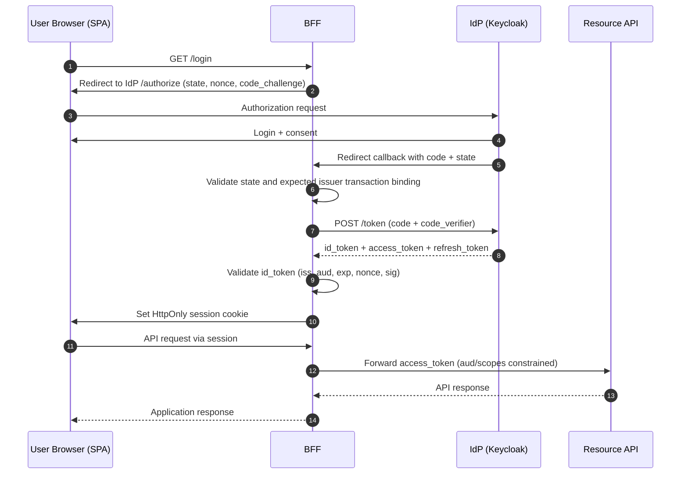

## 1. Scope and Objective

This playbook describes secure OIDC (authentication) and OAuth 2.0 (authorization) integration with Keycloak.

---

## 2. OIDC + OAuth 2.0 Workflow and Token Purpose

- **OIDC** handles user login and identity context via `id_token`
- **OAuth 2.0** handles delegated API access via `access_token`/`refresh_token`
- In Authorization Code flow, both are used together in one end-to-end sequence

### 2.1 Sequence (Authorization Code + PKCE, SPA + BFF pattern)

### 2.2 Token sets by flow

1. `authorization_code` (with OIDC scope):
- `id_token` + `access_token` + often `refresh_token`

2. `authorization_code` (without OIDC scope):
- `access_token` + often `refresh_token`, no `id_token`

3. `client_credentials`:
- only `access_token` (usually no refresh token)

4. `token exchange` (RFC 8693, Keycloak V2):
- input token -> new `access_token` (different audience/scope)

5. `offline_access` (scope, not flow):
- `offline_access` is an OAuth scope that changes refresh token semantics
- when requested and granted, an offline token is issued with long-lived or non-session-bound behavior
- this is not a separate grant flow, but token behavior modification in existing flows (for example, authorization_code)

### 2.3 Purpose of each token

- `id_token`: user authentication result for client session context
- `access_token`: token presented to the resource server for authorization; it may be bearer or sender-constrained
- `refresh_token`: gets new access tokens without full re-login
- `offline token`: gets new tokens without active browser session
- `userinfo` response: optional source of additional profile claims, not a replacement for `id_token` validation

Identity rule:
- Bind an external identity to the validated `(iss, sub)` pair and map it to an internal application user ID. `sub` is unique only within its issuer; using it alone is acceptable only while the application enforces one immutable issuer.
- Preserve issuer boundaries across realms, tenants, and IdP migrations. Pairwise `sub` values can differ between clients; linking identities requires an explicit, authenticated account-linking procedure.
- Do not use `email` as primary identity key
- Negative test: two trusted issuers with the same `sub` remain separate identities; matching email addresses do not silently link accounts or grant tenant membership.

### 2.4 Critical security rules

- Never use `id_token` as API bearer
- Keep `aud` and `scope` narrow
- Use explicit numeric token/session limits (see section 5), not vague "short/long" wording
- PKCE is mandatory for public clients

What PKCE is and why it is needed:
- PKCE (`Proof Key for Code Exchange`) adds a `code_challenge`/`code_verifier` pair to Authorization Code flow.
- It protects against authorization code interception: even if the code is stolen in redirect/callback paths, it cannot be exchanged for tokens without the `code_verifier`.

---

## 3. Recommended Architecture Patterns

### 3.1 Web Backend (server-rendered)

- Confidential client
- Authorization Code flow
- PKCE enabled (recommended even for confidential clients)
- Tokens are stored on backend
- Browser receives only session cookie

### 3.2 SPA + BFF (recommended for browser)

- SPA (`Single-Page Application`) is the browser-side frontend (JavaScript app) running in the user browser.
- BFF (`Backend for Frontend`) is a dedicated server-side backend for that frontend.
- SPA does not store refresh token
- BFF performs code exchange and stores refresh token server-side
- SPA talks to BFF through protected cookie-based session
- BFF calls APIs on behalf of user

Keep both access and refresh tokens on the BFF; exposing an access token to JavaScript creates a different client architecture. Restrict proxy destinations to explicitly approved hosts and paths, with allowed methods per route. Client input must not select an arbitrary upstream URL or cause credentials to be forwarded to an unintended destination. Test altered routes and redirects with synthetic tokens.

BFF and HttpOnly cookies reduce token theft but do not stop malicious same-origin JavaScript from making requests through the user's session. Preserve server-side authorization, CSRF defenses, XSS prevention, and additional confirmation for sensitive operations. Apply quotas to the authenticated user or tenant where appropriate; the BFF's shared outbound IP is not an individual user identity.

### 3.3 Mobile

- Public client
- Authorization Code + PKCE (`S256`)
- System browser only (ASWebAuthenticationSession / Custom Tabs)
- Refresh token stored only in OS secure storage

### 3.4 Service-to-service

- OAuth Client Credentials
- Separate machine clients and scopes/roles
- Do not mix user tokens and service tokens

---

## 4. Protection Profile Matrix (Recommended vs Maximum)

Maximum profile is defined as a **delta** to Recommended: the Maximum column lists only additional or stricter requirements.
Reading rule for controls below:
- If a bullet has no tag, it applies to both profiles (`R+M`)
- Maximum-only hardening is grouped under dedicated "Maximum profile hardening" blocks

| Control | Recommended (R) | Maximum (M) | Rationale / Threat |
|---|---|---|---|
| Flow and base client model | Authorization Code + PKCE (`S256`), SPA+BFF/server-side web app, mobile public + system browser, service confidential + client_credentials | In addition to R: mandatory strict client policies at IdP level | Reduces code interception risk, token misuse, and misconfiguration drift |
| Sender-constrained tokens | Bearer tokens are acceptable only after an explicit risk decision; public, partner, and high-value APIs must evaluate DPoP or mTLS and document any exception | In addition to R: require DPoP and/or mTLS; public clients must use sender-constrained refresh tokens or refresh token rotation with reuse detection | Reduces impact of bearer token theft and replay |
| PAR/JAR | Not mandatory by default | In addition to R: PAR (RFC 9126) + JAR (RFC 9101) for critical clients | Protects authorization parameters from tampering/mix-up, reduces front-channel risks |
| MFA/step-up | Offer phishing-resistant authentication; require it for privileged accounts and high-impact actions; verify authentication context per section 6.7 | In addition to R: hardware-backed, non-exportable authenticators where required by the assurance profile; reviewed recovery and emergency access | Protects against phishing, account takeover, and recovery bypass |
| Token TTL/rotation | Short TTLs, refresh token rotation, explicit numeric limits from section 5 | In addition to R: stricter TTLs and degraded windows for high-risk environments | Reduces exploitation window for compromised tokens |
| Token validation | `iss/aud/exp/nbf/iat/signature`, `alg` allowlist, `nonce`, `azp`, policy checks | In addition to R: mandatory holder-of-key validation for sender-constrained tokens | Protects against forged/misissued tokens, mix-up, and key confusion |
| Session/Cookies | HttpOnly/Secure/SameSite, narrow Domain/Path, session ID rotation, CSRF controls | In addition to R: no cross-origin on session-bound endpoints without approved exception | Protects against XSS cookie theft, CSRF, fixation, cookie scope abuse |
| Logout/Revocation | RP-initiated logout + local logout + refresh revocation | In addition to R: enforced revocation-latency objective for sensitive APIs after logout or compromise | Reduces replay after logout and accelerates revocation effect |
| Key management | Planned signing key rotation, trusted JWKS/issuer pinning | In addition to R: faster cadence and stricter emergency cutover SLA | Reduces blast radius in key compromise events |
| Operations/Monitoring | Baseline rate limits, lockout signals, auth/token anomaly monitoring | In addition to R: stronger anti-automation controls, stricter alerting and SLOs | Reduces brute-force/abuse and improves incident MTTR |

---

## 5. Unified Numeric Baseline (single source of truth)

All numeric limits for token/session/replay/rate-limiting are defined here. Other sections should reference this baseline instead of duplicating values.

These numbers are a local recommended baseline for live environments, not direct RFC or OIDC Core requirements. Treat them as default guardrails for this playbook and tune them by risk profile, user experience, client capability, and IdP behavior.

### 5.1 Token and session timing

- Access token TTL: `5-15m` (default: `10m`)
- ID token TTL: `<=5m`
- Browser/BFF refresh token absolute max lifetime: `<=24h`
- Mobile refresh token absolute max lifetime: `<=30d` only with secure enclave/keystore storage and device trust controls
- Refresh token reuse grace window (retry races): `<=30s`, only where the IdP explicitly supports a bounded window with the required replay detection. This is not a universal Keycloak setting. Serialize refreshes for one session across BFF instances and atomically persist the new token; test concurrent requests and use of an already replaced token
- User session idle timeout (browser): `15m`
- User session max age (browser): `8h`
- Fresh auth (`max_age`) for high-risk operations: `<=15m`
- JWT/client clock skew tolerance: `<=60s` (hard limit: `<=120s`)

### 5.2 Replay and rate-limiting baseline

- Token endpoint rate limit (per client + source IP): `60 req/min` sustained
- Burst budget: `120 req/min` within `<=1m`
- Brute-force lockout signal: `10` failed attempts in `5m`
- Callback state/nonce TTL: `<=10m`, single-use
- Introspection timeout budget: connect `<=100ms`, response `<=300ms`, total `<=500ms`
- Introspection cache TTL: positive `<=30s` (never above token `exp`/`Not Before`), negative `<=5s`
- Allowed degraded `fail-open` window only for low-risk class C and only by exception: `<=120s`

### 5.3 Maximum profile hardening

- For high-risk/regulated environments: tighten TTLs and max degraded windows relative to baseline values
- For high-risk/regulated environments: use stricter rate-limiting/burst/cache/degraded windows

---

## 6. Control Domains

### 6.1 Identity Flow

- Use Authorization Code + PKCE (`S256`) for browser/mobile user login
- Enforce strict callback integrity checks: `state` is mandatory and must match request->callback exactly
- `nonce` is mandatory for OIDC login and must match original authorization request value
- Redirect/logout URIs: exact match only and separate lists per environment
- For clients that can use more than one authorization server, realm, or tenant issuer, require mix-up protection: validate the authorization response `iss` parameter when the authorization server advertises RFC 9207 support, or use distinct redirect URIs bound to one issuer. Store the expected issuer in transaction state and reject callbacks where the issuer does not match.
- In Keycloak, use Client Policies/Profiles to enforce OAuth 2.1/FAPI-relevant settings supported by the deployed version and adapters: PKCE `S256`, safe redirect URIs, blocked implicit/password flows, request object/PAR/JAR where required by profile, and holder-of-key/DPoP for selected clients.
- Block the `implicit` grant by default; any temporary exception requires a migration plan, owner, expiry, and compensating controls.
- The OAuth password grant / Resource Owner Password Credentials flow is forbidden for live clients. Do not approve it as a normal exception path; use only a time-boxed migration plan for existing legacy clients.
- Replacement paths: Authorization Code + PKCE for browser/mobile/user login, device authorization flow where user interaction happens on a constrained device, and `client_credentials` for service-to-service access.

Maximum profile hardening:
- Enable PAR/JAR for critical clients and elevated-risk flows

### 6.2 Token Security

- Validate `iss`, `aud`, `exp`, `nbf`, `iat`, signature (`kid`/JWKS)
- Enforce JWT `alg` allowlist and reject unexpected algorithms
- Validate `azp` when present (especially with multiple audiences)
- Validate authorization scopes + roles + policy (deny-by-default)
- Never use `id_token` as API bearer
- Use short TTL/rotation and explicit audience (see section 5)
- Keep `Revoke Refresh Token` enabled (rotation)
- High-risk operations and post-incident restrictions must meet the revocation-latency objective in section 6.4. Require an online or event-driven status check when offline JWT validation cannot meet it; introspection is one supported mechanism. Reject invalid or suspicious tokens pending verification rather than treating introspection as a way to repair failed validation.
- Bearer access tokens are acceptable only after a documented risk decision. For public, partner, high-value, or high-replay-impact APIs, evaluate sender-constrained tokens (`DPoP` and/or `mTLS`). If bearer-only is approved, document client support constraints, XSS/client-compromise caveats, compensating controls, and token TTL.

Maximum profile hardening:
- Require sender-constrained tokens (DPoP and/or mTLS)
- For public clients: require sender-constrained refresh tokens or refresh token rotation with reuse detection; prefer sender-constrained access tokens for high-replay-impact APIs.
- Verify holder-of-key validation support in adapters/runtime for DPoP/mTLS. For DPoP, the resource server validates proof signature, `typ`, an allowed asymmetric `alg`, token key binding, `htm`, `htu` without query/fragment, `ath`, freshness, and replay protection; validate a server-issued `nonce` as well. Reject another key, an altered method or URL, missing proof, and proof reuse. Do not accept a DPoP token as ordinary Bearer

### 6.3 Session and Cookies

- Browser stores session cookie only; refresh/offline tokens in browser storage are forbidden
- Application server stores session state (Redis/DB/in-memory with replication)
- Rotate session ID after login callback and after privilege elevation
- Cookie `HttpOnly`: blocks JS access and reduces XSS-driven cookie theft
- Cookie `Secure`: sends cookie over HTTPS only, reducing in-transit interception risk
- Use `SameSite=Lax` as the common cookie default. Use `SameSite=None; Secure` only when the actual cross-site flow requires it, such as an applicable cross-site POST or embedded flow. Ordinary redirect-based SSO does not inherently require `None`; test the response mode and keep CSRF controls.
- Narrow `Domain`/`Path`: reduces cross-app leakage and cookie tossing/subdomain takeover impact
- CSRF protection is mandatory for state-changing BFF endpoints (`POST/PUT/PATCH/DELETE`): use a synchronizer token or a signed double-submit cookie bound to the authenticated session with HMAC and a server-side secret; naive double-submit cookies are not acceptable
- Validate `Origin` (primary) and `Referer` (fallback) for browser state-changing requests
- Apply same-origin policy for session-bound endpoints and enforce `Sec-Fetch-Site` checks
- Negative tests must include cookie injection/subdomain cookie scenarios, missing token, mismatched token, cross-site `Origin`, and absent `Sec-Fetch-*` fallback behavior

Maximum profile hardening:
- For session-bound endpoints, do not allow cross-origin CORS without explicitly approved exception

### 6.4 Logout and Revocation

- Implement secure logout flow: local session destroy -> RP-initiated logout -> strict `post_logout_redirect_uri`
- Revoke refresh token on logout via `/protocol/openid-connect/revoke` (RFC 7009)
- For multi-RP ecosystems, configure back-channel/front-channel logout with fallback behavior
- For global incidents, use `Sign out all active sessions` + realm/client `Not Before`
- Treat sign-out alone as insufficient for already issued access tokens until `exp` (see section 5)
- Define and enforce a maximum revocation latency for sensitive APIs. Use introspection/opaque tokens, event-driven invalidation, or access-token lifetimes short enough to meet that objective. Sender-constrained tokens reduce replay but do not themselves revoke a token. Introspection is one architecture choice, not a universal OAuth requirement.
- Record access-token TTL, refresh-token behavior, compromise response, validation/cache behavior, and local versus IdP logout semantics. Invalidation must reach every serving instance; measure stale-cache behavior during outages.
- Set a numeric revocation-latency objective for each endpoint class before release. Measure from the accepted logout/revocation/incident decision to rejection on all API instances; include event propagation, positive-cache lifetime, clock tolerance, and in-flight work. A previous cached `active` result must not authorize a sensitive operation past that objective. If no objective or evidence exists, block high-risk launch.
- Reject tokens that are inactive, issued before `Not Before`, or violate binding context

Maximum profile hardening:
- Tighten revocation latency and require an online or event-driven check where offline validation cannot meet it. Test logout and revocation with an already issued token on every API instance, including cache and IdP outage cases.

### 6.5 Key Management

- Validate JWT signatures only against trusted JWKS (`/protocol/openid-connect/certs`) from expected issuer
- `kid` must resolve to an approved verification key in the trusted JWKS. A passive Keycloak key can verify previously issued tokens during rotation overlap; disabled or compromised keys must not be accepted. Untrusted/user-controlled JWKS URLs are forbidden
- Planned realm signing key rotation is mandatory
- Rotation model: introduce new key in advance (active/passive), retire old key only after compatibility window
- Emergency compromise response: immediate new key issuance and session/token invalidation
- Local operational assumption, tune to issuer capability and threat model: signing key rotation every `90d`, overlap `24-72h`, emergency cutover `<=1h`
- HTTPS only; mTLS for trusted internal channels where required by threat model
- For confidential clients prefer `private_key_jwt` or mTLS; allow `client_secret` only with mandatory rotation

Maximum profile hardening:
- Tighten rotation cadence and emergency SLA for regulated/high-risk environments

### 6.6 Operations and Monitoring

- Centralize JWT/introspection validation in middleware and preserve deny-by-default authorization
- Enable IdP admin/user event auditing and SIEM correlation between auth and API events
- Monitor token endpoint errors, refresh failures, invalid signature, invalid audience, token-exchange/DPoP failures
- Capture and alert on replay signals (`state`/`nonce` reuse, repeated callback correlation IDs)
- For introspection, use circuit breaker + backoff + automatic policy normalization after confirmed recovery
- Define per-endpoint-class behavior:
  - Class A (money movement/admin/privilege changes/PII export): `fail-closed`
  - Class B (state-changing business operations): `fail-closed`
  - Class C (low-risk read-only): explicit decision; `fail-open` only by approved exception

Maximum profile hardening:
- Strengthen anti-automation controls and alerts (lower thresholds, faster response SLA)

### 6.7 Authentication Strength, Passkeys, and Recovery

Production profile:
- Offer WebAuthn/FIDO2 passkeys for user accounts. Require phishing-resistant authentication for privileged accounts and high-impact operations; OTP, SMS, and ordinary push approval are not equivalent protection. Record any migration exception with owner, expiry, restricted operations, and compensating controls.
- For passkeys used as MFA, require user verification and validate the `UV` flag server-side. A user-presence gesture alone does not establish a second factor. Synced passkeys may serve an AAL2-oriented profile; an AAL3 profile requires non-exportable keys and the other applicable assurance requirements. Do not claim an AAL merely from a product label.
- Use a maintained WebAuthn verifier. Validate ceremony type, single-use challenge, exact allowed origin, RP ID hash, signature, credential ownership, and required presence/verification flags. Define challenge expiry server-side. Test the exact browser, authenticator, IdP, and proxy configuration before enabling new WebAuthn features.
- Record whether credentials are synced or device-bound. Treat backup flags and signature-counter changes as risk signals; a zero or non-increasing counter alone is not proof of cloning for synced credentials. Require attestation only when device provenance is part of the threat model, with an approved trust store and privacy assessment.
- For federated step-up, bind the request to the original session and verify the returned `auth_time`, approved `acr`, and provider-specific `amr` semantics. Sending `max_age` or requesting an assurance level alone does not prove it was achieved; enforce the section 5 freshness limit and deny the operation when evidence is insufficient.

Where passwords remain:
- Require at least `15` characters for password-only authentication; a minimum of `8` is acceptable only when every password login requires MFA. Allow at least `64` characters, password managers, and paste; do not silently truncate.
- Block common and compromised passwords. Do not impose arbitrary character-composition rules or periodic password changes; force a change on evidence of compromise. Apply account-aware throttling and the password-hashing baseline in the secure coding playbook.

Enrollment and recovery:
- Adding, replacing, or removing an authenticator, changing a recovery channel, and linking an external identity require recent authentication at the applicable strength. An existing session cookie or knowledge of account details alone is insufficient.
- Provide a separately registered backup authenticator or protected recovery codes. Store recovery-code verifiers, enforce single use and throttling, and notify the user through an existing trusted channel on factor and recovery changes.
- Password reset links are short-lived, single-use, and bound to the account and purpose. Do not automatically sign in after reset or let password reset silently remove MFA. For suspected takeover, revoke affected sessions and refresh tokens through section 6.4.
- Recovery of privileged access needs independent approval and recorded identity verification; email/SMS fallback must not restore unrestricted privileged access by itself. Emergency access is a separate, monitored, time-bounded procedure with post-use review.

Verification:
- Reject replayed challenges, wrong origin/RP ID, another user's credential, and missing required `UV`; test legitimate synced credentials separately from suspected cloning.
- Reject stale or weaker step-up results, factor replacement from a stolen session, recovery-code reuse, account enumeration, and helpdesk attempts to bypass the privileged recovery procedure.
- Keep the authenticator policy, enrollment/recovery audit events, redacted authentication-context samples, and negative-test results with release evidence. Review fallback use and authenticator removal as security signals.

---

## 7. Threat-Driven Checks (Mandatory in Review)

- Authorization code interception -> PKCE + exact redirect URI
- Bearer token theft -> short TTL + sender-constrained tokens where risk profile requires
- Refresh token reuse -> rotation + reuse detection
- Open redirect -> strict allowlist
- Mix-up attacks -> `iss` validation + strict client/issuer config
- Privilege escalation -> strict audience/scope/role separation
- Session fixation -> session ID rotation after login
- Token leakage in logs -> redaction and explicit no-token logging policy

---

## 8. Anti-patterns

- Using `id_token` as API bearer
- PKCE `plain` instead of `S256`
- Wildcard redirect URI
- Storing refresh token in browser storage
- Enabling password grant / Keycloak Direct Access Grants for live clients
- Long access token TTL (hours/days)
- Single client for user login and machine-to-machine traffic without segregation
- Missing key rotation and missing key-compromise response procedure

---

## 9. Step-by-Step Integration with Keycloak

### Step 1. Realm and cryptography baseline

- Configure realm keys and rotation plan (see Key Management domain)
- Enable admin/user event audit
- Verify HTTPS and correct proxy header handling

### Step 2. Create client types

- `web-bff` (confidential)
- `spa-frontend` (if separate public client is needed)
- `mobile-app` (public + PKCE)
- `service-api-client` (confidential + `client_credentials`)

### Step 3. Lock redirect/logout URIs

- Exact match only
- Separate URI sets per environment
- Configure `Valid Post Logout Redirect URIs`

### Step 4. Enable secure capabilities

- Standard Flow: ON for user-login clients; OFF for a separate `client_credentials`-only client. Enable Client authentication and Service accounts roles for that service client, leaving other unnecessary flows disabled
- Implicit: OFF
- Direct Access Grants: OFF. In Keycloak this corresponds to the password grant and must remain disabled for live clients; legacy use requires a migration plan, not a standing exception.
- PKCE method: `S256`
- Revoke Refresh Token: ON (typically)
- Client Policies: enabled for the relevant client class and actually blocking unsafe grant/redirect/PKCE/holder-of-key settings, not only documenting the baseline.

Maximum profile hardening:
- Enable PAR/JAR and sender-constrained tokens for selected high-risk clients

### Step 5. Configure scopes/roles/audience

- Minimal client scopes
- Separate API client roles
- Audience mapping to exact resource servers

### Step 6. Integrate application

- Use `.well-known/openid-configuration` as endpoint source
- Pin trust to expected `issuer` and use only that issuer's `jwks_uri`
- Keep browser session cookie, not bearer tokens in browser storage
- In callback, strictly validate `state` and `nonce` before creating local session

### Step 7. Build resource server middleware

- Centralize JWT/introspection validation
- Enforce `iss/aud/exp/nbf` and scope/role checks
- Preserve deny-by-default authorization

### Step 8. Implement logout/revocation/invalidation

- Implement RP-initiated logout
- Implement refresh-token revocation path
- Prepare incident runbook for mass `Not Before`

### Step 9. Monitoring and detection

- Implement the metrics and alerts set from Operations/Monitoring domain
- Maintain response runbook for replay/brute-force/token-abuse signals
---

### Selected ASVS verification references

- `v5.0.0-9.2.1`: validate the validity period specified in a token, including JWT `nbf` and `exp`; a valid signature does not replace this check.
- `v5.0.0-10.3.1`: the resource server accepts only access tokens intended for it; validate the audience using token data or the introspection response.

Use these ASVS 5.0.0 requirements when recording verification results for the relevant controls; the list is not a complete ASVS assessment.

## 10. Related Materials

- [Browser and frontend security playbook](/Product-security-playbook/en/application-security/web/browser-security/playbook/)
- [API security playbook](/Product-security-playbook/en/application-security/api/api-security-patterns/playbook/)
- [Vault playbook](/Product-security-playbook/en/platform-security/secrets/vault/playbook/)
- [Threat modeling playbook](/Product-security-playbook/en/review/threat-modeling/playbook/)
