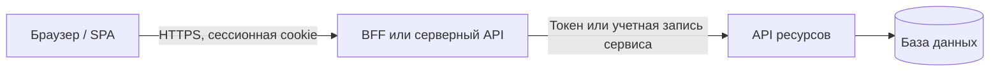
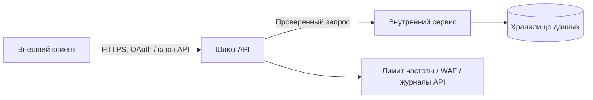
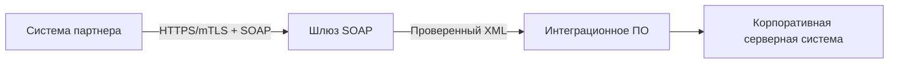
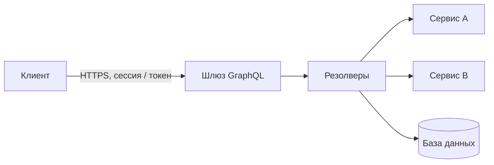
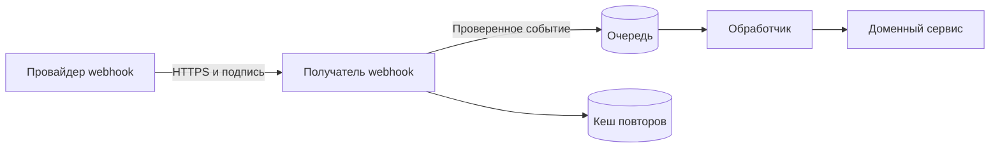
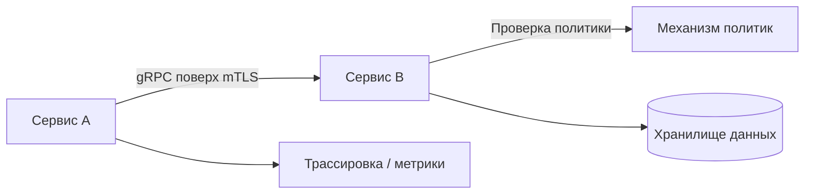
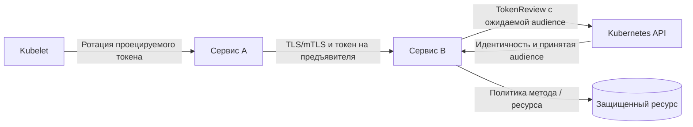

## 1. Область и цель

Этот плейбук описывает основные виды API, применимые угрозы, базовые меры защиты и типовые схемы интеграций для REST, SOAP/XML, GraphQL, Webhook и gRPC.

Базовый профиль согласован с OWASP API Security Top 10 2023. Цель документа состоит в том, чтобы превратить категории в проверяемые меры контроля для рабочих сред, рабочие настройки и подтверждения для ревью.

Используйте документ для:
- проектирования публичных, партнерских, внутренних и обращенных к фронтенду API;
- архитектурного ревью API до релиза;
- построения модели угроз, чеклиста безопасности и плана негативных тестов;
- выбора обязательных мер контроля для шлюза API, BFF, межсервисных интеграций и webhook.

Документ не заменяет специализированные материалы:
- для OIDC/OAuth используйте [руководство по безопасности OIDC + OAuth 2.0](/Product-security-playbook/ru/application-security/identity/oidc-oauth/playbook/);
- для моделирования угроз используйте [плейбук по моделированию угроз](/Product-security-playbook/ru/review/threat-modeling/playbook/);
- для архитектурной проверки допуска используйте [чеклист ревью архитектуры безопасности](/Product-security-playbook/ru/review/architecture/checklist/).

---

## 2. Виды API и назначение

### 2.1 REST API

REST API обычно используют HTTP-методы, URI-ресурсы и представления данных в JSON. Клиент обращается к конкретному ресурсу или коллекции ресурсов, а операция выражается через метод вроде `GET`, `POST`, `PUT`, `PATCH` или `DELETE`.

Это основной выбор для публичных API, взаимодействия клиентской и серверной частей, партнерских API, большинства операций CRUD и бизнес-процессов. В рабочей среде REST API часто находится за шлюзом API или BFF, но граница безопасности не должна заканчиваться на маршруте: доменная логика все равно должна проверять права на объект, арендатора, действие и поля.

Сильные стороны:
- широкая поддержка шлюзов API, OpenAPI, генерации SDK, DAST и контрактного тестирования;
- понятная модель ресурсов и кодов состояния HTTP;
- простая интеграция с OAuth 2.0, ключами API, mTLS и ограничением частоты запросов.

Типовые риски:
- Нарушение авторизации на уровне объекта (BOLA): пользователь получает доступ к объекту по чужому ID, потому что API проверяет только факт входа, а не право на конкретный ресурс. Типовой признак: изменение `user_id`, `tenant_id`, `order_id` или другого идентификатора объекта возвращает чужие данные или позволяет изменить чужой объект.
- Нарушение авторизации на уровне функции (BFLA): пользователь вызывает функцию, метод или маршрут, которые не должны быть доступны его роли. Часто проявляется как доступ обычного пользователя к административным эндпоинтам, функциям поддержки или экспорта через прямой HTTP-запрос, даже если интерфейс не показывает такую кнопку.
- Массовое присваивание и избыточное раскрытие полей: API принимает или возвращает больше полей, чем нужно для конкретной операции. При массовом присваивании клиент может передать `role`, `isAdmin`, `tenantId` или служебный флаг в модель записи; при избыточном раскрытии ответ показывает внутренние или чувствительные поля.
- Неконтролируемые параметры пагинации, фильтрации и сортировки: клиент управляет дорогостоящими запросами без лимитов и списка разрешенных значений. Это может привести к исчерпанию ресурсов, обходу бизнес-ограничений, утечкам через время ответа или выборке данных вне ожидаемой области.
- Слабая инвентаризация старых версий API: команда не знает, какие версии, маршруты и устаревшие эндпоинты доступны во время работы. Старые версии часто обходят новые меры авторизации, валидации и журналирования, потому что не проходят ту же проверку допуска к выпуску.

### 2.2 SOAP/XML API

SOAP API использует XML-сообщения с формальной оболочкой (envelope), контрактами WSDL и часто дополнительными механизмами WS-* для подписи, шифрования, маршрутизации и надежности. В отличие от обычного REST поверх HTTP, смысл операции обычно задается SOAP action, структурой тела XML и контрактом сервиса.

SOAP применяется в устаревших, корпоративных, банковских, государственных и B2B-интеграциях, где важны формальные контракты, XML Schema, расширения WS-* и совместимость с существующими платформами. В рабочей среде такие API часто стоят перед критичными серверными системами, поэтому безопасная настройка парсера, подписи, маскирование данных в ошибках и сегментация важны не меньше самой аутентификации партнера.

Сильные стороны:
- строгие WSDL/XSD-контракты;
- зрелая поддержка корпоративного промежуточного ПО;
- возможность защиты на уровне сообщений в сценариях WS-Security.

Типовые риски:
- XXE, расширение XML-сущностей и XML-бомба: XML-парсер обрабатывает внешние сущности, DTD или чрезмерное расширение сущностей. Это может привести к чтению локальных файлов, SSRF, утечке сетевых метаданных или отказу в обслуживании через рост потребления памяти и CPU.
- Небезопасная канонизация XML или проверка подписи: подпись проверяется не на том представлении XML или не на том элементе документа. Атакующий может использовать обертывание подписи (signature wrapping), чтобы сохранить корректную подпись на безопасной части сообщения и подставить вредоносное содержимое в исполняемую часть.
- Чрезмерно доверенная схема интеграции с серверными системами: шлюз SOAP передает корректный XML дальше как доверенную бизнес-команду без повторной проверки контекста. В устаревших интеграциях это часто дает прямой путь к банковскому ядру, ERP, биллингу или другим системам с серьезными последствиями компрометации.
- Сложная обработка ошибок и раскрытие внутренних деталей: ошибки SOAP и промежуточного ПО могут раскрывать трассировки стека, имена серверных систем, фрагменты SQL/XML и детали маршрутизации. Эти данные помогают атакующему подобрать следующий шаг и упрощают эксплуатацию ошибок парсера или серверной системы.

### 2.3 GraphQL API

GraphQL API обычно предоставляет один эндпоинт, на который клиент отправляет запрос или мутацию и сам выбирает нужные поля, вложенные связи и форму ответа. Схема описывает доступные типы, поля и операции, а резолверы получают данные из серверных сервисов, баз данных или других API.

GraphQL подходит для клиентских приложений, которым нужен гибкий выбор полей и агрегация данных из нескольких серверных источников. Его модель безопасности сосредоточена на резолверах, управлении схемой и контроле стоимости запросов; сводить отличие от REST к меньшему количеству эндпоинтов нельзя.

Сильные стороны:
- точный выбор полей клиентом;
- единая схема;
- удобная агрегация данных для веб-интерфейса и мобильных приложений.

Типовые риски:
- Обход авторизации на уровне поля, узла или связи: резолвер GraphQL возвращает поле, узел или связь без проверки прав на конкретный объект и арендатора. Даже если запрос верхнего уровня защищен, вложенный резолвер может раскрыть электронную почту, платежные данные, членство в группах или административные атрибуты.
- Отказ в обслуживании через глубину и сложность запроса: клиент строит глубоко вложенный или дорогой запрос, который заставляет сервер выполнять большое число вызовов резолверов и зависимых систем. Без лимитов глубины, сложности, тайм-аутов и отмены один запрос может создать нагрузку как множество REST-вызовов.
- Пакетные атаки и перебор внутри одного HTTP-запроса: клиент отправляет много операций или псевдонимов в одном запросе и обходит ограничение частоты HTTP-запросов. Это удобно для перебора учетных данных, OTP, идентификаторов объектов или проверки существования записей с меньшим числом видимых HTTP-событий.
- Утечки через introspection, GraphiQL и подробные ошибки: исследование схемы и инструменты разработки раскрывают типы, поля, мутации, устаревшие возможности и внутренние правила именования. Подробные ошибки могут дополнительно раскрывать пути резолверов, сообщения серверных систем и данные, полезные для атаки.

### 2.4 Webhook API

Webhook представляет собой входящий вызов от внешнего провайдера или другой системы при наступлении события: платеж прошел, заказ изменился, пользователь создан, оповещение сработало. В отличие от обычного API, получатель обычно не инициирует запрос сам и должен принимать события асинхронно, с учетом повторных попыток, нарушения порядка и повторной доставки.

Для принимающей стороны webhook является точкой входа из интернета, даже если он не выглядит как пользовательский API. Его безопасность строится вокруг проверки подписи исходного тела запроса, защиты от повторной отправки с проверкой временной метки, идемпотентности, изоляции обработки через очередь и строгой валидации содержимого до любых бизнес-действий.

Сильные стороны:
- асинхронная доставка событий;
- уменьшение частоты опроса;
- простая интеграция с SaaS и партнерскими системами.

Типовые риски:
- Подмена провайдера: атакующий отправляет запрос, похожий на webhook от легитимного сервиса. Если подпись, временная метка, идентификатор ключа и источник не проверяются до бизнес-обработки, система может принять поддельное событие как реальный платеж, возврат, регистрацию или оповещение.
- Повторная отправка старого события: ранее корректный webhook повторно отправляется после изменения состояния. Без ограничения давности и кеша повторных событий старое событие может повторно выполнить операцию или откатить состояние к нежелательному результату.
- Повторная обработка и нарушение идемпотентности: одно событие обрабатывается несколько раз из-за повторных попыток провайдера, сетевых ошибок или состояния гонки. Если обработчик не привязан к идентификатору события или ключу идемпотентности, возможны двойные списания, повторные уведомления, дубли заказов и рассогласованное состояние.
- Цепочки, подобные SSRF, если содержимое запускает исходящие запросы: тело webhook содержит URL, домен, ссылку на объект или цель интеграции, которую получатель затем использует для исходящего вызова. Без списка разрешенных значений и контроля исходящего трафика это превращает webhook в косвенный путь SSRF или утечки данных.
- Переполнение очереди и сообщения, вызывающие сбой обработки: атакующий или неисправный провайдер отправляет много событий либо содержимое, которое постоянно нарушает работу обработчика. Это заполняет очередь, задерживает легитимные события и может вызвать бесконечные циклы повторных попыток без очереди необработанных сообщений (DLQ) и лимитов.

### 2.5 gRPC API

gRPC API описывает сервисы и методы в контракте `.proto`, использует Protocol Buffers для сериализации сообщений и обычно работает поверх HTTP/2. Вызов представляет собой обращение к RPC-методу, а не к ресурсу URI; API может использовать одиночные запросы и ответы, серверные, клиентские или двунаправленные потоки.

gRPC часто применяется для внутреннего межсервисного взаимодействия с низкими задержками и потоковой передачи. В рабочей среде его нельзя считать безопасным только потому, что он внутренний: нужны TLS/mTLS, идентификация рабочей нагрузки, авторизация на уровне метода, сроки завершения, лимиты сообщений и контроль рефлексии сервера.

Сильные стороны:
- строгий protobuf-контракт;
- эффективная бинарная сериализация;
- поддержка одиночных и потоковых RPC;
- удобные перехватчики для аутентификации, авторизации и журналирования.

Типовые риски:
- Отсутствие авторизации на уровне метода: сервис проверяет только mTLS или учетную запись сервиса, но не право вызывающей рабочей нагрузки на конкретный RPC-метод и ресурс. После компрометации одного сервиса это упрощает продвижение атакующего внутри инфраструктуры и вызов привилегированных методов.
- Незашифрованный gRPC во внутренних сетях: трафик передается без TLS/mTLS, потому что сеть считается доверенной. Это повышает риск перехвата, подмены и утечки учетных данных или сессий при ошибках сегментации, обходе sidecar или компрометации узла.
- Чрезмерно доступная рефлексия сервера: она раскрывает список сервисов, методов и типов сообщений клиентам, которым это не нужно в рабочей среде. Это ускоряет разведку и помогает атакующему формировать корректные запросы без доступа к proto-файлам.
- Отказ в обслуживании через размер сообщений или потоковую передачу: большие сообщения, длинные потоки или отсутствие сроков завершения удерживают память, соединения и рабочие потоки. Без лимитов размера сообщения, длительности потока и параллелизма один клиент может ухудшить работу всего пула серверов.
- Слабый контроль обратной совместимости схем protobuf: изменения в proto нарушают работу старых клиентов или меняют смысл значений по умолчанию и неизвестных полей. Ошибки развития схемы могут привести к обходу авторизации, неверной интерпретации бизнес-флагов или незаметной потере данных.

---

## 3. Форматы данных и влияние на безопасность

| Формат | Где используется | Влияние на безопасность | Обязательные меры |
|---|---|---|---|
| JSON | REST, GraphQL, webhook | Массовое присваивание, путаница типов, избыточное раскрытие данных, инъекции в зависимые интерпретаторы | Валидация JSON Schema/OpenAPI, список разрешенных полей, запрет неизвестных свойств для моделей записи, фильтрация ответов |
| XML | SOAP, устаревшие REST API, сообщения наподобие SAML | XXE, расширение сущностей, инъекции XPath/XSLT, обертывание подписи | Отключение DTD и внешних сущностей, безопасный режим обработки, ограничения схемы, тесты обертывания подписи |
| Protocol Buffers | gRPC, контракты событий | Неочевидные значения по умолчанию, неизвестные поля, ошибки изменения схемы | Валидация protobuf, максимальный размер сообщения, проверки совместимости, явная авторизация вне схемы |
| Multipart/form-data | загрузка файлов, смешанное содержимое | Вредоносное ПО, различия поведения парсеров, чрезмерный размер частей, подмена типа содержимого | Лимиты размера файлов и частей, определение фактического типа содержимого, сканирование вредоносного ПО, изоляция хранилища |
| application/x-www-form-urlencoded | браузерные формы, эндпоинты OAuth | Загрязнение параметров, неоднозначное кодирование, риск CSRF | Строгое поведение парсера, политика повторяющихся параметров, защита от CSRF для процессов с привязкой к cookie |
| Двоичные данные | файловые API, потоковая передача, медиа | Эксплуатация парсеров, бомбы распаковки, исчерпание ресурсов | Обработка с ограничениями, обработка в песочнице, лимиты коэффициента распаковки, асинхронное сканирование |

---

## 4. Модели экспозиции

Стиль API и модель экспозиции нужно разделять. REST может быть публичным, внутренним или обращенным к фронтенду; каждый вариант имеет разные границы доверия.

| Модель экспозиции | Граница доверия | Основные риски | Базовый профиль безопасности |
|---|---|---|---|
| Браузер или клиентская часть -> серверный API | Браузер и сервер разделены границей интернета; браузер недоверенный | CSRF, ошибки CORS, утечка токенов, BOLA, злоупотребление API через XSS | BFF или сессионная cookie с HttpOnly, защита от CSRF, строгий CORS, авторизация на уровне объекта |
| Публичный API -> шлюз API -> внутренние сервисы | Интернет-клиент обращается к публичной границе | Кража ключа API, неправильное использование OAuth, злоупотребление ботами, обход квот, дрейф инвентаризации | OAuth с `client_credentials` или подпись запросов HMAC, проверка шлюзом, квоты клиентов, принудительное применение схемы |
| Партнерский API | Внешний клиент по договору | Совместное использование учетных данных, слабые меры партнера, избыточный доступ | mTLS или OAuth `client_credentials`, списки разрешенных источников, где оправданно, ограниченный доступ, контроль контракта |
| Внутренний межсервисный API | Внутренняя сеть не считается доверенной | Продвижение атакующего внутри инфраструктуры, злоупотребление доверенным посредником, отсутствие авторизации | Идентификация рабочей нагрузки, mTLS, авторизация метода и ресурса, сетевая политика |
| Получатель webhook | Внешний провайдер вызывает вашу точку входа | Подмена источника, повторная отправка и доставка, злоупотребление содержимым | Проверка подписи, допустимая давность временной метки, ключ идемпотентности, изоляция через асинхронную очередь |
| Административный или привилегированный API | Пользователь или сервис выполняет опасные действия | Повышение привилегий, отказ от совершенных действий, массовое повреждение данных | Дополнительная аутентификация, доступ JIT/JEA, согласование разрушительных действий, неизменяемый аудит |

---

## 5. Общая модель угроз API

Минимальная модель угроз для любого API должна покрывать:
- кто вызывает API: браузер, мобильное приложение, партнер, серверный сервис, провайдер SaaS, администратор;
- какие учетные данные используются: сессионная cookie, токен OAuth, ключ API, клиентский сертификат, секрет webhook, учетная запись рабочей нагрузки;
- где проходит граница доверия;
- какие объекты и операции требуют авторизации на уровне объекта, свойства и функции;
- какие параметры влияют на вызовы зависимых систем, запросы к БД, файловые пути, URL, очереди и привилегированные действия;
- какие лимиты ограничивают стоимость, размер содержимого, параллелизм, длительность потоковой передачи и поведение повторных попыток;
- какие события журналируются для расследования и обнаружения.

### 5.1 Базовая матрица угроз

Матрица покрывает категории OWASP API Security Top 10 2023: BOLA, Broken Authentication, BOPLA, Unrestricted Resource Consumption, BFLA, Unrestricted Access to Sensitive Business Flows, SSRF, Security Misconfiguration, Improper Inventory Management и Unsafe Consumption of APIs.

| Угроза | Где проявляется | Обязательные меры контроля | Проверка |
|---|---|---|---|
| BOLA | Ресурсы REST, узлы GraphQL, методы gRPC | Авторизация на уровне объекта для каждого чтения и записи, граница арендатора в политике | Негативные тесты: пользователь A не читает и не меняет объект пользователя B |
| BOPLA / избыточное раскрытие данных | Ответы REST, поля GraphQL | Авторизация на уровне поля или свойства, список разрешенных полей DTO ответа | Тесты отсутствия чувствительных полей для ролей без доступа |
| BFLA | Административные эндпоинты, мутации, методы сервисов | Политика на уровне функции, запрет маршрутов по умолчанию, отделение административных функций | Тесты доступа обычного пользователя к привилегированной операции |
| Нарушение аутентификации | Публичные, партнерские и внутренние API | Потоки OAuth 2.0, усиленные согласно RFC 9700; вход OIDC по OpenID Connect Core; проверка токенов; привязанные к отправителю токены через mTLS или DPoP по RFC 8705/RFC 9449, где используются | Тесты неверного issuer или audience, истекшего токена, входа и nonce OIDC, где применимо, привязки mTLS/DPoP |
| Исчерпание ресурсов | GraphQL, потоковый gRPC, загрузка файлов, эндпоинты поиска и списков | Ограничения частоты, размера содержимого, стоимости и глубины запросов, тайм-ауты | Нагрузочные тесты и тесты злоупотребления, поведение 413/429, подтверждение срабатывания тайм-аута |
| Злоупотребление бизнес-процессом | Регистрация, оплата, бронирование, поиск, экспорт | Лимиты с учетом риска, контроль частоты операций, обнаружение злоупотреблений, дополнительная аутентификация | Тесты злоупотребления и мониторинг чувствительных процессов |
| SSRF через API | Содержимое webhook, загрузка по URL, импорт и экспорт | Список разрешенных URL, политика исходящих соединений, блокировка IP метаданных, защита от DNS rebinding | Контрольные тесты SSRF, журналы блокировки исходящих соединений |
| Ошибки конфигурации безопасности | Шлюзы, CORS, отладка, рефлексия | Безопасные настройки по умолчанию, разделение окружений, сканирование конфигурации | Ревью конфигурации, реестр публичных эндпоинтов, проверки отладочных эндпоинтов |
| Недостаточная инвентаризация | Устаревшие версии, неучтенные API | Каталог API, владелец, жизненный цикл, политика вывода из эксплуатации | Сверка маршрутов шлюза, спецификаций OpenAPI и фактического трафика |
| Небезопасное потребление API | Сторонние и партнерские API | Внешние данные считаются недоверенными, проверка схемы ответа, circuit breaker | Контрактные тесты и тесты некорректных ответов вышестоящих систем |

---

### Граница доверия между шлюзом и сервером приложения

Принимайте `Forwarded` и `X-Forwarded-*` только от настроенных доверенных прокси. На первом доверенном узле удаляйте или перезаписывайте полученные извне заголовки пересылки; проверяйте `Host`/`:authority` и допустимую схему до формирования перенаправлений, обратных вызовов или решений безопасности. Определите узел, который задает идентичность клиента и схему.

Согласуйте разбор сообщений шлюзом и приложением. Отклоняйте неоднозначные границы сообщений, конфликт `Content-Length`/`Transfer-Encoding` и повторяющиеся заголовки, влияющие на безопасность. Проверяйте преобразование HTTP/2 в HTTP/1 и некорректные запросы на реальной цепочке развертывания, чтобы обнаружить рассинхронизацию запросов или маршрутизации. Недоверенный заголовок пересылки не должен менять арендатора, политику по IP клиента, проверку источника или цель перенаправления.

---

## 6. Угрозы и меры по типам API

### 6.1 REST

Обязательные меры:
- контракт OpenAPI 3.1 как минимум для всех релизных эндпоинтов; OpenAPI 3.2 допустим там, где его поддерживают проверка на шлюзе, генерация кода, статические проверки, сканеры и средства контрактного тестирования;
- аутентификация на шлюзе или границе сервиса, авторизация внутри доменной логики;
- авторизация на уровне объекта для каждого эндпоинта с идентификатором объекта;
- отдельные DTO и схемы для создания, обновления и чтения, чтобы исключить массовое присваивание;
- явный список разрешенных полей ответа, особенно для объектов пользователей, арендаторов, платежей, администрирования и поддержки;
- размер страницы по умолчанию и жесткие лимиты;
- согласованная стратегия 401/403/404 без раскрытия существования чужих объектов;
- ограничения частоты по клиенту, пользователю, арендатору, IP и чувствительному бизнес-процессу.

Рабочие настройки:
- максимальный размер тела запроса: `1-10 MB` для обычных JSON-эндпоинтов; больше: только после отдельного архитектурного ревью;
- размер страницы по умолчанию: `50-100`, жесткий максимум: `500-1000`;
- тайм-аут шлюза: `<=30s`, внутреннего сервиса обычно `<=3-5s`;
- Для изменяющих состояние операций, повтор которых может дублировать побочный эффект, нужен подходящий механизм идемпотентности: например, при создании платежа, заказа или отправке асинхронной команды. Не требуйте отдельный ключ автоматически для каждого PUT или DELETE; проверяйте семантику операции и побочные эффекты.

Проверка:
- Статические проверки OpenAPI и контрактные тесты выполняются в CI для измененных эндпоинтов.
- Проверка запросов и ответов покрывает пути принудительного применения правил на шлюзе и уровне сервиса.
- DTO записи отклоняют неизвестные свойства или подтверждают явный список разрешенных полей для защиты от массового присваивания.
- Маршруты шлюза, сервиса и реестр OpenAPI сравниваются на расхождения перед релизом.

### 6.2 SOAP/XML

Обязательные меры:
- запрет DTD и внешних сущностей во всех XML-парсерах;
- отключение загрузки внешних DTD, XInclude и небезопасных резолверов;
- безопасный режим обработки и лимиты расширения сущностей, глубины, атрибутов и общего размера документа;
- валидация XSD с контролем импорта внешних схем;
- проверка обертывания подписи XML, если используется WS-Security/XML Signature;
- маскирование чувствительных данных в ошибках SOAP и идентификатор корреляции вместо трассировок стека;
- отдельный сетевой сегмент или шлюз для устаревшей серверной системы SOAP.

Рабочие настройки:
- жесткий лимит размера XML-документа задается явно для каждого класса операций;
- эндпоинт SOAP не должен иметь прямого доступа к внутренним сервисам метаданных, административным панелям и плоскости управления облака;
- конфигурация парсера должна проверяться модульными и интеграционными тестами с XXE и XML-бомбами.

### 6.3 GraphQL

Обязательные меры:
- аутентификация до выполнения запроса;
- авторизация в резолверах на уровне объекта, поля и мутации;
- лимиты глубины, сложности и числа операций запроса;
- запрет или строгая авторизация introspection и GraphiQL в рабочей среде;
- Ограничение интроспекции уменьшает раскрытие схемы и служит дополнительной защитой, но не заменяет авторизацию. Каждый обработчик GraphQL по-прежнему проверяет права на объект, поле, арендатора и действие.
- сохраненные запросы или список разрешенных операций для публичных GraphQL API с серьезными последствиями компрометации и высоким риском злоупотреблений, если это совместимо с продуктом;
- лимиты пакетной обработки и отдельная защита от перебора внутри одного запроса;
- тайм-аут и распространение отмены на вызовы зависимых систем;
- ревью схемы для чувствительных и устаревших полей;
- сохраненные запросы или списки разрешенных операций версионируются вместе со схемой и проходят ревью при изменении полей, резолверов или директив, влияющих на авторизацию.

Рабочие настройки:
- максимальная глубина запроса: `5-10` для публичных API, выше только по обоснованию;
- максимум операций в запросе: `1` по умолчанию для публичного API; пакетная обработка только с явным лимитом;
- тайм-аут резолвера: `<=2-5s`, общий тайм-аут запроса: `<=10-15s`;
- introspection отключена для анонимных и публичных клиентов; для внутренних клиентов доступна только с аутентифицированной ролью разработчика;
- динамические запросы GraphQL допустимы для публичного API только с более строгим бюджетом стоимости, мониторингом злоупотреблений по клиентам и исключением, утвержденным владельцем; сохраненные запросы не заменяют авторизацию резолверов и контроль стоимости запросов.

### 6.4 Webhooks

Обязательные меры:
- проверяйте подпись провайдера до разбора бизнес-данных;
- ограничивайте размер тела запроса до чтения всего содержимого в память;
- сохраняйте и проверяйте точное исходное тело запроса, которое использует схема подписи провайдера, до разбора JSON/XML/form, нормализации, распаковки, преобразования кодировки или изменения промежуточным ПО;
- запрещайте сжатие и распаковку тела webhook, если провайдер явно не требует этого в контракте;
- если сжатие требуется, задавайте лимит коэффициента распаковки и фиксируйте, над чем вычисляется подпись: сжатыми байтами или распакованным содержимым;
- документируйте каноническую строку провайдера, подписываемые поля, поле временной метки, разрешенные алгоритмы, правила идентификатора ключа и логику выбора секрета или сертификата;
- сравнивайте подписи за постоянное время и отклоняйте запросы без подписи, с несколькими подписями, неизвестным алгоритмом, неизвестным ключом или некорректным форматом подписи;
- ограничивайте давность временной метки и ведите кеш повторов по идентификатору события или nonce подписи;
- обеспечивайте идемпотентную обработку по идентификатору события провайдера;
- быстро принимайте событие и обрабатывайте его асинхронно через очередь;
- проверяйте схему содержимого и его максимальный размер;
- строго проверяйте тип содержимого и отклоняйте неизвестные типы событий;
- регулярно ротируйте секреты webhook и храните их в менеджере секретов;
- применяйте меры защиты от SSRF к исходящим вызовам, запускаемым содержимым webhook.

Рабочие настройки:
- допустимая давность временной метки: `<=5m`, если провайдер поддерживает временную метку;
- допустимое расхождение часов: `<=60s`, если провайдер не требует более узкого значения;
- срок хранения кеша повторов: минимум `24h` или больше максимального периода повторных попыток провайдера;
- ротация секрета или ключа использует явный период совместного действия: старый и новый ключи принимаются только на время повторных попыток провайдера, затем старый ключ удаляется;
- HTTP-ответ для принятого события: `2xx` только после проверки подписи, давности и схемы;
- повторные попытки обработки: ограниченная экспоненциальная задержка и DLQ, без бесконечных циклов.

Проверка:
- негативные тесты покрывают изменение исходного тела запроса фреймворком или промежуточным ПО прокси, неверную канонизацию, устаревшие и будущие временные метки, неверные алгоритм и идентификатор ключа, повторную отправку и период совместного действия ключей при ротации.

### 6.5 gRPC

Обязательные меры:
- TLS для всех релизных каналов; mTLS для межсервисного взаимодействия;
- учетные данные рабочей нагрузки или токен OAuth в метаданных, а не в теле сообщения;
- авторизация на уровне метода через перехватчик или слой политик;
- максимальный размер получаемого/отправляемого сообщения;
- срок завершения и тайм-аут на стороне клиента и сервера;
- рефлексия сервера выключена или доступна только аутентифицированным клиентам с ролью разработчика или администратора;
- проверки совместимости схемы protobuf в CI;
- структурированные события аудита для привилегированных методов.

Рабочие настройки:
- незашифрованный gRPC допустим только при локальной разработке или в изолированной тестовой среде;
- максимальный размер получаемого сообщения: `4-16 MB` по умолчанию, больше только для документированных сценариев потоковой передачи или работы с файлами;
- серверный срок завершения одиночных вызовов: `<=5s` для обычных операций, отдельный бюджет для длительных заданий;
- срок действия сертификата учетной записи сервиса: `<=90d` при автоматической ротации.

---

## 7. Базовые меры безопасности для API

### 7.1 Аутентификация

Рекомендации:
- Браузерные сценарии: предпочтительно BFF и cookie с HttpOnly/Secure/SameSite; не храните refresh token в хранилище браузера.
- Публичные и партнерские API: OAuth 2.0 `client_credentials`, authorization code с PKCE для делегированного пользовательского доступа либо подпись запросов HMAC с временной меткой, nonce, каноническим запросом, идентификатором ключа, кешем повторов, ротацией и ограниченной областью доступа. Подписанный запрос без канонизации и правил защиты от повторов считается секретом на предъявителя, а не полноценной защитой от повторной отправки или подмены.
- Межсервисное взаимодействие: идентификация рабочей нагрузки и mTLS; не полагайтесь только на внутреннюю сеть.
- Webhook: схема подписи конкретного провайдера и проверки временной метки и повторной отправки.

Проверка:
- тесты истекших токенов, неверных issuer и audience;
- проверка валидации токенов на каждом сервере ресурсов;
- подтверждения ротации ключей API, секретов клиентов и сертификатов;
- отказ установления mTLS-соединения для неизвестного клиента.

### 7.2 Авторизация

Рекомендации:
- авторизация выполняется на уровне доменного объекта и действия, а не только маршрута шлюза;
- каждая операция имеет явную политику: субъект, действие, ресурс, арендатор и контекст (`context`);
- привилегированные операции отделены от обычных пользовательских;
- запрет по умолчанию для новых эндпоинтов, методов, мутаций и типов событий webhook.

Проверка:
- негативные тесты BOLA/BFLA/BOPLA;
- отчет о покрытии политики;
- события аудита разрешения и запрета чувствительных действий.

### 7.3 Валидация ввода и применение схем

Рекомендации:
- проверяйте тело, путь, параметры запроса, заголовки и метаданные;
- запрещайте неизвестные поля для операций записи, если обратная совместимость не требует иного;
- нормализуйте ввод до авторизации только там, где это не меняет его смысл с точки зрения безопасности;
- не передавайте управляемые пользователем значения в SQL/NoSQL/LDAP/OS/XML/URL без безопасных API и списка разрешенных значений.

Проверка:
- тесты валидации схемы;
- фаззинг и негативные тесты граничных значений;
- тесты инъекций в зависимые интерпретаторы.

### 7.4 Ограничение частоты запросов и защита от злоупотреблений

Рекомендации:
- применяйте лимиты по нескольким ключам: IP, пользователь, клиент, арендатор, токен, ключ API, эндпоинт, бизнес-процесс;
- отделяйте техническое ограничение частоты запросов от бизнес-мер противодействия злоупотреблениям;
- для дорогостоящих операций используйте модель квот и стоимости;
- ответы 429 не должны раскрывать лишнюю информацию о других арендаторах или внутренних лимитах.

Проверка:
- нагрузочный тест 429 поведение;
- оповещения о всплесках, длительных злоупотреблениях и исчерпании квот;
- панель потребления API по клиентам и арендаторам.

### 7.5 Транспортная и сетевая безопасность

Рекомендации:
- HTTPS обязателен для всех API вне локальной разработки;
- TLS 1.3 по умолчанию; TLS 1.2 только с современной конфигурацией;
- HSTS для HTTPS, доступного браузерам, если нет ограничений устаревших систем;
- политика исходящих соединений для API, которые выполняют внешние вызовы по входным данным.

Проверка:
- сканирование TLS;
- запрет незашифрованных эндпоинтов в реестре;
- тесты блокировки исходящих соединений к IP метаданных, localhost, частным диапазонам и запрещенным доменам.

### 7.6 Журналирование, аудит и обнаружение

Минимальные события:
- успешная и неуспешная аутентификация;
- отказ авторизации для чувствительных действий;
- административные и привилегированные операции;
- использование ключей API и учетных данных клиентов;
- решения по ограничению частоты и квотам;
- ошибки подписи webhook и попытки повторной отправки;
- ошибки валидации схемы на публичной границе;
- доступ к чувствительным данным и массовый экспорт.

Минимальные поля:
- временная метка, субъект, идентификаторы клиента и арендатора, исходный IP, user agent или учетная запись рабочей нагрузки;
- имя API, версия, эндпоинт или метод, действие, тип ресурса, идентификатор ресурса или стабильный хеш;
- решение, причина, код состояния, идентификаторы корреляции и запроса;
- не журналируйте токены, секреты, исходные учетные данные и чувствительное содержимое без маскирования.

Проверка:
- проверка примеров логов;
- правила обнаружения ошибок аутентификации, пробных попыток BOLA, злоупотребления квотами и повторной отправки webhook;
- отслеживание идентификатора запроса через шлюз, сервис и хранилище данных.

---

## 8. Схемы типовых интеграций

### 8.1 Браузер и клиентская часть -> серверный REST API

Основные угрозы:
- XSS приводит к злоупотреблению API в сессии пользователя;
- CSRF на эндпоинтах, изменяющих состояние;
- ошибки конфигурации CORS;
- BOLA/BFLA в серверном API;
- утечка access token и refresh token в хранилище браузера.

Обязательные меры контроля:
- схема BFF или cookie серверной сессии с `HttpOnly`, `Secure`, `SameSite`;
- защита от CSRF для `POST/PUT/PATCH/DELETE`: токен синхронизации или подписанная double-submit cookie, привязанная к аутентифицированной сессии через HMAC и серверный секрет; наивные double-submit cookie недопустимы;
- строгий список разрешенных origin без подстановочного символа при передаче учетных данных;
- авторизация на уровне объекта на сервере;
- access token недоступен JavaScript, если используется BFF.

Проверка:
- негативные тесты CSRF без токена или Origin, с несовпадающим токеном и сценариями внедрения cookie, включая cookie поддомена;
- предварительные запросы CORS для запрещенных origin;
- тесты BOLA по идентификаторам объектов;
- проверка отсутствия refresh token в хранилище браузера.

### 8.2 Публичный REST API -> шлюз API -> внутренние сервисы

Основные угрозы:
- кража учетных данных и повторное использование;
- обход квот;
- перекрытие маршрутов и устаревшие версии;
- избыточное раскрытие данных;
- SSRF через эндпоинты загрузки по URL или импорта.

Обязательные меры контроля:
- аутентификация на шлюзе и проверка в сервисе ресурса для критичных API;
- квоты по клиенту, арендатору и эндпоинту;
- проверка запросов по OpenAPI;
- фильтрация ответов на уровне сервиса;
- реестр API с владельцем, версией, классификацией данных и датой вывода из эксплуатации.

Проверка:
- тесты неверного токена или ключа API;
- тесты поведения при ответе `429`;
- сверка маршрутов шлюза с каталогом API;
- тесты SSRF для эндпоинтов, принимающих URL.

### 8.3 Партнерская интеграция SOAP/XML

Основные угрозы:
- XXE и XML-бомбы;
- обертывание подписи;
- компрометация учетных данных партнера;
- утечки через ошибки SOAP;
- доступность устаревших серверных систем.

Обязательные меры контроля:
- mTLS или эквивалентная надежная аутентификация клиента;
- безопасно настроенный XML-парсер до передачи в промежуточное ПО;
- список разрешенных WSDL/XSD и контролируемый импорт схем;
- маскирование чувствительных данных в ошибках SOAP;
- сетевая сегментация между шлюзом SOAP и серверной системой.

Проверка:
- набор тестов XXE и XML-бомб;
- тест неверного сертификата;
- негативные тесты обертывания подписи;
- проверка примеров ошибок SOAP.

### 8.4 Шлюз GraphQL -> серверные сервисы

Основные угрозы:
- утечка данных на уровне полей;
- дорогостоящие вложенные запросы;
- перебор через пакетные запросы;
- SSRF и инъекции на уровне резолвера;
- утечки через introspection.

Обязательные меры контроля:
- аутентификация до выполнения;
- авторизация на уровне резолвера;
- лимиты глубины, сложности и стоимости;
- сохраненные запросы или список разрешенных операций для публичных API высокого риска;
- контролируемая introspection и отключенный GraphiQL для публичного API в рабочей среде;
- тайм-ауты и отмена вызовов зависимых систем.

Проверка:
- тесты неавторизованного доступа к полю или узлу;
- тесты отказа в обслуживании через сложные запросы;
- тесты introspection для анонимных и публичных клиентов;
- тесты тайм-аутов резолвера.

### 8.5 Провайдер webhook -> получатель -> очередь -> обработчик

Основные угрозы:
- поддельное событие провайдера;
- повторная отправка;
- повторная обработка события;
- сообщение, вызывающее сбой обработки;
- SSRF через последующее действие, запускаемое событием.

Обязательные меры контроля:
- проверка подписи до бизнес-разбора;
- ограничение давности временной метки и кеш повторов;
- идемпотентность по идентификатору события;
- асинхронная обработка и DLQ;
- валидация схемы и список разрешенных типов событий;
- список разрешенных исходящих URL и контроль исходящих соединений для последующих действий.

Проверка:
- тест неверной подписи;
- тест повторной отправки того же идентификатора события;
- тест идемпотентности при повторной доставке;
- поведение DLQ для проблемных сообщений;
- тест SSRF с контрольным ресурсом.

### 8.6 Внутреннее межсервисное взаимодействие через gRPC

Основные угрозы:
- продвижение атакующего внутри инфраструктуры после компрометации рабочей нагрузки;
- отсутствие авторизации на уровне метода;
- незашифрованный трафик во внутренней сети;
- рефлексия раскрывает интерфейс сервиса;
- отказ в обслуживании через потоковую передачу или размер сообщений.

Обязательные меры контроля:
- mTLS с идентичность рабочей нагрузки;
- авторизация на уровне метода в перехватчиках;
- максимальный размер сообщения и длительность потока;
- ограниченная рефлексия сервера;
- сроки завершения на клиенте и сервере;
- обязательные проверки совместимости protobuf в CI.

Проверка:
- тест с неизвестным клиентским сертификатом;
- тест неавторизованного вызова метода;
- тест доступа к рефлексии;
- тесты чрезмерного размера сообщения и длительного потока;
- CI-подтверждения проверок несовместимых изменений в proto.

### 8.7 Kubernetes ServiceAccount Token для межсервисной аутентификации

Эта схема подходит для сервисов в Kubernetes, когда кластер является доверенным издателем учетных данных рабочих нагрузок, а отдельный сервер OAuth для межсервисных вызовов не требуется. Вызывающая рабочая нагрузка передает краткоживущий проецируемый токен ServiceAccount, а принимающий сервис проверяет его через Kubernetes TokenReview API. Это только аутентификация рабочей нагрузки: прикладная авторизация, защита канала и сетевой контроль остаются отдельными мерами.

Обязательные меры контроля:
- назначайте отдельный ServiceAccount каждой рабочей нагрузке; не принимайте общий ServiceAccount или ServiceAccount `default` соответствующего namespace как учетную запись сервиса;
- монтируйте отдельный проецируемый токен с `audience`, соответствующей стабильной границе безопасности принимающего сервиса, и коротким `expirationSeconds`; допустимый минимум Kubernetes равен `600` секундам;
- задавайте `automountServiceAccountToken: false`, если рабочей нагрузке не нужен автоматически смонтированный токен Kubernetes API, и явно монтируйте только требуемые проекции токенов;
- передавайте токен как `Authorization: Bearer <token>` через TLS/mTLS; запрещайте его запись в журналы приложения, прокси, трассировки и ошибок;
- принимающий сервис отправляет ожидаемую аудиторию в `TokenReview.spec.audiences` и принимает результат только при `status.authenticated: true` и наличии ожидаемого значения в `status.audiences`;
- проверяйте точного субъекта `system:serviceaccount:<namespace>:<service-account>` по списку разрешенных с запретом по умолчанию; совпадения только namespace или группы `system:serviceaccounts` недостаточно;
- применяйте авторизацию на уровне метода, действия, ресурса и арендатора после аутентификации. Kubernetes RBAC вызывающего ServiceAccount не предоставляет автоматически право на прикладную операцию;
- выдавайте принимающей рабочей нагрузке собственную ClusterRole только с `create` на `tokenreviews.authentication.k8s.io`. Не используйте `system:auth-delegator`, если сервису не требуется также создавать `subjectaccessreviews`;
- читайте проецируемый токен заново после ротации или используйте библиотеку, отслеживающую обновление файла; не удерживайте значение токена бессрочно в памяти;
- ограничивайте сетевую доступность внутри кластера через NetworkPolicy или эквивалентную политику CNI. Токен на предъявителя с привязкой к audience не заменяет mTLS и после кражи может быть повторно использован для той же аудитории до истечения срока действия.

Доступность и производительность:
- задавайте короткий тайм-аут TokenReview, ограниченные повторные попытки со случайным разбросом задержки и явный отказ в доступе при ошибке проверки защищенных операций;
- отслеживайте задержки, долю ошибок, ограничение частоты и объем TokenReview относительно лимитов и SLO плоскости управления;
- кеш положительных результатов не должен храниться дольше оставшегося срока токена. Учитывайте, что кеш откладывает эффект удаления Pod или ServiceAccount;
- локальная проверка JWT через OIDC discovery/JWKS допустима после отдельного решения по модели угроз: она снимает синхронную зависимость от kube-apiserver, но удаление Pod или ServiceAccount не отзывает уже выданный токен до его `exp`.

Проверка:
- корректный токен от разрешенного ServiceAccount с ожидаемой аудиторией принимается;
- неверная аудитория, истекший токен, неверная подпись и токен другого издателя кластера отклоняются;
- корректный токен от неразрешенного ServiceAccount проходит аутентификацию, но получает отказ авторизации;
- отсутствие ожидаемой аудитории в `TokenReview.status.audiences` приводит к отказу даже при `status.authenticated: true`;
- удаление связанного Pod или ServiceAccount приводит к отказу TokenReview; отдельно проверяется максимальная задержка локального кеша;
- отказ, тайм-аут и ограничение частоты Kubernetes API не приводят к разрешению доступа при сбое;
- ротация проецируемого токена не прерывает штатные межсервисные вызовы, а тесты маскирования подтверждают отсутствие токена в журналах и трассировках.

---

## 9. Чеклист релизного ревью

| Проверка | Подтверждение |
|---|---|
| У API есть владелец, модель внешней доступности, классификация данных и статус жизненного цикла | Запись в каталоге API |
| Модель аутентификации явно описана и актуальна | Конфигурация IdP, шлюза и сервиса, тесты проверки токенов |
| Авторизация покрывает уровень объекта, свойства и функции | Матрица политики, негативные тесты |
| Контракт существует и совпадает с фактическими маршрутами | OpenAPI/WSDL/proto/схема, различия маршрутов шлюза |
| Валидация ввода покрывает тело, путь, параметры запроса, заголовки и метаданные | Тесты схемы, конфигурация валидатора |
| Лимиты ресурсов заданы явно | Настройки размера содержимого, страницы, запроса, сообщения, тайм-аута и частоты |
| Чувствительные бизнес-процессы защищены от злоупотреблений | Правила частоты операций, панели квот, оповещения о мошенничестве и злоупотреблениях |
| Эндпоинты webhook проверяют подпись и повторную отправку | Тесты неверной подписи и повторной отправки |
| XML-парсеры безопасно настроены там, где принимается XML | Конфигурация парсера, тесты XXE |
| GraphQL контролирует глубину, сложность и авторизацию полей | Тесты безопасности GraphQL |
| gRPC использует TLS/mTLS и авторизацию методов | Конфигурация mTLS, тесты перехватчиков |
| Аутентификация Kubernetes ServiceAccount ограничена аудиторией и явным списком разрешенных вызывающих рабочих нагрузок | Манифест проецируемого тома, минимальный RBAC для TokenReview, негативные тесты неверной аудитории, ServiceAccount и отказа плоскости управления |
| Журналы помогают расследованию и не раскрывают секреты | Примеры журналов, тесты маскирования |
| Устаревшие версии заблокированы или отслеживаются | Политика вывода из эксплуатации, отчет по трафику |

---

## 10. Матрица решения ревью

Используйте эту матрицу для замечаний по API перед релизом. Она дополняет управление выпуском: если замечание здесь блокирует релиз, исключение должно проходить через процесс управления выпуском с владельцем, сроком действия, компенсирующими мерами и подтверждением проверки. Для общих SLA, жизненного цикла исключений и подтверждений закрытия замечаний сканера используйте [плейбук управления уязвимостями](/Product-security-playbook/ru/review/vulnerability-management/playbook/).

| Severity | Когда использовать | Обязательное действие |
|---|---|---|
| Critical | BOLA/BFLA или обход авторизации свойств раскрывает данные других арендаторов, административные действия, состояние платежей или учетного регистра, секреты либо массовый экспорт; подмена или повтор webhook запускает финансовые операции, изменение учетной записи или привилегированного состояния; ошибка XML-парсера дает чтение файлов, SSRF к метаданным или плоскости управления либо RCE; обход резолвера GraphQL раскрывает чувствительные поля арендатора или администратора; незашифрованный трафик или отсутствие аутентификации в gRPC раскрывает особо ценные межсервисные операции | Блокировать релиз до исправления; исключение требует согласования руководителя функции безопасности и владельца бизнеса |
| High | Публичный или партнерский API имеет доступный для эксплуатации пробел в авторизации объекта или функции; проверка подписи, временной метки, повторной отправки или идемпотентности webhook неполна для чувствительных событий; GraphQL не имеет авторизации резолверов или лимитов стоимости в публичном API либо API высокого риска; усиление защиты парсера SOAP/XML отсутствует, но последствия ограничены; gRPC не имеет mTLS или авторизации чувствительных внутренних методов | Владелец, срок, устранение или принятый риск и подтверждения негативных тестов |
| Medium | Инвентаризация API, валидация схемы, ограничения частоты, контроль introspection или рефлексии, журналирование либо управление устаревшими версиями неполны при ограниченной внешней доступности и наличии компенсирующих мер | Отслеживать исправление и проверить закрытие |
| Low | Недочет документации, сопровождения контракта, журналирования нечувствительных данных или усиления защиты с ограниченными прямыми последствиями | Исправить при ближайшей возможности |

Обязательный результат ревью:
- затронутый стиль API, маршрут, метод, событие или RPC, модель внешней доступности и класс данных;
- предпосылки для атакующего и последствия;
- требуемое исправление или компенсирующая мера;
- негативный тест или подтверждения из среды выполнения, доказывающие устранение;
- владелец, срок и решение по остаточному риску.
---

### Выбранные проверки ASVS

v5.0.0-4.1.1, v5.0.0-8.2.1, v5.0.0-1.3.6.

Используйте эти требования ASVS 5.0.0 при оформлении результатов проверки соответствующих мер защиты. Список не заменяет полную оценку по ASVS.

## 11. Связанные материалы

- [Плейбук OIDC + OAuth 2.0](/Product-security-playbook/ru/application-security/identity/oidc-oauth/playbook/)
- [Плейбук безопасности браузера и клиентской части](/Product-security-playbook/ru/application-security/web/browser-security/playbook/)
- [Плейбук злоупотребления бизнес-логикой](/Product-security-playbook/ru/application-security/business-logic/business-logic-abuse/playbook/)
- [Плейбук моделирования угроз](/Product-security-playbook/ru/review/threat-modeling/playbook/)
- [Плейбук безопасности MCP](/Product-security-playbook/ru/ai-security/mcp-security/playbook/)
- [Плейбук безопасности агентного ИИ](/Product-security-playbook/ru/ai-security/agentic-ai/playbook/)
