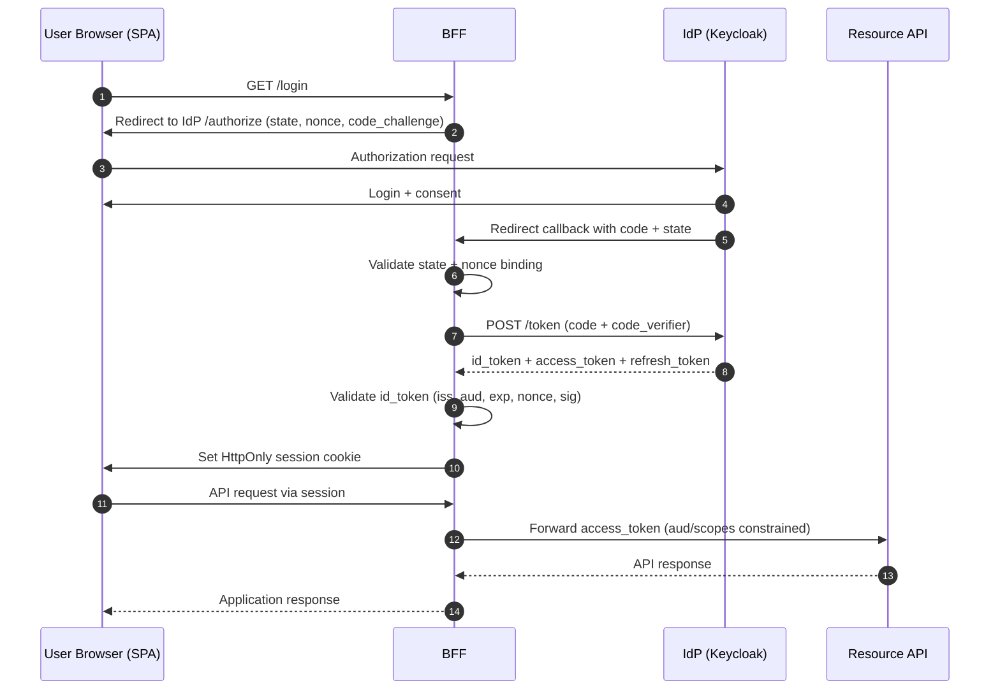

## 1. Область и цель

Этот документ описывает безопасную интеграцию OIDC (аутентификация) и OAuth 2.0 (авторизация) с Keycloak.

---

## 2. OIDC + OAuth 2.0: процесс и назначение токенов

- **OIDC** отвечает за пользовательский вход и контекст идентичности через `id_token`
- **OAuth 2.0** отвечает за делегированный доступ к API через `access_token`/`refresh_token`
- В потоке Authorization Code оба протокола работают вместе в одной сквозной последовательности

### 2.1 Последовательность (Authorization Code + PKCE, паттерн SPA + BFF)

### 2.2 Наборы токенов по потокам

1. `authorization_code` (со scope OIDC):
- `id_token` + `access_token` + часто `refresh_token`

2. `authorization_code` (без scope OIDC):
- `access_token` + часто `refresh_token`, без `id_token`

3. `client_credentials`:
- только `access_token` (обычно без refresh token)

4. `token exchange` (RFC 8693, Keycloak V2):
- входной токен -> новый `access_token` (другой audience/scope)

5. `offline_access` (scope, а не отдельный поток):
- `offline_access` — это OAuth scope, который меняет семантику refresh token
- при запросе и разрешении выдается offline token с долгим временем жизни или без привязки к пользовательской сессии
- это не отдельный grant flow, а модификация поведения токенов в существующих потоках (например, authorization_code)

### 2.3 Назначение каждого токена

- `id_token`: результат аутентификации пользователя для контекста сессии клиента
- `access_token`: bearer-токен, предъявляемый resource server для авторизации
- `refresh_token`: получение новых access token без полного повторного входа
- `offline token`: получение новых токенов без активной браузерной сессии
- ответ `userinfo`: опциональный источник дополнительных profile claims, не замена валидации `id_token`

Правило идентичности:
- Используйте `sub` как первичный стабильный идентификатор пользователя в приложении
- Не используйте `email` как первичный ключ идентичности

### 2.4 Критичные правила безопасности

- Никогда не используйте `id_token` как API bearer
- Держите `aud` и `scope` узкими
- Используйте явные численные ограничения времени для токенов/сессий (см. раздел 5), а не формулировки «короткий/длинный»
- PKCE обязателен для публичных клиентов

Что такое PKCE и зачем нужен:
- PKCE (`Proof Key for Code Exchange`) добавляет к потоку Authorization Code пару `code_challenge`/`code_verifier`.
- Это защищает от перехвата authorization code: даже если код украден в redirect/callback цепочке, без `code_verifier` его нельзя обменять на токены.

---

## 3. Рекомендуемые архитектурные шаблоны

### 3.1 Веб-бэкенд (серверный рендеринг)

- Конфиденциальный клиент
- Поток Authorization Code
- PKCE включен (рекомендуется даже для конфиденциальных клиентов)
- Токены хранятся на сервере
- Браузер получает только cookie сессии

### 3.2 SPA + BFF (рекомендуется для браузера)

- SPA (`Single-Page Application`) — фронтенд, работающий в браузере пользователя (JS-приложение).
- BFF (`Backend for Frontend`) — серверный слой, специально выделенный для этого фронтенда.
- SPA не хранит refresh token
- BFF выполняет обмен authorization code на токены и хранит refresh token на стороне сервера
- SPA взаимодействует с BFF через защищенную сессию на основе cookie
- BFF вызывает API от имени пользователя

### 3.3 Мобильные клиенты

- Публичный клиент
- Authorization Code + PKCE (`S256`)
- Только системный браузер (ASWebAuthenticationSession / Custom Tabs)
- Refresh token хранится только в защищенном хранилище ОС

### 3.4 Взаимодействие сервис-сервис

- OAuth Client Credentials
- Отдельные машинные клиенты и scopes/roles
- Не смешивайте пользовательские токены и сервисные токены

---

## 4. Матрица профилей защиты (Recommended и Maximum)

Maximum-профиль задается как **delta** к Recommended: в колонке Maximum перечислены только дополнительные или ужесточенные требования.
Маркировка по профилям в тексте ниже:
- Если пункт без тега, он относится к обоим профилям (`R+M`)
- Усиления Maximum-профиля вынесены в отдельные блоки `Усиления для профиля Maximum`

| Контроль | Recommended (R) | Maximum (M) | Обоснование / Угроза |
|---|---|---|---|
| Потоки и базовая модель клиентов | Authorization Code + PKCE (`S256`), SPA+BFF/server-side web app, mobile public + system browser, service confidential + client_credentials | Дополнительно к R: обязательные строгие client policies на уровне IdP | Снижение риска перехвата кода, злоупотребления токенами и дрейфа конфигурации |
| Sender-constrained токены | Bearer tokens допустимы только после явного risk decision; для public, partner и high-value API нужно оценить DPoP или mTLS и документировать любое исключение | Дополнительно к R: требовать DPoP и/или mTLS; public clients должны использовать sender-constrained refresh tokens или refresh token rotation с reuse detection | Уменьшение ущерба от кражи bearer-токена и повторного использования |
| PAR/JAR | Не обязательно по умолчанию | Дополнительно к R: PAR (RFC 9126) + JAR (RFC 9101) для критичных клиентов | Защита параметров авторизации от подмены и mix-up, снижение рисков front-channel |
| MFA/step-up | По риск-ориентированной бизнес-политике | Дополнительно к R: обязательный MFA/step-up для критичных операций | Защита от захвата аккаунта и несанкционированной эскалации |
| TTL/rotation токенов | Короткие TTL, refresh token rotation, явные численные лимиты из раздела 5 | Дополнительно к R: более жесткие TTL и окна деградации для контуров повышенного риска | Снижение окна эксплуатации компрометированных токенов |
| Валидация токенов | `iss/aud/exp/nbf/iat/signature`, `alg` allowlist, `nonce`, `azp`, policy checks | Дополнительно к R: обязательная holder-of-key validation для sender-constrained токенов | Защита от поддельных/ошибочно выданных токенов, mix-up и key-confusion |
| Сессии/cookie | HttpOnly/Secure/SameSite, узкие Domain/Path, rotation session ID, CSRF controls | Дополнительно к R: запрет cross-origin для session-bound endpoints без исключений | Защита от XSS-кражи cookie, CSRF, fixation и злоупотребления областью cookie |
| Выход/отзыв | RP-initiated logout + local logout + refresh revocation | Дополнительно к R: обязательная introspection для чувствительных API в окнах после logout/инцидента | Снижение replay после logout и ускорение эффекта revocation |
| Управление ключами | Плановая rotation signing keys, trusted JWKS/issuer pinning | Дополнительно к R: ускоренная cadence rotation и более жесткий emergency cutover SLA | Снижение зоны поражения при компрометации ключей |
| Эксплуатация/мониторинг | Базовые rate limits, lockout signals, мониторинг auth/token аномалий | Дополнительно к R: усиленные anti-automation controls, более строгие алерты и SLO | Снижение brute-force/abuse и MTTR при инцидентах |

---

## 5. Единая числовая база (единый источник значений)

Все численные лимиты для токенов, сессий, replay и rate-limiting задаются здесь. В остальных разделах ссылайтесь на этот базовый набор, а не дублируйте значения.

Эти значения являются локальной рекомендованной базой для рабочих сред этого плейбука, а не прямыми требованиями RFC или OIDC Core. Используйте их как дефолтные guardrails и уточняйте по профилю риска, UX, возможностям клиента и поведению IdP.

### 5.1 Временные параметры токенов и сессий

- Access token TTL: `5-15m` (по умолчанию: `10m`)
- ID token TTL: `<=5m`
- Browser/BFF refresh token absolute max lifetime: `<=24h`
- Mobile refresh token absolute max lifetime: `<=30d` только при secure enclave/keystore и device trust controls
- Refresh token reuse grace window (retry races): `<=30s`
- User session idle timeout (browser): `15m`
- User session max age (browser): `8h`
- Fresh auth (`max_age`) для high-risk операций: `<=15m`
- JWT/client clock skew tolerance: `<=60s` (hard limit: `<=120s`)

### 5.2 База для replay и rate-limiting

- Token endpoint rate limit (per client + source IP): `60 req/min` sustained
- Burst budget: `120 req/min` в пределах `<=1m`
- Brute-force lockout signal: `10` неудачных попыток за `5m`
- Callback state/nonce TTL: `<=10m`, single-use
- Introspection timeout budget: connect `<=100ms`, response `<=300ms`, total `<=500ms`
- Introspection cache TTL: positive `<=30s` (не больше token `exp`/`Not Before`), negative `<=5s`
- Допустимое degraded `fail-open` окно только для low-risk class C и только по исключению: `<=120s`

### 5.3 Усиления для профиля Maximum

- Для контуров повышенного риска или регулируемых сред: ужесточайте TTL и максимальные окна деградации относительно базовых значений
- Для контуров повышенного риска или регулируемых сред: применяйте более строгие rate-limiting/burst/cache лимиты и окна деградации

---

## 6. Домены контроля

### 6.1 Поток идентификации

- Используйте Authorization Code + PKCE (`S256`) для входа пользователей в браузерных и мобильных клиентах
- Выполняйте строгие проверки целостности callback: `state` обязателен и должен точно совпадать в связке request->callback
- `nonce` обязателен для OIDC login и должен совпадать с исходным authorization request
- Redirect/logout URI: только exact match и отдельные списки для каждого окружения
- Для clients, которые могут работать с несколькими authorization servers, realms или tenant issuers, требуйте защиту от mix-up: валидируйте `iss` в authorization response, когда authorization server объявляет поддержку RFC 9207, либо используйте отдельные redirect URI, привязанные к одному issuer. Сохраняйте ожидаемый issuer в transaction state и отклоняйте callbacks, где issuer не совпадает.
- В Keycloak применяйте Client Policies/Profiles для enforcement OAuth 2.1/FAPI-relevant settings, поддерживаемых развернутой версией и adapters: PKCE `S256`, безопасные redirect URI, запрет implicit/password flows, request object/PAR/JAR там, где это требуется профилем, и holder-of-key/DPoP для выбранных clients.
- Блокируйте `implicit` grant по умолчанию; любое временное исключение требует migration plan, owner, expiry и компенсирующие меры.
- OAuth password grant / Resource Owner Password Credentials flow запрещен для клиентов рабочих сред. Не утверждайте его как обычное исключение; допускается только ограниченный по времени migration plan для существующих legacy clients.
- Replacement paths: Authorization Code + PKCE для browser/mobile/user login, device authorization flow для устройств с ограниченным пользовательским вводом и `client_credentials` для service-to-service доступа.

Усиления для профиля Maximum:
- Включайте PAR/JAR для критичных клиентов и потоков с повышенным риском

### 6.2 Безопасность токенов

- Валидируйте `iss`, `aud`, `exp`, `nbf`, `iat`, signature (`kid`/JWKS)
- Применяйте JWT `alg` allowlist и отклоняйте неожиданные алгоритмы
- Валидируйте `azp`, когда присутствует (особенно при нескольких audiences)
- Валидируйте authorization scopes + roles + policy (deny-by-default)
- Никогда не используйте `id_token` как API bearer
- Используйте короткие TTL/rotation и явный audience (см. раздел 5)
- `Revoke Refresh Token` включен (rotation)
- Introspection обязательна для high-risk операций, подозрительных токенов и post-incident периодов
- Bearer access tokens допустимы только после документированного risk decision. Для public, partner, high-value API или API с высоким replay-impact оценивайте sender-constrained tokens (`DPoP` и/или `mTLS`). Если approved bearer-only режим, фиксируйте ограничения client support, caveats для XSS/client compromise, компенсирующие меры и TTL токенов.

Усиления для профиля Maximum:
- Требуйте sender-constrained tokens (DPoP и/или mTLS)
- Для public clients требуйте sender-constrained refresh tokens или refresh token rotation с reuse detection; для API с высоким replay-impact предпочитайте sender-constrained access tokens.
- Проверяйте holder-of-key validation в adapters/runtime для DPoP/mTLS

### 6.3 Сессии и cookie

- Browser хранит только session cookie; refresh/offline tokens в browser storage запрещены
- Application server хранит состояние сессии (Redis/DB/in-memory с репликацией)
- Session ID rotation после login callback и после повышения привилегий
- Cookie `HttpOnly`: запрещает JS-доступ и снижает риск кражи cookie при XSS
- Cookie `Secure`: отправка только по HTTPS, снижает риск перехвата в канале
- Cookie `SameSite=Lax` (или `None; Secure` для cross-site SSO): снижает CSRF/login CSRF риск
- Узкие `Domain`/`Path`: уменьшают межприложенческие утечки и риск cookie tossing/захвата поддомена
- CSRF-защита обязательна для state-changing BFF endpoints (`POST/PUT/PATCH/DELETE`): используйте synchronizer token или signed double-submit cookie, привязанный к authenticated session через HMAC и server-side secret; naive double-submit cookies недопустимы
- Валидируйте `Origin` (основной) и `Referer` (запасной) для браузерных state-changing запросов
- Используйте same-origin policy для session-bound endpoints и проверки `Sec-Fetch-Site`
- Негативные тесты должны покрывать cookie injection/subdomain cookie сценарии, отсутствие token, несовпадение token, cross-site `Origin` и fallback-поведение при отсутствии `Sec-Fetch-*`

Усиления для профиля Maximum:
- Для session-bound endpoints не допускайте cross-origin CORS без явно утвержденного исключения

### 6.4 Выход и отзыв

- Реализуйте безопасный logout flow: local session destroy -> RP-initiated logout -> strict `post_logout_redirect_uri`
- Отзывайте refresh token на logout через `/protocol/openid-connect/revoke` (RFC 7009)
- Для multi-RP экосистем настройте back-channel/front-channel logout и запасной сценарий
- При глобальном инциденте используйте `Sign out all active sessions` + realm/client `Not Before`
- Учитывайте, что sign-out сам по себе не отменяет мгновенно уже выданные access token до `exp` (см. раздел 5)
- Для чувствительных API introspection обязательна в окне `<=15m` после logout/revocation/обновления `Not Before`
- Отклоняйте токены, которые неактивны, выданы до `Not Before`, или нарушают контекст привязки (`binding context`)

Усиления для профиля Maximum:
- Расширяйте область обязательной introspection для дополнительных endpoint классов

### 6.5 Управление ключами

- JWT signature проверяйте только по trusted JWKS (`/protocol/openid-connect/certs`) ожидаемого issuer
- `kid` должен резолвиться в активный ключ JWKS; недоверенные/user-controlled JWKS URL запрещены
- Плановая rotation realm signing keys обязательна
- Rotation: ввод нового ключа заранее (active/passive), удаление старого только после compatibility window
- Emergency compromise: немедленный выпуск нового ключа и инвалидация sessions/tokens
- Базовая периодичность: signing key rotation каждые `90d`, overlap `24-72h`, emergency cutover `<=1h`
- HTTPS only; mTLS для доверенных внутренних каналов по threat model
- Для confidential clients предпочитайте `private_key_jwt` или mTLS; `client_secret` только при обязательной rotation

Усиления для профиля Maximum:
- Ужесточайте rotation cadence и emergency SLA для regulated/high-risk сред

### 6.6 Эксплуатация и мониторинг

- Централизуйте JWT/introspection validation в middleware и сохраняйте deny-by-default authorization
- Включите аудит admin/user events в IdP и корреляцию auth/API событий в SIEM
- Мониторьте: token endpoint errors, refresh failures, invalid signature, invalid audience, token-exchange/DPoP failures
- Накапливайте и алертите replay сигналы (`state`/`nonce` reuse, повторные callback correlation IDs)
- Для introspection используйте circuit breaker + backoff + автоматическое восстановление policy после подтвержденного восстановления
- Для классов endpoint зафиксируйте policy:
  - Class A (money movement/admin/privilege change/PII export): `fail-closed`
  - Class B (state-changing business operations): `fail-closed`
  - Class C (low-risk read-only): явное решение; `fail-open` только по утвержденному исключению

Усиления для профиля Maximum:
- Усиливайте anti-automation controls и алерты (более низкие пороги и более быстрый SLA реакции)

---

## 7. Проверки по модели угроз (обязательны в ревью)

- Перехват authorization code -> PKCE + exact redirect URI
- Кража bearer token -> короткий TTL + sender-constrained tokens там, где это требуется риск-профилем
- Повторное использование refresh token -> rotation + reuse detection
- Open redirect -> строгий allowlist
- Mix-up attacks -> валидация `iss` + строгая конфигурация client/issuer
- Повышение привилегий -> строгое разделение audience/scope/role
- Session fixation -> rotation session ID после login
- Утечка токенов в логах -> redaction и явная политика no-token logging

---

## 8. Антипаттерны

- Использование `id_token` как API bearer
- PKCE `plain` вместо `S256`
- Wildcard redirect URI
- Хранение refresh token в browser storage
- Включение password grant / Keycloak Direct Access Grants для клиентов рабочих сред
- Длинный TTL access token (часы/дни)
- Один client для user login и machine-to-machine трафика без сегрегации
- Отсутствие rotation ключей и процедуры реагирования на компрометацию ключей

---

## 9. Пошаговая интеграция с Keycloak

### Шаг 1. Базовая настройка realm и криптографии

- Настройте ключи realm и план rotation (см. домен Key Management)
- Включите аудит admin/user events
- Проверьте HTTPS и корректную обработку proxy headers

### Шаг 2. Создайте типы клиентов

- `web-bff` (confidential)
- `spa-frontend` (если нужен отдельный public client)
- `mobile-app` (public + PKCE)
- `service-api-client` (confidential + `client_credentials`)

### Шаг 3. Зафиксируйте redirect/logout URI

- Только exact match
- Отдельный набор URI для каждого окружения
- Настройте `Valid Post Logout Redirect URIs`

### Шаг 4. Включите безопасные возможности

- Standard Flow: ON
- Implicit: OFF
- Direct Access Grants: OFF. В Keycloak это соответствует password grant и должно оставаться выключенным для клиентов рабочих сред; legacy-использование требует migration plan, а не постоянного исключения.
- PKCE method: `S256`
- Revoke Refresh Token: ON (обычно)
- Client Policies: включены для нужного client class и реально блокируют небезопасные grant/redirect/PKCE/holder-of-key настройки, а не только документируют baseline.

Усиления для профиля Maximum:
- Включите PAR/JAR и sender-constrained tokens для выбранных клиентов повышенного риска

### Шаг 5. Настройте scopes/roles/audience

- Минимальные client scopes
- Отдельные API client roles
- Audience mapping на точные resource servers

### Шаг 6. Интегрируйте приложение

- Используйте `.well-known/openid-configuration` как источник эндпоинтов
- Закрепляйте доверие к ожидаемому `issuer` и используйте только `jwks_uri` этого издателя
- Храните browser session cookie, а не bearer tokens в browser storage
- В callback строго валидируйте `state` и `nonce` до создания локальной сессии

### Шаг 7. Постройте middleware resource server

- Централизуйте JWT/introspection validation
- Применяйте проверки `iss/aud/exp/nbf` и scope/role
- Сохраняйте deny-by-default authorization

### Шаг 8. Реализуйте logout/revocation/invalidation

- Реализуйте RP-initiated logout
- Реализуйте путь revocation для refresh token
- Подготовьте сценарий реагирования на инцидент для массового `Not Before`

### Шаг 9. Мониторинг и обнаружение

- Введите набор метрик и алертов по домену Operations/Monitoring
- Зафиксируйте сценарий реагирования для replay/brute-force/token-abuse сигналов
---

## 10. Связанные материалы

- [Плейбук безопасности браузера и frontend-части](/Product-security-playbook/ru/application-security/web/browser-security/playbook/)
- [Плейбук безопасности API](/Product-security-playbook/ru/application-security/api/api-security-patterns/playbook/)
- [Плейбук Vault](/Product-security-playbook/ru/platform-security/secrets/vault/playbook/)
- [Плейбук моделирования угроз](/Product-security-playbook/ru/review/threat-modeling/playbook/)
