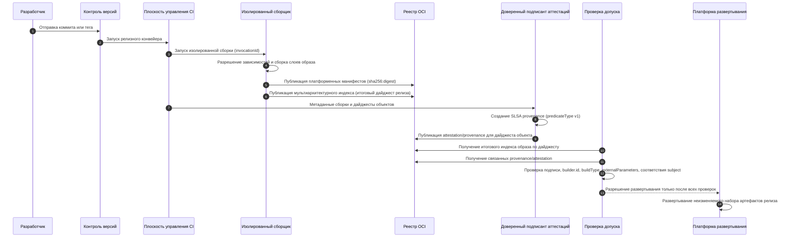

## 1. Область и цель

Обзор описывает применение направления Build в `SLSA v1.2` к конвейеру CI/CD, собирающему и публикующему образы контейнеров.

Что охватывает обзор:
- В области документа: происхождение сборки (build provenance), идентичность системы сборки, ее запуск, дайджест артефакта, распространение provenance и проверка перед развертыванием.
- За пределами этого документа: полная реализация направления Source и комплексная программа управления исходным кодом.
- Обязательное условие: управление исходным кодом проверяется отдельно от provenance сборки.

Цель:
- обеспечить проверяемую трассировку `source -> build -> image digest`
- снизить риск подмены артефакта, подделки метаданных и несанкционированного влияния на сборку

Порядок применения SLSA:
- сначала фиксируется целевой уровень зрелости конвейера сборки
- затем задаются обязательные требования к производителю артефакта и платформе сборки
- затем формализуется модель угроз
- после этого описывается пример модели CI/CD и проверки на каждом ее этапе
- в конце приведены правила проверки и минимальная последовательность внедрения

---

## 2. Целевая модель зрелости Build Track: L1 -> L2 -> L3

### 2.1 Build L1

- provenance существует и описывает способ сборки образа
- польза: возможность проследить происхождение образа и ход сборки
- ограничение: низкая устойчивость к подделке

### 2.2 Build L2

- provenance формирует и подписывает управляемая платформа сборки
- проверяющая сторона подтверждает подпись и идентичность системы сборки
- базовый уровень для рабочей цепочки поставки

Платформа сборки может использовать общую или выделенную инфраструктуру; SLSA не требует конкретного коммерческого провайдера исполнителей. Метка исполнителя или подпись, созданная пользовательским шагом сборки, не подтверждает Build L2. Проверьте формирование сведений о происхождении под контролем платформы, ее границу доверия и меры защиты, обосновывающие заявленный уровень.

### 2.3 Build L3

- усиленная защита от подделки provenance процессом арендатора
- изоляция сборок, одноразовая среда, недоступность секретов подписи
- `externalParameters` должны быть полными, без скрытых каналов внешнего влияния на сборку
- целевой уровень для публичных, партнерских, особо ценных компонентов и процессов распространения пакетов и образов

---

### 2.4 Матрица целевых уровней по риску

Выбор уровня SLSA Build определяется риском, а не единым правилом для всех релизов. Provenance сборки не заменяет управление исходным кодом: ревью, защита веток, авторизация выпуска и контроль описаний сборки остаются отдельными требованиями.

| Класс релиза | Минимально допустимая цель | Дополнительное требование |
|---|---|---|
| Внутренний сервис с низким риском и ограниченной зоной поражения | Build L2 допустим при документированном исключении и проверке перед развертыванием | Явно задайте меры Source Track и SDLC; уровни L2/L3 не доказывают безопасность исходного кода |
| Публичный, партнерский, особо ценный компонент или компонент рабочей платформы | Целевой уровень Build L3 | Нужны защищенные ветки и теги, ревью описаний сборки, доверенная идентичность системы сборки и обязательная проверка политики перед развертыванием |
| Широко используемый пакет или образ, общий базовый образ, средства подписи или развертывания либо регулируемый критичный артефакт | Build L3 плюс усиленные меры Source-track | Добавьте более строгое управление исходным кодом, авторизацию релиза, контроль ключей, воспроизводимую или независимую повторную сборку там, где это практически применимо, и ускоренный отзыв при инциденте |

Более низкий уровень допустим, только если владелец сервиса фиксирует допущения о зоне поражения, срок исключения и компенсирующие меры. Слабое управление исходным кодом отмечайте как проблему Source Track или SDLC даже при успешной проверке provenance сборки.

## 3. Требования к конвейеру и платформе сборки

### 3.1 Исходный код и запуск сборки

Эти проверки задают ожидания направления Build к разрешенным входным данным системы сборки. Они не заменяют управление исходным кодом в направлении Source.

- только утвержденный репозиторий и версия исходного кода для релизных веток
- явная политика допустимых способов запуска: тег или защищенная ветка
- запрет неутвержденных параметров, передаваемых при запуске сборки
- соответствие полей исходного кода в provenance ожидаемым репозиторию, неизменяемой версии, политике веток и тегов и событию запуска

### 3.2 Среда сборки

- релизные сборки на платформе с документированной границей доверия; собственная инфраструктура допустима, если платформа соответствует целевому уровню, а рабочая станция отдельного сотрудника не соответствует требованию hosted
- отдельная одноразовая среда для каждой сборки
- запрет общего изменяемого состояния между параллельными сборками
- кеш считается недоверенным вводом; релизный конвейер ограничивает область ключей кеша и сверяет входные данные с provenance; для релизов с высоким риском дополнительно возможна повторная сборка без кеша

### 3.3 Меры контроля артефактов

- публикация и решения политик привязываются только к дайджесту (`sha256:...`), а не к изменяемому тегу; релизные манифесты, значения Helm, наложения Kustomize, состояние GitOps и подтверждения релиза сохраняют точный дайджест для развертывания
- различайте дайджест индекса OCI и платформенного манифеста: один индекс многоплатформенного образа может ссылаться на разные манифесты `linux/amd64`, `linux/arm64` и других платформ
- проверяйте дайджест, который использует среда выполнения; если развертывание ссылается на индекс, проверяйте индекс и все разрешенные платформенные манифесты либо определяйте и проверяйте манифест выбранной платформы целевого кластера
- копирование и продвижение между реестрами не должны незаметно менять проверенную ссылку; фиксируйте исходный и целевой дайджесты, тип содержимого, набор платформ и объект подписи или provenance, проверяемый политикой
- изменение тега не может обходить согласование выпуска; теги помогают найти артефакт, но согласование, provenance, оценка уязвимостей и допуск привязываются к неизменяемым дайджестам

### 3.4 Управление изменениями исходного кода

Сведения о происхождении сборки подтверждают, где и как собран артефакт, но не доказывают, что изменение исходного кода было разрешено, проверено и безопасно. Защищайте релизные ветки и теги, назначайте проверяющих для кода приложения, описаний сборки, манифестов развертывания и конфигурации подписи. Для экстренных обходов фиксируйте ответственного, обоснование, срок действия и проверку после изменения.

#### Проверка Source Track

Для выбранного уровня SLSA Source соберите подтверждения из системы управления исходным кодом и сверьте их с точными входными данными релиза:
- Сопоставьте репозиторий, коммит и ветку или тег в подтверждениях с исходным кодом, использованным при сборке. Имя защищенной ветки само по себе не определяет проверенный коммит.
- Убедитесь, что сведения о происхождении исходного кода описывают применимые меры защиты и историю изменений. Для уровней, требующих ревью, проверьте необходимые независимые согласования и отсутствие незарегистрированного обхода.
- При использовании Source VSA проверяйте издателя, объект, политику и время проверки по правилам выпуска. Уровень Build или само наличие аттестации не подтверждают уровень Source.
- Проверьте прямую отправку изменений, подмену тега, другой коммит под ожидаемым именем ветки и отключение проверки исходного кода. Каждый сценарий, нарушающий правила выпуска, должен блокировать продвижение релиза с записью причины.

Сохраняйте настройки защиты репозитория, историю ревью, подтверждения происхождения, результат проверки и исключения в материалах релиза.

---

## 4. Модель угроз (обзор)

Основные сценарии для конвейера:
- сборка из неутвержденного источника или после подмены копии репозитория, ветки либо тега
- подмена `externalParameters` для внедрения несанкционированного поведения
- подделка provenance или подписи после сборки
- подмена в реестре или при передаче
- влияние сборок друг на друга через отравление кеша или сохраненное присутствие атакующего

Минимальная привязка к SLSA-проверкам:
- шаг 1: подлинность provenance и соответствие `subject`
- шаг 2: соответствие ожиданиям по `builder.id`, исходному коду, `buildType` и параметрам
- шаг 3: проверка зависимых артефактов (`resolvedDependencies`) по возможности, в том числе рекурсивно

---

## 5. Пример модели CI/CD для образов контейнеров

### 5.1 Поток поставки

Коммит или тег -> запуск CI -> изолированная сборка -> публикация образа по дайджесту -> формирование и подпись сведений о происхождении -> публикация аттестации -> обязательная проверка -> развертывание.

### 5.2 Ключевые границы доверия

- разработчик и рабочая станция
- система управления исходным кодом
- контур управления платформы сборки
- сервис подписи аттестаций в контуре управления платформы сборки
- шаги сборки, определенные пользователем: рабочая нагрузка арендатора
- реестр и слой распространения
- контур управления развертыванием: контроль допуска и движок политик

### 5.3 Диаграмма последовательности: формирование итогового артефакта



### 5.4 Как читать диаграмму: надежные и рискованные пути

Доверенный путь выпуска:
- запуск из утвержденного источника
- изолированная сборка на доверенной платформе
- публикация артефактов с адресацией только по дайджесту
- формирование provenance доверенным сервисом подписи аттестаций
- решение по политике на проверке допуска и только затем развертывание

Участки повышенного риска:
- неутвержденный источник или событие запуска до сборки
- параметры запуска вне схемы `externalParameters`
- общее состояние или кеш, влияющие на другие сборки
- попытка доступа к сервису подписи из шагов сборки арендатора
- развертывание по тегу без проверки аттестаций и provenance

Практическое правило:
- сервис подписи аттестаций относится к доверенному контуру управления сборкой; шаги арендатора не должны иметь прямого доступа к нему и к секретам подписи provenance

### 5.5 Что верифицировать на каждом этапе

- до сборки: утвержденные источник, версия и событие запуска
- после сборки: дайджест объекта и подлинность подписанной оболочки provenance
- до развертывания: `predicateType`, `builder.id`, издатель и идентичность подписанта, `buildType`, схема `externalParameters` и защита от повторного использования
- после развертывания: запись результата проверки допуска в журнал аудита

Итоговый набор релизных артефактов:
- дайджест индекса OCI для многоплатформенного релиза
- дайджест манифеста каждой разрешенной целевой платформы
- конфигурация образа и дескрипторы слоев файловой системы, доступные из согласованного манифеста
- аттестация SLSA provenance, связанная с дайджестом артефакта
- результат проверки допуска в журнале аудита

---

## 6. Распространение аттестаций и provenance

### 6.1 Где публиковать

Рекомендуемый минимум:
- основной канал: тот же репозиторий OCI с явной привязкой к дайджесту артефакта через `subject` и связанные артефакты
- дополнительный канал: резервная площадка для восстановления после сбоя, например вложения релиза

### 6.2 Связь артефакта и аттестации

- поддерживайте несколько аттестаций для одного артефакта
- принимайте аттестацию, только если и `builder.id`, и издатель с идентичностью подписанта входят в соответствующие списки разрешений
- аттестации должны быть неизменяемыми: не перезаписывайте аттестацию того же дайджеста
- для многоплатформенного образа явно определяйте объект проверки: дайджест индекса, каждый платформенный манифест или оба уровня; иначе проверенный индекс может скрыть непроверенный манифест, а проверенный манифест может попасть в развертывание через несогласованный индекс
- при продвижении между реестрами сверяйте объект аттестации с дайджестом целевого развертывания, а не только с исходной ссылкой, ранее проверенной в CI

---

## 7. Корни доверия и закрепление идентичностей

### 7.1 Что фиксировать в политике

- идентичность подписанта: издатель и subject/SAN сертификата; точное совпадение или узкое регулярное выражение для конкретного процесса CI;
- издатель OIDC для подписи без постоянного ключа, отдельно от subject/SAN;
- идентичность процесса: например, ссылка на процесс GitHub, ссылку на вызываемый процесс или шаблон SAN сертификата с учетом системы подписи;
- идентичность исходного кода: репозиторий, неизменяемые ID репозитория и владельца при наличии, ветка, тег или ссылка и ожидаемое происхождение коммита;
- идентичность системы сборки SLSA: точное значение `predicate.runDetails.builder.id` и максимальный доверенный уровень SLSA Build этой системы;
- корни доверия проверки подписи, например Fulcio/Rekor или корпоративная PKI, отдельно по средам;
- ожидаемый `buildType` и версию политики и схемы `externalParameters`.

Не объединяйте эти идентификаторы в одно поле `subject`. Формат GitHub Actions OIDC `sub` зависит от настроек организации и репозитория и для новых репозиториев может содержать неизменяемые ID владельца и репозитория. Перед принудительным применением проверьте политику на реальных сертификатах подписи и образцах provenance релизного процесса.

Ниже приведена минимальная модель политики для SLSA GitHub container generator. Для другой системы сборки извлеките `builder.id`, `buildType`, издателя и идентичность сертификата из реального образца provenance и подписи, затем закрепите эти значения.

```yaml
trusted_builders:
  - signature_oidc_issuer: https://token.actions.githubusercontent.com
    signature_certificate_identity: https://github.com/slsa-framework/slsa-github-generator/.github/workflows/generator_container_slsa3.yml@refs/tags/<approved-generator-version>
    github_oidc_subject_pattern: repo:ORG/REPO:ref:refs/tags/v*
    source_repository: github.com/ORG/REPO
    source_ref_pattern: refs/tags/v*
    workflow_ref: ORG/REPO/.github/workflows/release.yml@refs/tags/v*
    builder_id: https://github.com/slsa-framework/slsa-github-generator/.github/workflows/generator_container_slsa3.yml@refs/tags/<approved-generator-version>
    max_slsa_build_level: 3
    build_type: https://github.com/slsa-framework/slsa-github-generator/container@v1
    external_parameters_schema: policy://slsa/github-container-generator/v1
```

Это схема локальной политики, а не готовая конфигурация проверяющего инструмента. Замените `<approved-generator-version>` точной согласованной версией из реальной аттестации; новая версия генератора требует изменения списка доверия. Идентичность сертификата этого генератора относится к его reusable workflow, а не к вызывающему workflow релиза. Сопоставляйте исходный репозиторий и workflow релиза отдельно с подписанными данными. Шаблоны `v*` в полях правил выпуска требуют явно заданной семантики сопоставления в реализации. Генератор может выпускать формат v0.2; применяйте отдельную политику совместимости из раздела 8.1 по фактическому `predicateType`.

### 7.2 Ротация корней доверия и идентичностей без простоя

- выполняйте ротацию с управляемым перекрытием: временно принимайте старую и новую идентичности, затем удаляйте старую
- оформляйте изменение корней доверия или списка разрешений как изменение политики с ревью и аудитом

---

## 8. Проверка перед развертыванием и этапы внедрения

### 8.1 Обязательная проверка допуска

Соответствие SLSA и локальная политика развертывания проверяются отдельно. Отсутствие необязательных метаданных сборки не делает provenance недействительной по SLSA. Отклоняйте артефакт при нарушении обязательной структуры, подлинности, привязки к объекту или требований политики.

Обязательные проверки SLSA и соответствия ожиданиям:

1. Структура утверждения: `_type = https://in-toto.io/Statement/v1` и наличие `subject[]`, `predicate.buildDefinition`, `predicate.runDetails`.
2. Подлинность подписанной оболочки provenance и соответствие `subject`.
3. Проверка `predicateType = https://slsa.dev/provenance/v1`
4. Наличие `predicate.runDetails.builder` и соответствие `builder.id` списку доверенных систем сборки.
5. Корни доверия, издатель и идентичность подписанта по списку разрешений.
6. Соответствие исходного кода и параметров сборки ожиданиям. Ключи `externalParameters` вне утвержденной схемы для данного `buildType` и версии политики означают отказ.
7. Версия формата provenance: не смешивайте политики SLSA v0.2 и v1. Если инструменты выпускают `https://slsa.dev/provenance/v0.2`, нужна отдельная политика миграции или совместимости с явным сопоставлением полей (`builder.id`, `buildType`, исходный код и материалы, параметры) либо отказ в приеме аттестации. Проверки v1 `buildDefinition/runDetails` неприменимы к структуре v0.2 без преобразования.

Проверки локальной политики развертывания:

1. Если `predicate.runDetails.metadata.startedOn` и `finishedOn` присутствуют, проверяйте `startedOn <= finishedOn`. При их отсутствии требуйте подтверждение с учетом системы сборки или документированное исключение политики; само отсутствие не означает нарушение SLSA.
2. Проверяйте давность provenance по локальному `max_provenance_age` для среды, например `prod` `24h`, `staging` `7d`, кроме согласованных сценариев отложенного развертывания или продвижения.
3. Для отложенного выпуска неизменные дайджесты артефакта и сведений о происхождении или аттестации вместе с прежним результатом допуска позволяют повторно использовать исторические подтверждения сборки, но сами по себе не разрешают развертывание. Повторно проверьте действующую политику доверия, сообщения о компрометации системы сборки или ключей, уязвимости и раскрытые секреты, сроки исключений, целевую среду и конфигурацию развертывания. Сохраняйте исходные сведения о происхождении; не подписывайте их повторно только для обнуления возраста. Откат требует такой же текущей авторизации либо явно согласованного аварийного исключения.

### 8.2 Политика решений

- значение по умолчанию: `deny`
- развертывание разрешено только после всех обязательных проверок
- аварийный обход допустим только по оформленному исключению с TTL и последующим анализом первопричины

Ограничение для рабочих сред:
- аварийный обход для рабочей среды не дольше `24h`, с обязательной проверкой после инцидента

Синтетические положительные и отрицательные [сценарии политики](/ru/reference/security-policy-examples/overview/) проверяют привязку подписанта, системы сборки и целевого артефакта, не выполняя криптографическую проверку. Используйте их для проверки правил допуска и отказа, затем добавьте подписанные тестовые данные для проверки фактической реализации и корней доверия.

### 8.3 Минимальный план поэтапного внедрения

Если описанную модель нельзя внедрить за один шаг, действуйте поэтапно:

1. Этап A (L1):
- выпускать артефакты с адресацией только по дайджесту
- формировать provenance каждого релизного образа
- сохранять результат проверки допуска в журнале аудита

2. Этап B (L2):
- перенести релизные сборки на платформу и проверить формирование сведений о происхождении под ее контролем; смена типа исполнителя сама по себе не подтверждает L2
- включить проверку подписи provenance, `builder.id`, разрешенных издателей и идентичностей
- запретить развертывание без полного прохождения обязательных проверок

3. Этап C (L3):
- обеспечить отдельную одноразовую среду для каждой сборки
- закрыть прямой доступ шагов арендатора к подписанту и секретам
- закрепить версионируемую схему политики `externalParameters` и правила защиты от повторного использования для каждой среды
---

## 9. Связанные материалы

- [Плейбук безопасности образов контейнеров](/ru/supply-chain/container-image-security/playbook/)
- [Плейбук управления выпуском](/ru/review/release-governance/playbook/)
- [Плейбук управления уязвимостями](/ru/review/vulnerability-management/playbook/)
- [Плейбук ревью безопасности Kubernetes-кластера](/ru/platform-security/kubernetes/cluster-security-review/playbook/)
- [Инструкции агентов как артефакты цепочки поставки](/ru/ai-security/ai-assisted-development/playbook/#38-скиллы-и-инструкции-агентов)
